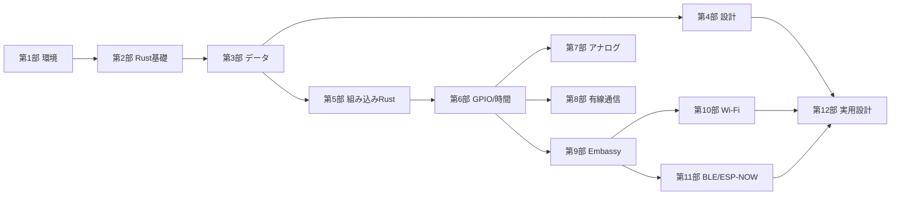

# カリキュラム（全120ページ）

- 構成: 12部 × 10ページ = 120ページ（TASK指定の原則構成を維持。変更なし）
- 1ページ約15分（読む7〜9分、動かす3〜5分、演習2〜3分）
- ファイルは `site/src/content/docs/partNN/MM-slug.md`
- 依存関係の原則: 第1部→第2部→…→第12部の順に読む。部を跨ぐ前提は各ページのfrontmatter `prerequisites` に記載

## 部の依存関係

## 第1部 ESP32-C6と開発環境

| # | ファイル | タイトル | 学習目標 | example |
|---|---|---|---|---|
| 1 | part01/01-goal | この教材で作れるもの | 最終ゴール（無線ボタン端末）と学習の道筋を説明できる | - |
| 2 | part01/02-why-rust | ArduinoからRustへ移る理由 | loop一枚岩の限界と、Rust+Embassyで何が変わるかを説明できる | - |
| 3 | part01/03-what-is-c6 | ESP32-C6とは何か | C6の構成（RISC-V、Wi-Fi 6、BLE、802.15.4）を説明できる | - |
| 4 | part01/04-mcu-vs-pc | マイコンと普通のパソコンの違い | RAM/フラッシュ/OSなしの意味を説明できる | - |
| 5 | part01/05-parts | 必要な部品 | 最小構成の部品を揃えられる | - |
| 6 | part01/06-volt-current | 電圧と電流の最低限 | 3.3V/GND/抵抗の役割とやってはいけない接続が分かる | - |
| 7 | part01/07-setup | 開発環境の構築 | Rust・ターゲット・espflashを導入できる | - |
| 8 | part01/08-new-project | Rustプロジェクトの作成 | esp-generateでプロジェクトを作り構成を説明できる | 01-blinky |
| 9 | part01/09-flash-monitor | 書き込みとシリアル表示 | espflashで書き込み、ログを見られる | 01-blinky |
| 10 | part01/10-blinky | 最初のLチカ | LEDを点滅させ、コードの各行を説明できる | 01-blinky |

## 第2部 Rustの最初の一歩

| # | ファイル | タイトル | 学習目標 |
|---|---|---|---|
| 1 | part02/01-variables | 変数とlet | letで変数を宣言し、型推論を説明できる |
| 2 | part02/02-mut | mutと変更できる変数 | 既定で不変である理由を説明できる |
| 3 | part02/03-numbers | 数値型 | u8/u32/i32/f32を使い分けられる |
| 4 | part02/04-bool | boolと比較 | 比較演算子と論理演算子を使える |
| 5 | part02/05-functions | 関数 | 引数と戻り値のある関数を書ける |
| 6 | part02/06-if | ifで分岐する | if/else ifを式として使える |
| 7 | part02/07-loop | loopと無限ループ | loop/break/continueを使える。組み込みでloopが主役である理由が分かる |
| 8 | part02/08-while | while | 条件付きループを書ける |
| 9 | part02/09-for | forとrange | for i in 0..10 と配列の反復を書ける |
| 10 | part02/10-array-tuple | 配列とタプル | 固定長配列とタプルを使える |

## 第3部 Rustらしいデータの扱い

| # | ファイル | タイトル | 学習目標 |
|---|---|---|---|
| 1 | part03/01-struct | structでまとめる | 関連データをstructにまとめられる |
| 2 | part03/02-enum | enumで選択肢を表す | データ付きenumで状態を表せる |
| 3 | part03/03-match | matchで場合分けする | 網羅性チェックの利点を説明できる |
| 4 | part03/04-option | Option — 「ないかもしれない」を型で表す | unwrapに頼らずOptionを扱える |
| 5 | part03/05-result | Result — 失敗を型で表す | Result/?演算子を使える |
| 6 | part03/06-methods | メソッドを定義する | impl内にメソッドを書ける |
| 7 | part03/07-impl | implと関連関数 | new()等の関連関数を書ける |
| 8 | part03/08-ownership | 所有権 — 誰がデータを持つのか | moveの規則を説明できる |
| 9 | part03/09-borrow | 借用 — 貸し借りの規則 | &と&mutの規則を説明できる |
| 10 | part03/10-lifetime | ライフタイムの直感 | 「いつまで存在するか」で説明できる |

## 第4部 大きなプログラムの作り方

| # | ファイル | タイトル | 学習目標 |
|---|---|---|---|
| 1 | part04/01-module | moduleで整理する | modで名前空間を分けられる |
| 2 | part04/02-file-split | ファイル分割 | mod宣言とファイルの対応が分かる |
| 3 | part04/03-pub | pubと公開範囲 | 公開/非公開を設計できる |
| 4 | part04/04-crate | crateと依存関係 | Cargo.tomlに依存を追加できる |
| 5 | part04/05-trait | trait — 共通の能力を定義する | traitを定義・実装できる |
| 6 | part04/06-generics | generics | 型引数付き関数を書ける |
| 7 | part04/07-associated-type | associated typeの入門 | embedded-halのError型の読み方が分かる |
| 8 | part04/08-error-design | エラー設計 | 自作エラー型とFromを設計できる |
| 9 | part04/09-state-machine | 状態機械 | enumで状態遷移を設計できる |
| 10 | part04/10-cpp-comparison | C++との設計比較 | class/interface/exceptionとの対応と限界を説明できる |

## 第5部 組み込みRustの基礎

| # | ファイル | タイトル | 学習目標 |
|---|---|---|---|
| 1 | part05/01-no-std | no_stdとは何か | stdとcoreの違いを説明できる |
| 2 | part05/02-before-main | main以前に起きること | リセット→初期化→mainの流れが分かる |
| 3 | part05/03-memory | メモリの地図 | フラッシュ/RAM/レジスタ空間を説明できる |
| 4 | part05/04-stack | stack | スタックの仕組みとオーバーフローを説明できる |
| 5 | part05/05-heap | heapを使わない設計 | heaplessと固定長バッファを使える |
| 6 | part05/06-static | staticとstatic_cell | 'staticな置き場所を作れる |
| 7 | part05/07-panic | panicとの付き合い方 | panicハンドラの役割とunwrapの危険が分かる |
| 8 | part05/08-pac | PACとレジスタとunsafe | PACの位置づけとunsafeが必要な理由を説明できる |
| 9 | part05/09-hal | HAL — esp-hal | HALが何を抽象化するか説明できる |
| 10 | part05/10-embedded-hal | embedded-hal | ドライバの互換性の仕組みを説明できる |

## 第6部 GPIO・割り込み・時間

| # | ファイル | タイトル | 学習目標 | example |
|---|---|---|---|---|
| 1 | part06/01-gpio-output | GPIO出力 | Outputでピンを駆動できる | 01-blinky |
| 2 | part06/02-gpio-input | GPIO入力 | Inputでピンを読める | 02-button |
| 3 | part06/03-pull-updown | Pull-upとPull-down | 浮いた入力の問題を説明できる | 02-button |
| 4 | part06/04-button | ボタンを読む | BOOTボタン(GPIO9)を読める | 02-button |
| 5 | part06/05-debounce | チャタリング対策 | 時間による除去を実装できる | 02-button |
| 6 | part06/06-gpio-interrupt | GPIO割り込みとasync wait | wait_for_falling_edge等を使える | 02-button |
| 7 | part06/07-timer | Timerで待つ | Timer::after系を使える | 06-embassy-tasks |
| 8 | part06/08-ticker | Tickerで周期実行 | ずれない周期処理を書ける | 06-embassy-tasks |
| 9 | part06/09-timeout | Timeout | with_timeoutで待ちすぎを防げる | 07-channel |
| 10 | part06/10-watchdog | Watchdog | 番犬タイマーの目的と使い方が分かる | - |

## 第7部 アナログと波形制御

| # | ファイル | タイトル | 学習目標 | example |
|---|---|---|---|---|
| 1 | part07/01-adc | ADCで電圧を読む | ADC1(GPIO0-6)で値を読める | 13-adc-pwm |
| 2 | part07/02-voltage-divider | 分圧の考え方 | 可変抵抗の分圧を計算できる | 13-adc-pwm |
| 3 | part07/03-sensor-reading | センサ値を整える | 生値→物理量変換と平均化ができる | 13-adc-pwm |
| 4 | part07/04-pwm | PWMとは何か | LEDCの仕組みを説明できる | 13-adc-pwm |
| 5 | part07/05-led-brightness | LEDの明るさを変える | duty変更で調光できる | 13-adc-pwm |
| 6 | part07/06-servo | サーボ制御 | 50Hz/パルス幅制御を実装できる | - |
| 7 | part07/07-frequency | 周波数の選び方 | 用途別周波数と分解能のトレードオフが分かる | - |
| 8 | part07/08-duty | duty比の計算 | ビット分解能とduty計算ができる | 13-adc-pwm |
| 9 | part07/09-hw-timer | ハードウェアタイマー | systimer/TIMGの違いが分かる | - |
| 10 | part07/10-mini-project | 小さな制御プロジェクト | 可変抵抗→LED調光を統合できる | 13-adc-pwm |

## 第8部 UART・I2C・SPI・TWAI

| # | ファイル | タイトル | 学習目標 | example |
|---|---|---|---|---|
| 1 | part08/01-uart-basics | UART基礎 | ボーレート/TX/RXを説明できる | 03-uart |
| 2 | part08/02-uart-async | UART非同期受信 | asyncで受信待ちできる | 03-uart |
| 3 | part08/03-i2c-basics | I2C基礎 | SDA/SCL/アドレス/ACKを説明できる | 04-i2c |
| 4 | part08/04-i2c-sensor | I2Cセンサを読む | レジスタ読み書きができる | 04-i2c |
| 5 | part08/05-i2c-errors | I2Cのエラー処理 | NACK等をResultで処理できる | 04-i2c |
| 6 | part08/06-spi-basics | SPI基礎 | MOSI/MISO/SCK/CS/モードを説明できる | 05-spi |
| 7 | part08/07-spi-device | SPIデバイスを使う | SPIで読み書きできる | 05-spi |
| 8 | part08/08-bus-sharing | バス共有 | 複数デバイスでバスを共有する設計が分かる | - |
| 9 | part08/09-twai-basics | TWAI基礎 | トランシーバ必須の配線と用語を説明できる | 11-twai |
| 10 | part08/10-twai-comm | TWAIで通信する | フレーム送受信ができる | 11-twai |

## 第9部 Embassyによる非同期処理

| # | ファイル | タイトル | 学習目標 | example |
|---|---|---|---|---|
| 1 | part09/01-sync-vs-async | 同期処理と非同期処理 | ブロッキングの問題を説明できる | 06-embassy-tasks |
| 2 | part09/02-async-await | asyncとawait | .awaitで何が起きるか説明できる | 06-embassy-tasks |
| 3 | part09/03-future | Futureの直感的説明 | poll/Wakerを直感的に説明できる | - |
| 4 | part09/04-task | task — 仕事を分割する | #[task]でtaskを書ける | 06-embassy-tasks |
| 5 | part09/05-spawner | Spawner | taskを起動し、起動失敗も扱える | 06-embassy-tasks |
| 6 | part09/06-embassy-time | EmbassyのTimerとInstant | 時間APIを使い分けられる | 06-embassy-tasks |
| 7 | part09/07-select | select — 早い者勝ち | selectとキャンセルを説明できる | 07-channel |
| 8 | part09/08-join | join — 全部待つ | joinを使える | - |
| 9 | part09/09-channel-signal-mutex | Channel・Signal・Mutex | task間通信を設計できる | 07-channel |
| 10 | part09/10-cancel-backpressure | キャンセル・詰まり・優先順位 | バックプレッシャと長いCPU処理の害を説明できる | 07-channel |

## 第10部 Wi-Fiとネットワーク

| # | ファイル | タイトル | 学習目標 | example |
|---|---|---|---|---|
| 1 | part10/01-wifi-basics | Wi-Fiの基礎 | SSID/チャンネル/2.4GHzを説明できる | 08-wifi |
| 2 | part10/02-station | Stationとしてつなぐ | APへ接続できる | 08-wifi |
| 3 | part10/03-access-point | Access Pointになる | AP動作の用途と限界が分かる | - |
| 4 | part10/04-ip-address | IPアドレス | IP/サブネット/ゲートウェイを説明できる | 08-wifi |
| 5 | part10/05-dhcp | DHCP | 自動割り当ての流れを説明できる | 08-wifi |
| 6 | part10/06-tcp | TCP | ソケットで送受信できる | 08-wifi |
| 7 | part10/07-udp | UDP | TCPとの違いを説明し送受信できる | - |
| 8 | part10/08-dns | DNS | 名前解決を使える | - |
| 9 | part10/09-http | HTTP | GETリクエストの中身を説明できる | 08-wifi |
| 10 | part10/10-mqtt-or-server | MQTTと小型サーバー | 物理層とアプリ層の積み重ねを説明できる | - |

## 第11部 BLE・ESP-NOW・802.15.4

| # | ファイル | タイトル | 学習目標 | example |
|---|---|---|---|---|
| 1 | part11/01-ble-basics | BLEの基礎 | BLEとBluetooth Classicの違い（C6はBLEのみ）を説明できる | 09-ble |
| 2 | part11/02-advertising | Advertising | アドバタイズの仕組みを説明できる | 09-ble |
| 3 | part11/03-service-characteristic | ServiceとCharacteristic | GATTの構造を説明できる | 09-ble |
| 4 | part11/04-peripheral | Peripheralを作る | 接続を受けて値を提供できる | 09-ble |
| 5 | part11/05-central | Central | Centralの役割とC6での対応状況が分かる | - |
| 6 | part11/06-ble-button | BLEでボタン状態を送る | Notifyでボタン状態を届けられる | 09-ble |
| 7 | part11/07-espnow-basics | ESP-NOWの基礎 | 接続レス通信の特徴を説明できる | 10-esp-now |
| 8 | part11/08-espnow-reliability | ESP-NOWの再送と重複排除 | 連番/ACK/再送を設計できる | 10-esp-now |
| 9 | part11/09-ieee802154 | IEEE 802.15.4 | 物理層とThread/Zigbeeの関係を説明できる | - |
| 10 | part11/10-thread-zigbee | Thread/ZigbeeとRust対応状況 | 現在の対応状況を正しく述べられる | - |

## 第12部 実用設計と最終プロジェクト

| # | ファイル | タイトル | 学習目標 | example |
|---|---|---|---|---|
| 1 | part12/01-light-sleep | Light Sleep | 止まる範囲と復帰要因を説明できる | 12-sleep |
| 2 | part12/02-deep-sleep | Deep Sleep | HP SRAM非保持と再起動の意味を説明できる | 12-sleep |
| 3 | part12/03-wakeup | Wake-upの設計 | タイマー/GPIO起床を使い分けられる | 12-sleep |
| 4 | part12/04-power-measurement | 消費電力の測り方 | 平均電流と瞬間電流を区別して測れる | - |
| 5 | part12/05-flash-config | Flashと設定保存 | 不揮発保存の考え方と対応状況が分かる | - |
| 6 | part12/06-logging-debug | ログとデバッグ | ログレベル活用とprintデバッグの限界が分かる | - |
| 7 | part12/07-error-recovery | エラーからの復旧 | リトライ/degraded設計ができる | final |
| 8 | part12/08-project-structure | プロジェクトの分割 | 責務と依存方向を設計できる | final |
| 9 | part12/09-testing | テストと保守 | 純粋ロジック分離とホストテストができる | final |
| 10 | part12/10-final-project | 最終プロジェクト — 無線ボタン端末 | 要求仕様を満たす設計を説明・実装できる | final-wireless-button |

## 応用編 キーボードを作る視点（120ページの後の発展コンテンツ）

実在のEmbassy製キーボードファームウェア（Keyball61/RP2040、Zenn記事 https://zenn.dev/nazo6/articles/keyball-embassy-rp2040 ）を教材の知識で読み解き、ESP32-C6へ翻訳する。前提は第12部まで。調査資料: docs/research/keyball-embassy.md

| # | ファイル | タイトル | 学習目標 | example |
|---|---|---|---|---|
| 1 | keyboard/01-intro | キーボードは組み込みの総合格闘技 | 題材と教材各部の対応を説明できる | - |
| 2 | keyboard/02-architecture | 実物のアーキテクチャを読む | join/selectツリー構成を教材の判断基準で分析できる | - |
| 3 | keyboard/03-matrix | キーマトリクスの原理 | マトリクス/Duplex/ゴーストとダイオードを説明できる | - |
| 4 | keyboard/04-scan-c6 | C6でスキャンを書く | マトリクススキャン+デバウンスを実装できる | 14-keymatrix |
| 5 | keyboard/05-keymap-state | レイヤとTap-Holdの状態機械 | 型でキーマップを設計し、Tap-Holdの難しさを説明できる | - |
| 6 | keyboard/06-split-comm | 左右をつなぐ — 1本の線の上のプロトコル | 半二重通信の制約と信頼性設計の要否を説明できる | final |
| 7 | keyboard/07-usb-hid | USB HIDの仕組みと、C6にUSBがない話 | HIDレポートの構造とC6のUSB制約を説明できる | - |
| 8 | keyboard/08-ble-hid | C6の答え — BLE HIDキーボード | HOGPのGATT構造を説明できる | 15-ble-hid |
| 9 | keyboard/09-integration | 統合の設計 — 劣化運転と共有リソース | Option化による劣化運転と周期の違う仕事の共存を設計できる | - |
| 10 | keyboard/10-ecosystem | エコシステムと次の一歩 | rktk/RMK/rumcakeの位置づけと自分の次の一歩を選べる | - |

## 付録（ページ数に含めない補助コンテンツ）

| ファイル | タイトル |
|---|---|
| appendix/glossary | 用語集 |
| appendix/arduino-map | Arduinoからの対応表 |
| appendix/troubleshooting | トラブルシューティング |

## 完成基準

- **complete/reviewed（完全原稿）**: テンプレート全節が埋まり、コードは`cargo-check-passed`以上、確認問題・演習あり
- **drafted（下書き）**: 本文はあるが一部節が薄い/コード未検証
- **outlined（骨格）**: 学習目標・先に結論・アウトライン・前後リンクのみ
- P1優先24ページ（完全原稿必須）: part01/10, part02/01, part03/01〜05, part03/08, part03/09, part04/05, part04/10, part05/01, part05/09, part06/01, part06/04, part08/01, part08/03, part08/06, part08/09, part09/04, part09/06, part09/09, part10/02, part11/06, part11/07, part12/02, part12/07, part12/08, part12/10
