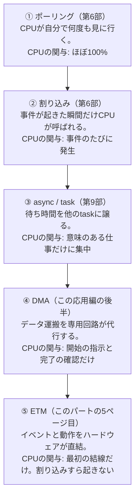

## このページでできるようになること

- ArduinoとESP32-C6の設計思想の違いを「CPUがやるか、専用ハードウェアがやるか」という軸で説明できる
- ポーリングから割り込み、async、DMA、ETMへと続く「CPU関与の階段」を図で説明できる
- この図鑑の各ページに付く「Rustからの現在地」バッジ（3種類）の意味を読み取れる
- この応用編・全10ページの地図を手に入れる

## 先に結論

この応用編のテーマは一つだけです——**CPUに全部やらせるのをやめ、専用ハードウェアへ仕事を分担させよう**。Arduino UNOの世界では、「入力を読む→判断する→出力する」をCPUが順番に実行します。ESP32-C6の世界では、「入力回路→計数回路→タイマー→PWM出力」という**ハードウェアの処理網をチップ内に組み上げ、CPUは最初の設定だけして寝てしまう**ことができます。第9部で学んだEmbassyのtask並行性は「1つのCPUの上で仕事を切り替える」技術でしたが、その先には「CPUの外で、複数の回路が本当に同時に働く」**ハードウェアの並行性**があります。この図鑑では、ESP32-C6のちょっと信じがたい機能たちを1つずつ紹介し、各機能に**Rust（esp-hal 1.1.1）からいま実際に使えるのか**を示すバッジを必ず付けます。

## 身近なたとえ

ワンオペの食堂を想像してください。店主が注文を聞き、調理し、配膳し、会計もする——これがArduino UNOのCPUです。腕が良くても、体は一つなので、揚げ物を見ている間は会計ができません。

一方ESP32-C6は、券売機（入力）、自動炊飯器（タイマー）、食洗機（データ運搬）、そして「揚げ物のブザーが鳴ったら換気扇を強にする」といった**機械同士の連動**まで備えた食堂です。店主（CPU）は開店前に各機械を設定して回るだけで、営業中は奥で仮眠すら取れます。

たとえと違う点を正直に言うと、実際の「機械」はチップの中の**ペリフェラル（周辺機器）と呼ばれるデジタル回路**であり、店主の「設定して回る」はCPUが各ペリフェラルの設定レジスタに値を書き込むことです。また、機械が増えるほど「どの機械に何をさせるか」という設計の仕事は増えます。楽になるのはCPUであって、設計者のあなたではありません。

## 仕組み — CPU関与の階段

この教材でここまで学んできた「待ち方・反応のしかた」を並べ直すと、一段ずつCPUの関与が減っていく階段になっています。



①〜③はすでに学びました。第6部でポーリングと割り込みを比べ、第9部で「割り込みがWakerを起こし、taskが目を覚ます」というEmbassyの仕組みを学びましたね。ここで大事なのは、**③までは結局CPUが仕事をしている**ということです。asyncは待ち時間を無駄にしない技術であって、仕事そのものを減らす技術ではありません。

④と⑤が、この応用編で新しく踏み込む領域です。データを運ぶ（DMA）、波形を作る（RMT）、パルスを数える（PCNT）、イベントに反応する（ETM）——こうした仕事を**CPUの外にある専用回路に丸ごと渡してしまう**。これが「ハードウェアの並行性」です。Embassyのtaskが何十個あっても、CPUが1つなら同時に進むtaskは1つだけです。しかしペリフェラルは本当に同時に動きます。RMTが波形を送出している最中も、PCNTはパルスを数え続け、ETMはボタンに反応します。CPUが眠っていてもです。

### なぜArduino UNOではこうならないのか

Arduino UNO（ATmega328P）にもタイマーやUARTなどのペリフェラルはあります。Arduinoが劣っているのではなく、**チップの規模と設計の時代が違う**のです。ATmega328Pは2KBのRAMを持つ8bitマイコンで、ペリフェラルの種類も配線の自由度も限られています。ESP32-C6は160MHzの32bit RISC-Vに、この図鑑で紹介する専用回路の群れを載せた「小さな工場」です。Arduinoで身につけた「CPUが読んで、判断して、出す」という直感は正しい基礎ですが、その直感のままESP32-C6を使うと、工場を持っているのにワンオペを続けることになります。

## 「Rustからの現在地」バッジの読み方

この図鑑の各機能ページには、冒頭に次の形式のバッジを必ず付けます。

> **Rustからの現在地**: unstableで試せる — esp-hal 1.1.1の`rmt`モジュールを使います。（これは例です）

バッジは3種類です。

| バッジ | 意味 | この教材で書けるか |
|---|---|---|
| **今すぐ試せる（stable）** | esp-hal 1.1.1のstable APIだけで使える | 書ける |
| **unstableで試せる** | esp-halの`unstable` feature配下のAPIで使える | **書ける**（本教材はunstable有効） |
| **概念のみ（ESP-IDF）** | ハードウェアは対応しているが、esp-hal 1.1.1にドライバがない。C言語のESP-IDFなら使える | 概念の説明のみ |

第5部9ページで学んだとおり、esp-halは「stable API」と「`unstable` feature配下のAPI」の2階建てで、本教材はCargo.tomlで`unstable`を有効にしています（[バージョン固定表](/embassy-esp32-c6/project/versions/)参照）。つまり**上2つのバッジが付いた機能は、この教材の環境でそのまま書いて動かせます**。unstableの代償は「esp-halのマイナー更新でAPIが変わりうる」ことでした。この図鑑のRMT・PCNT・ETMなどはまさにその領域にいます。

3つ目のバッジは、この図鑑ならではの学びを含んでいます。たとえばADCの連続変換+DMAは、ESP32-C6のハードウェアもESP-IDFも対応していますが、esp-hal 1.1.1にはまだドライバがありません。**「チップができること」と「手元のライブラリでできること」は別物**です。データシートを読んで「できるはずだ」と思い込む前に、ライブラリの現在地を確かめる——この区別ができることは、組み込み開発者として一段階の成長です。

## 図鑑の地図 — 全10ページ

前半5ページ（このパート）は、Embassyのコードで実際に動かせるものを中心に進みます。

| ページ | 機能 | ひとことで | Rustからの現在地 |
|---|---|---|---|
| [2. GPIO Matrix](/embassy-esp32-c6/deep-dive/02-gpio-matrix/) | チップ内蔵の配線盤 | ほぼどの信号もほぼどのピンへ | 今すぐ試せる（stable） |
| [3. RMT](/embassy-esp32-c6/deep-dive/03-rmt/) | 波形の演奏装置 | ついにオンボードLEDが光る | unstableで試せる |
| [4. PCNT](/embassy-esp32-c6/deep-dive/04-pcnt/) | ハードウェアカウンタ | CPUを使わず数え、方向まで分かる | unstableで試せる |
| [5. ETM](/embassy-esp32-c6/deep-dive/05-etm/) | ペリフェラル直結網 | 割り込みすら使わない | unstableで試せる（範囲限定） |

後半5ページでは、LEDCのハードウェアフェードとDMA（[6ページ](/embassy-esp32-c6/deep-dive/06-ledc-dma/)から）に始まり、モーター制御専用のMCPWM、メインCPUがDeep Sleep中も働き続けるLPコアなど、さらに深いところへ潜ります。

順番にも意味があります。まずGPIO Matrixで「信号とピンが分離している」というESP32の土台を知り、RMTとPCNTで「出力の分担」「入力の分担」を体験し、最後にETMで「入力と出力をCPU抜きで直結する」ところまで降りていきます。

## よくある失敗

- **「asyncを使えばCPU負荷が下がる」と思い込む** — 第9部の復習ですが、asyncは待ち時間の使い方を変える技術で、仕事の総量は減りません。1µs単位の波形生成をtaskでやろうとしても、Timerの分解能もtask切り替えの時間も足りず破綻します。仕事そのものを減らすのがこの応用編のテーマです
- **データシートに載っている機能を「Rustで書けるはず」と思い込む** — ハードウェア対応とesp-halのドライバ実装は別物です。各ページのバッジと[バージョン固定表](/embassy-esp32-c6/project/versions/)を確認してから設計してください。逆に「Rustにないから機能自体が存在しない」も誤りです
- **専用ハードウェアを「上級者向けの飾り」と考えて全部CPUで書き続ける** — WS2812のような相手は、そもそもCPUのソフトウェアループでは安定して駆動しにくい速度で通信します。分担は趣味ではなく必要から生まれた技術です

## やってみよう

5分でできる予習です。これまで書いたコードに、実は今回のテーマがすでに隠れています。`examples/`ディレクトリで次を実行して、`with_`で始まるメソッドを数えてください。

```bash
grep -rn "with_tx\|with_rx\|with_sda\|with_scl\|with_sck\|with_mosi\|with_miso" \
  03-uart/src 04-i2c/src 05-spi/src
```

UARTのTXがGPIO23、I2CのSDAがGPIO6……これらのピン番号、誰が決めたのでしょうか。データシートの固定表ではなく、**あなた**が決めていました。その種明かしが次のページです。

## 確認問題

1. 「CPU関与の階段」の5段を、CPUの関与が多い順に並べてください。
2. Embassyのtask並行性と「ハードウェアの並行性」の違いを1〜2文で説明してください。
3. 「unstableで試せる」バッジの機能は、この教材の環境でそのまま書けます。その理由と、引き換えに受け入れているリスクを答えてください。

<details>
<summary>答え</summary>

1. ポーリング → 割り込み → async/task → DMA → ETM
2. task並行性は1つのCPUの上で仕事を高速に切り替えて「同時に見せる」技術。ハードウェアの並行性は、CPUの外の専用回路が本当に同時に動くこと。CPUが眠っていてもペリフェラルは動き続ける。
3. 本教材はCargo.tomlでesp-halの`unstable` featureを有効にしているため。引き換えに、これらのAPIはsemver保証がなく、esp-halのマイナー更新で書き方が変わる可能性がある。

</details>

## まとめ

- テーマは「CPUに全部やらせない」。ポーリング→割り込み→async→DMA→ETMと、CPUの関与は段階的に減らせる
- asyncまでは「CPUの仕事のやりくり」、この応用編からは「CPUの外の並行性」。ペリフェラルはCPUが寝ていても本当に同時に動く
- 各機能には「Rustからの現在地」バッジが付く。ハードウェア対応とライブラリ対応は別物として確かめる

## 次のページ

まずは土台から。「TWAIのピンをどこからでも出せる」「UARTのピンを自分で決められる」——あなたがすでに使っていたその自由の正体、チップ内蔵の配線盤GPIO Matrixの種明かしです。

- 前: [12. 持ち帰るもの — 17,000行から教材へ](/embassy-esp32-c6/robot/12-lessons/)
- 次: [2. GPIO Matrix — チップ内蔵のプログラム可能な配線盤](/embassy-esp32-c6/deep-dive/02-gpio-matrix/)
