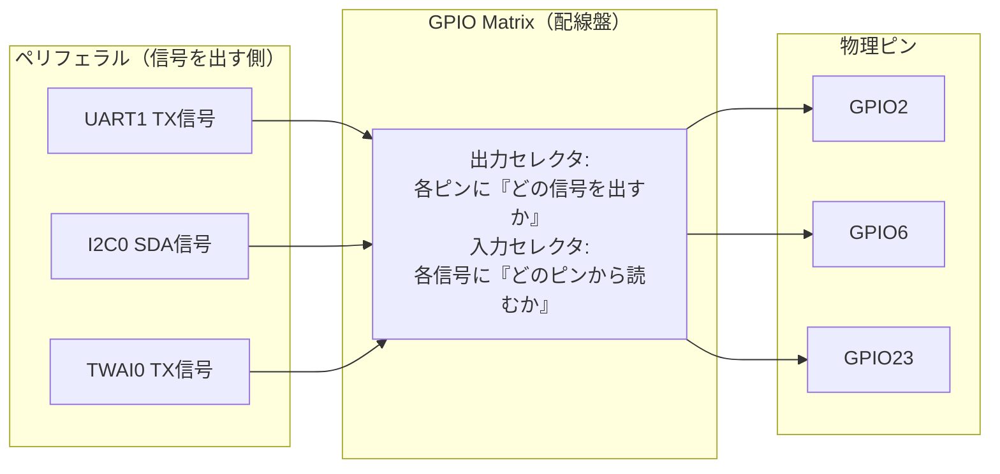

> **Rustからの現在地**: **今すぐ試せる（stable）** — 各ドライバの`with_tx()`/`with_sda()`/`with_pin()`などがGPIO Matrixの操作そのものです。あなたは第8部からずっとこれを使っています。

## このページでできるようになること

- 「ペリフェラルの信号」と「物理ピン」がESP32-C6では分離していることを、GPIO Matrixの仕組みで説明できる
- これまで書いてきた`with_tx()`/`with_sda()`等が、実はGPIO Matrixの配線指示だったと種明かしできる
- 自由に使えないピン（フラッシュ・USB・ストラッピング）を挙げ、理由を説明できる
- UARTループバックのピンを差し替えて、ビルドし直すだけで動くことを確かめられる

## 先に結論

多くのマイコンでは「UARTのTXは○番ピン」と**シリコンの設計時点で固定**されています。ESP32-C6は違います。チップの中に**GPIO Matrix**という「プログラム可能な配線盤」があり、UART・I2C・SPI・TWAIといったペリフェラルのデジタル信号を、**ほぼ任意のGPIOピンへソフトウェアで接続**できます。第8部で`with_tx(peripherals.GPIO23)`と書いたとき、あなたはすでにこの配線盤を操作していました。ただし万能ではありません。フラッシュ用のGPIO24〜30、USB Serial/JTAGのGPIO12/13、起動設定に関わるストラッピングピン（GPIO4/5/8/9/15）には注意が必要で、ADCなどのアナログ機能はピン固定のままです。そしてTWAIのピンを自由に選べても、**外付けトランシーバが必須**という電気の掟は変わりません。

## 身近なたとえ

昔の電話交換手の配線盤を思い浮かべてください。壁一面にジャックが並び、交換手がコードを差し替えることで「誰と誰をつなぐか」を自由に変えられます。電話機（ペリフェラル）と回線（ピン）は固定の関係ではなく、盤面で好きに組み替えられる——GPIO Matrixはこれをチップ内部のデジタル回路でやります。

たとえと違うのは、実際には物理的なコードの差し替えではなく、**セレクタ回路（マルチプレクサ）の設定レジスタに番号を書き込む**ことで接続が決まる点です。だから起動のたびにソフトウェアが配線をやり直せますし、動作中に組み替えることさえできます。

## 仕組み

ESP32-C6の内部では、ペリフェラルは「UART1のTX信号」「TWAI0のRX信号」といった**信号（signal）**を出し入れします。GPIO Matrixは、この信号群と物理ピン（GPIO0〜30）の間に挟まったセレクタの集合体です。



普通のマイコン（Arduino UNOのATmega328Pなど）では、この配線盤の部分が固定配線です。だからUNOのハードウェアUARTは0/1番ピンから動かせず、SPIは11〜13番ピン固定です。別のピンでシリアル通信をしたければSoftwareSerialのように**CPUがピンを高速に上げ下げして通信を真似る**しかなく、CPU時間を大量に食います。「配線をソフトで決める」と「通信をソフトで実行する」はまったく別のことです。GPIO Matrixは前者であり、配線が決まったあとの通信はハードウェアが行います。

### あなたはもう使っていた

第8部からのコードを振り返ると、ピンの自由はずっと目の前にありました。すべてcargo check済みのexamplesからの実例です。

| example | 書いた行 | 配線盤への指示 |
|---|---|---|
| 03-uart | `.with_tx(peripherals.GPIO23)` | UART1のTX信号をGPIO23へ |
| 04-i2c | `.with_sda(peripherals.GPIO6)` | I2C0のSDA信号をGPIO6へ（入出力両方向） |
| 05-spi | `.with_mosi(peripherals.GPIO18)` | SPI2のMOSI信号をGPIO18へ |
| 11-twai | `peripherals.GPIO2 // TX` | TWAI0のTX信号をGPIO2へ |
| 18-rmt-ws2812 | `.with_pin(peripherals.GPIO8)` | RMTチャネル0の出力をGPIO8へ |

第8部でTWAIを学んだとき、「CANのピンはどこ?」という疑問に「どこでもいい」と答えられたのはGPIO Matrixのおかげです。市販マイコンの多くはCANコントローラのピンが固定なので、これはかなりの驚きポイントです。基板を設計してから「このピン、別の用途に使いたかった…」と気づいても、ESP32ならソフトウェアで救える場合が多い——製品開発の現場でこの柔軟性は本当に重宝されています。

### 動かせないもの・注意するもの

配線盤にも限界があります。ここを正直に押さえておきましょう。

- **フラッシュ用ピン（GPIO24〜26、28〜30。GPIO27はVDD_SPI電源）**: プログラムを保存するフラッシュメモリとの接続に使われています。ここに信号を割り当てるとプログラム自体が読めなくなります。開発ボードではそもそもピンヘッダに出ていません
- **GPIO12/13**: USB Serial/JTAGのD−/D+です。ここを別用途にするとネイティブUSB経由の書き込み・デバッグができなくなります
- **ストラッピングピン（GPIO4/5/8/9/15）**: リセット直後の一瞬だけ「起動モードの設定スイッチ」として読まれます。起動後は普通に使えますが、外部回路がリセット時にこれらを引っ張っていると起動モードが変わってしまいます（GPIO8のWS2812Bで次ページに再登場します）
- **アナログ機能はピン固定**: ADCはGPIO0〜6専用です。GPIO Matrixが配れるのは**デジタル信号だけ**で、アナログ回路は物理的にそのピンに作り込まれています
- **GPIO14は存在しない**: ESP32-C6にGPIO14はありません。番号が連続だと思い込むと配線図で迷子になります
- **電気の掟は変わらない**: TWAIのTX/RX信号をどのピンに出せても、CANバスに参加するには外付けトランシーバが必須です（[第8部9. TWAI基礎](/embassy-esp32-c6/part08/09-twai-basics/)）。配線盤は信号の行き先を変えるだけで、電圧や駆動能力の問題は解決しません

## RustとEmbassyではどう書くか — ピン差し替え実験

新しいAPIは何も要りません。第8部で動かしたUARTループバック（examples/03-uart）のピンを差し替えて、GPIO Matrixを体感します。元のコードはこうでした（抜粋です。完全なコードは examples/03-uart を見てください）。

```rust
let mut uart = Uart::new(peripherals.UART1, uart_config)
    .expect("UARTの設定が不正です")
    .with_tx(peripherals.GPIO23)
    .with_rx(peripherals.GPIO22)
    .into_async();
```

これを、たとえばGPIO21とGPIO20に差し替えます（この2行だけの変更です）。

```rust
    .with_tx(peripherals.GPIO21)
    .with_rx(peripherals.GPIO20)
```

ジャンパワイヤもGPIO21–GPIO20間に差し替えて、ビルドし直せばそのまま動きます。UART1という「電話機」は同じで、つなぐ「回線」だけが変わりました。回路図の変更も、はんだ付けも要りません。

なお、GPIO16/17は避けてください。UART0のログ出力コンソールに使われています。前節の注意ピン（4/5/8/9/12/13/15）も実験では避けるのが無難です。

## コードを一行ずつ読む

- `Uart::new(peripherals.UART1, uart_config)` — この時点ではUART1という**ペリフェラル本体**を確保しただけで、まだどのピンにもつながっていません。信号とピンが分離している証拠です
- `.with_tx(peripherals.GPIO21)` — GPIO Matrixの出力セレクタに「GPIO21にはUART1のTX信号を出せ」と設定します。`peripherals.GPIO21`の**所有権を渡している**ことにも注目してください。同じピンを別のペリフェラルに二重接続しようとするとコンパイルエラーになります。配線盤の設定ミスをRustの型システムが防いでいるのです
- `.with_rx(peripherals.GPIO20)` — 入力方向のセレクタ設定です。「UART1のRX信号はGPIO20から読め」となります

もう一段深く潜りたい人へ。esp-halには`gpio::interconnect`というモジュール（unstable）があり、ピンを`split()`して`InputSignal`/`OutputSignal`という「信号の端子」を取り出し、手動で配線することもできます。実は次々ページのPCNTのコードに出てくる`pulse_in.peripheral_input()`がまさにこれです。`with_xxx()`はこの低レベル配線を安全に包んだ言い方だった、というわけです。

## 実行方法

```bash
cd examples/03-uart
cargo run --release
```

ピンを差し替えた版でも、元と同じログが出れば成功です。

```text
INFO - 受信: Hello, UART! from ESP32-C6
```

差し替え前後で動作が何も変わらないこと——それ自体が「配線はソフトウェアで決まっている」ことの証明です。

## よくある失敗

- **ジャンパを差し替え忘れる** — コードをGPIO21/20に変えたのに、ジャンパが23–22のままだと受信タイムアウトになります。配線盤（チップ内）と配線（チップ外）は別物で、外側は今までどおり手で差し替える必要があります
- **GPIO16/17に割り当ててログが壊れる** — UART0のコンソールと衝突し、ログが出なくなったり文字化けしたりします。「どのピンも空いているように見える」のがGPIO Matrixの罠で、ボード上ですでに役割を持つピンの一覧（ハードウェア資料）を確認する習慣をつけてください
- **ADCを別ピンに「配線」しようとする** — `with_xxx()`相当の方法を探しても存在しません。アナログはピン固定です。GPIO Matrixが扱うのはデジタル信号だけ、と覚えてください

## やってみよう

TX/RXを**同じ側のピン組で入れ替えて**みましょう。`with_tx(peripherals.GPIO22)`、`with_rx(peripherals.GPIO23)`にすると、ジャンパはそのまま（23–22間）で動くはずです。物理配線を1mmも動かさずにTXとRXの位置が入れ替わる——交換手の仕事はすべてチップの中で終わっています。

## 確認問題

1. Arduino UNOのハードウェアUARTが0/1番ピンから動かせないのに、ESP32-C6のUART1はピンを選べます。両者の違いを「信号」と「ピン」という言葉を使って説明してください。
2. GPIO Matrixで自由にできない・注意が必要なピンを3グループ挙げてください。
3. 「TWAIのピンをどこにでも出せるなら、GPIO2/3を直接CANバスにつないでよい」——正しいですか。

<details>
<summary>答え</summary>

1. UNOではUARTの信号が特定ピンに固定配線されている。ESP32-C6ではペリフェラルの信号と物理ピンが分離しており、間にあるGPIO Matrix（セレクタ回路）の設定で任意の組み合わせに接続できる。
2. フラッシュ用のGPIO24〜30（GPIO27はVDD_SPI）、USB Serial/JTAGのGPIO12/13、ストラッピングピンのGPIO4/5/8/9/15。（加えてアナログ機能はGPIO0〜6のピン固定、GPIO16/17はコンソール用）
3. 誤り。GPIO Matrixは信号の行き先を変えるだけで、CANバスの電気的条件は満たせない。外付けトランシーバを介する必要がある。

</details>

## まとめ

- ESP32-C6ではペリフェラルの信号と物理ピンが分離しており、GPIO Matrixというチップ内の配線盤がソフトウェア設定で両者をつなぐ
- `with_tx()`などのメソッドは配線盤への指示。所有権の移動が「ピンの二重使用」をコンパイル時に防ぐ
- フラッシュ・USB・ストラッピングの各ピンとアナログ機能には制約が残る。配線盤は電気の掟（トランシーバ必須など）を変えない

## 次のページ

配線盤で信号を「どこに出すか」は自由になりました。次は「どんな波形を出すか」です。µs以下の精度で波形を演奏するRMTを使い、第1部から封印されてきたオンボードLED——GPIO8のWS2812B——をついに光らせます。

- 前: [1. CPUに全部やらせない — 深淵への招待](/embassy-esp32-c6/deep-dive/01-intro/)
- 次: [3. RMT — 波形をハードウェアに演奏させる](/embassy-esp32-c6/deep-dive/03-rmt/)
