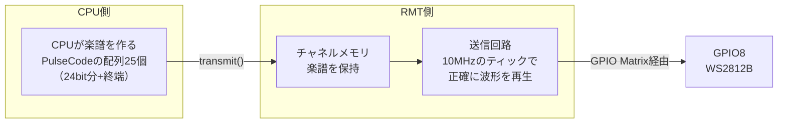

> **Rustからの現在地**: **unstableで試せる** — esp-hal 1.1.1の`rmt`モジュール（unstable）。async対応で、`transmit(&data).await`と書けます。WS2812用の補助クレートesp-hal-smartledはesp-hal 1.1.1と併用できないため、パルス列は自前で組み立てます（それが一番勉強になります）。

## このページでできるようになること

- RMTが「High xµs / Low yµs…という波形の列を記憶し、正確に再生する装置」だと説明できる
- WS2812Bの1線式プロトコル（0/1のパルス幅、GRB順、リセット時間）を読める
- クロック80MHz・分周8から「1ティック=0.1µs」を計算し、パルス幅をティック数へ変換できる
- オンボードLED（GPIO8のWS2812B）を虹色に光らせ、`transmit().await`中にCPUが自由であることを説明できる

## 先に結論

第1部の最初のLチカで、こう書きました——「ボードに載っているRGB LED（GPIO8）はWS2812Bというアドレサブル（信号制御式）LEDなので、単純なON/OFFでは光りません」。あれから長い旅でしたが、**今日、封印を解きます**。鍵はRMT（Remote Control Transceiver）。名前のとおり元は赤外線リモコン用の回路ですが、正体は「**HighとLowの長さの列を記憶し、指定どおり正確に送出（あるいは受信して記録）する装置**」です。楽譜（パルス列）をメモリに書いておけば、演奏（波形の送出）はハードウェアが0.1µs単位の正確さでやってくれます。CPUは楽譜を書くだけ。だからこの装置は、赤外線でもWS2812でも、**まだ存在しない自作の通信規格でも**、波形で表せるものなら何でも演奏できます。

## 身近なたとえ

オルゴールのシリンダーを思い浮かべてください。ピンの位置（=楽譜）をあらかじめ刻んでおけば、あとはゼンマイが正確なテンポで演奏します。演奏中に職人（CPU）が横に立っている必要はありません。職人の仕事は、シリンダーにピンを刻むことだけです。

たとえと違うのは、RMTの「楽譜」は書き換え自由なメモリ（1チャネルあたり48エントリ、各32bit）で、テンポはゼンマイではなく80MHzのクロックと分周器で決まる点です。また、RMTには「聴音」側もあります。受信モードでは、届いた波形のHigh/Lowの長さを測って楽譜として書き取ってくれます（ESP32-C6は送信2チャネル+受信2チャネル）。

## 仕組み — WS2812Bという気難しい相手

WS2812Bは、電源・GND・データの3本しか足がないのに、色と明るさを自由に指定できるLEDです。内部に小さな制御チップが入っていて、データ線1本から次のルールで24bitを受け取ります。

- 1ピクセル = 24bit を「**緑→赤→青**（GRB順・各バイトMSBファースト）」で送る
- **0ビット**: High 0.4µs → Low 0.85µs
- **1ビット**: High 0.8µs → Low 0.45µs（許容誤差 ±0.15µs）
- 50µs以上Lowを保つと「**リセット**」となり、送った色がLEDに反映される

つまり0も1も「HighからLowへの1往復」で、**Highの長さだけで区別**します。0.4µsと0.8µsの差で0/1が決まる——これがLチカとの決定的な違いです。第1部のLチカは`Timer::after`で500ms待ちましたが、Embassyのtimerの世界は待ち時間の最小単位も切り替えの所要時間もms〜数十µsのオーダーで、0.4µsのパルスを24発、誤差±0.15µs以内で並べる仕事にはまったく歯が立ちません。



送信が始まったら、CPUは自由です。`transmit(&data).await`の待ち時間は他のtaskに譲られ、送信完了の割り込みでtaskが起こされます。第9部で学んだasyncの型そのままですね。

## Arduinoではどう書くか

Arduino UNOでWS2812を光らせる定番はAdafruit NeoPixelなどのライブラリです。中身を覗くと、**割り込みを禁止した上で、クロック数を数えながら手書きのアセンブリでピンを上げ下げ**しています。16MHzのAVRでは0.4µsは6〜7命令分しかなく、C言語の`digitalWrite()`では間に合わないからです。この方式はCPUを送信中ずっと拘束し、割り込み禁止中はmillis()が狂うなどの副作用もあります。悪い実装なのではなく、**専用ハードウェアがないマイコンでは職人芸でCPUに演奏させるしかない**のです。RMTはこの職人芸を丸ごと専用回路に置き換えます。

## RustとEmbassyではどう書くか

examples/18-rmt-ws2812 の要点を順に見ます（以下はすべて抜粋です。完全なコードは examples/18-rmt-ws2812 を見てください）。まずティックの設計から。

```rust
// RMTのソースクロックは80MHz。分周器(clk_divider)を8にすると
//   80MHz ÷ 8 = 10MHz → 1ティック = 0.1µs (100ns)
const T0H: u16 = 4; // 0ビットのHigh: 4ティック = 0.4µs
const T0L: u16 = 8; // 0ビットのLow : 8ティック = 0.8µs（規格値0.85µs、誤差±0.15µs内）
const T1H: u16 = 8; // 1ビットのHigh: 8ティック = 0.8µs
const T1L: u16 = 4; // 1ビットのLow : 4ティック = 0.4µs（規格値0.45µs、誤差±0.15µs内）
```

80MHzを8で割って10MHz、つまり1ティック0.1µs。WS2812の全パルス幅が「0.1µsの整数倍」でほぼ表せるので、この分周値を選びました。0.85µsぴったりではなく0.8µs（8ティック）としていますが、規格の許容誤差±0.15µsに収まるので問題ありません。**分周器の選び方ひとつで楽譜の書きやすさが変わる**——これがRMT設計の第一歩です。

次に、RGB値を楽譜（パルス列）へ変換する関数です。

```rust
fn ws2812_pulses(r: u8, g: u8, b: u8) -> [PulseCode; 25] {
    let one = PulseCode::new(Level::High, T1H, Level::Low, T1L);
    let zero = PulseCode::new(Level::High, T0H, Level::Low, T0L);

    let mut data = [PulseCode::end_marker(); 25];
    // WS2812は緑→赤→青（GRB）の順で受け取る点に注意
    let grb: u32 = ((g as u32) << 16) | ((r as u32) << 8) | (b as u32);
    for (i, slot) in data.iter_mut().take(24).enumerate() {
        // 上位ビット(bit23)から順に送る
        let bit_is_one = grb & (1 << (23 - i)) != 0;
        *slot = if bit_is_one { one } else { zero };
    }
    // data[24]は終端マーカ（長さ0のエントリ）。ここで送信が止まる。
    data
}
```

そして初期化と送信ループです。

```rust
let rmt = Rmt::new(peripherals.RMT, Rate::from_mhz(80))
    .unwrap()
    .into_async();

let mut channel = rmt
    .channel0
    .configure_tx(
        &TxChannelConfig::default()
            .with_clk_divider(8) // 80MHz÷8=10MHz → 1ティック=0.1µs
            .with_idle_output(true)
            .with_idle_output_level(Level::Low),
    )
    .unwrap()
    .with_pin(peripherals.GPIO8);

loop {
    let (r, g, b) = wheel(hue);
    let data = ws2812_pulses(r / 8, g / 8, b / 8);
    channel.transmit(&data).await.unwrap();
    hue = hue.wrapping_add(1);
    Timer::after(Duration::from_millis(20)).await;
}
```

## コードを一行ずつ読む

- `PulseCode::new(Level::High, T1H, Level::Low, T1L)` — 楽譜の1エントリです。「Highを8ティック、続けてLowを4ティック」という**1往復ぶんの波形**を32bitに詰めます。0ビット用と1ビット用の2種類の「音符」を先に作っておき、あとは並べるだけです
- `[PulseCode::end_marker(); 25]` — 24bit分の音符+**終端マーカ**で25エントリ。終端マーカは「長さ0」の特別なエントリで、RMTはこれを読むと送信を止めます。楽譜の「終止線」です。25エントリはチャネルメモリの48エントリに収まるため、送信中の楽譜の差し替えを考えずに済みます
- `let grb: u32 = ...` — WS2812はRGBではなく**GRB順**です。ここを間違えると「赤のつもりが緑に光る」という混乱の定番が起きます
- `Rmt::new(peripherals.RMT, Rate::from_mhz(80))` — RMT本体を80MHzのクロックで初期化します。`.into_async()`でasync版に変換するのは、第8部のUARTやI2Cで見た型と同じです
- `.with_clk_divider(8)` — チャネルごとの分周器。ここで「1ティックの長さ」が決まります
- `.with_idle_output(true).with_idle_output_level(Level::Low)` — 送信していない間、ピンをLowに固定します。フレーム間のLowが50µsを超えると「リセット」となり色が反映される、というWS2812の仕様をアイドル状態でそのまま満たす設計です
- `.with_pin(peripherals.GPIO8)` — 前ページの配線盤がここでも登場。RMTチャネル0の出力信号をGPIO8へつなぎます。GPIO8はストラッピングピンでもあるため、外部回路でリセット時にLowへ引かれるとブートに影響しますが、オンボードLEDへの接続は問題ありません
- `channel.transmit(&data).await` — 楽譜を渡して演奏開始。**await中、CPUは他のtaskに使えます**。24bit+リセットの演奏はハードウェアが正確にこなし、完了割り込みでこのtaskが再開します

### esp-hal-smartledが使えなかった話

WS2812向けには、RMTの上にかぶせるesp-hal-smartledという便利クレートがあります。しかし執筆時点の同クレートはesp-hal「~1.0」に固定されており、本教材のesp-hal 1.1.1とは依存関係が両立しません。そこでこの例は生の`PulseCode`で書きました。回り道に見えますが、得たものは大きいはずです。**便利クレートの下で何が起きているかを自分の手で書けた**こと、そしてバージョン固定表の大切さ（クレートの組み合わせは自分で検証する）をまた一つ体感したことです。

### 「存在しない通信規格」を作れる

RMTの本当の凄みは、WS2812が「単なる一例」にすぎないことです。楽譜に書ける波形なら何でも演奏できるので、

- 赤外線リモコンの信号（本来の用途。受信チャネルで「書き取り」もできる）
- サーボやステッピングドライバ向けの正確なパルス
- **自分で決めたルールの1線通信** — 「Highが0.3µsなら0、0.6µsなら1」という自作規格を今日から運用できます

「チップが対応している通信規格の一覧」から選ぶのではなく、**波形から通信を発明する**側に回れる。これがこの図鑑でRMTを「キモい機能」に数える理由です。

## 実行方法

配線は不要です。WS2812BはボードのGPIO8に直結済みです。

```bash
cd examples/18-rmt-ws2812
cargo run --release
```

```text
INFO - RMTでオンボードWS2812Bを虹色に光らせます
```

オンボードLEDが虹色にゆっくり変化すれば成功です（約5秒で色相が1周します）。第1部でON/OFFしても沈黙していたあのLEDが、正しい「言葉」で話しかけたら応えてくれた瞬間です。

## よくある失敗

- **赤を指定したのに緑に光る** — GRB順をRGB順と取り違えています。`ws2812_pulses`のビット並べ替えを確認してください。逆に言えば、色が入れ替わって光ること自体が「パルス列は正しく届いている」証拠でもあります
- **終端マーカを忘れて`transmit`がおかしくなる** — 楽譜に終止線がないと、RMTはどこで止まればいいか分かりません。配列の最後は必ず`PulseCode::end_marker()`にしてください
- **明るさ全開で目を痛める** — WS2812Bの全開はかなり眩しく、電流も増えます。例では`r / 8`のように1/8へ落としています。フルカラーLEDテープを何十個もつなぐ場合は電源設計(5V・大電流)が別途必要です
- **esp-hal-smartledを追加してビルドが壊れる** — esp-hal 1.1.1とはバージョンが両立しません。cargoの依存解決エラーが出ます。本教材の範囲では生PulseCodeで書いてください

## やってみよう

`Timer::after(Duration::from_millis(20))`を`5`に変えて色相の回転を速くしてみましょう。速くしても色の変化が破綻しないのは、1フレームの演奏（24bit ≒ 30µs）がフレーム間隔よりずっと短く、しかも演奏の正確さがCPUの忙しさと無関係だからです。ついでに`/ 8`を`/ 2`にして明るさの変化も見てみてください（直視は禁物）。

## 確認問題

1. RMTを一言で説明してください。「波形」という言葉を使うこと。
2. 80MHzのクロックを分周器8で割ると1ティックは何µsですか。また、T1H=8ティックは何µsですか。
3. `transmit(&data).await`の実行中、CPUは何をしていますか。Arduino UNO+NeoPixelライブラリとの違いを添えて答えてください。

<details>
<summary>答え</summary>

1. HighとLowの長さの列（波形の楽譜）をメモリに記憶し、ハードウェアが正確に送出・受信するペリフェラル。
2. 80MHz ÷ 8 = 10MHzなので1ティック = 0.1µs。8ティックは0.8µs。
3. 待ち時間は他のtaskに譲られており、CPUは別の仕事（または休み）に使える。UNOのライブラリは割り込みを禁止してCPU自身が波形を作るため、送信中CPUは完全に拘束される。

</details>

## まとめ

- RMTは「波形の楽譜を記憶し正確に演奏する装置」。分周器でティックの長さを決め、PulseCodeの列+終端マーカで楽譜を書く
- WS2812Bは0.4µs/0.8µsのHigh幅で0/1を区別するGRB 24bitの1線式。CPUのソフトウェアループではなくRMTで駆動するのが本筋
- `transmit().await`で演奏はハードウェア、CPUは自由。波形で表せるなら自作の通信規格すら作れる

## 次のページ

出力の分担ができたので、次は入力の分担です。ボタンやエンコーダのパルスを、CPUに数えさせるのをやめましょう。回転の「方向」までハードウェアが判定するPCNTです。

- 前: [2. GPIO Matrix — チップ内蔵のプログラム可能な配線盤](/embassy-esp32-c6/deep-dive/02-gpio-matrix/)
- 次: [4. PCNT — CPUを使わずに数え、方向まで分かる](/embassy-esp32-c6/deep-dive/04-pcnt/)
