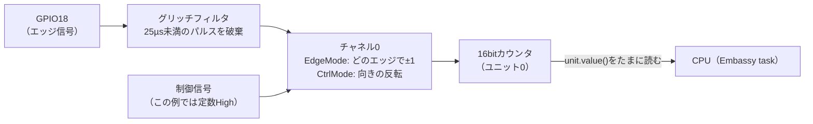

> **Rustからの現在地**: **unstableで試せる** — esp-hal 1.1.1の`pcnt`モジュール(unstable)。カウントも方向判定もフィルタも使えます。async対応はまだないため、この例では値をポーリングで読みます（数えるのはハードウェアなので、読むのが遅くても取りこぼしません）。

## このページでできるようになること

- 「GPIO割り込みで数える」方式の限界と、ハードウェアカウンタPCNTの利点を説明できる
- グリッチフィルタの設定値からフィルタ時間を計算できる（1000サイクル ÷ 40MHz = 25µs）
- EdgeMode/CtrlModeの組み合わせで「どのエッジで、どちら向きに数えるか」を設計できる
- A/B相ロータリーエンコーダの4逓倍デコードの原理を説明できる

## 先に結論

回転数の計測、流量計のパルス、エンコーダ付きモーター——「パルスを数える」仕事は組み込みの定番です。Arduino的な解法は「エッジで割り込み→変数を`++`」ですが、パルスが速くなると割り込みの嵐でCPUが仕事にならず、接点のチャタリング（バタつき）も数えてしまいます。PCNT（Pulse Counter、パルスカウンタ）は**数える仕事そのものをハードウェアにやらせる**ペリフェラルです。ESP32-C6には4ユニット（各2チャネル）あり、エッジの種類ごとに増やす/減らす/何もしないを設定でき、**制御信号との組み合わせで回転方向まで判定**します。さらに入口には**グリッチフィルタ**があり、指定より短いパルスをCPUに見せる前に捨てます。第6部で学んだ「時間で吸収する」デバウンスに対し、こちらは「**ハードで除去する**」対策です。

## 身近なたとえ

マラソン大会の周回チェックを思い浮かべてください。係員（CPU）が目視で数えるなら、選手が速くなるほど見落としますし、コースをうろうろ横切る観客（ノイズ）も数えてしまうかもしれません。PCNTは足元の計測マット（ハードウェアカウンタ）です。選手が通るたび自動で記録し、係員はときどき集計表を見るだけ。マットは「一瞬だけ踏まれた振動」（グリッチ）を無視し、逆走（方向）も区別します。

たとえと違うのは、PCNTのカウンタは16bitの符号付き整数（`i16`）で、増える方向にも減る方向にも数えられる点です。また「一定数に達したら知らせる」上限・下限イベントを設定でき、係員（CPU）を割り込みで呼ぶこともできます。

## 仕組み

PCNTの1チャネルには2本の入力があります。

- **エッジ信号（edge signal）**: 数える対象のパルス。立ち上がり/立ち下がりそれぞれに「増やす(Increment)/減らす(Decrement)/何もしない(Hold)」を設定できます（`EdgeMode`）
- **制御信号（ctrl signal）**: 数え方を切り替えるスイッチ。制御信号がHighのとき/Lowのときそれぞれに「そのまま(Keep)/逆転(Reverse)/停止」を設定できます（`CtrlMode`）

「エッジで数え、制御で向きを変える」——この2本の組み合わせが、あとで見るエンコーダの方向判定の鍵になります。



### グリッチフィルタ — ノイズを入口で捨てる

第6部5ページのチャタリング対策は「最初のエッジから一定時間は追加のエッジを信用しない」という**時間で吸収する**方法でした。判断するのはソフトウェア、つまりCPUです。PCNTのグリッチフィルタは発想が違います。**指定したクロックサイクル数より短いパルスは、そもそも存在しなかったことにする**。ESP32-C6のAPBクロックは40MHzなので、

```text
1000サイクル ÷ 40MHz = 25µs
```

「25µs未満のパルスはノイズとみなして破棄」という設定になります。接点バウンスの大半は数µs〜のスパイク状のノイズを含むので、これで入口のかなりの部分が消えます。設定レジスタは10bitなので最大1023サイクル（約25.6µs）までです。ソフトのデバウンス（ms単位の長い揺れに強い）とハードのフィルタ（µs単位の短いスパイクに強い）は守備範囲が違うので、実戦では併用も普通です。

## Arduinoではどう書くか

```cpp
volatile long count = 0;
void onEdge() { count++; }          // 割り込みハンドラ
attachInterrupt(digitalPinToInterrupt(2), onEdge, FALLING);
```

素直で良いコードですが、限界も明確です。①パルスごとに割り込みが走り、高速になるとCPU時間を食いつくす、②チャタリングも忠実に数える、③回転方向を知るにはハンドラ内でもう1本のピンを読む追加ロジックが要る、の3点です。PCNTはこの3つを全部ハードウェアに引き取らせます。

## RustとEmbassyではどう書くか

examples/19-pcnt の要点です（抜粋です。完全なコードは examples/19-pcnt を見てください）。この例は配線を1本で済ませるため、**自分でパルスを作って自分で数える**構成にしています。GPIO10を100msごとにトグルするtaskがパルス発生器、GPIO18がPCNTの入力です。2つをジャンパでつなぐと、立ち下がりエッジは200ms周期=毎秒5回なので、カウンタは毎秒+5ずつ増えるはずです。

```rust
// パルス発生用の出力（GPIO10、最初はLow）
let pulse_out = Output::new(peripherals.GPIO10, Level::Low, OutputConfig::default());
spawner.spawn(pulse_gen(pulse_out).unwrap());

// カウント対象の入力(GPIO18、内部プルアップ)
let input_config = InputConfig::default().with_pull(Pull::Up);
let pulse_in = Input::new(peripherals.GPIO18, input_config);

// PCNTを初期化してユニット0を使う（ESP32-C6はユニット4個×各2チャネル）
let pcnt = Pcnt::new(peripherals.PCNT);
let unit = pcnt.unit0;

// ハードウェアグリッチフィルタ: 1000サイクル ÷ 40MHz = 25µs未満を除去
unit.set_filter(Some(1000)).unwrap();
unit.clear(); // カウンタを0にリセット

let channel = &unit.channel0;
channel.set_ctrl_signal(Level::High);                    // 制御信号は定数High
channel.set_ctrl_mode(CtrlMode::Keep, CtrlMode::Keep);   // 向きは常にそのまま
channel.set_edge_signal(pulse_in.peripheral_input());    // エッジ信号にGPIO18
channel.set_input_mode(EdgeMode::Increment, EdgeMode::Hold); // 立ち下がりで+1

unit.resume(); // カウント開始

loop {
    Timer::after(Duration::from_secs(1)).await;
    info!("カウンタ値: {}", unit.value());
}
```

## コードを一行ずつ読む

- `unit.set_filter(Some(1000))` — グリッチフィルタの設定です。単位は「APBクロック（40MHz）のサイクル数」。1000で25µsです。**80MHzではありません**。ESP32ファミリはチップごとにAPBクロックが違うので、他機種の記事の数値をそのまま持ち込むとフィルタ時間が変わってしまいます
- `channel.set_ctrl_signal(Level::High)` — 今回は方向切り替えを使わないので、制御信号には`Level::High`という「常にHighの仮想入力」を配線します。実在のピンではなく定数を信号として配線できるのも、前々ページのGPIO Matrix（interconnect）の応用です
- `channel.set_edge_signal(pulse_in.peripheral_input())` — GPIO18の信号をPCNTのエッジ入力へ配線します。`peripheral_input()`はGPIO Matrixのunstable API（interconnect）で、「入力ピンの信号を取り出してペリフェラルに渡す」操作を露出したものです
- `channel.set_input_mode(EdgeMode::Increment, EdgeMode::Hold)` — 第1引数が立ち下がり、第2引数が立ち上がりの動作です。「High→Lowで+1、Low→Highは何もしない」となります
- `unit.resume()`と`unit.value()` — 開始したら、CPUの仕事は**ときどき`value()`（`i16`）を読むだけ**です。1秒に1回しか読んでいませんが、その間のパルスはハードウェアが漏らさず数えています。割り込みは1回も使っていません

### 本命: A/B相エンコーダの4逓倍デコード

PCNTが本領を発揮するのはロータリーエンコーダです。エンコーダは90°位相のずれたA相・B相の2信号を出し、**どちらが先に変化するかで回転方向が分かります**。PCNTでは「A相をエッジ信号、B相を制御信号」にすると、方向込みのカウントがハードウェアだけで完結します（esp-hal pcntモジュールのドキュメントの例より。examples/19のコメントにも収録しています）。

```rust
let ch0 = &unit.channel0;
ch0.set_ctrl_signal(input_b.clone());  // B相で方向を判定
ch0.set_edge_signal(input_a.clone());  // A相のエッジを数える
ch0.set_ctrl_mode(CtrlMode::Reverse, CtrlMode::Keep);
ch0.set_input_mode(EdgeMode::Increment, EdgeMode::Decrement);
let ch1 = &unit.channel1;
ch1.set_ctrl_signal(input_a);          // ch1はA/Bを入れ替える
ch1.set_edge_signal(input_b);
ch1.set_ctrl_mode(CtrlMode::Reverse, CtrlMode::Keep);
ch1.set_input_mode(EdgeMode::Decrement, EdgeMode::Increment);
```

チャネル0がA相の両エッジ、チャネル1がB相の両エッジを数えるので、1周期あたり4カウント——分解能が4倍になる「**4逓倍**」です。正転では+4/周期、逆転では−4/周期になります。この配線をArduino式の割り込みで書くと、2ピン×両エッジの割り込みハンドラで状態遷移表を管理するそれなりのコードになりますが、PCNTでは**設定8行で、実行時のCPU負荷はゼロ**です。

## 配線

- ジャンパワイヤでGPIO10とGPIO18を直結（おすすめ。内蔵パルス発生taskを数えます）
- あるいはGPIO18とGNDを手でつなぎ外しする（盛大にチャタリングしますが、フィルタの効果を観察できます）

## 実行方法

```bash
cd examples/19-pcnt
cargo run --release
```

```text
INFO - PCNTを開始しました。GPIO10とGPIO18をジャンパでつなぐと毎秒+5ずつ増えます
INFO - カウンタ値: 5
INFO - カウンタ値: 10
INFO - カウンタ値: 15
```

## よくある失敗

- **フィルタ時間を80MHzで計算してしまう** — ESP32-C6のAPBクロックは40MHzです。1000サイクルは25µsであって12.5µsではありません。無印ESP32（APB 80MHz）の記事を読むときは要注意です
- **`set_filter(Some(2000))`のように1023を超える値を渡す** — フィルタのレジスタは10bitで、上限は1023サイクル（約25.6µs）です。esp-halではエラーになります。もっと長い除去時間が欲しい場合は、ソフトのデバウンス（第6部5ページ）と役割分担してください
- **カウンタが増えない** — ①ジャンパの差し間違い（GPIO10–GPIO18間か）、②`unit.resume()`忘れ、③EdgeModeが両方Holdになっている、の順に疑ってください。数えるのはハードなので、「ログの間隔を短くする」は解決策になりません
- **`value()`がマイナスやオーバーフローで混乱する** — カウンタは`i16`です（−32768〜32767）。長時間数え続ける用途では、上限・下限イベントで折り返しを検知するか、定期的に読み出して64bit変数に積算します

## やってみよう

`set_input_mode(EdgeMode::Increment, EdgeMode::Hold)`を`(EdgeMode::Increment, EdgeMode::Increment)`に変えてみましょう。両エッジを数えるので、毎秒+5が毎秒+10になります。次に`(EdgeMode::Decrement, EdgeMode::Hold)`にすると毎秒−5に。EdgeModeの2つの引数がそれぞれ立ち下がり/立ち上がりに対応していることが、ログの変化で確認できます。

## 確認問題

1. GPIO割り込みで数える方式に対するPCNTの利点を3つ挙げてください。
2. `set_filter(Some(400))`としたとき、除去されるのは何µs未満のパルスですか。
3. 4逓倍デコードで「4逓倍」になるのはなぜですか。

<details>
<summary>答え</summary>

1. 高速なパルスでもCPU時間を消費しない（割り込みの嵐が起きない）。グリッチフィルタでノイズを入口で除去できる。制御信号との組み合わせで回転方向の判定までハードウェアで完結する。
2. 400 ÷ 40MHz = 10µs未満のパルス。
3. A相・B相それぞれの立ち上がりと立ち下がり、計4つのエッジすべてでカウントするため、エンコーダ1周期あたり4カウント得られるから。

</details>

## まとめ

- PCNTは「数える」をハードウェアに任せるペリフェラル。CPUはときどき`value()`を読むだけで、割り込みも不要
- グリッチフィルタはAPBクロック40MHz基準・最大1023サイクル（約25.6µs）。時間で吸収するソフトデバウンスに対し、入口で除去するハード対策
- エッジ信号+制御信号の2本と`EdgeMode`/`CtrlMode`の組み合わせで、A/B相エンコーダの方向判定・4逓倍までハードウェアで完結する

## 次のページ

RMTで出力を、PCNTで入力を、それぞれハードウェアに任せました。最終段は「入力と出力を、CPUも割り込みも通さずチップ内で直結する」ETMです。CPUが寝ている間にボタンがLEDを切り替えます。

- 前: [3. RMT — 波形をハードウェアに演奏させる](/embassy-esp32-c6/deep-dive/03-rmt/)
- 次: [5. ETM — 割り込みすら使わない、周辺回路の直結](/embassy-esp32-c6/deep-dive/05-etm/)
