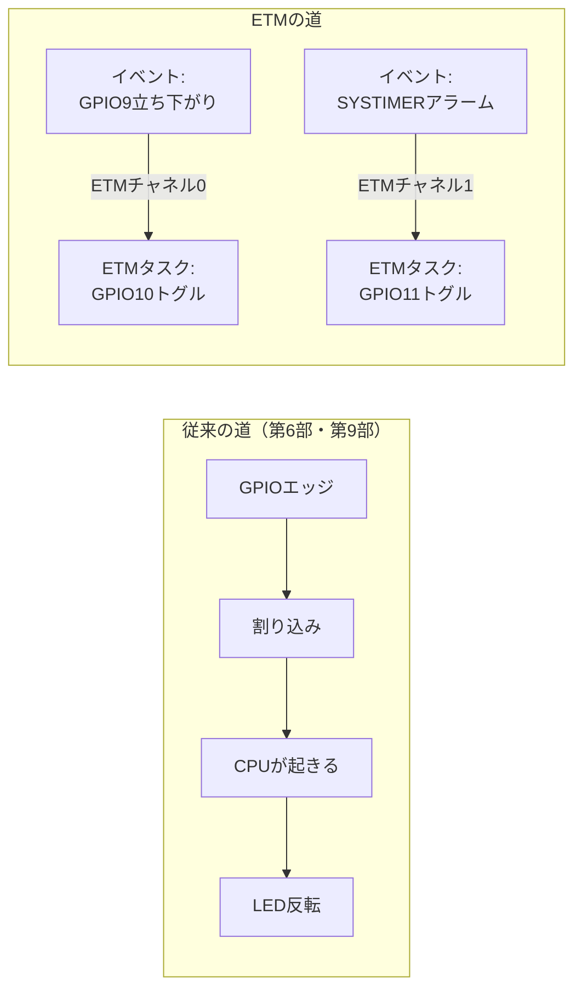

> **Rustからの現在地**: **unstableで試せる（範囲限定）** — esp-hal 1.1.1の`etm`モジュール（unstable）。結線できるのは現状GPIO（イベント+タスク）、SYSTIMER（イベント）、TIMG（イベント+タスク）です。LEDC・PCNT・RMTのETM端子は未実装（ハードウェアには存在します）。

## このページでできるようになること

- ETM（Event Task Matrix）が「イベント」と「タスク」をCPUも割り込みも介さず直結する仕組みだと説明できる
- BOOTボタン→LEDトグル、タイマー→LED点滅の2本の結線を、Embassyのtaskが眠ったまま動かせる
- 結線済みチャネルをdropすると無効化される罠を回避できる
- esp-hal 1.1.1で結線できる範囲とハードウェアの全容の差を、正直に言える

## 先に結論

CPU関与の階段、最後の一段です。ボタンでLEDを切り替える普通の道は「ボタン→割り込み→**CPUが起きてLEDを操作**」でした。第9部のasync waitでも、Wakerの先でLEDを反転させるのは結局CPUです。ETM（Event Task Matrix）はこの道を捨てます。「GPIO9に立ち下がりエッジが来た」という**イベント**と、「GPIO10の出力を反転せよ」という**タスク**を、チップ内部の配線でつなぐ——それだけです。以後、ボタンとLEDの間に**CPUも割り込みも一切登場しません**。ESP32-C6のETMは50チャネルあり、ペリフェラル同士をこのように50本まで直結できます。GPIO Matrixが「信号とピン」の配線盤だったのに対し、ETMは「**出来事と動作**」の配線盤です。チップの中に小さなデジタル回路を組み立てる感覚を、今日ここで味わってください。

なお、ETMの文脈で「タスク」はペリフェラルが実行する動作を指す用語で、Embassyのtaskとは別物です。以下、ETMの方は「ETMタスク」と書き分けます。

## 身近なたとえ

「玄関の人感センサが反応したら廊下の電気を点ける」を考えます。普通のマイコン方式は、センサが家主（CPU）のスマホを鳴らし、家主がアプリで照明を点ける方式。家主が寝ていたら、起こされます。ETM方式は、センサと照明を**直接電線でつないだ**配線工事です。家主は工事の日に配線を決めるだけで、以後は熟睡していても電気は点きます。

たとえと違うのは、ETMの「配線工事」はソフトウェアによるレジスタ設定なので、いつでも張り替えられる点です。もう一つ、直結の代償も正直に言うと、**家主は点いたことを知りません**。CPUを介さないということは、CPUが状態を把握しなくなるということでもあります。記録や判断が必要な場面では、あえて割り込みを使う設計が正解になります。

## 仕組み

ETMの語彙は2つだけです。

- **イベント（Event）**: ペリフェラルが発する「〜が起きた」という通知。例: GPIOのエッジ、タイマーのアラーム発火
- **ETMタスク（Task）**: ペリフェラルが受け付ける「〜せよ」という指示。例: GPIOのセット/クリア/トグル、タイマーのスタート/ストップ

ETM本体は50個のチャネルを持ち、各チャネルが「イベント1つ→ETMタスク1つ」を結線します。



この例では2本の結線を張ります。①BOOTボタン（GPIO9）の立ち下がり→GPIO10のLEDトグル、②SYSTIMERの500ms周期アラーム→GPIO11のLEDトグル（=1秒周期の点滅）。セットアップが終わったら、Embassyのmain taskは5秒ごとにログを吐く以外、何もしません。

## RustとEmbassyではどう書くか

examples/20-etm の要点です（抜粋です。完全なコードは examples/20-etm を見てください）。

```rust
// --- GPIO側のETMチャネル（イベント8本+タスク8本）を取り出す ---
let gpio_ext = Channels::new(peripherals.GPIO_SD);

// --- チャネルA: BOOTボタン(GPIO9)の立ち下がり → GPIO10トグル ---
let button_event = gpio_ext
    .channel0_event
    .falling_edge(peripherals.GPIO9, InputConfig { pull: Pull::Up });
let led_task = gpio_ext.channel0_task.toggle(
    peripherals.GPIO10,
    OutputConfig {
        open_drain: false,
        pull: Pull::None,
        initial_state: Level::Low,
    },
);

// --- チャネルB: SYSTIMERのアラーム0(500ms周期) → GPIO11トグル ---
let syst = SystemTimer::new(peripherals.SYSTIMER);
let alarm0 = syst.alarm0;
let timer_event = SystimerEvent::new(&alarm0);
let led2_task = gpio_ext.channel1_task.toggle(peripherals.GPIO11, /* 同様 */);

// --- ETM本体でイベントとタスクを結線する ---
let etm = Etm::new(peripherals.ETM);
let _channel_a = etm.channel0.setup(&button_event, &led_task);
let _channel_b = etm.channel1.setup(&timer_event, &led2_task);

let mut periodic = PeriodicTimer::new(alarm0);
periodic.start(HalDuration::from_millis(500)).unwrap();

loop {
    info!("CPUは寝ています。それでもボタンでLEDが切り替わります");
    Timer::after(Duration::from_secs(5)).await;
}
```

## コードを一行ずつ読む

- `Channels::new(peripherals.GPIO_SD)` — GPIO側のETM窓口です。GPIOペリフェラルはETMに対して**イベント用8チャネル+ETMタスク用8チャネル**の端子を持ちます（ETM本体の50チャネルとは別の数字です。混同注意）
- `.falling_edge(peripherals.GPIO9, ...)` — 「GPIO9の立ち下がり」というイベントの定義です。GPIOイベントは`rising_edge`/`falling_edge`/`any_edge`の3種類。BOOTボタンは押すとGNDへ落ちるので、離した状態のためにプルアップを有効にします
- `.toggle(peripherals.GPIO10, ...)` — 「GPIO10を反転せよ」というETMタスクの定義です。GPIOのETMタスクは`set`/`clear`/`toggle`の3種類。ここでもピンの所有権を渡しており、CPU側のコードが同じピンを触る事故はコンパイル時に防がれます
- `SystimerEvent::new(&alarm0)` — SYSTIMERのアラーム発火をイベントとして取り出します。タイマーというペリフェラルが「時間が来た」をCPUではなくETMに向けて発することができる、というのが要点です
- `let _channel_a = etm.channel0.setup(&button_event, &led_task);` — ETM本体のチャネル0で結線します。**戻り値の束縛が超重要**です（次項）
- `PeriodicTimer::new(alarm0)`と`start(500ms)` — アラーム0を500ms周期で発火させます。発火のたびにETM経由でGPIO11が反転するので、LED2は1秒周期で点滅します。Embassyの時刻ドライバはTIMG0を使っているため、SYSTIMERはこの実験に自由に使えます

### dropの罠 — 結線は「持ち続ける」もの

`setup()`が返す結線済みチャネルは、**dropされると結線が解除されます**。Rustの「所有者がいなくなったら後片付けする」というDropの仕組みが、ここでは「配線を撤去する」として働くのです。`etm.channel0.setup(...);`と戻り値を捨てて書くと、その行の直後に結線が消え、ボタンを押しても何も起きません。`let _channel_a = ...`のように変数へ束縛して、ループより長く生かしてください。`PeriodicTimer`も同様で、dropするとアラームが止まります。

### ログの一行が語ること

実行中のログはこれだけです。

```text
INFO - CPUは寝ています。それでもボタンでLEDが切り替わります
```

この一行は自慢ではなく実験条件の宣言です。main taskは5秒に1回起きてこれを印字する以外、GPIO9もGPIO10も**一度も読み書きしていません**。それでもボタンを押した瞬間にLED1が切り替わり、LED2は正確に点滅し続けます。試しにloop内の`Timer::after`を60秒にしても、LEDの反応は1msも変わりません。第9部で「割り込みがWakerを起こしてtaskが再開する」経路を学びましたが、ETMの経路にはそのどちらも存在しない——階段の最下段です。

### esp-halの現在地 — 結線できる範囲は正直に

ETMというハードウェア自体は、もっと多くのペリフェラルと接続できます。しかしesp-hal 1.1.1で結線に使えるのは現状、

- **GPIO**: イベント（エッジ3種）+ ETMタスク（set/clear/toggle）
- **SYSTIMER**: イベント（アラーム発火）
- **TIMG**: イベント + ETMタスク（カウンタのstart/stop等）

に限られます。LEDC・PCNT・RMTにもハードウェア上はETM端子があります（たとえば「PCNTが上限に達したらPWMを止める」が配線だけで書けるはずです）が、esp-halではまだ実装されていません。前ページまでの言葉で言えば、「C6ハードは対応・esp-halは未対応」の生きた実例です。ドライバの進化とともに結線先は増えていくはずなので、[esp-halのetmモジュールのドキュメント](https://docs.espressif.com/projects/rust/esp-hal/1.1.1/esp32c6/esp_hal/etm/index.html)で現在地を確認する癖をつけてください。

### 発展: 超音波センサのEcho幅計測（概念）

ETMらしい応用を1つ、概念だけ紹介します。超音波距離センサHC-SR04系は、距離をEchoピンの**Highの長さ**で返します。ETMで「Echo立ち上がり→タイマーstart」「Echo立ち下がり→タイマーstop」と2本結線すれば、パルス幅の計測がCPU完全不介入で行えます。割り込み方式だと割り込み応答のゆらぎ（他のtaskや割り込みの都合で数µsずれる）が測定誤差になりますが、ETM直結ならハードウェアの応答だけで決まります。「チップ内に測定治具を組む」感覚です。

## 配線

| 接続 | 内容 |
|---|---|
| GPIO10 → 330Ω → LED1(+) → LED1(−) → GND | ボタンでトグルするLED |
| GPIO11 → 330Ω → LED2(+) → LED2(−) → GND | 勝手に点滅するLED |
| GPIO9 | ボード上のBOOTボタン。配線不要 |

LEDの足は長い方が(+)です。第1部のLチカと同じ配線を2組作るだけです。

## 実行方法

```bash
cd examples/20-etm
cargo run --release
```

```text
INFO - ETMの結線が完了しました。ここから先、LEDの制御にCPUは関与しません
INFO - CPUは寝ています。それでもボタンでLEDが切り替わります
```

LED2（GPIO11）が1秒周期で点滅を始め、BOOTボタンを押すたびLED1（GPIO10）が切り替われば成功です。

## よくある失敗

- **`setup()`の戻り値を捨てて「何も起きない」** — 結線済みチャネルはdropで無効化されます。`let _channel_a = ...`と束縛し、プログラムの生存期間じゅう保持してください。`PeriodicTimer`を捨てたときはLED2だけ止まるので、切り分けの手がかりになります
- **ボタン1押しでLED1が2回反転して「効いていない」ように見える** — BOOTボタンにもチャタリングはあります。この経路にはPCNTのようなフィルタが入っておらず（C6のGPIOグリッチフィルタはesp-hal未実装）、バウンスの数だけ`toggle`が走るため、偶数回反転すると見た目は元どおりです。何度か押して挙動を観察してください。「ハード直結は速いが、ノイズも素通しになる」という設計上のトレードオフの実物です
- **書き込みモードに入ってしまう** — GPIO9はストラッピングピンです。BOOTボタンを**押しながらリセット**すると書き込みモードに入ります（それが本来の役目です）。実験中に再起動がかかった場合はボタンから指を離してリセットしてください
- **「LEDCのフェードをボタンで起動」など未実装の結線を書こうとする** — ハードウェアのETM端子一覧（TRM）にあっても、esp-hal 1.1.1に該当APIがなければ書けません。現状の結線先はGPIO/SYSTIMER/TIMGだけです

## やってみよう

チャネルAのイベントを`falling_edge`から`any_edge`に変えてみましょう。押した瞬間と離した瞬間の両方でトグルが走るようになります。うまく観察すると「押している間だけ点く/消える」ように見えるはずです（チャタリングで反転することもあります）。イベントの選び方ひとつで回路の意味が変わるのを体感してください。

## 確認問題

1. 「割り込みでLEDをトグル」と「ETMでLEDをトグル」の違いを、CPUの関与という観点で説明してください。
2. `etm.channel0.setup(&event, &task);`と戻り値を束縛せずに書くと何が起きますか。理由も答えてください。
3. ETMの利点と引き換えに失うものを1つ挙げてください。

<details>
<summary>答え</summary>

1. 割り込み方式はイベントのたびにCPUが起こされ、CPU上のコードがLEDを操作する。ETMはイベントとETMタスクをチップ内部で直結するため、結線後はCPUも割り込みも一切関与しない。
2. 結線済みチャネルが文の終わりでdropされ、ETMチャネルが無効化される。ボタンを押しても何も起きない。Dropの後片付けが「配線の撤去」として働くため。
3. CPUがイベントの発生を知らないこと（記録・集計・条件判断はできない）。ほかに、フィルタを挟まないためチャタリング等のノイズも素通しになる点、esp-halでは結線先が限られる点など。

</details>

## まとめ

- ETMはイベント（〜が起きた）とETMタスク（〜せよ）をチップ内で直結する50チャネルの配線盤。結線後はCPUも割り込みも不要
- 結線済みチャネルとPeriodicTimerはdropで止まる。束縛して持ち続けるのがRust版ETMの作法
- esp-hal 1.1.1の結線先はGPIO/SYSTIMER/TIMGのみ。LEDC・PCNT・RMTのETM端子はハードにはあるが未実装——ハード対応とライブラリ対応は別物

## 次のページ

CPU関与の階段を最下段まで降りました。後半戦は「明るさの変化をハードに任せる」LEDCハードウェアフェードと、「データ運搬をハードに任せる」DMAから再開します。

- 前: [4. PCNT — CPUを使わずに数え、方向まで分かる](/embassy-esp32-c6/deep-dive/04-pcnt/)
- 次: [6. LEDCハードフェードとDMA](/embassy-esp32-c6/deep-dive/06-ledc-dma/)
