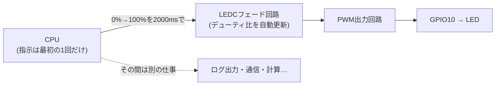
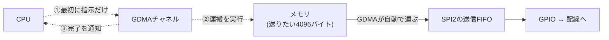

> **Rustからの現在地**: LEDCハードウェアフェードは**unstableで試せる**（esp-hal 1.1.1の`ledc`、examples/21で体験）。DMAは**unstableで試せる**（`dma`、SPI2/I2S/PARLIO等）。ADC連続測定+DMAは**概念のみ（ESP-IDF）**——ハードとIDFにはあるがesp-halは未実装です。

## このページでできるようになること

- LEDCのハードウェアフェードを使い、「2秒かけて0%→100%」をCPUの介入なしで実行できる
- 「フェード中もCPUは別の仕事をしています」というログが何を証明しているのか説明できる
- DMA（Direct Memory Access）を「メモリと周辺回路の間でデータを運ぶ専用の運搬係」として説明できる
- 「ハードウェアが対応していること」と「Rustのライブラリで今書けること」を区別できる

## 先に結論

第7部のPWMでは、LEDの明るさを変えるたびにCPUがデューティ比を書き換えました。実はLEDC（LED Control、C6のPWM回路）には「目標のデューティ比まで、指定時間かけて自動で変化させる」ハードウェアフェード機能があります。`start_duty_fade(0, 100, 2000)`と一度指示すれば、あとの2秒間、デューティ比の更新はすべてLEDCの仕事です。ページ後半では、同じ発想をデータ転送に広げたDMAを学びます。「このメモリからこの周辺回路へ4096バイト運べ」と指示すると、運搬の間CPUは別の仕事ができます。ただしADC連続測定+DMAのように「ハードもESP-IDFも対応しているが、esp-halではまだ書けない」機能もあります。この区別こそ本教材が[対応状況表](/embassy-esp32-c6/project/support-matrix/)で列を分けている理由です。

## 身近なたとえ

文化祭の照明係に「2秒かけてゆっくり明るくして」と頼む場面を想像してください。今までのやり方（ソフトウェアフェード）は、あなた自身がつまみを握り、20ミリ秒ごとに少しずつ回す方法でした。ハードウェアフェードは、目標と時間を照明係に伝えたら、つまみを回す作業は全部任せて、あなたは別の仕事へ行く方法です。

たとえと違う点もあります。LEDCのフェードは人間ではなく回路なので、途中で気を利かせて速度を変えたりはしません。指示した開始%・終了%・時間のとおりに、機械的に一定の刻みでデューティ比を進めるだけです。

## 仕組み①: LEDCハードウェアフェード

第7部で使ったLEDCには、各チャンネルにフェード用の小さな計算回路が付いています。「今のデューティ比」「目標」「1ステップの増分」「ステップの間隔」をレジスタに書くと、あとはPWMの周期に合わせてハードウェアがデューティ比を足し引きし続けます。



割り込みすら要りません。第5部（ETM）が「イベントの配線」をハードに任せたのに対し、こちらは「値の時間変化」をハードに任せています。

## RustとEmbassyではどう書くか

これは抜粋です。完全なコードは examples/21-ledc-fade を見てください。LEDCの初期化（5kHz・12bit、チャンネル0にGPIO10）は第7部と同じなので省略します。LEDCはesp-halのunstable APIです。

```rust
// フェードの向き: (開始デューティ%, 終了デューティ%)
let mut fade = (0u8, 100u8);
// CPUが自由であることを示すためのカウンタ
let mut counter: u32 = 0;

loop {
    let (start, end) = fade;

    // 2000msかけて start% → end% へハードウェアが自動でフェードする。
    // パラメータが不正（範囲外・時間が長すぎ等）だとErrが返るのでmatchで処理
    match channel0.start_duty_fade(start, end, 2000) {
        Ok(()) => info!("フェード開始: {start}% → {end}% (2000ms)"),
        Err(e) => {
            error!("フェードを開始できませんでした: {e:?}");
            Timer::after(Duration::from_secs(1)).await;
            continue;
        }
    }

    // フェードが終わるまで待つ。この間、デューティ比の更新はすべて
    // LEDCハードウェアの仕事。CPUは250msごとに別の仕事（ログ出力）ができる
    while channel0.is_duty_fade_running() {
        counter += 1;
        info!("フェード中もCPUは別の仕事をしています: {counter}");
        Timer::after(Duration::from_millis(250)).await;
    }

    // 向きを反転して繰り返す（0→100 の次は 100→0）
    fade = (end, start);
}
```

## コードを一行ずつ読む

- `channel0.start_duty_fade(start, end, 2000)` — フェードの開始指示です。引数は「開始デューティ%」「終了デューティ%」「かける時間（ミリ秒）」。この関数はすぐに戻ります。2秒間ブロックするのではなく、指示だけしてCPUを解放するのがポイントです
- `Err(e)`の処理 — 範囲外の%や、ハードのステップ計算が成立しない長すぎる時間を渡すと`Err`が返ります。教材の値では起きませんが、「ハードに頼む指示にも文法がある」ことを示すためにmatchで受けています
- `channel0.is_duty_fade_running()` — フェード用回路がまだ動作中かをレジスタで確認します。終わったかどうかを知る唯一の手段なので、ポーリング（定期的な確認）で待ちます
- `counter += 1;` と `info!(...)` — この2行が本ページの主役です。もしCPUがフェードの計算をしていたら、こんな悠長にログを打つ余裕はありません。**カウンタが増え続けること自体が「デューティ比の更新をCPUがやっていない」証拠**です。2000msのフェード中に250ms間隔なので、1回のフェードでおよそ8ずつ増えます
- `Timer::after(Duration::from_millis(250)).await` — `await`で実行権を手放すので、この待ち時間には他のtaskも動けます。「ハードに任せる」と「asyncで待つ」の合わせ技です

## 配線

第7部5ページと同じです。GPIO10 → 抵抗330Ω → LEDのアノード（足の長い方） → LEDのカソード → GND。

## 実行方法

```bash
cd examples/21-ledc-fade
cargo run --release
```

LEDが2秒かけてじわっと明るくなり、2秒かけて暗くなるのを繰り返します。ログはこうなります。

```text
INFO - フェード開始: 0% → 100% (2000ms)
INFO - フェード中もCPUは別の仕事をしています: 1
INFO - フェード中もCPUは別の仕事をしています: 2
...
INFO - フェード中もCPUは別の仕事をしています: 8
INFO - フェード開始: 100% → 0% (2000ms)
INFO - フェード中もCPUは別の仕事をしています: 9
...
```

**Rustからの現在地（LEDCハードウェアフェード）: unstableで試せる** — esp-hal 1.1.1の`ledc`モジュール（unstable）に`start_duty_fade()`と`is_duty_fade_running()`があり、本教材の構成でそのまま動かせます。

## 仕組み②: DMA — 「データの流れ」を運搬係に任せる

フェードは「値の変化」をハードに任せました。次は「データの移動」です。

SPIで4096バイトの画像データをディスプレイへ送ることを考えます。DMAなしでは、CPUが「1バイト送信FIFOに書く→送信完了を待つ」を4096回繰り返します。DMA（Direct Memory Access、CPUを介さないメモリアクセス）を使うと、CPUは最初に「このメモリのここから4096バイトを、SPI2へ運べ」と指示するだけです。あとは専用の運搬回路がメモリから周辺回路へデータを流し、終わったら知らせてくれます。



ESP32-C6のDMAはGDMA（General DMA）と呼ばれ、送信・受信あわせて6チャンネル（esp-halからは`DMA_CH0`〜`DMA_CH2`のペアとして見えます）を、SPI2・UHCI（UART）・I2S・AES・SHA・ADC・PARLIOといった周辺回路につなぎ替えて使えます。ここでもGPIO Matrix（2ページ）と同じ「つなぎ替えられる配線盤」の思想が生きています。

実はDMAはすでに登場済みです。

- [応用編2の9ページ](/embassy-esp32-c6/sensor-node/09-peripherals-types/)では、esp32c3-embassyが電子ペーパーへの大きなSPI転送を`SpiDma`（SPIバス+DMAチャネル）で組んでいました
- 第10部のWi-Fi（examples/08-wifi）でも、esp-radioドライバの内部では受信フレームの運搬にDMAの仕組みが使われています。意識せずに恩恵だけ受けていた形です

## ADC連続測定+DMA — 「ハード対応」と「ライブラリ対応」は別物

C6のADCには連続測定モードがあります。複数チャンネルを一定速度で自動巡回して測り続け、結果をDMAがメモリへ流し込み、一定量たまるとCPUに知らせる——マイコンを簡易オシロスコープにする入口の機能で、ESP-IDF（C言語の公式開発環境）には`adc_continuous`というAPIがあります。

しかし、**esp-hal 1.1.1のADCはoneshot（1回ずつ測る）のみで、連続+DMAはまだ書けません**。GDMAのハードウェアはADCに対応しているのに、Rustドライバ側の接続が未実装だからです。

これが[対応状況表](/embassy-esp32-c6/project/support-matrix/)で「C6ハード対応」と「Rust HAL対応」の列を分けている理由の、いちばん分かりやすい実例です。データシートに載っている機能が、いま使うライブラリで書けるとは限りません。逆に、書けないからといってハードが無いわけでもありません。簡易オシロを今すぐ作りたければESP-IDFという選択肢がありますし、esp-halも開発が活発なので、将来のバージョンで対応される可能性があります。

**Rustからの現在地（DMA）: unstableで試せる** — `dma`モジュール（unstable）に`DmaTxBuf`/`DmaRxBuf`や`dma_buffers!`マクロがあり、SPI2・I2S・PARLIO・AES・SHA・メモリ間コピーで使えます。
**Rustからの現在地（ADC連続測定+DMA）: 概念のみ（ESP-IDF）** — ハードとESP-IDFは対応、esp-hal 1.1.1は未実装です。

## よくある失敗

- **`start_duty_fade`の後に`while`でawaitなしのループを書いてしまう** — `while channel0.is_duty_fade_running() {}`のように待つと、ハードは自由でもCPUはこのループに縛り付けられ、他のtaskが一切動けなくなります。Embassyでは必ず`Timer::after(...).await`のような「実行権を手放す待ち」を挟んでください
- **フェードのパラメータが不正で`Err`が返っているのに気づかない** — 100%を超える値や極端な時間を渡すとフェードは始まりません。戻り値を無視すると「LEDが動かない」原因を配線のせいだと勘違いしがちです。まずログでErrを確認しましょう
- **「ハードにあるからRustでも書けるはず」とAPIを探し続ける** — ADC連続+DMAのように、ハード・ESP-IDF・esp-halで対応段階が違う機能があります。探す前に対応状況表とdocs（docs.espressif.com/projects/rust）を確認する習慣をつけると時間を無駄にしません

## やってみよう

`start_duty_fade(start, end, 2000)`の2000を500に変えて、1回のフェードでカウンタがいくつ増えるか予想してから実行してみてください（250ms間隔なので約2になるはずです）。LEDの見た目の変化も比べてみましょう。

## 確認問題

1. 「フェード中もCPUは別の仕事をしています: n」のカウンタが増え続けられるのはなぜですか。
2. 「C6のハードウェアは対応しているが、esp-hal 1.1.1では書けない」機能の例を1つ挙げてください。
3. DMAが特に役立つのは、どんなデータ転送のときですか。

<details>
<summary>答え</summary>

1. デューティ比の更新をLEDCのフェード回路が実行しており、CPUは開始指示のあと何もしなくてよいからです。CPUは250msごとにログを打つ余裕があります。
2. ADCの連続測定+DMA（ほかにSDM、GPIOグリッチフィルタなど）。ESP-IDFにはAPIがありますが、esp-hal 1.1.1では未実装です。
3. サイズが大きい・繰り返し発生する転送（ディスプレイへの画像送信、音声データ、連続センサ測定など）。1バイトずつCPUが運ぶ方式では、転送の間CPUが専有されてしまいます。

</details>

## まとめ

- LEDCハードウェアフェードは`start_duty_fade()`で開始指示だけすれば、デューティ比の更新をハードが実行する。カウンタのログがCPUの自由を証明する
- DMAは「メモリ⇔周辺回路のデータ運搬係」。C6のGDMAは6チャンネルで、SPI2やI2S、PARLIOなどにつなぎ替えて使える
- ハード対応・ESP-IDF対応・esp-hal対応は別物。ADC連続+DMAはその生きた実例で、現状は概念のみ（ESP-IDF）

## 次のページ

「値の変化」も「データの流れ」もハードに任せられるなら、モーター制御はどうでしょう。次はPWMの親玉、MCPWMです。上下のスイッチを同時にONして壊す事故を、ハードウェアが自動で防いでくれます。

- 前: [5. ETM — 割り込みすら使わない、周辺回路の直結](/embassy-esp32-c6/deep-dive/05-etm/)
- 次: [7. MCPWM — モーター制御工場](/embassy-esp32-c6/deep-dive/07-mcpwm/)
