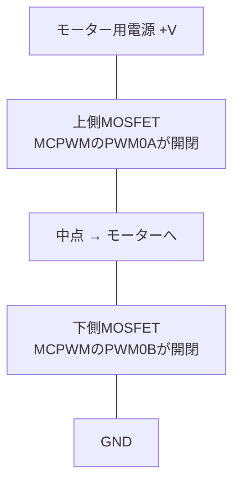

> **Rustからの現在地**: **unstableで試せる（一部機能）** — esp-hal 1.1.1の`mcpwm`モジュール（unstable）で相補PWM+デッドタイム（`DeadTimeCfg`+`LinkedPins`）とソフトウェア同期まで書けます。キャプチャ・故障入力・ハードウェア同期・ETM連携は未実装（ハードウェアには存在します）。

## このページでできるようになること

- LEDC（照明向けPWM）とMCPWM（電力変換・モーター向けPWM）の役割の違いを説明できる
- ハーフブリッジ回路で「上下のスイッチ同時ON」が破壊事故になる理由と、デッドタイムがそれを防ぐ仕組みを説明できる
- esp-hal 1.1.1で相補PWM+デッドタイムを書く方法（`DeadTimeCfg`と`LinkedPins`）を知る
- MCPWMのうちRustでまだ書けない機能（キャプチャ・故障入力・ハードウェア同期）を区別できる

## 先に結論

MCPWM（Motor Control PWM）は、名前のとおりモーター制御と電力変換のための専用PWM回路です。第7部のLEDCと同じ「デューティ比で出力を刻む」仲間ですが、決定的な違いは**安全機構がハードウェアに組み込まれている**ことです。代表がデッドタイム自動挿入で、上下2つのスイッチ（MOSFET）を交互に開閉するとき、「両方OFF」の短い時間を波形に必ず挟み、同時ONによる短絡破壊を防ぎます。CPUがフリーズしていても波形は安全なままです。esp-hal 1.1.1（unstable）では相補PWM+デッドタイムとソフトウェア同期まで書けますが、入力パルス計測（キャプチャ）、故障入力による即時停止、ハードウェア同期はまだ未実装です。

## 身近なたとえ

水力発電のダムに、上の水門（電源側）と下の水門（GND側）があると考えてください。交互に開け閉めして水流を制御しますが、もし一瞬でも**両方同時に開く**と、水が上から下へ素通りして施設が壊れます。そこで水門の制御盤には「片方を閉じてから、少し待って、もう片方を開ける」という順序が機械仕掛けで組み込まれています。この「少し待つ」がデッドタイムです。

たとえと違う点: 実物のMOSFETで「素通り」するのは水ではなく電流で、貫通電流（シュートスルー）と呼ばれます。数マイクロ秒どころか、もっと短い時間でも発熱・破壊に至ることがあります。待ち時間もマイクロ秒以下の精度で管理されます。

## 仕組み

### ハーフブリッジと相補PWM

モータードライバの基本形「ハーフブリッジ」は、電源とGNDの間に2つのMOSFET（電気のスイッチ）を縦に積み、その中点からモーターへ配線します。



上側ONで中点は+Vに、下側ONで中点はGNDになります。つまり上下は**常に逆**（相補）に動かします。1本のPWMの反転をもう1本に出すだけ——に見えますが、スイッチは瞬時にON/OFFできないため、切り替わりの瞬間に上下が同時ONになる危険があります。そこでMCPWMのデッドタイム生成回路が、両方OFFの区間を自動で挟みます。

```text
時間 →
上側(PWM0A): ████████░░░░░░░░░░░░░░████████
下側(PWM0B): ░░░░░░░░░░████████░░░░░░░░░░░░
                     ↑↑        ↑↑
              どちらもOFFのすき間 = デッドタイム
              （ハードウェアが波形に自動で挿入）
```

Arduinoの`analogWrite()`や第7部のLEDCでこれをやろうとすると、反転もすき間もソフトで作ることになり、プログラムが一瞬止まっただけで貫通の危険が生じます。MCPWMなら、指示した後は波形生成回路が保証します。

### MCPWMの装備一覧（C6）

- **タイマー×3、オペレータ×3、PWM出力×6** — オペレータ1つがA/B2本の出力を持ちます。3オペレータで6本、つまり三相インバータ（ブラシレスモーターを回す上下6スイッチ）を1台でまかなえます
- **デッドタイム生成** — 上で見たとおり。立ち上がり側・立ち下がり側を別々に設定できます
- **同期** — 複数のタイマーの位相をそろえます。ソフトウェアからのトリガと、外部信号によるハードウェア同期があります
- **故障入力（フォルト）** — 過電流検出などの信号が入った瞬間、CPUを介さずPWM出力を安全状態に落とします（ハードウェアの機能。後述のとおりRust未実装）
- **キャプチャ** — 入力パルスの時刻をタイマーで記録します（同じく未実装）

## RustとEmbassyではどう書くか

esp-hal 1.1.1の`mcpwm`モジュール（unstable）で、相補PWM+デッドタイムはこう書けます。これは構文確認のみの抜粋で、本教材のexamplesにはありません。動く全体像はesp-halリポジトリの`qa-test/src/bin/mcpwm.rs`とモジュールのドキュメントを参照してください。

```rust
use esp_hal::mcpwm::operator::{DeadTimeCfg, PwmPinConfig};
use esp_hal::mcpwm::timer::PwmWorkingMode;
use esp_hal::mcpwm::{McPwm, PeripheralClockConfig};
use esp_hal::time::Rate;

// MCPWM全体のクロックを40MHzに（固定値の初期化なのでunwrap）
let clock_cfg = PeripheralClockConfig::with_frequency(Rate::from_mhz(40)).unwrap();
let mut mcpwm = McPwm::new(peripherals.MCPWM0, clock_cfg);

// オペレータ0をタイマー0につなぐ
mcpwm.operator0.set_timer(&mcpwm.timer0);

// GPIO0(上側)とGPIO1(下側)を相補ペアとして結びつける。
// AHC = Active High Complementary: BはAの反転になり、
// 切り替わりにデッドタイムが入る（TRMの用語）
let mut pins = mcpwm.operator0.with_linked_pins(
    peripherals.GPIO0,
    PwmPinConfig::UP_ACTIVE_HIGH, // A側の波形の作り方
    peripherals.GPIO1,
    PwmPinConfig::EMPTY,          // B側はデッドタイム回路が生成する
    DeadTimeCfg::new_ahc(),
);

// デッドタイム: 40カウント（40MHzなら1µs）を両エッジに
pins.set_rising_edge_deadtime(40);
pins.set_falling_edge_deadtime(40);

// タイマー0: 0..=99 を数えて20kHz → タイムスタンプ値がほぼ%になる
let timer_clock = clock_cfg
    .timer_clock_with_frequency(99, PwmWorkingMode::Increase, Rate::from_khz(20))
    .unwrap();
mcpwm.timer0.start(timer_clock);

// デューティ比30%。あとは波形もデッドタイムもハードが作り続ける
pins.set_timestamp_a(30);
```

`with_linked_pins()`が本ページの核心です。2本のピンを「デッドタイム生成回路を通るペア」として結びつけるので、以後どんなデューティ比を書いても、すき間のない波形は物理的に出ません。タイマーの位相をソフトからそろえるソフトウェア同期（`set_counter()`）も書けます。

### まだ書けないもの（正直リスト）

esp-hal 1.1.1のMCPWMドライバで未実装なのは、キャプチャ、故障入力による即時停止、ハードウェア同期（外部信号でのタイマー同期）、キャリア変調、そしてETM（5ページ）との連携です。ハードウェアには存在するので、ここでも「ハード対応とライブラリ対応は別物」（6ページ）が現れています。本格的なモータードライバを今すぐ組むならESP-IDFの方が装備が揃っています。

**Rustからの現在地: unstableで試せる（一部機能）** — 相補PWM+デッドタイム、デューティ比更新、ソフトウェア同期までは書けます。キャプチャ・フォルト・ハード同期は概念のみ（ESP-IDF）。

## LEDCとの住み分け

| | LEDC（第7部） | MCPWM（本ページ） |
|---|---|---|
| 得意分野 | 照明の調光、ブザー、サーボの単純制御 | モーター駆動、DC-DCコンバータなどの電力変換 |
| 出力 | 独立6ch | 相補ペア×3（6出力） |
| 安全機構 | なし | デッドタイム、故障入力（ハード） |
| ハードフェード | あり（6ページ） | なし |

「LEDをじわっと光らせたい」ならLEDC、「電源とGNDを高速で切り替えて電力を制御したい」ならMCPWMです。

## 応用編3とのつながり — モーター制御はハードに任せる

[応用編3の8ページ](/embassy-esp32-c6/robot/08-motion/)で読んだサッカーロボットは、さらに一歩進めて、FOC（Field Oriented Control、ブラシレスモーターの磁界を数学的に制御する方式）の計算ごとTMC4671という専用ハードICに任せていました。MCPWMのデッドタイムも、TMC4671のFOCも、思想は同じです。**タイミングが命の仕事と安全が命の仕事は、ソフトではなくハードに持たせる。** マイコン内蔵の回路を使うか外付けICを使うかは、規模と要求精度で選びます。

## よくある失敗

- **モーターをGPIOに直結してしまう** — MCPWMが作るのはあくまで制御信号です。モーターの電流はGPIOの定格（第1部6ページ）を大きく超えます。必ずモータードライバ回路（MOSFETやドライバIC）を挟んでください
- **デッドタイムを0にする・短すぎる値にする** — 波形はきれいに見えても、実際のMOSFETのOFFが間に合わず貫通電流が流れます。使うMOSFETのスイッチング時間をデータシートで確認して決めます。逆に長すぎると出力波形が歪み、制御精度が落ちます
- **`unstable` featureなしでmcpwmモジュールを探す** — MCPWMはunstable API配下です。本教材のexamplesはすでに有効化済みですが、自分のプロジェクトを新規に作るときは忘れがちです

## やってみよう

上の抜粋の値で計算してみましょう。周期は0〜99の100カウントで20kHz、つまり1周期50µsです。デッドタイム40カウント（1µs）は周期の何%を占めますか。`set_timestamp_a(30)`のとき、上側が実際にONしている時間は約何µsでしょうか（答えの目安: 2%、約14µs——30%の15µsからデッドタイム分が削られます）。

## 確認問題

1. ハーフブリッジで上下のMOSFETが同時にONすると何が起きますか。その名前は?
2. デッドタイムを「ソフトウェアの待ち時間」ではなく「ハードウェアの波形生成」で入れる利点は何ですか。
3. esp-hal 1.1.1のMCPWMで、まだ書けない機能を2つ挙げてください。

<details>
<summary>答え</summary>

1. 電源からGNDへ電流が素通りする貫通電流（シュートスルー）が流れ、MOSFETが発熱・破壊されます。
2. プログラムがフリーズしても、割り込みが遅れても、すき間のない波形が物理的に出力されないこと。安全がCPUの調子に依存しません。
3. キャプチャ、故障入力による即時停止、ハードウェア同期、キャリア変調、ETM連携のうち2つ。

</details>

## まとめ

- MCPWMは電力変換・モーター制御専用のPWM。相補出力とデッドタイム自動挿入で、上下同時ONの破壊をハードウェアが防ぐ
- esp-hal 1.1.1では`with_linked_pins()`+`DeadTimeCfg`で相補+デッドタイムまで書ける。キャプチャや故障入力は未実装で、必要ならESP-IDF
- 照明系はLEDC、電力変換系はMCPWM。さらに上の要求は応用編3のTMC4671のような専用ICへ——「タイミングと安全はハードに任せる」の一本道

## 次のページ

ここまでの機能は、CPUが起きている間の分業でした。次はさらに徹底します。メインCPUがDeep Sleepで眠っている間も働き続ける、もう一つの小さなCPU——LPコアです。

- 前: [6. ハードに流れを任せる — LEDCフェードとDMA](/embassy-esp32-c6/deep-dive/06-ledc-dma/)
- 次: [8. LPコア — 地下室でもう一人が働いている](/embassy-esp32-c6/deep-dive/08-lp-core/)
