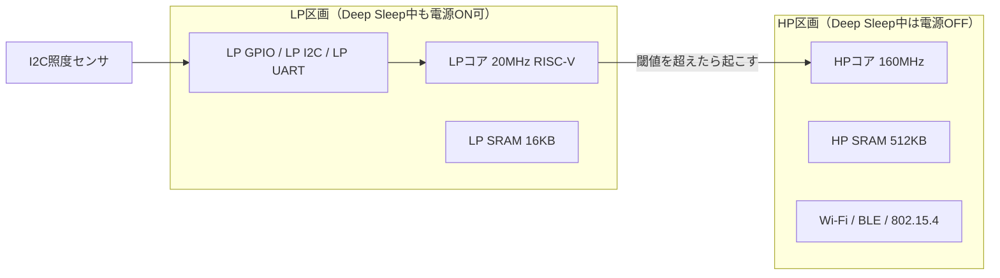

> **Rustからの現在地**: **unstableで試せる（難度高）** — esp-halの`lp_core`（unstable）+LP側専用の`esp-lp-hal` 0.3.0。APIは揃っていますが、HP用とLP用の2バイナリを別々にビルドする構成が必要です。出発点はesp-hal公式exampleのlp_blinky。

## このページでできるようになること

- ESP32-C6に2つ目のCPU（LPコア）が入っていること、その性能と役割を説明できる
- 「起きる回数を減らす」（第12部・応用編2）の次の一手が「そもそも起きない」であることを説明できる
- RustでLPコアを使う場合の2バイナリ構成（HP用+LP用）の概要と難しさを知る

## 先に結論

ESP32-C6には、メインのCPU（HPコア、最大160MHz）とは別に、**LPコア（Low Power core）**という小さなCPUが載っています。20MHzのRISC-V（RV32IMAC）で、専用のLP SRAM 16KBの中でプログラムを実行します。最大の特徴は、**メインCPUがDeep Sleepで眠っている間も動き続けられる**ことです。LP GPIO・LP I2C・LP UARTという省電力ドメインの周辺回路を使ってセンサを監視し、「本当に用があるときだけ」メインCPUを起こせます。Rustからはesp-halの`lp_core`（unstable）+LP側専用の`esp-lp-hal` 0.3.0で挑戦できますが、HP用とLP用の**2つのバイナリを別々にビルドして埋め込む**構成が必要で、難度は高めです。本教材のexamplesには含めず、公式exampleへの道案内をします。

## 身近なたとえ

企画ドラフトの言葉を借りると、「マイコンが寝ていると思ったら、地下室でもう一人が働いていた」——これがLPコアです。家全体（メインCPUと大きなメモリ）は消灯して静まり返っているのに、地下室では夜勤の当番が小さな明かりで計器を見張り続けていて、異常を見つけたときだけ家中を叩き起こします。

正式に言い直します。LPコアはHPコアと同じRISC-V命令セット（RV32IMAC）を実行する独立したプロセッサで、電源区画（パワードメイン）がHP側と分かれています。Deep SleepではHP側の電源が切られHP SRAMも消えますが（第12部2ページ）、LP区画——LPコア、LP SRAM 16KB、LP GPIO（GPIO0〜7）、LP I2C、LP UART——には電気を残せます。「夜勤の当番」は比喩ですが、監視も判断も本物のプログラムで書きます。

## 仕組み



動きの流れはこうです。

1. 起動時、HPコアがLP SRAMへLPコア用のプログラムを書き込み、LPコアを起動する
2. HPコアはDeep Sleepに入る（消費はデータシート典型値で数µA〜、LP区画の設定による）
3. LPコアが周期的にLP I2Cでセンサを読む。20MHzと遅く、できることも少ないが、監視には十分
4. 閾値を超えたらLPコアがウェイクアップ信号を出し、HPコアが起きて本格的な仕事（無線送信など）をする

ESP-IDFの公式例がまさにこの形です。LPコアがI2C接続の照度センサ（BH1750）を読み続け、明るさが閾値を跨いだときだけメインを起こします。

### 「起きる回数を減らす」の次は「起きずに済ませる」

第12部と[応用編2の5ページ](/embassy-esp32-c6/sensor-node/05-duty-cycle/)では、Deep Sleepの合間に短く起きるデューティサイクル設計で平均電流を桁で下げました。それでも「センサ値を確認するためだけの起床」は残ります。測って、閾値以下で、また寝る——この空振りにHPコア+無線の起動コストを払うのはもったいない。監視をLPコアに任せれば、HPコアは**意味のあるときしか起きません**。「CPUに全部やらせない」の、電力版の到達点です。

## RustではどうやるかとRustからの現在地

Rustでは役割ごとに2つのクレート（=2つのバイナリ）を作ります。

- **LP側**: `esp-lp-hal` 0.3.0（esp32c6対応）で書く小さな`no_std`プログラム。公式リポジトリにblinky・i2c・uartの例があります
- **HP側**: いつものesp-halプログラム。`load_lp_code!`マクロでLP側のビルド済みバイナリを埋め込み、`LpCore::new(peripherals.LP_CORE)`で起動して`run(LpCoreWakeupSource::HpCpu)`で走らせます（`lp_core`はunstable API）

概念を1行ずつではなく、骨組みだけ示します。これはHP側の抜粋イメージで、そのままでは動きません。

```rust
// HP側: ビルド済みのLP用バイナリを埋め込んで、LPコアで走らせる
let mut lp_core = esp_hal::lp_core::LpCore::new(peripherals.LP_CORE);
let lp_program = esp_hal::load_lp_code!("../lp-program/target/.../lp-blinky");
lp_program.run(&mut lp_core, esp_hal::lp_core::LpCoreWakeupSource::HpCpu, /* LPピン等 */);
```

**Rustからの現在地: unstableで試せる（難度高）** — API自体は揃っています。難しいのはビルド構成です。

- HP用とLP用でクレートを分け、それぞれ別のターゲット設定でビルドする（ワークスペースとビルド順の管理が必要）
- LP側で使えるのは`esp-lp-hal`の限られたAPIだけ。ログもEmbassyもありません
- HP/LP間のデータ共有はLP SRAM上のアドレスを合意して行う低レベルな世界です

本教材のexamplesにLPコア例を含めなかったのはこのためです。1つのディレクトリに1バイナリという教材の構成が崩れ、初学者の環境トラブルの源になります。挑戦する人は、esp-halリポジトリの`examples/peripheral/lp_core`（lp_blinky・lp_i2c）と`esp-lp-hal/examples`が正確な出発点です。ESP-IDF側にも同じ題材の公式ドキュメント（ulp-lp-core）があります。

## よくある失敗

- **Deep Sleepですべてが止まると思い込む** — 第12部では「Deep SleepはHP SRAM非保持=実質再起動」と学びましたが、それはHP区画の話です。LP区画は設定しだいで生きています。逆に、LP区画に電気を残せばそのぶんDeep Sleepの消費電流は増えます。「どの区画へ電気を残すか」の設計です（実測せずに具体的な電流値を断定しないこと）
- **LPコアにHP側の感覚で仕事をさせようとする** — 20MHz・16KB・周辺はLP系のみ。無線もHP SRAMも触れません。「監視と判断だけを任せ、重い仕事は起こしてから」が正しい分担です
- **2バイナリのビルド順を忘れる** — `load_lp_code!`はビルド済みのLPバイナリをファイルとして埋め込みます。LP側を先にビルドしていないとHP側のビルドが失敗します

## やってみよう

esp-halリポジトリの`examples/peripheral/lp_core/lp_blinky`のソースを開き、(1) LP側プログラムがどのクレート（esp-lp-hal）を使っているか、(2) HP側のどの行でLPバイナリが埋め込まれているか（`load_lp_code!`を探す）の2点を見つけてください。コードを書かなくても、2バイナリ構成の全体像がつかめます。

## 確認問題

1. LPコアのCPUアーキテクチャ・クロック・使えるメモリ量は?
2. 「デューティサイクル設計」と「LPコアによる監視」は、省電力の考え方としてどう違いますか。
3. RustでLPコアを使うとき、バイナリが2つ必要になるのはなぜですか。

<details>
<summary>答え</summary>

1. RISC-V（RV32IMAC）、最大20MHz、LP SRAM 16KB。
2. デューティサイクルは「HPコアが起きる回数と時間を減らす」工夫。LPコアは監視そのものを別の小さなCPUに任せ、HPコアは「意味のあるときだけ」起きる。空振りの起床をなくせる。
3. HPコアとLPコアは別々のプロセッサとして別々のプログラムを実行するから。HP用は esp-hal、LP用は esp-lp-hal でビルドし、HP側が`load_lp_code!`でLP用バイナリを埋め込んで転送する。

</details>

## まとめ

- LPコアは20MHzのRISC-V。Deep Sleep中も生きるLP区画（LP SRAM 16KB、LP GPIO/I2C/UART）でセンサ監視を続け、必要なときだけHPコアを起こす
- 「起きる回数を減らす」（第12部・応用編2）の次の一手が「起きずに済ませる」。監視という仕事を丸ごと専用ハードに委譲する
- Rustからの現在地はunstableで試せる（難度高）。2バイナリ構成が必要で、出発点はesp-hal公式のlp_blinky

## 次のページ

分業の相手はCPUだけではありません。次はGPIOそのものを作り変える3つの機能——複数ピンを束ねて自作バスにするPARLIO、GPIO操作のためにCPU命令セットまで拡張したDedicated GPIO、デジタルピンから疑似アナログを出すSDMを見ます。

- 前: [7. MCPWM — モーター制御工場](/embassy-esp32-c6/deep-dive/07-mcpwm/)
- 次: [9. 自作バスと専用命令 — PARLIO・Dedicated GPIO・SDM](/embassy-esp32-c6/deep-dive/09-bus-and-bits/)
