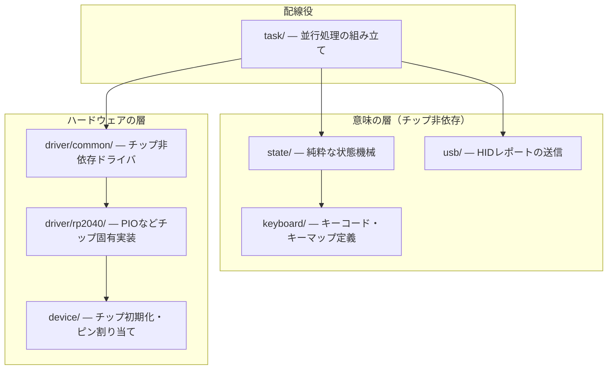
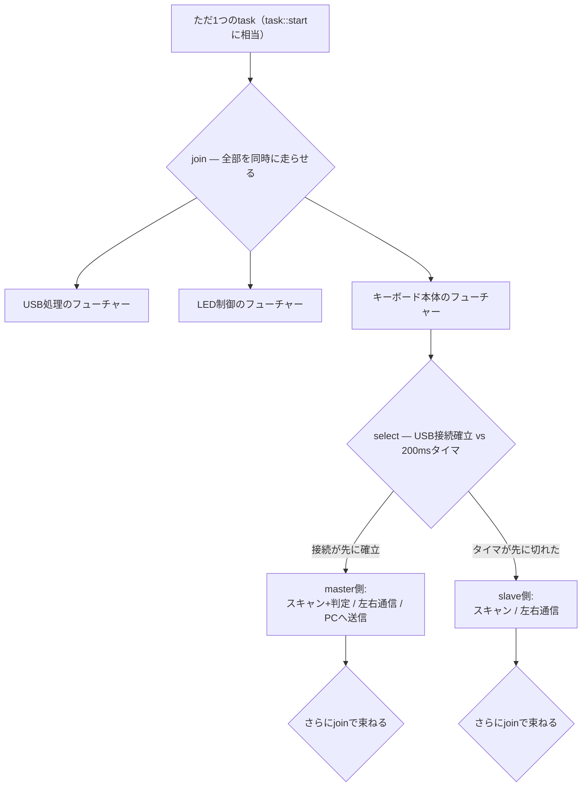

## このページでできるようになること

- 題材ファームウェアのモジュール構成を、責務と依存方向で説明できる
- 「spawnするtaskは1つだけ」という設計を、第9部の「task分割 vs join/select」の判断基準で分析できる
- Channel・Signal・Mutexの使い分けを、実物の構成から読み取れる
- master/slave判定（USB列挙の早い者勝ち）という仕掛けを説明できる

## 先に結論

題材ファームウェアは、チップ固有の初期化（device）、ドライバ（driver）、キーマップの定義（keyboard）、純粋な状態機械（state）、並行処理の配線（task）、PCへの送信（usb）にモジュールが分かれています。並行処理は意外な作りで、**embassy-executorにspawnするtaskはたった1つ**。その中で`join`と`select`のツリーを組んで、USB処理・LED制御・キーボード本体の3つ以上の仕事を同時に回します。これは第9部8ページで学んだ「起床の速さならtask分割、借用の共有しやすさならjoin/select」の判断基準で読み解けます。さらに、左右どちらの半分がPCと直接つながる「master」になるかを、**USBの接続確立が先に済んだ側が勝つ**という方法で起動時に自動判定します。同じファームウェアを左右両方に書き込めばよい、気持ちのよい設計です。

## 身近なたとえ

文化祭の模擬店を想像してください。調理担当（食材を実際に加熱する＝ドライバ）、レシピ係（味と手順を決めるだけで火は触らない＝状態機械）、そして**店長が1人**。店長は自分では調理しませんが、注文を受け、調理を頼み、できたものを渡す段取りのすべてを組みます（＝taskモジュール）。

たとえと違うのは、ソフトウェアではこの役割分担を**依存の方向として強制できる**ことです。レシピ係（state）はコンロ（HAL）を知らないので、コンロが変わっても（RP2040→C6でも）レシピはそのまま使えます。これは第12部8ページで学んだ「純粋ロジックを外へ、ハードウェア依存を端へ」そのものです。

## モジュールの地図

記事とリポジトリから読み取れるモジュール構成を、筆者の整理で1枚の図にします（図は独自に描き起こしたものです）。



読み取ってほしいのは次の3点です。

- **state/はハードウェアを知りません**。依存はembassy-timeの時刻型くらいで、キー入力の解釈（レイヤ、Tap-Hold）はすべて純粋な計算です。第12部9ページで学んだ「テストできる設計」と同じ思想です（5ページで詳しく見ます）
- **driverがcommonとrp2040に分かれています**。トラックボールやOLEDの「手順」はチップ非依存側に、PIO（RP2040独自の機能）を使う実装だけがチップ固有側にあります。C6へ翻訳するとき、driver/rp2040/だけを差し替えればよい構造です
- **task/が全体を組み立てる唯一の場所**です。第12部8ページの言葉で言えば「実体は配線役が持ち、各部品には口だけ渡す」の配線役に当たります

## spawnするtaskは1つだけ

このファームウェアの並行処理で最も面白いのは、**embassy-executorにspawnされるtaskが1つしかない**ことです。教材ではスキャン用・ログ用など複数のtaskをspawnしてきたので、意外に感じるはずです。ではその1つのtaskの中はどうなっているか。`join`と`select`のツリーです（構成は記事の解説に基づき、図は独自に描いたものです）。



第9部8ページで、並行処理には2つの書き方があると学びました。

1. taskを分ける — 起こしてほしいフューチャーだけが起こされ、反応が速い
2. 1つのtask内でjoin/selectを使う — 同じ変数への**借用を共有**でき、task用のstatic領域も不要

このファームウェアが2を選んだ理由は、判断基準に当てはめると読めてきます。

- **共有したいものが多い**。キーの状態、左右通信の口、ディスプレイ——多くのフューチャーが同じデータに触ります。taskに分けると所有権をムーブで切り分けるか、すべてをstaticなMutexに包む必要がありますが、同じtask内なら普通の借用で貸し借りできます
- **起動時にしか決まらない分岐がある**。masterになるかslaveになるかは起動時のselectで決まり、その後は別の枝を走り続けます。「spawnするtaskの組を実行時に選ぶ」よりも「1つのtaskの中でifのように枝分かれする」ほうが素直に書けます
- **反応速度の不利は小さい**。束ねた全フューチャーが1回の起床でまとめて確認される無駄はありますが、キーボードの時間感覚（ミリ秒単位）では問題になりません

つまりこれは「taskを使いこなせなかった」のではなく、**借用の共有を優先した意図的な設計**です。全員が一緒に始まり、一緒に生きる——こうした構成は「構造化並行性」とも呼ばれます。教材の最終プロジェクトが複数task+Channelを選んだのは、部品ごとの独立性と説明のしやすさを優先したからで、どちらも判断基準に沿った正解です。

## Channel・Signal・Mutexの構成を読む

このファームウェアが使う同期プリミティブを、「なぜその道具なのか」という視点で表に再構成しました（記事の内容を基に筆者が整理したものです）。

| 流れる情報 | 道具 | 容量 | なぜその道具か |
|---|---|---|---|
| slave→masterのキー・マウスイベント | Channel | 64 | 押した・離したの**取りこぼし禁止**。順序も大事 |
| master→slaveの指示（LED制御など） | Channel | 64 | 同上。指示の抜けは見た目のバグになる |
| PCへ送るキーボードレポート | Channel | 10 | 送信が追いつかない瞬間も、入力は失えない |
| PCへ送るマウスレポート | Channel | 10 | 同上 |
| LEDアニメーションの指示 | Signal | 最新1件 | 「今どの色にすべきか」は**最新値だけでよい** |
| USBリモートウェイクアップ要求 | Signal | 最新1件 | 「起こしてほしい」という事実だけ伝わればよい |
| OLED画面 | Mutex | — | 複数の場所から書く**共有資源**。順番に使う |
| 左右通信の1本の線 | セマフォ | — | 線は1本。送信したい者が**順番待ち**する |

第9部9ページの使い分け——「取りこぼし禁止はChannel、最新値だけはSignal、共有資源はMutex」——が、実物でそのまま守られていることが分かります。教材にない道具はセマフォ（Semaphore）だけです。Mutexが「鍵1本」だとすれば、セマフォは「入場券N枚」で、ここでは公平な順番待ち（先に並んだ者から通す）のために使われています。

2つ、教材との違いに注目してください。

- **RawMutexの選び方**。教材では迷ったら`CriticalSectionRawMutex`としましたが、このファームウェアの多くは`ThreadModeRawMutex`を使います。これは「割り込みからは触らず、通常実行（thread mode）だけで使う」前提の軽量版です。ただしUSBリモートウェイクアップのSignalだけは`CriticalSectionRawMutex`——割り込みの文脈からも触れる必要がある箇所だけ、保護を強くしています。「どの実行文脈から触るか」で保護方式を選ぶ、第9部9ページの考え方の実例です
- **OLEDのMutexにはもう1つ工夫**があります。panic発生時にはpanicハンドラが画面へエラーを出しますが、そこでは`lock().await`ではなく**try_lock**（待たずに試すだけ）を使います。panic中にawaitで眠るわけにはいかないからです。異常時の道具は正常時と別に選ぶ——第12部7ページの心構えと重なります

## master/slave判定 — USB列挙の早い者勝ち

分割キーボードでは、PCとUSBケーブルでつながる側（master）と、そうでない側（slave）で仕事が違います。では、どちらがmasterかをどう決めるのでしょうか。左右で別のファームウェアを書き込むのは面倒ですし、書き込み間違いも起きます。

このファームウェアの答えは「**USBの接続確立（列挙）が先に成功した側がmaster**」です。両側とも起動するとUSB接続の確立を試み、`select`で「接続確立」対「200msタイマ」を競争させます。記事によれば、判定の核心は次の1行です（出典: 上記リポジトリ legacyブランチ）。

```rust
// これは題材リポジトリからの引用（1行）です
select(hid.keyboard.ready(), Timer::after_millis(200)).await
```

- PCにつながっている側: ホストとのやりとりが始まり、`ready()`が先に完了 → master
- つながっていない側: 誰も応答しないので200msのタイマが先に切れる → slave

第9部7ページで学んだ「selectはタイムアウトを作る道具」が、そのまま**役割の自動判定**に化けています。QMK（C言語の定番キーボードファームウェア）にも同じ発想の機能（SPLIT_USB_DETECT）があり、定石の再発明ではなく定石のRust翻訳と言えます。

ただしこの方法は**USBがあるから成立する**判定です。ESP32-C6には汎用USBデバイス機能がないため、C6で分割キーボードを作るなら別の手を考える必要があります。たとえば「片側のGPIOをジャンパでGNDに落としておく」（配線で決める）、「フラッシュの設定値で決める」（第12部5ページ）、「無線接続の先着で決める」などです。この翻訳問題は後半の通信のページで改めて扱います。

## よくある誤解

- **「taskを1つしか使わないのは初心者的な設計だ」** — 逆に、借用・RAM・起床コストを理解した上での選択です。task分割とjoin/selectツリーは上下関係ではなく、共有の形と反応速度で選ぶトレードオフです
- **「Mutexで包めば何でも共有してよい」** — このファームウェアがMutexで包む共有資源はOLEDくらいで、データの流れの主役はChannelとSignalです。「共有より通信」という第9部の原則は実物でも守られています

## 設計を考える

1. LEDアニメーションの指示をSignalではなくChannel（容量64）にしたら、どんな不具合が起きうるでしょうか。

<details>
<summary>考え方の例</summary>

指示の生産が消費より速いと、古い色指示がキューに溜まります。受け側は過去の指示を順に消化するため、「今の状態」と表示が数秒ずれる、いわゆる遅延表示が起きえます。満杯になれば送信側が待たされ、キー処理まで巻き込まれるかもしれません。「最新値だけ意味がある情報」にキューは不向き——Signalが正解です。

</details>

2. C6で分割キーボードを作るとして、master/slave判定を「左側のGPIOをジャンパでGNDへ落としておく」方式にした場合、USB列挙方式と比べた利点と欠点を1つずつ挙げてください。

<details>
<summary>考え方の例</summary>

利点は、通信機能が立ち上がる前の起動直後に、GPIOを1回読むだけで確実に判定できることです。欠点は、「PCへつなぎ替えるだけで左右どちらでもmasterになれる」柔軟さが失われることです（ジャンパは配線なので差し替えられません）。どちらを取るかは使い方次第で、これも設計判断です。

</details>

## まとめ

- モジュールは「配線役（task）・意味の層（state/keyboard/usb）・ハードウェアの層（driver/device）」に分かれ、状態機械はチップ非依存
- spawnするtaskは1つだけで、join/selectツリーが全体を構成する。借用の共有を優先した意図的な設計
- Channel=取りこぼし禁止、Signal=最新値、Mutex=共有資源という第9部の使い分けが実物でも貫かれ、master/slave判定はselectのタイムアウトの応用

## 次のページ

地図が手に入ったので、いよいよ部品の中身へ入ります。まずは入力の最前線、キーマトリクスです。61個のキーをわずかなピン数で読み取る配線の仕組みと、Keyballが使う一段変わった「Duplex Matrix」を原理から理解します。

[3. キーマトリクスの原理](/embassy-esp32-c6/keyboard/03-matrix/)

前のページ: [1. キーボードは組み込みの総合格闘技](/embassy-esp32-c6/keyboard/01-intro/)
