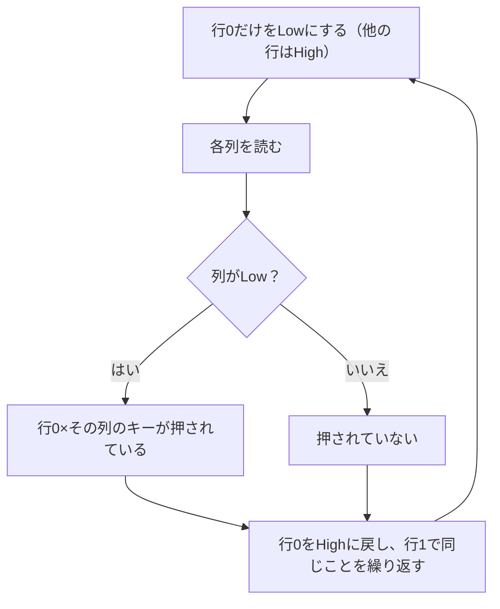

## このページでできるようになること

- N×M個のキーをN+M本のピンで読み取る「キーマトリクス」の配線とスキャンを説明できる
- ゴースト（押していないキーが押されたように見える現象）の原因と、ダイオードによる対策を説明できる
- Keyballが使う「Duplex Matrix」（方向切替で2回スキャン）の狙いを説明できる

## 先に結論

キーを1個ずつGPIOへつなぐと、61キーのキーボードには61本のピンが必要になり、どんなマイコンでも足りません。そこでキーを**行×列の格子**に配線し、「行を1本ずつ選んでは列を読む」スキャンを高速に繰り返します。8行8列なら16本のピンで64キーを読めます。ただし3キー同時押しで**ゴースト**という誤検出が起きるため、各キーに**ダイオード**を入れて電流を一方通行にします。Keyballはさらに一歩進んだ**Duplex Matrix**を使います。ピンの入出力の向きを実行時に切り替えて「列→行」と「行→列」の**2回スキャン**を行い、同じピン数で読めるキー数を倍増させる技です。

## 身近なたとえ

学校の出席確認を考えます。全校生徒600人に1人ずつ「いますか」と聞くと600回かかります。実際には「1年2組、出席を取ります」とクラス単位で呼び、そのクラスの列だけを見ますね。キーマトリクスのスキャンも同じで、「行」というクラスを1つずつ呼び出し、そのときの「列」の返事だけを読みます。

たとえと違うのは速度です。マイコンは全行のスキャンを1秒間に何十回も繰り返すので、人間から見れば「全キーを常に監視している」のと変わりません。10ms周期なら、どんなに素早いタイプでも取りこぼしません。

## 仕組み — 行×列の格子

2行3列（6キー）の例で配線を見ます（図は本教材の描き起こしです）。

```text
          列0      列1      列2     ← 入力ピン（内部プルアップでHigh）
           |        |        |
行0 ───●──[SW]──●──[SW]──●──[SW]
           |        |        |
行1 ───●──[SW]──●──[SW]──●──[SW]
           |        |        |

[SW] = キースイッチ。押すと、その位置の「行の線」と「列の線」がつながる
行 = 出力ピン（普段はHigh、スキャン時に1本だけLowにする）
```

キーは「行の線と列の線の交差点」に置かれ、押すと2本の線を電気的につなぎます。スキャンの手順は次の通りです。



なぜこれで分かるのでしょうか。列は内部プルアップ付きの入力なので、何もなければHighです（第6部3ページ）。いま行0だけがLowだとします。行0×列1のキーが押されていれば、列1の線はLowの行0とつながり、Lowへ引かれます。**「どの行をLowにしたときに、どの列がLowになったか」**の組み合わせで、押されたキーの位置が一意に決まる——これがキーマトリクスの原理です。

ピン数の節約効果は劇的です。N×M個のキーに必要なピンはN+M本。61キーでも、8行8列に収めれば16本で済みます。

## ゴーストとダイオード

キーマトリクスには有名な弱点があります。**3つのキーを同時に押すと、押していない4つ目のキーが押されたように見える**ことがあるのです。これをゴースト（ghost）と呼びます。

```text
        列0      列1
行0 ───●──[押]──●──[押]        押されたキー: (0,0) (0,1) (1,0)
         |        |
行1 ───●──[押]──●──[離]← ここが押されて見える！

行1をLowにしてスキャンしたとき:
  列1 →(0,1)押→ 行0の線 →(0,0)押→ 列0 →(1,0)押→ 行1(Low)
  という抜け道ができ、列1までLowに引かれてしまう
```

行1をLowにして列を読む場面を考えます。(1,0)が押されているので列0がLowになるのは正しい検出です。ところが、押された3つのキーが行と列の線を数珠つなぎにするため、**列1から行0の線と列0を経由して、Lowの行1へ抜ける道**ができてしまいます。その結果、押していない(1,1)の検出条件「行1がLowのとき列1がLow」まで成立してしまうのです（細かな電圧のふるまいは非選択の行をどう扱うかで変わりますが、「押された3つのキーが抜け道を作る」という構図は同じです）。

対策が**ダイオード**です。ダイオードは電流を一方向にしか通さない部品で、各キーに直列に（たとえば行→列の向きで）入れます。すると先ほどのう回路は、どこかで必ずダイオードの「逆向き」を通る必要が生じて遮断され、ゴーストは起きなくなります。自作キーボードのキットで1キーごとにダイオードをはんだ付けするのは、このためです。

なお、教材のexamples/14-keymatrix（次のページ）は2×2でデモ用のため、ダイオードなしでも動きます。ゴーストが問題になるのは3キー同時押しからです。

## KeyballのDuplex Matrix — 2回スキャンでキー数を倍に

Keyballはさらに面白い配線を使います。名前は**Duplex Matrix**（duplexは「双方向」の意味）。原理はこうです。

通常のマトリクスでは、行は出力・列は入力と**役割が固定**です。しかし、ダイオードの向きを工夫すると、1つの交差点に**向きの違う2つのキー**をぶら下げられます。

- キーA: 行→列の向きのダイオード。**行を出力・列を入力**にしたスキャン（1回目）でだけ検出される
- キーB: 列→行の向きのダイオード。**列を出力・行を入力**にしたスキャン（2回目）でだけ検出される

反対向きのダイオードは、スキャン方向が逆のときは電流を通さないので、AとBは互いに混ざりません。1周期の中で、ピンの入出力方向を切り替えて2回スキャンすれば、**同じピン数で2倍のキー**を読み分けられるというわけです。

Keyballのファームウェアでは、片手あたり物理5×4本のピンを、この2回スキャンで**論理5行7列**として扱っています。ピンの少ない小型マイコンボードに61キー+トラックボールを収めるための工夫です。

この方式の代償は2つあります。

- **ピンが「出力にも入力にもなる」必要がある**。固定の`Output`/`Input`型では書けず、実行時に方向を切り替えられるピン型が要ります。embassy-rpでは`Flex`という型がこれで、esp-halにも同名の`esp_hal::gpio::Flex`があります（次のページで触れます）
- **方向切替のたびに信号が落ち着くのを待つ**必要があります。ピンの方向を変えた直後は電圧が安定していないからです。このファームウェアはその待ちを、CPUを空回しさせるのではなく、ピンの立ち上がりをasyncに待つ書き方——記事のコードでいう `col.wait_for_high().await`（出典: 上記リポジトリ legacyブランチ）——で実現しています。第6部6ページで学んだ「エッジをawaitで待つ」が、スキャンの中でも使われているのです

## 左右判定ジャンパ — マトリクスの1マスをスイッチ以外に使う

前のページで、master/slave判定はUSB接続の早い者勝ちだと読みました。実はもう1つ、「自分は**左手側か右手側か**」という判定も必要です。masterかどうかとは別の話で、キーマップのどちら半分を担当するかが変わります。

Keyballの答えは巧妙です。**キーが存在しないマトリクス位置（論理座標(2,6)）をジャンパにして、片側の基板だけ、そこが常に「押されている」状態になるよう配線しておく**のです。ファームウェアは起動時のスキャンでその位置を読み、「押されていれば右、いなければ左」のように自分の立場を知ります。

- 追加のピンはゼロ。既存のスキャンがそのまま判定器になる
- 左右で同じファームウェアを書き込める（前ページのmaster/slave自動判定と合わせ技）

「入力装置の一部を設定スイッチに転用する」発想は、キーボードに限らず使えます。ハードウェアの制約が厳しい組み込みらしい、覚えておきたい技です。

## よくある誤解

- **「プルアップしているのだから、押されたらHighになる」** — 逆です。列は普段プルアップでHigh、押されるとLowの行につながってLowになります。「Low=押されている」はこの教材のBOOTボタン（第6部4ページ）と同じ向きです
- **「ダイオードは部品を静電気から守るためにある」** — キーマトリクスのダイオードの主目的はゴースト防止（電流の一方通行化）です。保護部品ではなく、論理を正しくするための部品です
- **「2回スキャンすると反応が半分に遅くなる」** — 1周期の仕事が増えるのは事実ですが、スキャン周期そのもの（例: 10〜20ms）を保てば応答性は変わりません。増えるのは周期内のCPU使用時間です

## 設計を考える

1. 5行7列の論理マトリクス（35キー）を「通常のマトリクス」で作る場合と、Keyball方式（Duplex）で作る場合、それぞれ必要なピン数を考えてください。

<details>
<summary>考え方の例</summary>

通常方式では5+7=12本。Duplex方式では、5×4の物理配線を2方向にスキャンして5×7ぶんの論理位置を得ているので5+4=9本。3本の節約です。ピンが余っているマイコンなら通常方式のほうが単純で、ピンが足りないなら複雑さと引き換えにDuplexを選ぶ——どちらが正しいかではなく、制約が決める設計判断です。

</details>

2. 左右判定ジャンパをマトリクス位置ではなく「専用GPIO1本」で作る設計と比べて、Keyball方式の利点と欠点を挙げてください。

<details>
<summary>考え方の例</summary>

利点はピンを1本も消費しないこと。スキャンのついでに読めるのでコードの追加もわずかです。欠点は、キーマップの1マスが使えなくなることと、「(2,6)は特別なマス」という暗黙の約束がコードとハードウェアの間に生まれることです。こうした約束は、コメントや定数名で明示しておかないと将来の自分を混乱させます。

</details>

## まとめ

- キーマトリクスは行×列の格子配線で、N×M個のキーをN+M本のピンで読む。スキャンは「行を1本ずつLowにして列を読む」の高速な繰り返し
- 3キー同時押しで起きるゴーストは、各キーに直列のダイオードで電流を一方通行にして防ぐ
- KeyballのDuplex Matrixは、ダイオードの向きとピンの方向切替を組み合わせて2回スキャンし、同じピン数で論理キー数を倍増させる。左右判定もマトリクスの1マスを転用して行う

## 次のページ

原理が分かったので、今度は自分の手で動かします。ESP32-C6とブレッドボードで2×2のキーマトリクスを実際にスキャンする、cargo check済みの完全なコードを一行ずつ読みます。

[4. C6でスキャンを書く](/embassy-esp32-c6/keyboard/04-scan-c6/)

前のページ: [2. 実物のアーキテクチャを読む](/embassy-esp32-c6/keyboard/02-architecture/)
