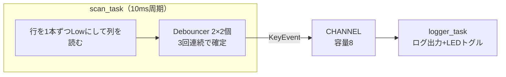

## このページでできるようになること

- ESP32-C6で2×2キーマトリクスをスキャンし、キーイベントをログに出せる
- デバウンサを純粋な状態機械として書き、スキャンと分離できる
- 「デバウンサを持つ」設計と「スキャン周期で代用する」設計（Keyball方式）を、トレードオフとして比較できる

## 先に結論

前ページの原理を、C6で実際に動く形にします。コードは`examples/14-keymatrix`（cargo check済み）です。行=GPIO18/19を出力、列=GPIO20/21を内部プルアップ入力とし、**Tickerの10ms周期**で「行を1本ずつLowにして列を読む」スキャンを回します。チャタリングは**Debouncer**（3回連続で同じ観測なら確定、という純粋な状態機械）で吸収し、確定したイベントだけをChannelでロガーtaskへ送ります。一方、題材のKeyball版ファームウェアには**デバウンサがありません**。スキャン1周を最低20msに保つ「ペーシング」で実質的な代用としています。どちらが正しいという話ではなく、比べる価値のある設計判断です。

## 仕組み

構成は2つのtaskと1本のChannelです。第9部で学んだ「共有より通信」の最小構成です。



- スキャンと「イベントを受けて何かする側」を分けておくと、後で「何かする側」をUSBやBLEの送信に差し替えられます。これは題材ファームウェアの構造（スキャン→Channel→レポート送信）の縮小版でもあります
- Debouncerは前ページまでの言葉で言えば「1キーぶんの小さな状態機械」です。ハードウェアに触れない純粋なロジックとして書きます

## コードを一行ずつ読む

これは抜粋です。完全なコードは examples/14-keymatrix を見てください。

まずピンの設定です。行は出力（普段High）、列はプルアップ入力にします。

```rust
// 行線: 出力。普段はHigh（非選択）にしておき、スキャン時だけLowにする
let rows = [
    Output::new(peripherals.GPIO18, Level::High, OutputConfig::default()),
    Output::new(peripherals.GPIO19, Level::High, OutputConfig::default()),
];

// 列線: 内部プルアップ付き入力
let input_config = InputConfig::default().with_pull(Pull::Up);
let cols = [
    Input::new(peripherals.GPIO20, input_config),
    Input::new(peripherals.GPIO21, input_config),
];
```

配列にしているのが小さなポイントです。`rows[0]`のような番号で回せるので、スキャンが二重の`for`で書けます。2×2を8×8に広げても、この部分は配列の中身が増えるだけです。

次にデバウンサ。第6部5ページでは「30ms待って読み直す」方式を使いましたが、ここでは周期スキャンに合う**カウンタ方式**にします。

```rust
/// 1キー分のチャタリング除去を行う小さな状態機械
struct Debouncer<const N: u8> {
    pressed: bool, // 確定済みの状態
    count: u8,     // 確定状態と逆の観測が何回連続したか
}

impl<const N: u8> Debouncer<N> {
    /// 状態が確定変化したときだけ Some(新しい状態) を返す
    fn update(&mut self, raw: bool) -> Option<bool> {
        if raw == self.pressed {
            self.count = 0;
            None
        } else {
            self.count += 1;
            if self.count >= N {
                self.pressed = raw;
                self.count = 0;
                Some(raw)
            } else {
                None
            }
        }
    }
}
```

- 「確定済みの状態」と「逆の観測の連続回数」の2つだけを持ちます。`N`回（この例では3回）連続で逆の観測が続いたら確定を反転し、そのとき**1回だけ**`Some`を返します。10ms周期×3回=約30msのチャタリングを吸収できる計算です
- `const N: u8`はconstジェネリクスで、感度をキーごとに型で選べます
- この構造体はGPIOもTimerも知りません。**ホストPCの`cargo test`でそのまま検証できる**、第12部9ページの形です

スキャン本体は、原理どおりの二重ループです。

```rust
// 全キー分のデバウンサ（最初はすべて「離されている」状態）
let mut debouncers = [[Debouncer::<DEBOUNCE_COUNT>::new(); COLS]; ROWS];

let mut ticker = Ticker::every(Duration::from_millis(10));

loop {
    ticker.next().await;

    for (r, row) in rows.iter_mut().enumerate() {
        row.set_low();
        // 配線の電圧が落ち着くまで少し待つ（セトリング時間）
        Timer::after(Duration::from_millis(1)).await;

        for (c, col) in cols.iter().enumerate() {
            let raw_pressed = col.is_low(); // Low = 押されている

            if let Some(pressed) = debouncers[r][c].update(raw_pressed) {
                let event = KeyEvent {
                    row: r as u8,
                    col: c as u8,
                    pressed,
                };
                // キューが満杯のときは空きが出るまでここで待つ
                CHANNEL.send(event).await;
            }
        }

        row.set_high(); // 行を非選択へ戻す
    }
}
```

- `Ticker`は「10msごと」を正確に刻みます。処理にかかった時間ぶんだけ次の待ちを縮めてくれるので、周期がずれません（第6部8ページ）
- 行をLowにした直後の`Timer::after(1ms)`が**セトリング待ち**です。配線には電気的な「なまり」があり、切り替えた瞬間の値は信用できません。前ページで見たKeyball版の`wait_for_high().await`と同じ役割を、ここでは時間待ちで実現しています
- 確定イベントだけを`CHANNEL.send(...).await`で送ります。容量8のキューが満杯なら送信側が待つ——取りこぼしなし（バックプレッシャ）の設計です

## 配線

| 部品 | 接続 |
|---|---|
| ボタン(0,0) | GPIO18 ↔ GPIO20 |
| ボタン(0,1) | GPIO18 ↔ GPIO21 |
| ボタン(1,0) | GPIO19 ↔ GPIO20 |
| ボタン(1,1) | GPIO19 ↔ GPIO21 |
| LED | GPIO10 → 抵抗330Ω → LEDアノード(+) → カソード(−) → GND |

各ボタンは「行の線」と「列の線」の交差点に入れます。ブレッドボードでは、ボタンの片足を行のジャンパ線へ、もう片足を列のジャンパ線へつなぐだけです。電源は不要です（列の内部プルアップと行の出力だけで動きます）。2×2かつ3キー同時押しを気にしないので、ダイオードは省略しています。

## 実行方法

```bash
cd examples/14-keymatrix
cargo run --release
```

ボタンを押したり離したりすると、次のようなログが出ます。どれかのキーを押すたびにLEDが反転します。

```text
INFO - 2×2キーマトリクスのスキャンを開始します
INFO - キー (0,1) 押された
INFO - キー (0,1) 離された
INFO - キー (1,0) 押された
```

## Keyball版との対比 — デバウンサを持たない設計

ここで題材ファームウェアに戻ります。驚くかもしれませんが、Keyball版のスキャンには**この教材のようなデバウンサがありません**。押した・離したのエッジ検出だけです。ではチャタリングをどうしているのか。答えは**スキャンループのペーシング**です。

- スキャン1周の所要時間を`Instant::now()`で測り、1周が最低20ms（定数`MIN_KB_SCAN_INTERVAL`、出典: 上記リポジトリ legacyブランチ）になるよう、残り時間だけ`Timer::after_micros`で眠ります
- つまり、キーの状態は**最短でも20msに1回しか観測されません**。チャタリング（多くは数ms〜10ms程度で収まる接点の暴れ）は観測と観測の間に終わってしまい、そもそも「見えない」のです

2つの設計を並べてみます。

| | 教材版（Debouncer） | Keyball版（20msペーシング） |
|---|---|---|
| 確定までの遅れ | 10ms×3回=約30ms | 最短で次の観測まで（〜20ms） |
| コード量 | 状態機械ぶん増える | ループの時間調整のみ |
| チャタリング耐性 | 30ms未満の暴れを確実に吸収 | 観測間隔より長い暴れは誤検出しうる |
| テスト | Debouncer単体をホストでテスト可能 | ロジックとしては存在しない |
| 副次効果 | — | スキャン頻度の上限=消費電力・バス占有の抑制も兼ねる |

どちらが正しい、ではありません。Keyball版は「実用上ほぼ起きない事象のために常設のコードを持たない」という割り切りで、作者が毎日使って問題ないことを確かめています。教材版は「吸収できる暴れの長さを数字で言える」「単体テストできる」ことを優先しました。共通するのは、**どちらも時間を使ってチャタリングを吸収している**ことです。片方は明示的な状態機械で、片方はサンプリング間隔そのもので。この共通点に気づけると、他人のコードの「無いもの」にも意図を読めるようになります。

## Duplex Matrixへの道 — Flexピン

前ページのDuplex Matrixは「ピンの入出力方向を実行時に切り替える」必要がありました。この例の`Output`/`Input`は方向が型で固定されていますが、esp-halには**`esp_hal::gpio::Flex`**という、1本のピンを実行時に入力にも出力にも切り替えられる型があります。embassy-rp（RP2040用HAL）の`Flex`と同じ役割で、C6でDuplex Matrixを組むならこの型が対応物になります。この例では通常マトリクスなので出番はありませんが、「型で方向を固定する安全さ」と「実行時に切り替える柔軟さ」を場面で選べることは覚えておいてください。

## よくある失敗

- **ボタンを押していないのに「押された」が連発する** — 列ピンのプルアップ指定を忘れると、入力が浮いて（第6部3ページ）ノイズを拾います。`InputConfig::default().with_pull(Pull::Up)`を確認してください
- **特定の1列だけ全キーが反応しない** — 列のジャンパ線が抜けている、またはGPIO番号の取り違えが典型です。配線表とコードのGPIO番号を突き合わせてください
- **セトリング待ちを削ったら隣のキーが誤反応した** — 行を切り替えた直後は電圧が安定していません。`Timer::after`を消すと、前の行の状態を読んでしまうことがあります。「待ち」はサボりではなく仕様です

## やってみよう

`DEBOUNCE_COUNT`を3から1に変えて書き込み、ボタンをゆっくり半押ししたり、勢いよく連打したりしてみてください。環境によっては1回の押下で「押された/離された」が複数回出ることがあります。3に戻すと消えるはずです。チャタリングという「見えない敵」を、数字の変更だけで観察できます。

## 設計を考える

1. この例を8行8列（64キー）に拡張すると、スキャン1周のセトリング待ちだけで 8行×1ms=8ms かかります。10ms周期を保つために、どんな改善が考えられますか。

<details>
<summary>考え方の例</summary>

セトリング待ちを1msから短くするのが第一候補です（実際の配線では数十µsで十分なことが多く、Keyball版のようにピンの変化をawaitで待つ手もあります）。ほかに、スキャン周期そのものを見直す（Keyball版は20ms周期で実用になっています）、行の切り替えと列読みの順序を工夫する、などが考えられます。「待ち時間の根拠を測って詰める」のは組み込みの定番作業です。

</details>

2. Debouncer方式と20msペーシング方式を組み合わせる（20ms周期+2回連続で確定）とどうなるでしょう。利点と代償を考えてください。

<details>
<summary>考え方の例</summary>

確定までは最大40ms程度になり、体感でわずかに遅れが出るかもしれません。代わりに、20msを超えるような長い接点の暴れや電気ノイズにも耐えます。ゲーム用なら遅延を、工場の振動環境なら耐性を優先するでしょう。要求で答えが変わる、典型的なトレードオフです。

</details>

## まとめ

- C6の2×2マトリクスは「行を配列で回してLow→セトリング待ち→列を読む」+Ticker 10msで書ける（examples/14-keymatrix、cargo check済み）
- Debouncerは「確定状態+連続カウンタ」だけの純粋な状態機械で、ホストでテストできる
- Keyball版はデバウンサを持たず、スキャン1周を最低20msに保つペーシングで代用する。どちらも「時間でチャタリングを吸収する」設計の異なる現れ方であり、Duplex Matrixに必要な方向切替はesp-halでは`Flex`が対応物になる

## 次のページ

スキャンで得た「(行,列)が押された」はまだただの座標です。それを「A」「Ctrl」「レイヤ2のF5」という意味に変えるのがキーマップと状態機械——このファームウェアで最も頭を使う部分です。

[5. レイヤとTap-Holdの状態機械](/embassy-esp32-c6/keyboard/05-keymap-state/)

前のページ: [3. キーマトリクスの原理](/embassy-esp32-c6/keyboard/03-matrix/)
