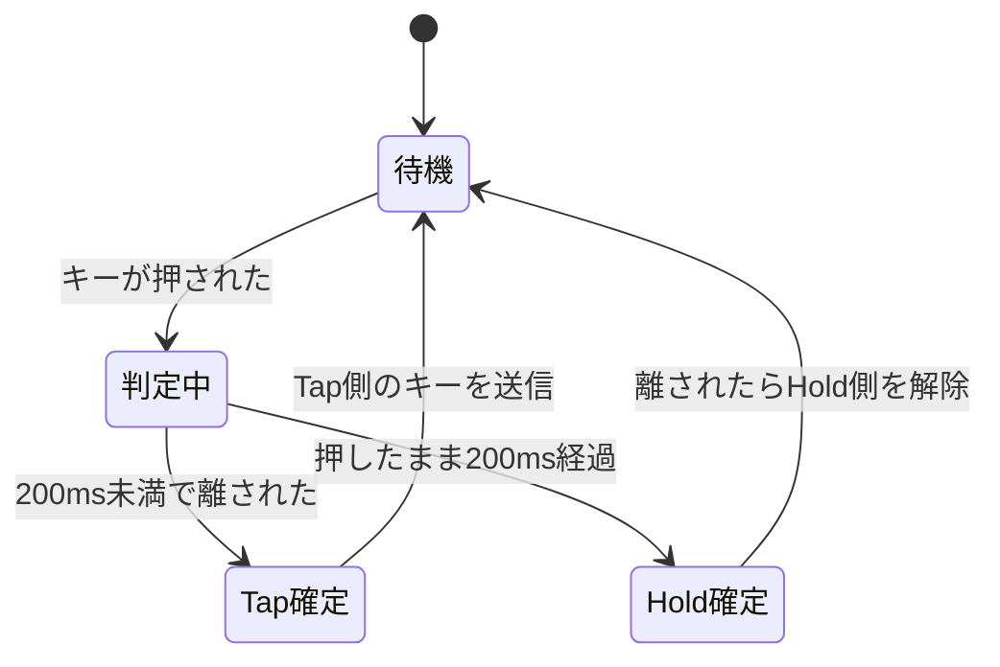

## このページでできるようになること

- 「型でキーマップを表す」設計を、enumの入れ子として読み書きできる
- レイヤの解決規則（上から探す・透過・遮断）を説明できる
- Tap-Hold判定がなぜ難しいのか（時間×複数キー×順序の組合せ爆発）を説明できる
- 状態機械をHAL非依存に保つ利点を、実例で説明できる

## 先に結論

スキャンが報告する「(行,列)が押された」を「Aを入力」「Ctrlを押しながら」という**意味**へ変えるのがキーマップです。題材ファームウェアはこれを**enumの入れ子**で表します。1マスは「何もしない/下のレイヤに任せる/このキー」、キーは「押したら即発動/短押しと長押しで別の意味（Tap-Hold）」、その中身が「文字/修飾キー/マウス/レイヤ操作」——と、**ありえる形を型がすべて列挙**します。Tap-Holdの判定は「押してから200ms」という時間だけで行われ、QMKにあるPERMISSIVE_HOLD（他のキーの割り込みで確定を早める規則）は記事時点の版にはありません。この単純化は弱点でもありますが、**時間×複数キー×順序**が絡む判定規則がいかに膨張しやすいかを知ると、むしろ賢い割り切りに見えてきます。そしてこの状態機械はすべて**HAL非依存の純粋ロジック**です。証拠に、このページのRustコードは実機なしで、ホストPCの`cargo check`を通してあります。

## 身近なたとえ

レイヤは、紙の地図に重ねる**透明シート**です。1枚目（レイヤ0）には普通の文字が並び、2枚目（レイヤ1）には記号や矢印が書いてあります。シートを重ねた状態で上から覗くと、透明な部分（Inherit）は下の文字が見え、何か書いてある部分はそれが上書きされ、黒く塗られた部分（None）は下も見えません。

Tap-Holdは、家の呼び鈴に近い感覚です。ポンと1回押せば「来客」、押しっぱなしなら「緊急」——同じボタンでも**押す長さで意味が変わる**取り決めです。たとえと違うのは、キーボードでは1秒間に十数打という速度でこの判定が行われ、しかも複数のキーの判定が**時間的に重なり合う**ことです。この重なりが、後で見る「頭が爆発する」原因になります。

## 型でキーマップを表す

記事時点のコードは、キーマップを次の考え方の型で定義しています（型の構成は記事に基づき、以下のコードはこの教材が独自に書き直したものです。元の定義には`WithModifier`や`Special`などの選択肢もあります）。

```rust
/// 最終的にPCへ届く「意味」
enum KeyCode {
    Key(u8),        // 文字キー（HID Usage ID。例: 0x04 = A）
    Modifier(u8),   // Shift・Ctrlなどの修飾キー（ビット位置）
    Mouse(u8),      // マウスボタン
    Layer(LayerOp), // レイヤ操作
}

/// レイヤ操作の種類
enum LayerOp {
    Momentary(usize), // 押している間だけそのレイヤへ
    Toggle(usize),    // 離した瞬間にオン/オフを切り替え
}

/// 1つのキーの「押し方」への反応
enum KeyAction {
    Tap(KeyCode),              // 押したらこのキー
    TapHold(KeyCode, KeyCode), // 短押しと長押しで別のキー
}

/// キーマップの1マス
enum KeyDef {
    None,           // 何もしない（下のレイヤも見ない＝遮断）
    Inherit,        // 下のレイヤに任せる（透過）
    Key(KeyAction), // このキーとして働く
}

/// 1レイヤ = マスの2次元配列。キーマップ全体はレイヤの配列
type Layer = [[KeyDef; COLS]; ROWS];
type Keymap = [Layer; LAYERS]; // 題材ではレイヤは4枚
```

第3部で学んだ「enumはありえる選択肢を型で列挙する道具」の、これが実戦形です。この設計の効き目は2つあります。

- **ありえない組み合わせが書けない**。「Tapだけど中身がない」「レイヤ操作なのに対象レイヤ番号がない」といった中途半端な状態は、そもそも型として存在しません。キーマップの定義ミスの多くがコンパイルエラーになります
- **キーマップがただのデータになる**。`Keymap`は巨大なconst配列として書けて、フラッシュに置かれます。解釈するコード（状態機械）と、配置の定義（データ）が完全に分離します

## レイヤの解決 — 上から探す・透過・遮断

いま押されたマスが「どのキーとして働くか」は、有効なレイヤを**上から**調べて決めます。有効・無効は`[bool; 4]`のフラグです。

```rust
/// 上のレイヤから順に探し、Inheritなら下へ、Noneなら打ち切り
fn resolve(keymap: &Keymap, active: [bool; LAYERS], row: usize, col: usize) -> Option<&KeyAction> {
    for i in (0..LAYERS).rev() {
        if !active[i] {
            continue; // 無効なレイヤは飛ばす
        }
        match &keymap[i][row][col] {
            KeyDef::Inherit => continue,           // 下のレイヤへ透過
            KeyDef::None => return None,           // ここで遮断
            KeyDef::Key(action) => return Some(action),
        }
    }
    None
}
```

透明シートのたとえがそのままコードになっています。`Momentary`（押している間だけ`active[n] = true`）と`Toggle`（離した瞬間に反転）の違いも、フラグをいつ書き換えるかの違いにすぎません。ここまでは素直です。難しいのは次です。

## 押した長さを測る

Tap-Holdを判定するには、まず各キーの「押されてからの経過時間」が要ります。題材ファームウェアは、全キーぶんの押下開始時刻を持つ構造体（`AllPressed`）で、毎周期のスキャン結果を**時間つきイベント**へ変換します。考え方を書き直すと次の通りです。

```rust
/// 各キーの押下開始時刻。押されていなければNone
struct AllPressed {
    pressed_at: [[Option<Instant>; COLS]; ROWS],
}

/// 毎周期、スキャン結果から作られるイベント
enum KeyStatusEvent {
    Pressed,            // この周期に押された
    Pressing(Duration), // 押され続けている（経過時間つき）
    Released(Duration), // この周期に離された（押されていた長さつき）
}

impl AllPressed {
    fn observe(&mut self, row: usize, col: usize, raw: bool) -> Option<KeyStatusEvent> {
        match (self.pressed_at[row][col], raw) {
            (None, true) => {
                self.pressed_at[row][col] = Some(Instant::now());
                Some(KeyStatusEvent::Pressed)
            }
            (Some(since), true) => Some(KeyStatusEvent::Pressing(since.elapsed())),
            (Some(since), false) => {
                self.pressed_at[row][col] = None;
                Some(KeyStatusEvent::Released(since.elapsed()))
            }
            (None, false) => None, // 押されていないまま
        }
    }
}
```

`Option<Instant>`と`match`の組み合わせ（第3部4ページ）だけで、「押された瞬間」「押し続け」「離された瞬間」が区別できます。`Instant`と`Duration`はembassy-timeの型で、GPIOにもチップにも依存しません。

## Tap-Hold — なぜ頭が爆発するのか

材料がそろいました。Tap-Holdの判定規則は、題材ファームウェアでは驚くほど単純です。**しきい値は200ms**（定数`TAP_THRESHOLD`、出典: 上記リポジトリ legacyブランチ）。



1キーぶんの判定を関数にすると、こう書けます（確定した瞬間だけ`Some`を返す簡略版です）。

```rust
const TAP_THRESHOLD: Duration = Duration::from_millis(200);

fn tap_hold_step(event: &KeyStatusEvent, decided: &mut bool) -> Option<TapHoldVerdict> {
    match event {
        KeyStatusEvent::Pressed => {
            *decided = false; // まだどちらか分からない
            None
        }
        KeyStatusEvent::Pressing(held) if !*decided && *held >= TAP_THRESHOLD => {
            *decided = true;
            Some(TapHoldVerdict::Hold) // 200msを超えた → Hold確定
        }
        KeyStatusEvent::Released(held) if !*decided && *held < TAP_THRESHOLD => {
            Some(TapHoldVerdict::Tap) // 200ms未満で離した → Tap確定
        }
        _ => None,
    }
}
```

状態図も関数も小さくて安心した——と思うのは早いのです。この規則には有名な弱点があります。「D＝短押しでd、長押しでCtrl」というキーで、**Ctrl+Fを素早く打つ**とどうなるでしょうか。

```text
時刻   0ms      80ms     150ms
       D押す    F押す    F離す   （Dはまだ押している）
```

人間の意図は明らかにCtrl+Fです。しかしDはまだ200msに達していないので**未確定**。この版の規則では、Dが200msを超えるまでCtrlになれません。素早く打つと「df」と文字が出てしまう——実際にこの種のミス入力は、Tap-Hold設定を使い始めた誰もが体験します。

QMK（定番のキーボードファームウェア）には、このためにPERMISSIVE_HOLDという追加規則があります。「未確定の間に**別のキーが押されて離された**ら、時間を待たずにHold確定」というものです。上の例なら、Fが150msで離された瞬間にDがCtrl確定し、Ctrl+Fが送信されます。記事時点の題材ファームウェアに**この規則はありません**。時間だけの、いちばん単純な判定です。

では規則を足せばよいだけでしょうか。ここが「頭が爆発する」入口です。

- 状態は1キーの経過時間だけではなくなります。**未確定のTap-Holdキーの集合×他に押されている全キー×それらのイベントの順序**が判定材料になります
- 「押されて離されたら」ではなく「押されたら即Hold確定」にする流儀（QMKでは別のオプション）もあり、規則同士が干渉します
- Tap-Holdキーを2つ同時に使うと（例: 左手の親指2つ）、互いが互いの「割り込みキー」になり、規則の適用順で結果が変わります
- 判定を保留している間、押されたキーをPCへ送らずに**溜めておいて後から順序正しく送る**仕組みも必要になります

つまり難しさの正体は、状態機械の状態が「1キーの時間」から「**複数キーの時間と順序の組合せ**」へ爆発することです。第4部9ページで「状態と遷移を列挙し尽くす」練習をしましたが、その列挙対象が積の形で増えていく——これがTap-Hold問題の本質です。題材ファームウェアが時間だけの判定に留めたのは、「200msという体感できる規則1つなら、動作を完全に予測できる」という割り切りとして読めます。

## 小ネタ2つ — オートマウスと余りの持ち越し

Keyballならではの状態機械も2つ紹介します。どちらも小さくて味わい深い設計です。

**オートマウスレイヤ**。トラックボールを転がすと、クリックキーなどが並ぶマウス用レイヤへ**自動で**切り替わり、500ms動きがなければ戻ります。実装の骨格は「最後に動いた時刻」だけです。

```rust
const AUTO_MOUSE_TIMEOUT: Duration = Duration::from_millis(500);

struct AutoMouseLayer {
    last_motion: Option<Instant>,
}

impl AutoMouseLayer {
    fn on_motion(&mut self) {
        self.last_motion = Some(Instant::now()); // ボールが動いたら記録
    }

    fn is_active(&self) -> bool {
        match self.last_motion {
            Some(t) => t.elapsed() < AUTO_MOUSE_TIMEOUT,
            None => false,
        }
    }
}
```

**スクロールの余り持ち越し**。スクロールモードでは、ボールの移動量を割り算してスクロール量に変えます。このとき**割り切れなかった余りを捨てずに次回へ持ち越す**のがポイントです。

```rust
struct ScrollAccumulator {
    rest: i32, // 前回までの余り
}

impl ScrollAccumulator {
    const DIVISOR: i32 = 8; // 8カウントでスクロール1ノッチ

    fn step(&mut self, delta: i32) -> i32 {
        let total = self.rest + delta;
        self.rest = total % Self::DIVISOR; // 余りは捨てずに持ち越す
        total / Self::DIVISOR
    }
}
```

余りを捨てると、ゆっくり転がしたとき（毎回の移動量が8未満のとき）に**永遠にスクロールしない**バグになります。整数しか使えない組み込みで小数のような滑らかさを出す、固定小数点の考え方の入口です。

## 状態機械はHALを知らない

このページのコードには、`esp_hal`も`embassy_executor`も一度も登場しませんでした。使ったのは`core`のenum/matchと、embassy-timeの`Instant`/`Duration`だけです。題材ファームウェアの`state/`モジュールもまったく同じ方針で、**チップに1ミリも依存しない純粋ロジック**として書かれています。

これは第12部9ページ「テストと保守」で学んだ、テスト可能な設計そのものです。実際、このページに載せたRustコード（型定義・resolve・AllPressed・tap_hold_step・AutoMouseLayer・ScrollAccumulator）は、**実機なしでホストPCの`cargo check`を通して検証しました**。embassy-timeはホスト向けにもビルドできるので、こういう芸当ができるのです。逆に言えば、状態機械の中で`Input`を読んだりログを出したりし始めると、この検証手段は失われます。「意味の計算」と「ハードウェアの読み書き」の境界線を守ることが、RP2040のコードをC6の教材で読めている理由でもあります。

## よくある誤解

- **「Tap-Holdは200msのタイマを1本持てばよい」** — 1キーだけならそうですが、実用では複数のTap-Holdキーと通常キーの押下が時間的に重なります。難しさは時間そのものではなく、複数キーの状態と順序の組合せにあります
- **「レイヤのNoneとInheritは同じようなもの」** — 正反対です。Inheritは下のレイヤへ**透過**し、Noneは下を見せずに**遮断**します。記号レイヤで「使わないキーを無効化したい」ならNone、「基本レイヤのまま使いたい」ならInheritです

## 設計を考える

1. この版にPERMISSIVE_HOLD（未確定中に他キーが押されて離されたらHold確定）を足すとしたら、状態機械に何を追加する必要があるでしょうか。

<details>
<summary>考え方の例</summary>

少なくとも(1)未確定のTap-Holdキーが存在する間、他のキーのPressed/Releasedを監視する仕組み、(2)その間に押されたキーをすぐPCへ送らず溜めておくバッファ、(3)Hold確定した瞬間に「修飾キー→溜めたキー」の順で送り直す処理、が要ります。1キー内で閉じていた状態機械が、全キーのイベント列を見る状態機械へ変わる——これが本文で述べた組合せ爆発の入口です。

</details>

2. オートマウスレイヤの解除を「500ms動きなし」ではなく「マウス以外のキーが押されたら即解除」にすると、使い心地はどう変わるでしょうか。両方組み合わせる場合の注意点は。

<details>
<summary>考え方の例</summary>

即解除は「ポインタを動かした直後に文字を打つ」場面で誤クリックを防げますが、「動かして→クリック」の間に他のキーへ指が触れると、クリックのつもりが文字になる事故も起きます。組み合わせる場合は「クリックキー自身は解除のきっかけにしない」などの除外規則が必要で、ここでも規則同士の干渉が現れます。実際のキーボードファームウェアがオプションだらけになるのは、この干渉の調停を利用者に委ねているからです。

</details>

## まとめ

- キーマップは「KeyDef（マス）→KeyAction（押し方）→KeyCode（意味）」というenumの入れ子で表し、ありえない設定を型で排除する。レイヤ解決は「上から探す・Inheritは透過・Noneは遮断」
- Tap-Holdは押下時間200msだけで判定する。PERMISSIVE_HOLDのような追加規則は、複数キー×時間×順序の組合せ爆発と引き換えになる
- 状態機械はHAL非依存の純粋ロジックに保たれ、実機なしでホスト検証できる。これは教材第12部で学んだ設計思想の実例そのもの

## 次のページ

片手ぶんの入力が「意味」になりました。しかし分割キーボードには、もう半分の入力を**1本の線**で運ぶという難題が残っています。フレーミング、衝突、ベストエフォートの割り切り——後半は左右間の通信から始まります。

[6. 左右をつなぐ通信](/embassy-esp32-c6/keyboard/06-split-comm/)

前のページ: [4. C6でスキャンを書く](/embassy-esp32-c6/keyboard/04-scan-c6/)
