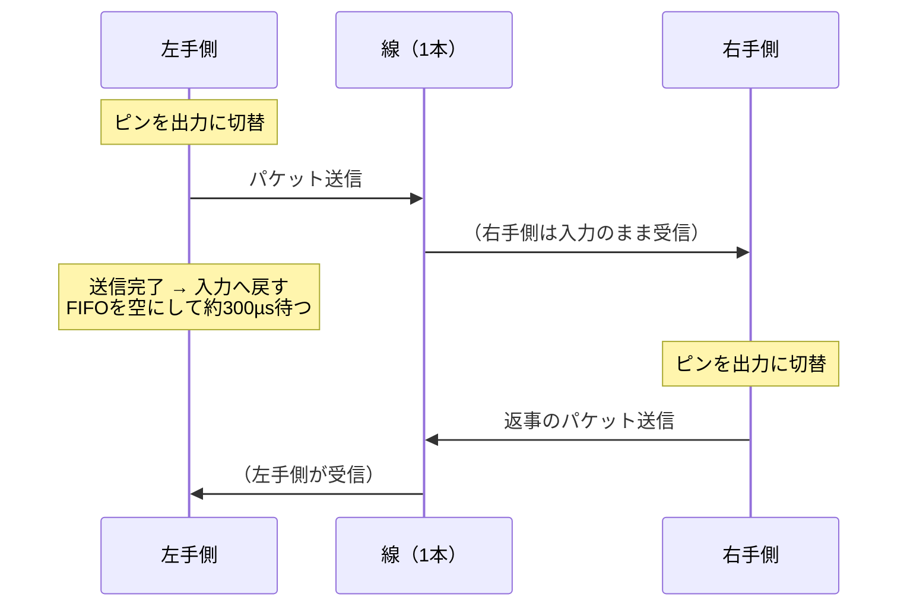

## このページでできるようになること

- 「データ線が1本しかない」という物理的制約から、半二重通信とフレーミングの必要性を導ける
- RP2040のPIOが何を肩代わりしているかを説明できる
- ACK・再送・破損検出のない通信設計のリスクを、教材の最終プロジェクトと対比して評価できる
- ESP32-C6で同じ問題を解くなら何を選ぶか（有線UART/無線ESP-NOW）を、トレードオフ付きで判断できる

## 先に結論

Keyballの左右は、オーディオ用のTRSケーブルでつながっています。3本の線のうち2本は電源とGNDに使うので、**データに使える線は1本だけ**です。1本の線で双方向にやり取りするには、送る側と受ける側が交代する**半二重通信**にするしかありません。Keyballはこの線の上に、1バイトを10ビットの枠で運ぶ独自のフレーミングを定義し、その送受信をRP2040固有のペリフェラルであるPIOに任せています。そして重要なのはここからです。この通信には**ACKも、破損検出（CRC）も、再送もありません**。作者自身がREADMEで「衝突すると不安定」と明記しています。第11部8ページで学んだとおり、**信頼性は勝手には付いてこない。必要なら自分で設計する**——実物のファームウェアが、その教訓をそのまま見せてくれます。

## 身近なたとえ

トランシーバー（無線機）を思い浮かべてください。1つの周波数を2人で使うので、同時には話せません。「こちら山田、どうぞ」と言って話す権利を相手に渡し、交代で話します。2人が同時に話すと、両方の声が混ざってどちらも聞き取れなくなります。

実際の1線通信がたとえと違うのは、線の上に「どうぞ」という合図の仕組みが**最初から用意されてはいない**ことです。誰がいつ送るか、衝突したらどうするかは、すべてファームウェアの設計者が決めます。決めなければ「決めていない」という設計になり、その結果もまた自分に返ってきます。

## 仕組み

### なぜ線は1本しかないのか

TRSケーブルは、先端（Tip）・中間（Ring）・根元（Sleeve）の3つの接点を持つ、いわゆるステレオミニプラグのケーブルです。分割キーボードの世界では、これを次のように使うのが定番です。

| 接点 | 用途 |
|---|---|
| Tip | 電源（V+）: 片側からもう片側へ電気を送る |
| Ring | **データ（1本だけ）** |
| Sleeve | GND |

電源とGNDを届けなければ反対側の手が動かないので、この2本は削れません。残りは1本。つまり「データ線1本で左右の会話を成立させよ」という制約は、ケーブルを選んだ瞬間に決まっています。ハードウェアの制約がソフトウェアの設計（半二重・フレーミング・調停）を決める、教材で何度も見てきた構図です。

### 半二重 — 同じピンが出口にも入口にもなる

1本の線を双方向に使うため、Keyballの実装では**同じGPIOピンを送信時だけ出力に切り替え、送り終わったら入力へ戻します**。方向を切り替える瞬間はデリケートで、記事時点の実装では、受信へ戻るときに受信バッファ（FIFO）にたまったゴミを捨て、さらに約300マイクロ秒のガード時間を置いてから受信を再開しています。自分が送った信号の残りを「相手からの受信」と誤認しないための用心です。



### フレーミング — 1バイトを運ぶ10ビットの枠

線の上を流れるのはただの電圧の高低です。「どこからが1バイトか」を受け手が見分けるために、Keyballはスタートビット・8ビットのデータ・開始チェック・終了チェックからなる**10ビットの枠**で1バイトを運びます。パケットは最大8バイトです。第8部1ページで学んだUARTのフレーム（スタートビット＋データ＋ストップビット）と同じ発想で、枠の中身だけが独自流です。実装はQMK（C言語の定番キーボードファームウェア）の1線通信ドライバを参考にしたと記事にあります。

```text
1バイトぶんの枠（10ビット）:
[スタート][D0][D1][D2][D3][D4][D5][D6][D7][チェック]
   ↑ここから1バイト          データ8ビット      ↑枠の区切りの検査

パケット = この枠 × 最大8バイト
```

パケットの中身（キーイベントやLED指示）は、postcardというクレートでRustのenumをバイト列に変換（シリアライズ）して詰めています。第11部で「ペイロードの形式は自分で決めて文書化する」と学んだことの、実物版です。

### PIOへのオフロード — C6には無いもの

このビット単位の送受信を、KeyballはCPUではなく**PIO（Programmable I/O）**にやらせています。PIOはRP2040固有のペリフェラルで、数命令だけの小さなプログラムを実行できる「ミニ実行装置（ステートマシン）」を複数持ち、CPUとは独立にGPIOを正確なタイミングで上げ下げできます。Keyballは1つのPIOの中のステートマシン2つをRX用とTX用に割り当て、**1本のピンを2つのステートマシンで共有**して約100kbpsで通信します。CPUは「バイト列を渡す・受け取る」だけでよく、ビットのタイミングはPIOが守ってくれるわけです。

ESP32-C6にPIOはありません。C6の設計思想は「よく使う波形は役割の決まったペリフェラル（UART・SPI・RMT等）に任せる」であり、自由なビット操作装置は持たないのです。ではC6でどうするかは、このページの後半で考えます。

### 調停 — FairSemaphoreは何を守り、何を守らないか

線は1本なので、自分のチップの中でも「スキャン結果を送りたいフューチャー」と「LED指示を送りたいフューチャー」が同時に線を使おうとするかもしれません。Keyballはこれを、embassy-syncのセマフォ（FairSemaphore）で調停しています。セマフォは第9部で学んだMutexの親戚で、「許可証を取った者だけが資源を使える」仕組みです。Fair（公平）と付くのは、**待ち始めた順に許可証が渡される**からです。早い者勝ちだと運の悪いフューチャーがいつまでも送れない「飢餓」が起きうるので、順番待ちの列を作ります。

ただし注意してください。このセマフォが調停できるのは**同じチップの中のフューチャー同士**だけです。左手側と右手側は別々のチップで、お互いのセマフォは見えません。つまり**左右が同時に送信を始める「線上の衝突」は防げない**のです。

### そして、信頼性は「無い」

衝突したらどうなるのでしょうか。記事時点の実装には、ACK（受け取ったよの返事）も、CRC（データが壊れていないかの検査）も、再送もありません。衝突すればパケットは壊れ、壊れたパケットは静かに消えます。リポジトリのREADMEには、**衝突すると通信が不安定になることが作者自身の手で明記**されています。誠実な設計文書です。「動くけれど、ここが弱点だ」と書き残すのは、第12部で学んだ「正直なstatus表記」と同じ姿勢です。

教材の最終プロジェクト（examples/final-wireless-button）と並べてみましょう。

| 部品 | Keyball左右通信（記事時点） | 教材の無線ボタン端末 |
|---|---|---|
| 連番（seq） | なし | あり（u32、全パケット共通） |
| ACK | なし | あり（種別3のパケット） |
| 再送 | なし | あり（200msタイムアウト、最大3回） |
| 重複排除 | 不要（再送がないため） | あり（送信元ごとに最後のseqを記憶） |
| 破損検出 | フレームのチェックビットのみ | XORチェックサム＋マジックナンバー |
| 失敗時 | パケット消失（不安定） | エラー状態へ遷移し自動復帰を待つ |

最終プロジェクトのパケット形式を思い出してください（examples/final-wireless-button/src/protocol.rs より抜粋）。

```text
+--------+--------+-------------------+--------+----------+
| byte 0 | byte 1 | bytes 2..6        | byte 6 | byte 7   |
| MAGIC  | 種別   | seq (u32, LE)     | フラグ | チェック |
| 0xB7   | 1/2/3  | 通し番号          | 0/1    | サム     |
+--------+--------+-------------------+--------+----------+
```

どちらが「正しい」のではありません。キーボードの左右通信は数十センチの有線で、衝突の頻度は低く、1周期落ちても次の20ms後のスキャンで状態が送り直されます。**失敗のコストが小さいから、信頼性を省くという選択が成立している**のです。一方、無線ボタン端末の「押した」は一度きりのイベントで、消えたら故障に見えます。第11部8ページの結論——信頼性が必要かどうかは用途が決める、必要なら4点セットを自分で組む——が、実物のコードで裏付けられました。

### C6ならどう作るか

PIOのないC6での選択肢は3つあります。

**案1: 2線UART（いちばん素直）**。TRSの1本制約は「オーディオケーブルを流用したい」という文化的な事情です。接点が4つあるTRRSケーブルにするか専用ケーブルを使えばデータ線を2本取れて、C6のUARTペリフェラル（HP UART×2）のTXとRXを普通につなぐ**全二重**になります。全二重なら衝突という問題そのものが消えます。フレーミングもUARTのハードウェアがやってくれます。

**案2: 1線半二重UART**。TRS互換にこだわるなら、UARTのTXとRXを1本の線にまとめ、送信のたびにピン設定を切り替える方法もあります。Keyballと同じ衝突・方向切替の問題を自分で背負うことになるので、設計の難しさは残ります。

**案3: 左右を無線にする**。C6にはESP-NOWがあります。左手から右手へ、キーイベントをESP-NOWで送れば**ケーブルそのものが消えます**。ただしタダではありません。

| 観点 | 有線（UART） | 無線（ESP-NOW） |
|---|---|---|
| ケーブル | 必要 | 不要（見た目と取り回しは最高） |
| 電源 | ケーブルで供給できる | **左手側にも電池と充電回路が必要** |
| 遅延 | 数十µs〜数百µsで安定 | 通常は数ms程度だが、2.4GHz帯の混雑で変動する |
| 消失 | 衝突時のみ | 電波環境次第で日常的に起きうる → **4点セット必須** |
| 相手の識別 | つながっている相手が相手 | MACアドレスの登録（ペアリング相当）を自分で設計 |
| 電力 | 通信自体はごく小さい | 無線分の消費が常に載る（第12部の省電力設計が必須） |

無線化した瞬間、最終プロジェクトで作った連番・ACK・再送・重複排除がそのまま**必須部品**になることに注目してください。教材の最終プロジェクトは、実は「無線分割キーボードの左右通信」の練習そのものだったのです。

## よくある失敗

- **FairSemaphoreが衝突まで防いでくれると誤解する** — セマフォが調停するのは同一チップ内のフューチャー同士だけです。別チップ同士の同時送信は、線の上のプロトコル（またはACK/再送）で扱うしかありません
- **方向切替のガードを設計しない** — 半二重で送信直後に即受信へ戻ると、自分の送った信号の残りやノイズを「受信データ」として拾います。KeyballのFIFO破棄＋300µs待ちのような用心には、必ず理由があります
- **「たまに取りこぼす」を仕様として明記しない** — 信頼性を省く選択は有効ですが、READMEに書いていなければただの隠れたバグです。省いたなら省いたと書く。実物の作者はそれをやっています
- **無線化の対価を見積もらない** — ケーブルが消える代わりに、電池・充電・ペアリング・再送設計が増えます。トレードオフ表を書いてから決めましょう

## やってみよう

Keyballの最大8バイトのパケットに、最終プロジェクトの4点セット（連番・種別・チェックサム）を載せるとしたら、8バイトをどう配分しますか。紙にバイト配置図を書いてみてください。キーイベント（行・列・押した/離した）を積んだうえで連番に何ビット残せるか、連番が一周する周期は実用上問題ないかまで考えると、プロトコル設計の手触りが分かります。

## 確認問題

1. データ線が1本しかないことから、「半二重」「フレーミング」「調停」の3つの設計が必要になる理由を、それぞれ1文で説明してください。
2. Keyballの左右通信がACK・再送なしでも実用になっているのはなぜですか。同じ設計を無線ボタン端末に流用してはいけないのはなぜですか。
3. C6で左右を無線化する場合、最終プロジェクトの部品のうちそのまま使えるものを3つ挙げてください。

<details>
<summary>答え</summary>

1. 半二重: 1本の線で双方向に送るには時間で送り手を交代するしかないから。フレーミング: 線上はただのビット列で、バイトやパケットの区切りを受け手が見分ける枠が要るから。調停: 送りたい者が複数いるとき、誰が線を使うか決めないと衝突するから。
2. 数十センチの有線で衝突頻度が低く、キー状態は20ms周期で繰り返し送られるため、1回の消失のコストが小さいから。無線ボタン端末の「押した」は一度きりのイベントで、消えると「押したのに動かない」故障になるため、連番・ACK・再送・重複排除で守る必要があります。
3. 例: protocol.rsのパケット設計（連番・種別・チェックサム）、send_event_with_retryの再送とタイムアウト、DedupTableの重複排除。いずれもハードウェア非依存の層なのでそのまま流用できます（第12部8ページの依存方向設計の恩恵です）。

</details>

## まとめ

- データ線1本という物理制約が、半二重・フレーミング・調停という3つのソフトウェア設計を要求する。KeyballはビットのタイミングをPIOに任せ、チップ内の調停をFairSemaphoreで行う
- この通信にACK・CRC・再送はなく、作者自身が「衝突すると不安定」と明記している。信頼性を省くのも設計だが、省いたと書き残すことまで含めて設計である
- C6にPIOはない。2線UARTで全二重にするのが素直で、無線化するなら最終プロジェクトの4点セットがそのまま必須部品になる

## 次のページ

キーの状態を集めて左右で共有したら、次はそれをPCへ届ける番です。PCがキーボードを「キーボード」と認識する仕組み——USB HIDを読み解き、そしてC6の重大な事情に向き合います。

[7. USB HIDの仕組みと、C6にUSBがない話 →](/embassy-esp32-c6/keyboard/07-usb-hid/)

---

前: [5. レイヤとTap-Holdの状態機械](/embassy-esp32-c6/keyboard/05-keymap-state/) | 次: [7. USB HIDの仕組みと、C6にUSBがない話](/embassy-esp32-c6/keyboard/07-usb-hid/)
