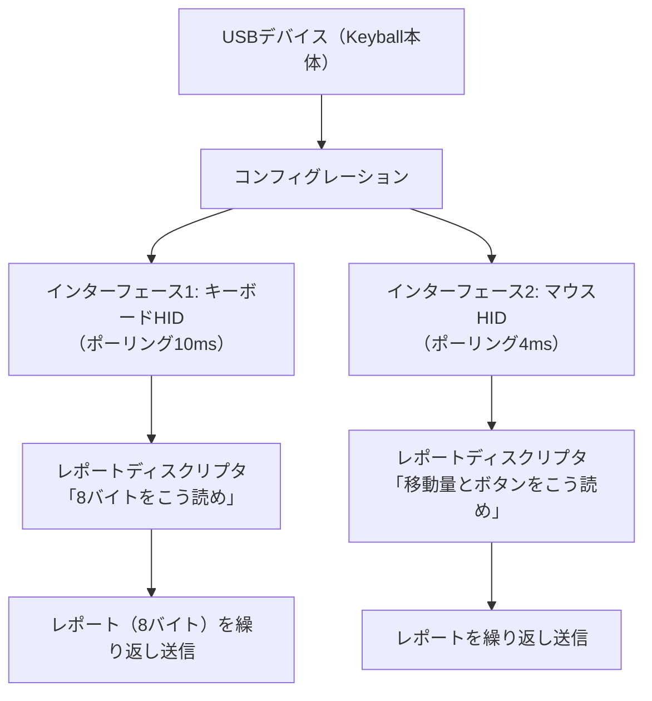

## このページでできるようになること

- 「デバイス → レポートディスクリプタ → レポート」というHIDの階層を説明できる
- 8バイトのブートキーボードレポートの中身をバイト単位で読める
- KeyballのUSB構成（2つのHIDインターフェース、リモートウェイクアップ）の意図を説明できる
- 「ESP32-C6ではUSBキーボードを作れない」という結論を、ハード対応表から自力で導ける

## 先に結論

PCにキーボードを挿すと、ドライバのインストールなしですぐ使えます。これはHID（Human Interface Device）という約束事のおかげです。デバイスは接続直後に**レポートディスクリプタ**という「私が送るデータの読み方の説明書」をPCへ渡し、以後は**レポート**という短いバイト列（キーボードなら8バイト）を送るだけになります。Keyballはembassy-usbでキーボードとマウスの2つのHIDインターフェースを組み立てています。しかしこの設計をC6へ持ち込もうとした瞬間、決定的な事実にぶつかります。**ESP32-C6には汎用のUSBデバイスコントローラがありません**。C6のUSB端子はログと書き込み専用のUSB Serial/JTAGであり、キーボードのふりはできないのです。「作り始める前にハード対応表を見よ」——本教材の[技術対応状況表](/embassy-esp32-c6/project/support-matrix/)の思想が、ここで現実の壁として現れます。

## 身近なたとえ

新しく職場に来た派遣スタッフを想像してください。初日にまず「私はこういう書式で日報を出します。1行目は出勤状況、2行目は……」という説明書を総務に渡します。以後は毎日その書式どおりの日報を出すだけで、総務は誰の日報でも機械的に処理できます。HIDのレポートディスクリプタがこの「書式の説明書」、レポートが「日報」です。

たとえと違うのは、説明書も日報も人が読む文章ではなく、数十バイトのバイト列だという点です。書式はUSBの標準規格で決まっていて、世界中のOSが同じ規則で解釈します。だからこそドライバなしで動くのです。

## 仕組み

### HIDの階層 — 説明書を先に、データは後で



接続直後にOSはディスクリプタ類を読み取り、「これはキーボードとマウスの複合デバイスだ」と学習します。以後の通信はレポートの往復だけです。なお**ポーリング**とはホスト（PC）側が「何かある？」と定期的に聞きに来る方式のことで、キーボード10ms・マウス4msという間隔はデバイス側が「この間隔で聞きに来てほしい」と申告する値です。マウスを短くしているのは、ポインタの動きが遅延に敏感だからです。

### 8バイトのブートレポート

キーボードの入力レポートの最小構成は8バイトで、**ブートレポート**と呼ばれます（BIOS画面のような単純な環境でも解釈できる形式、という意味です）。

```text
byte 0 : 修飾キーのビットマップ
         bit0=左Ctrl bit1=左Shift bit2=左Alt bit3=左GUI
         bit4〜7=右側の同キー
byte 1 : 予約（常に0）
byte 2 : 押されているキー その1（Usage ID）
byte 3 : 押されているキー その2
  …
byte 7 : 押されているキー その6
```

「Usage ID」はキーごとの番号で、たとえば'a'は0x04です。同時に押せるキーは修飾キーを除いて6個まで——安いキーボードで多数同時押しが効かない「6キーロールオーバー」の正体はこのレポート形式です。そして押されたキーだけでなく、**離した後の状態（全ゼロのレポート）を送ることも同じくらい重要**です。キーアップのレポートが届かなければ、OSはキーが押しっぱなしだと解釈し続けます。

### 説明書の言語 — レポートディスクリプタ

「8バイトをこう読め」を伝えるレポートディスクリプタは、専用のバイト列言語で書きます。実は本教材のBLE HIDサンプル（examples/15-ble-hid、次ページで完全解説します）が**まったく同じ言語**を使っているので、冒頭だけ味見しておきましょう。

```rust
const REPORT_MAP: [u8; 45] = [
    0x05, 0x01, // Usage Page (Generic Desktop) : デスクトップ機器の分類から…
    0x09, 0x06, // Usage (Keyboard)             : 「キーボード」を選ぶ
    0xA1, 0x01, // Collection (Application)     : ここからキーボードの定義
    // --- 1バイト目: 修飾キー（Ctrl/Shift/Alt/GUI）を1ビットずつ、計8ビット ---
    0x05, 0x07, //   Usage Page (Keyboard/Keypad)
    0x19, 0xE0, //   Usage Minimum (0xE0 = 左Ctrl)
    0x29, 0xE7, //   Usage Maximum (0xE7 = 右GUI)
    // …（続きは次ページで全文を読みます）
```

これは抜粋です。完全なコードは examples/15-ble-hid を見てください。2バイトずつの「命令＋値」の並びで、「これから8ビット×1個のフィールドが来る。意味は左Ctrl〜右GUIだ」のように、レポートの構造を頭から順に宣言していきます。USBで使ってもBLE（Bluetooth Low Energy）で使っても、この説明書の書式は共通です。**ここを一度理解すれば、次ページのBLE HIDは「運び方が変わるだけ」になります。**

### Keyballの実装を読む — embassy-usbの構成

記事時点のKeyballのUSB部は、独自の言葉で要約すると次の構造です（元コードの転載は避け、設計だけを述べます）。

- embassy-usbのBuilderで、キーボード用とマウス用の**2つのHIDインターフェース**を1つのUSBデバイスに登録する（ポーリング間隔はキーボード10ms・マウス4ms）
- キーイベントを処理する側とUSBへ書き出す側は**Channelで分離**されている。スキャンや状態機械が作ったレポートをChannelへ送り、レポート専任のフューチャーが受け取ってUSBへ書き込む——第9部9ページの「作る人と使う人をChannelでつなぐ」がそのまま現れる
- USBには**SUSPENDED（サスペンド）**という状態がある。PCがスリープするとデバイスも省電力状態に入るが、その間にキーが押されたら**リモートウェイクアップ**という手順でPC側を起こす。Keyballはサスペンド中の入力をSignalで通知し、USB側のフューチャーがwakeup要求を出す
- 左右どちらがPCにつながっているか（master/slave）の判定にもUSBを使う。**USBの列挙（PCとの初期手続き）が200ms以内に完了した側がmaster**という「早い者勝ち」判定で、`select`とタイマーの組み合わせ——第9部7ページで学んだ「処理とタイムアウトの競争」の実戦形です

### そしてC6には、これができない

ここまで読んで「C6で書き換えるなら embassy-usb の部分は……」と考え始めたはずです。しかし[ハードウェア調査資料が示すとおり](/embassy-esp32-c6/project/support-matrix/)、答えは明快です。

**ESP32-C6が持つUSB機能は「USB Serial/JTAG」だけです**（GPIO12/13固定）。これはログ出力・フラッシュへの書き込み・デバッグ専用に役割が固定された機能で、レポートディスクリプタを自由に定義して「私はキーボードです」と名乗る——つまり汎用USBデバイスとして振る舞う——ことはできません。RP2040やESP32-S3が持つような汎用USBデバイスコントローラを、C6は搭載していないのです。

これは工夫で乗り越えられる種類の壁ではありません。選択肢は2つです。

1. **無線で届ける** — C6の強みはBLE（Bluetooth Low Energy）です。HIDにはBLE版の運び方（HID over GATT）が標準化されており、レポートディスクリプタも8バイトレポートもそのまま使えます。次ページの主題です
2. **チップを変える** — 「有線USBキーボードであること」が要件なら、C6は選ばず、汎用USBデバイスコントローラを持つESP32-S3やRP2040を選ぶのが正直な判断です。適材適所であり、負けではありません

どちらにしても教訓は同じです。**プロジェクトを始める前に、ハードウェアの対応表を確認する。** 本教材が最初に[技術対応状況表](/embassy-esp32-c6/project/support-matrix/)を作り、「C6がハードとして対応」と「Rustで実用的に扱える」を列で分けたのは、まさにこの種の手戻りを防ぐためでした。

## よくある失敗

- **「USB端子があるからUSBデバイスになれる」と思い込む** — C6の開発ボードにはUSB-C端子が2つもありますが、片方はUART変換チップ経由、もう片方はUSB Serial/JTAGです。端子の存在とコントローラの能力は別物です。データシートの機能一覧まで確認しましょう
- **キーアップのレポートを送り忘れる** — 押したときの8バイトだけ送って満足すると、OS側では押しっぱなしになります。「状態が変わるたびに現在の状態を送る」のがレポートの原則です
- **ポーリング間隔を「短いほど良い」と決めつける** — 間隔を短くするとホストのUSB帯域と自分の処理量を消費します。キーボード10ms・マウス4msのような使い分けは、入力の性質（遅延への敏感さ）に合わせた設計です
- **6キー制限を知らずにレポートを設計する** — ブートレポートは同時押し6キーまでです。それ以上が必要なら別形式のレポート（NKRO）を自分でディスクリプタに定義することになり、難易度が一段上がります

## やってみよう

「Shift+A」を押している瞬間の8バイトレポートを、16進数で紙に書いてみてください（ヒント: 左Shiftはbyte 0のbit1、'a'のUsage IDは0x04です）。次に、そこからShiftだけを離した瞬間のレポートも書いてみましょう。2つのレポートの差分が「OSから見たキー操作」のすべてです。

## 確認問題

1. レポートディスクリプタを接続時に一度だけ渡す設計には、どんな利点がありますか。毎回のレポートに意味の説明を付ける設計と比べて答えてください。
2. Keyballがキーボード用とマウス用でポーリング間隔を変えている（10msと4ms）のはなぜですか。
3. 「C6でUSBキーボードを作りたい」と相談されたら、あなたはどう答えますか。確認すべき資料と、提示できる選択肢を含めて答えてください。

<details>
<summary>答え</summary>

1. 毎回のレポートは最小の8バイトで済み、解釈の規則はOSが接続時に一度だけ学習すればよくなります。通信量が減り、OSはどんなメーカーのデバイスでも同じ手順で扱えます（だからドライバのインストールが不要になります）。
2. マウスのポインタ移動は遅延が体感に直結するため短い4msに、キーボードは10msでも人間には十分速いためやや長くして、帯域と処理量を節約しています。
3. まず技術対応状況表とデータシートでUSB機能を確認してもらいます。C6のUSBはSerial/JTAG専用で汎用USBデバイスにはなれないため、(a) BLE HIDキーボードとしてC6で作る、(b) 有線USBが必須要件ならESP32-S3等の汎用USBデバイスコントローラを持つチップに変える、の2択を提示します。

</details>

## まとめ

- HIDは「説明書（レポートディスクリプタ）を先に渡し、以後は短いレポートを送るだけ」という階層設計。キーボードの基本形は修飾キー1バイト＋予約1バイト＋キー6個の8バイト
- Keyballはembassy-usbで2つのHIDインターフェースを構成し、Channelによる分離・リモートウェイクアップ・USB列挙のタイムアウト競争によるmaster判定など、教材で学んだ部品を総動員している
- ESP32-C6に汎用USBデバイスコントローラはない。USB Serial/JTAGはキーボードになれない。ハード対応表を最初に確認し、BLE HIDで作るかチップを変えるかを判断する

## 次のページ

C6にはUSBがない。ならばC6の答えは無線です。レポートディスクリプタも8バイトレポートもそのままに、運び方だけをBLE（Bluetooth Low Energy）へ変えた、cargo check済みの実装を1行ずつ読みます。

[8. C6の答え — BLE HIDキーボード →](/embassy-esp32-c6/keyboard/08-ble-hid/)

---

前: [6. 左右をつなぐ — 1本の線の上のプロトコル](/embassy-esp32-c6/keyboard/06-split-comm/) | 次: [8. C6の答え — BLE HIDキーボード](/embassy-esp32-c6/keyboard/08-ble-hid/)
