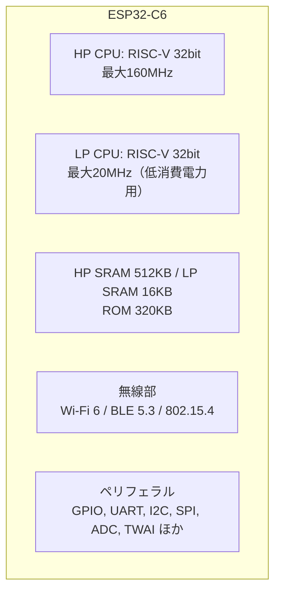

## このページでできるようになること

- ESP32-C6の構成（RISC-V、Wi-Fi 6、BLE、802.15.4）を説明できる
- 対応している無線と、していない無線（Bluetooth Classic）を区別できる
- 開発ボードESP32-C6-DevKitC-1のボタンとLEDの正体を言える

## 先に結論

ESP32-C6は、Espressif社の**無線マイコン**です。CPUは**RISC-V**（オープンな命令セット）で最大160MHz。無線は**Wi-Fi 6（2.4GHzのみ）**、**BLE（Bluetooth Low Energy）5.3**、そして**IEEE 802.15.4**（Thread/Zigbeeの土台）の3種類に対応します。一方、イヤホンなどで使う**Bluetooth Classicには対応していません**。この教材ではC6を載せた公式開発ボード**ESP32-C6-DevKitC-1**を使います。

## 身近なたとえ

ESP32-C6は「無線機を3台持った小さな事務員」です。机（メモリ）は小さいけれど、Wi-Fiトランシーバ、BLEトランシーバ、802.15.4トランシーバを使い分けて外と連絡が取れます。

たとえと違うのは、3台の無線機が1枚のチップに焼き込まれた回路であることと、アンテナを一部共有しているため、使い方に応じた調停が必要になることです（詳しくは第10〜11部で扱います）。

## 仕組み — チップの中身

主要スペックを表にまとめます（出典: ESP32-C6データシート、DevKitC-1ユーザーガイド）。

| 項目 | 値 |
|---|---|
| メインCPU（HP） | 32bit RISC-V（RV32IMAC）、最大160MHz |
| 低消費電力CPU（LP） | 32bit RISC-V、最大20MHz |
| メモリ | HP SRAM 512KB、LP SRAM 16KB、ROM 320KB |
| フラッシュ | ボード搭載モジュール（ESP32-C6-WROOM-1）に8MB |
| Wi-Fi | Wi-Fi 6（802.11ax）、**2.4GHzのみ**、最大150Mbps、TWT対応 |
| Bluetooth | **BLE（Bluetooth Low Energy）のみ**、Bluetooth 5.3認証 |
| その他無線 | IEEE 802.15.4（Thread 1.3 / Zigbee 3.0の物理層） |

### RISC-Vであることの意味

従来のESP32はXtensaという独自系のCPUで、Rustで開発するには専用ツールチェーンが必要でした。C6は標準的なRISC-Vなので、**ふつうのstable Rustがそのまま使えます**。これがこの教材でC6を選ぶ大きな理由のひとつです。

### 3つの無線の使い分け（さわりだけ）

- **Wi-Fi 6**: インターネットや家庭内LANにつなぐ。2.4GHz帯のみで、5GHz帯には対応しません
- **BLE（Bluetooth Low Energy）**: スマホや近くの機器と省電力でやり取りする。**Bluetooth Classic（イヤホンの音楽伝送など）とは別物**で、C6はBLE側だけに対応します
- **IEEE 802.15.4**: ThreadやZigbeeというスマートホーム向け通信の土台になる規格です

## 開発ボード ESP32-C6-DevKitC-1

チップ単体では電源もUSBも扱いにくいので、周辺回路を載せた公式開発ボードを使います。特徴を3つだけ覚えてください。

- **USB-Cポートが2つ**: どちらもパソコンとの通信・書き込みに使えます（第9ページで詳しく）
- **ボタンが2つ**: RST（リセット）と**BOOT（GPIO9につながる）**。BOOTは書き込みモードへの入り口で、教材後半では「ユーザーボタン」としても使います
- **LEDの正体に注意**: ボード上の光る部品は、電源表示の赤LED（プログラムから制御不可）と、**GPIO8につながったRGB LED（WS2812B）**の2つです。WS2812Bは専用の信号で制御するタイプで、**単純なON/OFFでは光りません**。この話は第10ページのLチカで効いてきます

## よくある失敗

- **「Bluetooth対応」と聞いてワイヤレスイヤホンをつなごうとする**: C6が対応するのはBLE（Bluetooth Low Energy）だけです。音楽伝送に使うBluetooth Classicは非対応です
- **5GHz帯のWi-Fiにつなごうとする**: C6のWi-Fiは2.4GHz帯のみです。家のルーターの5GHz専用SSIDには接続できません
- **旧ESP32やESP32-C3の記事の情報をそのまま使う**: チップが違えばピン配置も機能も違います。この教材ではC6の公式資料に基づく情報だけを使います

## やってみよう

手元のESP32-C6-DevKitC-1を観察して、①2つのUSB-Cポート、②RSTボタンとBOOTボタン、③RGB LED、の3つを実物で指差し確認してください。

## 確認問題

1. ESP32-C6が対応する無線を3つ挙げてください。
2. C6で「Bluetooth」と言うとき、正確には何と呼ぶべきで、何が非対応ですか。
3. ボードのRGB LEDはどのGPIOにつながっていて、なぜ単純なON/OFFでは光らないのですか。

答え

1. Wi-Fi 6（802.11ax、2.4GHzのみ）、BLE（Bluetooth Low Energy）5.3、IEEE 802.15.4です。
2. BLE（Bluetooth Low Energy）と呼ぶべきです。Bluetooth Classicは非対応です。
3. GPIO8です。WS2812Bというアドレサブル（信号制御式）LEDで、決められたタイミングの信号でデータを送らないと点灯しないためです。

## まとめ

- ESP32-C6＝RISC-V（最大160MHz）＋Wi-Fi 6（2.4GHz）＋BLE 5.3＋802.15.4の無線マイコン
- Bluetooth Classicと5GHz Wi-Fiは非対応
- 開発ボードのLEDはGPIO8のWS2812B。単色のユーザーLEDは載っていない

## 次のページ

C6のメモリは512KB。パソコンの数万分の1です。この差が開発のやり方をどう変えるのか、マイコンとパソコンの違いを整理します。

- 前: [2. ArduinoからRustへ移る理由](/embassy-esp32-c6/part01/02-why-rust/)
- 次: [4. マイコンと普通のパソコンの違い](/embassy-esp32-c6/part01/04-mcu-vs-pc/)
