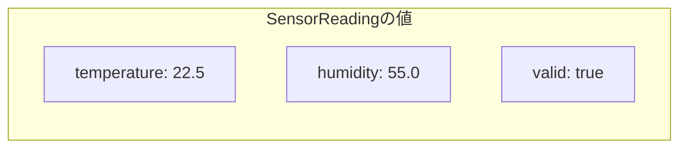

## このページでできるようになること

- 関連するデータをstruct（構造体）にまとめて、ひとつの型として定義できる
- structの値を作り、フィールドを読み書きできる
- structを関数に渡して使える

## 先に結論

structは「関連するデータの集まりに名前を付けたもの」です。温度・湿度・有効フラグのようにいつも一緒に扱う値は、バラバラの変数3個ではなく、structひとつにまとめます。各データには**フィールド名**が付くので、タプルの`.0`や`.1`と違って「何のデータか」がコードを読むだけで分かります。この部でこれから学ぶenum・メソッド・所有権は、すべてstructのような「自分で作った型」を土台に進みます。

## 身近なたとえ

structは、学校で使う「生徒カード」のようなものです。名前・出席番号・身長を別々の紙に書いてバラバラに管理すると、誰の身長か分からなくなります。1枚のカードに項目名付きでまとめれば、「このカードの身長」と迷わず読めます。

ただしたとえと違う点がひとつあります。カードは項目を後から書き足せますが、structの**フィールドの種類と型はコンパイル時に固定**です。定義にないフィールドを後から追加したり、型の違う値を入れたりすることはできません。

## 仕組み

structの定義は「設計図」で、そこから作った値が「実体」です。

```rust
struct SensorReading {
    temperature: f32, // 温度（℃）
    humidity: f32,    // 湿度（%）
    valid: bool,      // 正しく読めたか
}
```

- `struct 型名 { フィールド名: 型, ... }` で定義します
- 型名は大文字始まり（`SensorReading`）、フィールド名は小文字のスネークケース（`temperature`）が慣習です
- 定義しただけではメモリは使いません。値を作った時点で、フィールドがひとまとまりでメモリに置かれます



第2部で学んだタプル`(f32, f32, bool)`でも同じデータは持てます。違いは名前です。`reading.0`では何の値か分かりませんが、`reading.temperature`なら読み間違えません。

## Arduinoではどう書くか

Arduino（C++）にも`struct`はあり、考え方はほぼ同じです。

```cpp
struct SensorReading {
  float temperature;
  float humidity;
  bool valid;
};

SensorReading morning = {22.5, 55.0, true};
```

C++の初期化は「書いた順番」で値を並べます。順番を間違えてもコンパイルが通ってしまうことがあります。Rustはフィールド名を必ず書くので、順番の間違いが起きません。

## Rustではどう書くか

温度センサの測定値をstructにまとめ、関数に渡して表示する例です。Rust Playgroundでそのまま動きます。

```rust
struct SensorReading {
    temperature: f32, // 温度（℃）
    humidity: f32,    // 湿度（%）
    valid: bool,      // 正しく読めたか
}

fn print_reading(reading: &SensorReading) {
    if reading.valid {
        println!("温度 {} ℃ / 湿度 {} %", reading.temperature, reading.humidity);
    } else {
        println!("この測定値は使えません");
    }
}

fn main() {
    let morning = SensorReading {
        temperature: 22.5,
        humidity: 55.0,
        valid: true,
    };

    print_reading(&morning);

    // 一部のフィールドだけ変えて、新しい値を作る
    let noon = SensorReading {
        temperature: 28.0,
        ..morning
    };
    print_reading(&noon);
}
```

## コードを一行ずつ読む

- `let morning = SensorReading { temperature: 22.5, ... }` — 値を作るときは**全フィールドに名前付きで**値を与えます。ひとつでも忘れるとコンパイルエラーです
- `fn print_reading(reading: &SensorReading)` — structを関数に渡しています。`&`は「借りて読むだけ」という印で、詳しくは[9. 借用](/embassy-esp32-c6/part03/09-borrow/)で学びます。ここでは「渡した後も呼び出し側で使い続けられる書き方」と読んでください
- `reading.temperature` — フィールドは`値.フィールド名`で読みます
- `..morning` — **struct更新記法**です。「書いていないフィールドは`morning`と同じ」という意味で、変更点だけを書けます

フィールドを書き換えたいときは、変数を`let mut`で作ります。

```rust
let mut reading = SensorReading { temperature: 22.5, humidity: 55.0, valid: true };
reading.temperature = 30.0; // mutなので変更できる
```

## 実行方法

[Rust Playground](https://play.rust-lang.org/)にコードを貼り付けて「Run」を押します。

```text
温度 22.5 ℃ / 湿度 55 %
温度 28 ℃ / 湿度 55 %
```

`humidity`は両方55のままで、`temperature`だけ変わっていることを確認してください（`55.0`は表示上`55`になります）。

## よくある失敗

### フィールドの書き忘れ（E0063）

```rust
let reading = SensorReading {
    temperature: 22.5,
    humidity: 55.0,
    // validを書き忘れた
};
```

```text
error[E0063]: missing field `valid` in initializer of `SensorReading`
 --> src/main.rs:8:19
  |
8 |     let reading = SensorReading {
  |                   ^^^^^^^^^^^^^ missing `valid`
```

「`valid`が足りない」とそのまま教えてくれています。structは全フィールドが揃って初めて完成、というルールがあるからです。中途半端な値（validが未設定のセンサ値など）を作れないことは、バグを防ぐ仕組みでもあります。

### mutなしで書き換え（E0594）

```rust
let reading = SensorReading { temperature: 22.5, humidity: 55.0, valid: true };
reading.temperature = 30.0; // mutを付けていない
```

```text
error[E0594]: cannot assign to `reading.temperature`, as `reading` is not declared as mutable
help: consider changing this to be mutable
  |
  |     let mut reading = SensorReading { ... };
  |         +++
```

第2部で学んだ通り、変数は既定で変更不可です。structのフィールドも同じで、変数全体が`mut`のときだけ書き換えられます。コンパイラの`help`が修正方法まで示してくれています。

## やってみよう

`SensorReading`に`sensor_id: u8`フィールドを追加してみましょう。追加した瞬間、値を作っている場所すべてがE0063でエラーになります。エラーの場所を順番に直して、`print_reading`で`sensor_id`も表示してください。「フィールドを増やすと直すべき場所をコンパイラが全部教えてくれる」感覚がつかめます。

## 確認問題

1. タプル`(f32, f32, bool)`ではなくstructを使う利点は何ですか。
2. `..morning`という書き方は何をしますか。
3. structのフィールドを書き換えるために必要なことは何ですか。

<details>
<summary>答え</summary>

1. 各データにフィールド名が付くので、コードを読むだけで何のデータか分かる。順番の間違いも起きない。
2. struct更新記法。明示的に書いたフィールド以外を、既存の値（morning）からコピーして新しい値を作る。
3. 変数を`let mut`で宣言する。

</details>

## まとめ

- structは関連データの集まりに名前を付けた型。フィールド名で安全に読み書きできる
- 値を作るときは全フィールドが必須。`..`記法で「変更点だけ」書ける
- 書き換えには`let mut`が必要。既定は変更不可

## 次のページ

structは「AもBもCも持つ」型でした。次は「AかBかCのどれか」を表すenumを学びます。ボタンの状態のような「同時にはひとつしかない」データにぴったりの道具です。

- 前のページ: [10. 配列とタプル](/embassy-esp32-c6/part02/10-array-tuple/)
- 次のページ: [2. enumで選択肢を表す](/embassy-esp32-c6/part03/02-enum/)
