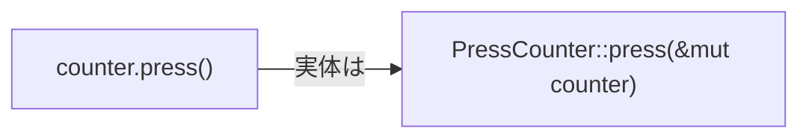

## このページでできるようになること

- implブロックの中にメソッドを定義できる
- `&self`（読むだけ）と`&mut self`（変更する）を使い分けられる
- `値.メソッド()`の呼び出しが何をしているか説明できる

## 先に結論

メソッドは「その型専用の関数」です。structのデータと、そのデータを扱う操作をひとまとめにできます。`counter.press()`のように`値.メソッド名()`で呼び、第1引数の`self`に呼び出した値自身が入ります。selfの受け取り方は主に2種類で、**読むだけなら`&self`、書き換えるなら`&mut self`**です。この区別はただの飾りではなく、「このメソッドは値を変えるのか」がシグネチャを見るだけで分かる、Rustらしい情報になっています。

## 身近なたとえ

メソッドは、機器に付いている「専用ボタン」のようなものです。電子レンジの「あたためボタン」はレンジ本体に付いていて、押せば**そのレンジ自身**が動きます。よそのレンジや冷蔵庫は動きません。`counter.press()`も同じで、操作の対象（self）が`counter`自身だと最初から決まっています。

たとえと違うのは、メソッドが特別な仕組みではないことです。実体はただの関数で、`counter.press()`は「`press(&mut counter)`を見やすく書いたもの」にすぎません。対象を第1引数として渡している、という点は普通の関数と同じです。

## 仕組み

メソッドは`impl 型名 { ... }`というブロックの中に書きます。implはimplementation（実装）の略です。

```rust
struct PressCounter {
    count: u32,
}

impl PressCounter {
    // &self: 読むだけのメソッド
    fn value(&self) -> u32 {
        self.count
    }

    // &mut self: 中身を変えるメソッド
    fn press(&mut self) {
        self.count += 1;
    }
}
```

- `&self`は「自分を読むだけ借りる」、`&mut self`は「自分を書き換える前提で借りる」という宣言です。`&`と`&mut`の意味そのものは[9. 借用](/embassy-esp32-c6/part03/09-borrow/)で詳しく学びます
- メソッドの中では`self.count`のように、`self.`を付けてフィールドへアクセスします
- もうひとつ、`self`（&なし）で「自分を丸ごと受け取る」形もあります。呼び出し後に元の値が使えなくなる特殊な形なので、[8. 所有権](/embassy-esp32-c6/part03/08-ownership/)を学んだ後に意味が分かります



## Rustではどう書くか

ボタンが押された回数を数えるカウンタの例です。第6部で本物のBOOTボタンにつなげる処理の骨組みになります。Rust Playgroundでそのまま動きます。

```rust
struct PressCounter {
    count: u32,
}

impl PressCounter {
    // &self: 読むだけのメソッド
    fn value(&self) -> u32 {
        self.count
    }

    // &mut self: 中身を変えるメソッド
    fn press(&mut self) {
        self.count += 1;
    }

    fn reset(&mut self) {
        self.count = 0;
    }
}

fn main() {
    let mut counter = PressCounter { count: 0 };

    counter.press();
    counter.press();
    counter.press();
    println!("押された回数: {}", counter.value());

    counter.reset();
    println!("リセット後: {}", counter.value());
}
```

## コードを一行ずつ読む

- `impl PressCounter { ... }` — 「ここからPressCounter専用の関数を書きます」という宣言です。structの定義（データ）とimpl（操作）が分かれているのがRustの形です
- `fn value(&self) -> u32` — 読むだけなので`&self`。呼び出し側の値は変わりません
- `fn press(&mut self)` — countを書き換えるので`&mut self`。**`&mut self`のメソッドは、`mut`で宣言した変数からしか呼べません**
- `let mut counter = ...` — pressとresetを呼ぶために`mut`が必要です。逆に言うと、`mut`なしの変数は「valueしか呼べない読み取り専用のカウンタ」になります。変更されたくない値を渡すときの安全装置として働きます
- `counter.press()` — selfは自動で渡されるので、引数リストには書きません

## 実行方法

[Rust Playground](https://play.rust-lang.org/)にコードを貼り付けて「Run」を押します。

```text
押された回数: 3
リセット後: 0
```

## よくある失敗

### mutなしの変数から&mut selfメソッドを呼ぶ（E0596）

```rust
let counter = PressCounter { count: 0 }; // mutを付けていない
counter.press();
```

```text
error[E0596]: cannot borrow `counter` as mutable, as it is not declared as mutable
   |
13 |     counter.press();
   |     ^^^^^^^ cannot borrow as mutable
   |
help: consider changing this to be mutable
   |
12 |     let mut counter = PressCounter { count: 0 };
   |         +++
```

`press`は`&mut self`、つまり「書き換えます」と宣言しているメソッドです。変更不可の変数からは呼べません。この制約のおかげで、「変更しないつもりだった値がメソッド経由でこっそり変わる」事故が起きません。`let mut`にすれば直ります。

### メソッド内でselfを付け忘れる（E0425）

```rust
fn press(&mut self) {
    count += 1; // self.を忘れた
}
```

「cannot find value `count` in this scope」（E0425）になります。フィールドは`self.count`のように必ず`self.`経由でアクセスします。エラーメッセージには`help: you might have meant to use the available field: `self.count``のような提案が出ます。

## やってみよう

`PressCounter`に「押された回数が10回以上ならtrueを返す」メソッド`is_many(&self) -> bool`を追加してみましょう。読むだけのメソッドなので`&self`です。`&mut self`にしても動きますが、「読むだけなのに書き換え宣言をしている」不正確なシグネチャになります。使う側の制約がどう変わるか（mutなし変数から呼べるか）も試してみてください。

## 確認問題

1. `&self`と`&mut self`の使い分けの基準は何ですか。
2. `counter.press()`を普通の関数呼び出しの形で書くとどうなりますか。
3. `let counter = ...`（mutなし）の変数に対して呼べるのは、どんなメソッドですか。

<details>
<summary>答え</summary>

1. メソッドがフィールドを読むだけなら`&self`、書き換えるなら`&mut self`。
2. `PressCounter::press(&mut counter)`。メソッドは第1引数selfを自動で受け取る関数にすぎない。
3. `&self`を取るメソッドだけ。`&mut self`のメソッドはE0596で呼べない。

</details>

## まとめ

- メソッドは`impl 型名 { }`の中に書く、その型専用の関数。`値.メソッド()`で呼ぶ
- 読むだけなら`&self`、書き換えるなら`&mut self`。シグネチャが「変更するかどうか」を語る
- `&mut self`のメソッドは`mut`な変数からしか呼べない。これが意図しない変更を防ぐ

## 次のページ

implブロックには、selfを取らない関数も書けます。`new()`のような「値を作る側」の関数——関連関数を学びます。

- 前のページ: [5. Result — 失敗を型で表す](/embassy-esp32-c6/part03/05-result/)
- 次のページ: [7. implと関連関数](/embassy-esp32-c6/part03/07-impl/)
