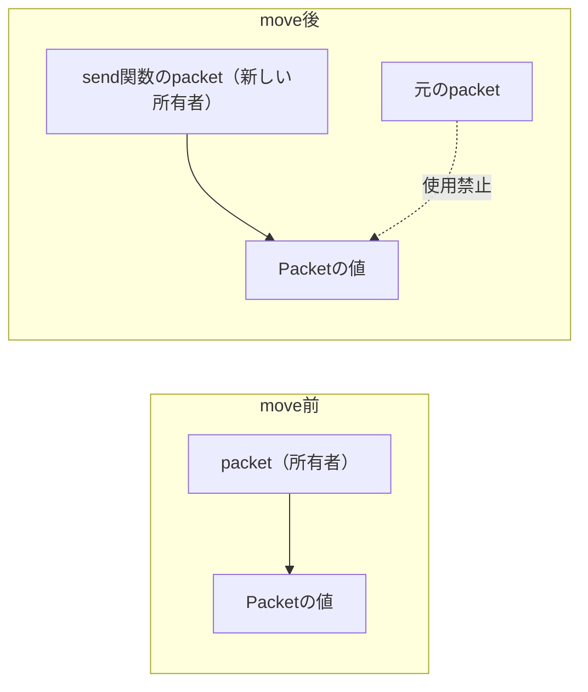

## このページでできるようになること

- 「誰がデータを持つのか」「いつまで存在するのか」という所有権の考え方を説明できる
- 値を渡すと所有権が移る（move）ことと、その後元の変数が使えなくなる理由を説明できる
- E0382（move後の使用）のエラーメッセージを読んで直せる

## 先に結論

記号の話から始める前に、プログラム共通の根本問題から考えます。メモリ上のデータには、必ず3つの問いがついて回ります。**誰がこのデータを持っているのか。いつまで存在するのか。誰が一時的に使ってよいのか。** C/C++ではこの3つをプログラマが頭の中で管理し、間違えると「もう存在しないデータを読む」バグ（実行するまで気づけず、症状も不安定）になります。Rustはこの管理をルール化しました。**すべての値には持ち主（所有者）となる変数がちょうど1つあり、持ち主がスコープを抜けたら値は片付けられ、値を別の変数や関数に渡すと持ち主が移る**。持ち主の移動をmove（ムーブ）と呼びます。ルール違反はすべてコンパイルエラーになるので、「もう存在しないデータを読む」バグは実行前に消えます。

## 身近なたとえ

所有権は、図書室の本の「貸出カード」に近い仕組みです。どの本にも借りている人がちょうど1人記録されていて、責任者が常に明確です。本を友だちに譲れば（move）、カードの名前は友だちに書き換わり、あなたはもうその本の責任者ではありません。「返す責任」も一緒に移ります。

たとえと違う点が2つあります。第一に、Rustの「片付け」は返却ではなく**メモリの解放**で、持ち主がスコープを抜けた瞬間に自動で起きます。解放を忘れることも、二重に解放することもありません。第二に、この管理は実行中に誰かが台帳を見て行うのではなく、**コンパイル時にすべて確定**します。実行時のコストはゼロです。

## 仕組み

冒頭の3つの問いに、Rustの規則を対応させます。

| 問い | Rustの規則 |
|---|---|
| 誰が持つのか | 値の所有者となる変数はちょうど1つ |
| いつまで存在するのか | 所有者がスコープを抜けるまで。抜けた時点で自動で片付く |
| 誰が一時的に使うのか | 借用（次のページ）。所有権を移さず参照だけ渡す |

「渡すと持ち主が移る」を図にすると、こうなります。



move後の元の変数は「もう持ち主ではない」ので、コンパイラが使用を禁止します。値が2か所から同時に管理される状態を作らないためです。

なお`u32`や`bool`のような小さな型は例外で、渡すときに中身が**コピー**されます（Copy型と呼びます）。コピーなら元の変数も持ち主のままなので、渡した後も使えます。第2部で数値を自由に渡せていたのはこのためです。

## Rustではどう書くか

通信で送るパケットを関数に渡す例です。Rust Playgroundでそのまま動きます。

```rust
struct Packet {
    payload: [u8; 4],
    len: usize,
}

// Packetを「値ごと」受け取る = 所有権が移る
fn send(packet: Packet) {
    println!("{}バイト送信: {:?}", packet.len, &packet.payload[..packet.len]);
    // この関数が終わると、packetはここで片付けられる
}

fn main() {
    let packet = Packet {
        payload: [0x01, 0x02, 0x03, 0x00],
        len: 3,
    };

    send(packet); // 所有権がsendへ移る（move）

    // ここでpacketはもう使えない
    // println!("{}", packet.len); // ←コメントを外すとE0382

    // u32のようなコピーが軽い型は、moveではなくコピーされる
    let a: u32 = 10;
    let b = a; // aの中身がコピーされる
    println!("a = {}, b = {}", a, b); // 両方使える
}
```

## コードを一行ずつ読む

- `fn send(packet: Packet)` — 引数が`Packet`（`&`なし）なので、「値ごと受け取る＝所有権をもらう」宣言です。呼んだ側は値を手放します
- `send(packet);` — ここでmoveが起きます。以降、mainの`packet`は「初期化されていない変数」と同じ扱いになります
- `&packet.payload[..packet.len]` — 配列の先頭から`len`バイトだけを見るスライスです（第2部の配列の応用）
- `let b = a;` — `u32`はCopy型なので、moveではなくコピーです。`a`も`b`も独立した持ち主として使えます。structは、明示的に指定しない限りCopyになりません

`send`のように「受け取った値をそのまま消費して終わる」関数では、所有権をもらう設計は自然です。一方「中身を読みたいだけ」の関数が所有権まで奪うのはやり過ぎで、その解決策が次のページの借用です。

## 実行方法

[Rust Playground](https://play.rust-lang.org/)にコードを貼り付けて「Run」を押します。

```text
3バイト送信: [1, 2, 3]
a = 10, b = 10
```

## よくある失敗

### moveした後に使う（E0382）

コメントを外して実行してみてください。これがこの部で一番大事なエラーです。

```text
error[E0382]: borrow of moved value: `packet`
   |
11 |     let packet = Packet {
   |         ------ move occurs because `packet` has type `Packet`,
   |                which does not implement the `Copy` trait
...
15 |     send(packet);
   |          ------ value moved here
16 |     println!("{}", packet.len);
   |                    ^^^^^^^^^^ value borrowed here after move
   |
note: consider changing this parameter type in function `send` to borrow
      instead if owning the value isn't necessary
```

読み方を順番に見ます。

1. 1行目: 「moveされた値`packet`を使おうとした」——何が起きたかの要約
2. `move occurs because ...` — moveになった理由。「`Packet`はCopyではないから」
3. `value moved here` — **どこでmoveしたか**（`send(packet)`の行）
4. `value borrowed here after move` — **どこで使ってしまったか**
5. `note:` — 直し方の提案。「所有する必要がないなら、関数の引数を借用（`&Packet`）に変えては」

エラーは「moveの場所」と「使った場所」を両方指してくれるので、たどれば必ず原因が分かります。直し方は主に3つです。(1) 提案通り`send(&Packet)`にして借用で渡す（次のページ）、(2) 使う処理をsendより前に移す、(3) 本当に両方に値が必要なら複製する。

### ループの中でmoveする（E0382の変種）

```rust
for _ in 0..3 {
    send(packet); // 2周目でエラー
}
```

「value moved here, in previous iteration of loop」というE0382になります。1周目でmoveしてしまうと、2周目には持ち主がいないからです。ループ内で繰り返し使うものは、所有権を渡さず借用で渡す設計にします。

## やってみよう

`send(packet)`を2回続けて呼び、E0382のメッセージから「どこでmoveし、どこで使ったか」を自分で指差して読んでみましょう。そのあと`send`の引数を`&Packet`に、呼び出しを`send(&packet)`に変えると2回呼べるようになることを確かめてください（`&`の意味は次のページで説明します）。

## 確認問題

1. 所有権の3つの基本規則を「持ち主」という言葉を使って説明してください。
2. moveの後に元の変数が使えないのはなぜですか。
3. `let b = a;`で、`a`が`u32`のときとstructのときで挙動が違うのはなぜですか。

<details>
<summary>答え</summary>

1. どの値にも持ち主の変数がちょうど1つある。持ち主がスコープを抜けると値は自動で片付けられる。値を渡すと持ち主が移る（move）。
2. 持ち主が移った後の変数から値を使えると、値が2か所から管理され、片付けの二重実行や「片付けた後に読む」バグの原因になるから。コンパイラがこれを禁止する。
3. `u32`はCopy型なので中身がコピーされ、両方が持ち主として残る。structは既定でCopyではないので、moveになり元の変数は使えなくなる。

</details>

## まとめ

- データには「誰が持つか」「いつまで存在するか」「誰が一時的に使うか」の3つの問いがあり、Rustはこれをコンパイル時に検査する
- 値の持ち主はちょうど1つ。渡すと持ち主が移る（move）。移った後の変数は使えない（E0382）
- E0382は「moveの場所」と「使った場所」の両方を指す。エラーメッセージ自体が地図になっている

## 次のページ

「読みたいだけなのに所有権を渡すのはやり過ぎ」——その答えが借用です。3つ目の問い「誰が一時的に使うのか」に、`&`と`&mut`の規則で答えます。

- 前のページ: [7. implと関連関数](/embassy-esp32-c6/part03/07-impl/)
- 次のページ: [9. 借用 — 貸し借りの規則](/embassy-esp32-c6/part03/09-borrow/)
