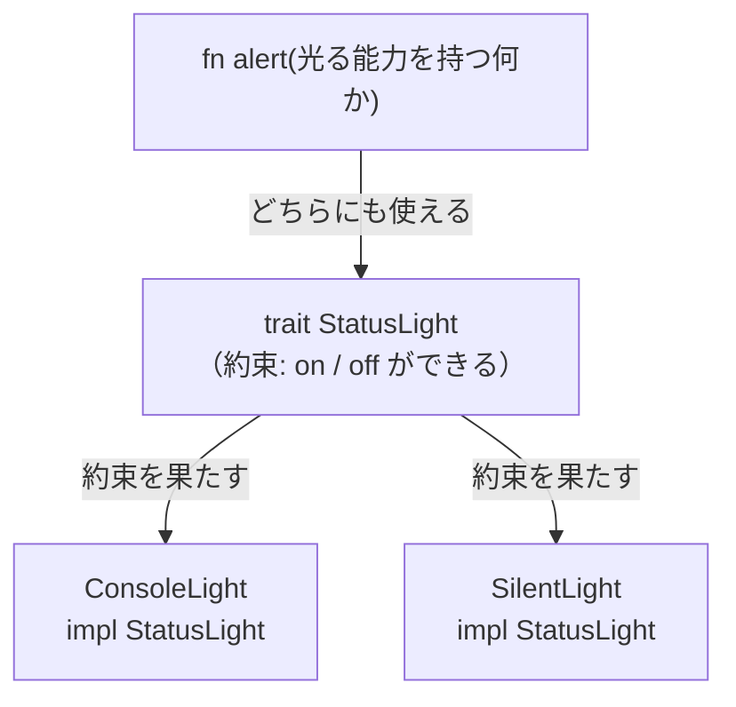

## このページでできるようになること

- traitを「共通の能力の約束」として説明できる
- 自分でtraitを定義し、複数の型に実装できる
- traitを引数の条件（トレイト境界）に使った関数を書ける
- embedded-halの `OutputPin` が何を約束しているか読める

## 先に結論

**trait（トレイト）** は「この能力を持つ型は、これらのメソッドを必ず持つ」という**約束の定義**です。型ごとに `impl トレイト名 for 型名` で約束を果たす実装を書きます。関数の引数を「〜という能力を持つ型なら何でもよい」と書けるようになるのが最大の効果です。組み込みRustの世界では、embedded-halというcrateが `OutputPin`（出力ピンの能力）などのtraitを定めており、**どのメーカーのチップでも同じ約束でドライバを書ける**仕組みの土台になっています。

## 身近なたとえ

「運転免許」を考えてください。免許は「この人はアクセル・ブレーキ・ハンドルの操作ができる」という**能力の証明**です。タクシー会社が運転手を募集するとき、「田中さん限定」ではなく「普通免許を持つ人なら誰でも」と書けます。人（型）は違っても、免許（trait）が同じなら同じ仕事を任せられます。

実際の技術との違いを一言添えると、traitの「約束」はコンパイラが**強制的に検査**します。免許のペーパードライバーのように「持っているけど実はできない」は起こりません。メソッドを1つでも実装し忘れるとコンパイルエラーになります。

## 仕組み

traitの定義と実装は3点セットで覚えます。

1. **定義** — `trait 名前 { 必要なメソッドの一覧 }`
2. **実装** — `impl 名前 for 型 { メソッドの中身 }`
3. **利用** — `fn f<T: 名前>(x: &mut T)` のように「この能力を持つ型なら何でも」と書く



## RustとEmbassyではどう書くか

「状態を知らせるライト」というtraitを作り、2つの型に実装してみます。Playgroundで動く完全なコードです。

```rust
trait StatusLight {
    fn on(&mut self);
    fn off(&mut self);

    // デフォルト実装
    fn blink_once(&mut self) {
        self.on();
        self.off();
    }
}

struct ConsoleLight;

impl StatusLight for ConsoleLight {
    fn on(&mut self) {
        println!("LED ON");
    }
    fn off(&mut self) {
        println!("LED OFF");
    }
}

struct SilentLight {
    is_on: bool,
}

impl StatusLight for SilentLight {
    fn on(&mut self) {
        self.is_on = true;
    }
    fn off(&mut self) {
        self.is_on = false;
    }
}

// traitを引数の条件にとる関数
fn alert<L: StatusLight>(light: &mut L) {
    for _ in 0..3 {
        light.blink_once();
    }
}

fn main() {
    let mut c = ConsoleLight;
    alert(&mut c);

    let mut s = SilentLight { is_on: false };
    alert(&mut s);
    println!("SilentLight is_on = {}", s.is_on);
}
```

## コードを一行ずつ読む

- `trait StatusLight { fn on(&mut self); ... }` — メソッドの**シグネチャ（名前と引数と戻り値）だけ**を書き、中身は書きません。「onとoffができること」という約束の条文です。
- `fn blink_once(&mut self) { ... }` — 中身まで書いたメソッドは**デフォルト実装**です。実装側は書かなくてもこの中身をもらえます。onとoffさえあればblinkは組み立てられるからです。
- `impl StatusLight for ConsoleLight` — 「ConsoleLightはStatusLightの約束を果たします」という宣言です。`on` と `off` を書き忘れると `not all trait items implemented` エラーになります。
- `fn alert<L: StatusLight>(light: &mut L)` — `L: StatusLight` が**トレイト境界**です。「Lは何の型でもよいが、StatusLightの約束を果たしていること」と読みます。alertはConsoleLightのこともSilentLightのことも知りませんが、約束されたメソッドだけを使うので安全です。

## 本物の例 — embedded-halのOutputPin

第5部・第6部で使うembedded-hal 1.0には、まさにこの形のtraitが定義されています（これは抜粋です。完全な定義は[公式ドキュメント](https://docs.rs/embedded-hal/1.0.0/embedded_hal/digital/trait.OutputPin.html)を見てください）。

```rust
pub trait OutputPin: ErrorType {
    fn set_low(&mut self) -> Result<(), Self::Error>;
    fn set_high(&mut self) -> Result<(), Self::Error>;
}
```

「出力ピンの能力とは、HighにできてLowにできること」という約束です。esp-halの `Output` 型はこの約束を実装しています。他社チップ（STM32やRP2350など）のHALも同じ約束を実装しています。

だから、こう書いたドライバは**どのチップでも動きます**。

```rust
use embedded_hal::digital::OutputPin;

struct Alarm<P: OutputPin> {
    pin: P,
}

impl<P: OutputPin> Alarm<P> {
    fn new(pin: P) -> Self {
        Alarm { pin }
    }

    fn ring(&mut self) -> Result<(), P::Error> {
        self.pin.set_high()
    }
}
```

`Alarm` は「set_highできる何か」しか要求していません。crates.ioにある多くのセンサ・表示器ドライバがこの方式で書かれているため、チップを乗り換えてもドライバを書き直さずに済みます。これがtraitの実用上の最大の恩恵です（仕組みの詳細は[第5部10ページ](/embassy-esp32-c6/part05/10-embedded-hal/)で扱います）。

`Self::Error` という見慣れない書き方は次々ページ（関連型）で説明します。今は「失敗の種類もピンごとに約束されている」とだけ捉えてください。

## ジェネリクスとdyn Traitの違い（軽く）

`fn alert<L: StatusLight>` は**コンパイル時**に型が決まる書き方です。もう1つ、`&dyn StatusLight` という**実行時**に切り替える書き方もあります。速度と引き換えに「違う型を1つの配列に混ぜる」ことができます。使い分けは次ページのジェネリクスで扱います。今は「traitの使い方には2通りある」とだけ覚えれば十分です。

## 実行方法

Rust Playground に最初のコードを貼り付けて Run します。

```text
LED ON
LED OFF
LED ON
LED OFF
LED ON
LED OFF
SilentLight is_on = false
```

ConsoleLightは画面に出力し、SilentLightは黙って変数を変えるだけ。同じ `alert` 関数が両方に働いたことが分かります（最後がfalseなのは、blinkの最後にoffするためです）。

## よくある失敗

**1. traitをuseし忘れてメソッドが呼べない**

embedded-halのようなcrateのtraitは、`use embedded_hal::digital::OutputPin;` のように**traitそのものをuseしていないと、メソッドが見えません**。`no method named 'set_high' found` と言われたら、まずtraitのuse忘れを疑ってください。traitのメソッドは、その約束が「見えている」場所でしか使えないという規則があるためです。

**2. 約束にないメソッドを呼ぼうとする**

`fn alert<L: StatusLight>` の中で `light.is_on` に触ろうとするとエラーになります。alertが知っているのは「StatusLightの約束」だけで、SilentLight固有のフィールドは約束に含まれないからです。必要なら約束（trait）側にメソッドを足します。

## やってみよう

`StatusLight` に `fn sos(&mut self)` というデフォルト実装を追加してみましょう。中身は `blink_once` を3回呼ぶだけで構いません。`main` で `c.sos();` を呼んで、点滅が増えれば成功です。ConsoleLightとSilentLightには**一切手を加えずに**新しい能力が増えることを確認してください。

## 確認問題

1. traitの定義に書くのは、メソッドの何ですか？
2. `fn f<T: OutputPin>(pin: &mut T)` の `T: OutputPin` はどう読みますか？
3. embedded-halがtraitとして `OutputPin` を定義していることの実用上の利点は何ですか？

<details>
<summary>答え</summary>

1. シグネチャ（名前・引数・戻り値）です。デフォルト実装を持つメソッドは中身も書けます。
2. 「Tは、OutputPinの約束を実装している型なら何でもよい」です。
3. ドライバを特定チップ向けではなく「約束」に対して書けるため、同じドライバがesp-halでも他社HALでも使い回せることです。
</details>

## まとめ

- traitは「この能力を持つ型はこれらのメソッドを持つ」という約束。実装漏れはコンパイルエラーになる
- `fn f<T: トレイト名>` で「約束を果たす型なら何でも受け取る」関数が書ける
- embedded-halの `OutputPin` はこの仕組みの実例で、チップを跨いだドライバの使い回しを可能にしている

## 次のページ

`<T: StatusLight>` の `<T>` の部分、つまりジェネリクスそのものを正面から学びます。dyn Traitとの使い分けもここで整理します。

[6. generics](/embassy-esp32-c6/part04/06-generics/)

---

前のページ: [4. crateと依存関係](/embassy-esp32-c6/part04/04-crate/)
