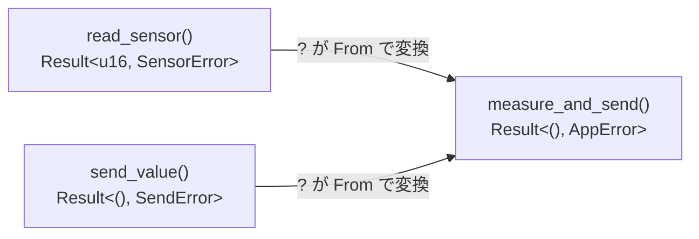

## このページでできるようになること

- プログラム全体のエラーをenumで設計できる
- `From` を実装して `?` に変換を任せられる
- `unwrap` を使ってよい場面・いけない場面を判断できる

## 先に結論

プログラムが大きくなると、モジュールごとに違うエラー型が返ってきます。定石は、**アプリ全体のエラーenumを1つ作り、各エラーをその選択肢として包む**ことです。`From` traitを実装しておくと、`?` 演算子が下位のエラーを上位のエラーへ**自動変換**してくれるため、処理の本流がきれいに保てます。`unwrap` は「失敗が設計上ありえない場面」に限定し、そう言える理由をコメントで書きます。

## 身近なたとえ

保健室の記録を考えてください。教室で起きたけが、体育で起きたけが、原因はさまざまですが、保健室に届く時点で「けがの記録カード」という**共通の書式**に包まれます。カードには「どこで何が起きたか」の元情報がそのまま入っています。

実際の技術との違いを一言添えると、Rustのエラー変換は人が書き写すのではなく、`From` の実装に従って**コンパイラが変換コードを差し込みます**。書式への詰め替えミス（情報の紛失）は起こりません。元のエラーは値としてそのまま中に保持されます。

## 仕組み

第3部5ページで学んだ `?` は「Errならその場でreturnする」演算子でした。実はもう1つ仕事をしています。

> `?` はErrを返すとき、必要なら `From::from` で**呼び出し元の関数のエラー型に変換してから**返す。

つまり `From<下位エラー> for 上位エラー` を実装しておけば、型の違うエラーが混ざる関数でも `?` を並べるだけで済みます。



## RustとEmbassyではどう書くか

ボタン端末を意識した例です。センサ読み取りと送信、2種類の失敗を1つのAppErrorに束ねます。Playgroundで動く完全なコードで、String・Vec・Boxを使わないので**そのままno_stdでも通用する形**です（no_stdは[第5部1ページ](/embassy-esp32-c6/part05/01-no-std/)で扱います）。

```rust
// 下位のエラー（別モジュールやクレートが返す想定）
#[derive(Debug)]
enum SensorError {
    NotReady,
    OutOfRange(u16),
}

#[derive(Debug)]
enum SendError {
    NoLink,
    Timeout,
}

// アプリ全体のエラー
#[derive(Debug)]
enum AppError {
    Sensor(SensorError),
    Send(SendError),
}

impl From<SensorError> for AppError {
    fn from(e: SensorError) -> Self {
        AppError::Sensor(e)
    }
}

impl From<SendError> for AppError {
    fn from(e: SendError) -> Self {
        AppError::Send(e)
    }
}

fn read_sensor(raw: u16) -> Result<u16, SensorError> {
    if raw > 4095 {
        return Err(SensorError::OutOfRange(raw));
    }
    Ok(raw)
}

fn send_value(v: u16, linked: bool) -> Result<(), SendError> {
    if !linked {
        return Err(SendError::NoLink);
    }
    println!("送信: {v}");
    Ok(())
}

// ?が From を使って SensorError / SendError を AppError に変換する
fn measure_and_send(raw: u16, linked: bool) -> Result<(), AppError> {
    let v = read_sensor(raw)?;
    send_value(v, linked)?;
    Ok(())
}

fn main() {
    match measure_and_send(9999, true) {
        Ok(()) => println!("成功"),
        Err(e) => println!("失敗: {e:?}"),
    }
}
```

## コードを一行ずつ読む

- `enum AppError { Sensor(SensorError), Send(SendError) }` — 下位エラーを**そのまま中に入れて**包みます。情報を捨てずに種類だけ束ねるのがポイントです。
- `impl From<SensorError> for AppError` — 「SensorErrorからAppErrorへの変換方法」の定義です。これがあると `?` が黙って変換してくれます。
- `let v = read_sensor(raw)?;` — read_sensorの失敗はSensorError型ですが、この関数の戻りはAppError型です。`?` が `AppError::from(e)` を挟んでくれるので、型の違いを気にせず書けます。
- `measure_and_send` の本文 — エラー処理コードが1行もないのに、2種類の失敗がすべて正しく上へ伝わります。**本流のロジックが縦にまっすぐ読める**のがこの設計の狙いです。

## unwrapとの使い分け

`unwrap` は「Errだったらパニック（強制停止）する」ため、組み込みでは端末が黙って止まることを意味します（詳細は[第5部7ページ](/embassy-esp32-c6/part05/07-panic/)）。使い分けの目安です。

| 場面 | 使うもの | 理由 |
|---|---|---|
| 起動直後の初期化（ペリフェラル取得など） | `unwrap` 可 | 失敗したら続行不能。早く大きく壊れた方が気づける。理由をコメントで書く |
| 実行中に起こりうる失敗（通信・センサ） | `Result` + `?` | 失敗してもリトライや縮退運転で動き続けたい |
| 「ありえない」と自分が思っているだけの場面 | `Result` か `match` | 思い込みは実機でよく裏切られる |

## 実行方法

Rust Playground に貼り付けて Run します。`main` の呼び出しを3パターン試すと分かりやすいです。

```text
measure_and_send(1000, true)  → 送信: 1000 / 成功
measure_and_send(9999, true)  → 失敗: Sensor(OutOfRange(9999))
measure_and_send(1000, false) → 失敗: Send(NoLink)
```

失敗表示に**どこの何が悪いか**まで残っていることを確認してください。

## よくある失敗

**1. Fromを書かずに?を使う**

```text
error[E0277]: `?` couldn't convert the error to `AppError`
```

`?` は魔法ではなく、`From` 実装を探して使っているだけです。このエラーが出たら「変換の道」がまだ無いという意味なので、`impl From<下位> for 上位` を書き足します。

**2. エラーを文字列にしてしまう**

`Err("センサがおかしい")` のような文字列エラーは、matchで分岐できず、リトライすべきか諦めるべきかをコードで判断できません。さらに組み込み（no_std）では動的な文字列型自体が使えません。**エラーはenumで種類として設計する**のが、部を通じての方針です。

## やってみよう

`SendError` に `Busy` という選択肢を追加し、`send_value` に「`v == 0` ならBusyを返す」条件を足してみましょう。`measure_and_send(0, true)` で `失敗: Send(Busy)` が出れば成功です。AppError側は**一切変更不要**であることを確認してください。

## 確認問題

1. `?` がエラーを返すとき、型が合わない場合に何を使って変換しますか？
2. アプリ全体のエラーをenumで束ねる利点を2つ挙げてください。
3. `unwrap` を使ってよいのはどんな場面ですか？

<details>
<summary>答え</summary>

1. `From` traitの実装（`From::from`）です。
2. 例: 下位の情報を失わずに1つの型で扱える。matchで失敗の種類ごとに対処（リトライ/縮退/停止）を書き分けられる。関数の戻り値の型が1つに定まり `?` で連鎖できる。
3. 失敗が設計上ありえない、または失敗したら続行する意味がない場面（起動時の初期化など）です。その理由をコメントに残します。
</details>

## まとめ

- アプリ全体のエラーenumを作り、下位エラーを選択肢として包む
- `From` を実装すれば `?` が変換までやってくれて、本流がまっすぐ読める
- `unwrap` は初期化などに限定し、理由をコメントで書く

## 次のページ

enumのもう1つの強力な使い道、**状態機械**です。ボタン端末の「待機中・送信中・エラー」をenumで安全に設計します。

[9. 状態機械](/embassy-esp32-c6/part04/09-state-machine/)

---

前のページ: [7. associated typeの入門](/embassy-esp32-c6/part04/07-associated-type/)
