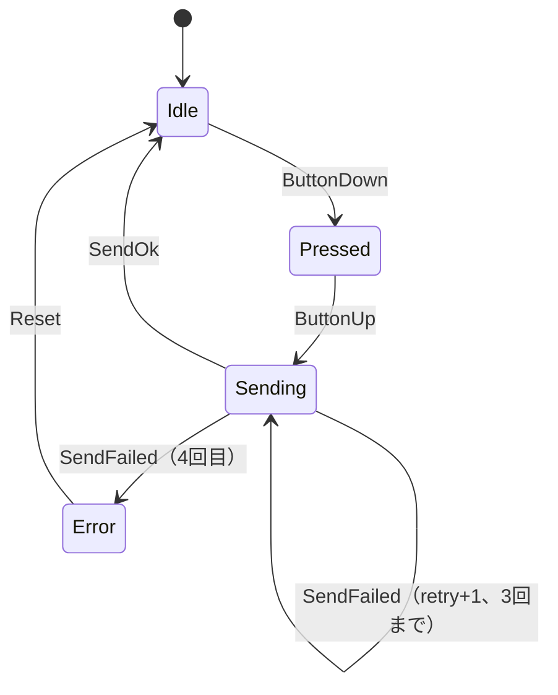

## このページでできるようになること

- 状態機械（state machine）という設計を説明できる
- 状態をenum、きっかけをenum、遷移を1つの関数として書ける
- 「ありえない状態」を型で作れなくする発想が分かる

## 先に結論

**状態機械**とは、プログラムを「今どの状態か」と「何が起きたら次のどの状態へ移るか」の表として設計する方法です。Rustでは状態を `enum State`、きっかけ（イベント）を `enum Event`、遷移を `fn next_state(State, Event) -> State` の1関数に書くのが定石です。boolフラグを何個も並べる設計と違い、**ありえない組み合わせがそもそも作れず**、matchの網羅性チェックが遷移の書き忘れを検出してくれます。この設計は第12部の最終プロジェクト（無線ボタン端末）の背骨になります。

## 身近なたとえ

信号機を考えてください。信号は「青・黄・赤」の**どれか1つ**の状態にしかなりません。「青と赤が同時」はありえません。そして「青→黄→赤→青」という移り方の規則が決まっていて、青からいきなり赤には飛びません。

実際の技術との違いを一言添えると、現実の信号機は故障で全消灯することがありますが、Rustのenumで書いた状態機械は「どの選択肢でもない状態」を**言語仕様として作れません**。守られ方が物理的な機械より強い、という点が違います。

## 仕組み

この教材の最終目標「無線ボタン端末」の中心部を状態機械にします。



図の丸が `State`、矢印のラベルが `Event` です。設計の作業は「この図を描くこと」で、コードは図の写しにすぎません。

boolフラグでこれを書こうとすると `is_pressed`、`is_sending`、`has_error` の3つで8通りの組み合わせができてしまい、「送信中かつエラー」のような**意図しない組み合わせ**の処理を全部考える羽目になります。enumなら状態は最初から4つだけです。

## RustとEmbassyではどう書くか

Playgroundで動く完全なコードです。

```rust
// ボタン端末の状態
#[derive(Debug, Clone, Copy, PartialEq)]
enum State {
    Idle,
    Pressed,
    Sending { retry: u8 },
    Error,
}

// 状態を変えるきっかけ
#[derive(Debug, Clone, Copy)]
enum Event {
    ButtonDown,
    ButtonUp,
    SendOk,
    SendFailed,
    Reset,
}

// 「今の状態」と「起きたこと」から「次の状態」を決める
fn next_state(state: State, event: Event) -> State {
    match (state, event) {
        (State::Idle, Event::ButtonDown) => State::Pressed,
        (State::Pressed, Event::ButtonUp) => State::Sending { retry: 0 },
        (State::Sending { .. }, Event::SendOk) => State::Idle,
        (State::Sending { retry }, Event::SendFailed) => {
            if retry < 3 {
                State::Sending { retry: retry + 1 }
            } else {
                State::Error
            }
        }
        (State::Error, Event::Reset) => State::Idle,
        // それ以外の組み合わせでは状態を変えない
        (s, _) => s,
    }
}

fn main() {
    let mut state = State::Idle;
    let events = [
        Event::ButtonDown,
        Event::ButtonUp,
        Event::SendOk,
        Event::ButtonDown,
        Event::ButtonUp,
        Event::SendFailed,
        Event::SendFailed,
        Event::SendFailed,
        Event::SendFailed,
        Event::Reset,
    ];
    for e in events {
        let next = next_state(state, e);
        println!("{state:?} --{e:?}--> {next:?}");
        state = next;
    }
}
```

## コードを一行ずつ読む

- `Sending { retry: u8 }` — 状態に**データを持たせられる**のがRustのenumの強みです（第3部2ページの復習）。リトライ回数は送信中にしか意味がない値なので、Sendingの中に置きます。Idleのときに `retry` を読む、というバグはコンパイル時に不可能になります。
- `match (state, event)` — 状態とイベントの**組**でmatchします。遷移表の1行が、matchの1アームに対応します。
- `(State::Sending { .. }, Event::SendOk)` — `..` は「中のデータは何でもよい」という書き方です。成功したらretry回数は関係なくIdleへ戻ります。
- `(s, _) => s` — 表にない組み合わせ（IdleでSendOkが来た等）は「何もしない」。この1行を**意識的に**書くのが大事です。書かなければコンパイラが「この組み合わせが未処理」と教えてくれるので、遷移の考え漏れを潰してから最後に足します。

## 実行方法

Rust Playground に貼り付けて Run します。

```text
Idle --ButtonDown--> Pressed
Pressed --ButtonUp--> Sending { retry: 0 }
Sending { retry: 0 } --SendOk--> Idle
Idle --ButtonDown--> Pressed
Pressed --ButtonUp--> Sending { retry: 0 }
Sending { retry: 0 } --SendFailed--> Sending { retry: 1 }
Sending { retry: 1 } --SendFailed--> Sending { retry: 2 }
Sending { retry: 2 } --SendFailed--> Sending { retry: 3 }
Sending { retry: 3 } --SendFailed--> Error
Error --Reset--> Idle
```

1回目の押下は送信成功でIdleへ、2回目は4連続失敗でErrorへ落ち、ResetでIdleに復帰する流れが読み取れます。

## よくある失敗

**1. 最初から `(s, _) => s` を書いてしまう**

包括アーム（catch-all）を先に書くと、matchの網羅性チェックが働かなくなり、「Pressedのままボタンが離されないケース」のような考え漏れに気づけません。まず表にある遷移だけを書き、コンパイラのエラー `non-exhaustive patterns` に**残りの組み合わせを列挙させてから**、最後に包括アームを足す順番が安全です。

**2. 状態の外に関連データを置く**

`retry` を `State` の外の変数にすると、「Idleに戻ったのにretryが3のまま」のような**リセット忘れ**が起きます。データをそれが意味を持つ状態の中に入れておけば、`Sending { retry: 0 }` を作った瞬間に必ず初期化されます。

## やってみよう

`Pressed` 状態に「押されたまま離されなかったら諦める」遷移を足してみましょう。`Event::Timeout` を追加し、`(State::Pressed, Event::Timeout) => State::Idle` の1アームを書くだけです。イベント列にTimeoutを混ぜて動きを確認してください。

## 確認問題

1. boolフラグ3つの設計と比べて、enumの状態機械は何が安全ですか？
2. `retry` を `Sending` の中に持たせる利点は何ですか？
3. 包括アーム `(s, _) => s` を最後に書くべき理由は何ですか？

<details>
<summary>答え</summary>

1. ありえない状態の組み合わせ（例: 送信中かつエラー）がそもそも作れません。状態は常にどれか1つです。
2. retryが意味を持つ間しか存在せず、Sendingに入るたびに必ず初期化されます。リセット忘れが構造的に起きません。
3. 先に書くと網羅性チェックが働かず、遷移の考え漏れをコンパイラに指摘してもらえなくなるためです。
</details>

## まとめ

- 状態機械は「状態のenum + イベントのenum + 遷移関数1つ」で書く
- 状態に紐づくデータはenumの中に持たせ、ありえない状態を型で排除する
- 包括アームは最後。まず網羅性チェックに考え漏れを見つけさせる

## 次のページ

第4部の締めくくりとして、ここまで学んだstruct・trait・Option・Result・ジェネリクスを、C++の対応する仕組みと突き合わせます。どちらが優れているかではなく、**何と何が対応し、何が違うのか**を整理します。

[10. C++との設計比較](/embassy-esp32-c6/part04/10-cpp-comparison/)

---

前のページ: [8. エラー設計](/embassy-esp32-c6/part04/08-error-design/)
