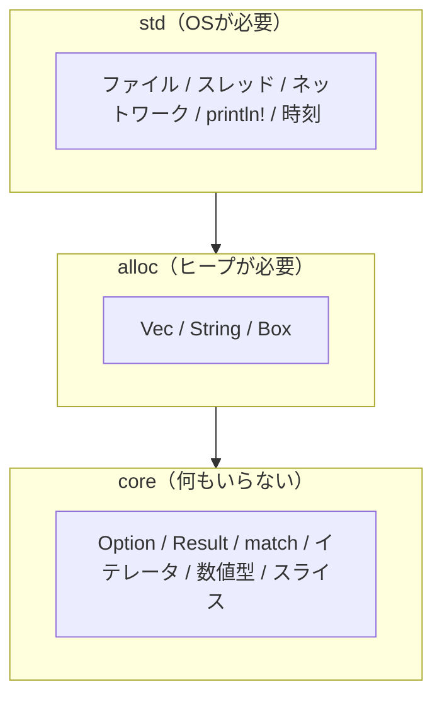

## このページでできるようになること

- `#![no_std]` が「何を捨てて、何を残す」宣言なのかを説明できる
- Rustの標準ライブラリが `core` / `alloc` / `std` の3層でできていることを説明できる
- ESP32でRustを使う2つの道（ESP-IDF系とno_std系）の違いを説明できる
- blinkyの先頭2行 `#![no_std]` `#![no_main]` の意味を説明できる

## 先に結論

`#![no_std]` は「OSの助けを借りずに動きます」という宣言です。Rustの標準ライブラリ `std` には、ファイル・スレッド・ネットワークなど、OSがあることを前提にした機能が含まれています。マイコンにはOSがないので、その部分は使えません。代わりに、OSがなくても動く中核部分 `core` だけを使います。`Option` や `Result`、`match`、イテレータなど、これまで学んだRustの大部分は `core` に入っているので、そのまま使えます。

## 身近なたとえ

`std` を使うプログラミングは、設備の整ったキッチンでの料理に似ています。水道をひねれば水が出て、ガスも冷蔵庫もあります。`no_std` は、キャンプ場での料理です。水道も冷蔵庫もないので、必要な道具は全部自分で持ち込みます。ただし、料理の腕前（Rustの文法や型の知識）はどちらでも同じように役立ちます。

ただし実際の `no_std` は「不便になる」だけの話ではありません。OSという仲介者がいない分、プログラムがハードウェアを直接、確実に制御できるようになります。マイコンではこちらのほうが望ましいのです。

## 仕組み

### Rustの標準ライブラリは3層構造

Rustの「標準ライブラリ」は、実はひとつの塊ではなく、3つの層に分かれています。



| 層 | 必要なもの | 入っているもの（例） | マイコンで使えるか |
|---|---|---|---|
| `core` | なし | `Option`、`Result`、`match`、`for`、配列、スライス、イテレータ | 使える（常に） |
| `alloc` | ヒープ（動的メモリ） | `Vec`、`String`、`Box` | 条件付き（アロケータを自分で用意した場合のみ。第5部5ページ参照） |
| `std` | OS | ファイル、スレッド、TCPソケット、`println!` | 使えない |

`std` は「`core` + `alloc` + OS機能」の詰め合わせです。`#![no_std]` と書くと、コンパイラは `std` を自動で読み込むのをやめ、`core` だけを前提にします。

### 「OSがない」とはどういうことか

第1部で見たように、パソコンではOS（WindowsやmacOS）がプログラムとハードウェアの間に立ちます。ファイルを開くのも、画面に文字を出すのも、実際の仕事はOSがやっています。`std` の関数の多くは、内部でOSに仕事を頼んでいるだけです。

ESP32-C6には（この教材の構成では）OSがいません。電源が入ると、あなたのプログラムがチップ上で動く唯一のプログラムになります。頼れる相手がいない代わりに、すべてを自分で決められます。

- `println!` の代わりに → `esp-println` がシリアル出力を直接たたく
- スレッドの代わりに → Embassyのtask（第9部）
- 時刻の代わりに → ハードウェアタイマー（`embassy-time`、第6部）

### ESP32のRustには2つの道がある

ESP32系チップでRustを使う方法は、大きく2系統あります。混同しやすいので、ここではっきり区別しておきます。

| | ESP-IDF系（std） | no_std系（本教材はこちら） |
|---|---|---|
| 土台 | ESP-IDF（EspressifのC言語SDK）+ FreeRTOSというOS | なし（ベアメタル） |
| stdが使える？ | 使える（`Vec`、スレッド等） | 使えない（coreのみ） |
| 主なクレート | esp-idf-hal、esp-idf-svc | **esp-hal、esp-rtos、Embassy** |
| 特徴 | C資産をそのまま利用できる | 全部Rust。小さく、見通しがよい |

インターネットで「ESP32 Rust」を検索すると、両方の系統の記事が混ざって出てきます。`esp-idf-hal` のコードは本教材のコードとは動きませんし、その逆も同じです。**本教材はno_std + esp-hal系に統一しています。** 記事を参考にするときは、まずどちらの系統かを確かめてください。

## RustとEmbassyではどう書くか

第1部で動かしたblinkyの先頭を、あらためて見てみます。これは抜粋です。完全なコードは examples/01-blinky を見てください。

```rust
#![no_std]
#![no_main]

use embassy_executor::Spawner;
use embassy_time::{Duration, Timer};
use esp_backtrace as _;
```

## コードを一行ずつ読む

- `#![no_std]` — 「stdを使いません。coreだけで書きます」という宣言です。ファイルの先頭に書きます。`#!` で始まる属性は「このファイル全体（クレート全体）への指示」を意味します。
- `#![no_main]` — 「普通の `main` 関数の呼ばれ方を使いません」という宣言です。パソコンでは、`main` の前にOSがプログラムを起動する手続きをしますが、マイコンにはそれがありません。代わりの起動手順は次のページで詳しく見ます。
- `use esp_backtrace as _;` — panic（実行中の強制停止）が起きたときの処理を持ち込みます。`no_std` では、panic時に何をするかを自分で用意する義務があります（第5部7ページ）。

## 実行方法

このページで新しく動かすコードはありません。代わりに、`no_std` の世界で `std` を使おうとすると何が起きるかを試せます。examples/01-blinky の `main.rs` の先頭に、次の1行を足してビルドしてみてください。

```rust
use std::vec::Vec; // 実験用。確認したら消す
```

```bash
cargo build
```

```text
error[E0463]: can't find crate for `std`
```

「`std` というクレートが見つからない」というエラーになります。`#![no_std]` を宣言したので、コンパイラは最初から `std` を持っていないのです。確認したら、足した行は消しておいてください。

## よくある失敗

- **`println!` を書いてエラーになる** — `println!` は `std` のマクロなので使えません。本教材ではログ出力に `log` クレートの `info!` などを使い、`esp-println` がシリアルへ届けます。blinkyでも `info!("Lチカを開始します")` を使っていました。
- **`Vec` や `String` を書いてエラーになる** — これらはヒープが必要な `alloc` 層の型です。固定長の代わりの道具（`heapless` など）は第5部5ページで学びます。
- **`#![no_std]` を消してしまう** — 「エラーの原因では？」と思って先頭2行を消すと、逆にビルドできなくなります。マイコン向けターゲットに `std` は用意されていないためです。

## やってみよう

blinkyの `main.rs` を開き、`use` している項目を上から順に見て、それぞれが「core由来」「外部クレート由来」のどちらかをメモしてみてください。ヒント: `core::` で始まるものはひとつもなく、すべて外部クレートですが、`Duration` のような型の**使い方**（メソッド呼び出し、型推論）は第2〜4部で学んだ知識がそのまま通用することを確かめられます。

## 確認問題

1. `Option` と `Result` は `no_std` でも使えますか。理由も答えてください。
2. `Vec` が `core` ではなく `alloc` に入っているのはなぜですか。
3. 検索で見つけた記事が `esp-idf-svc` を使っていました。本教材のプロジェクトにそのコードをコピーして動きますか。

<details>
<summary>答え</summary>

1. 使えます。どちらも `core` に入っており、OSもヒープも必要としないためです。
2. `Vec` は実行中に伸び縮みするため、ヒープ（動的メモリ確保）が必要だからです。ヒープの仕組みはOSがなくても用意できるので、`std` ではなく `alloc` という中間の層に置かれています。
3. そのままでは動きません。`esp-idf-svc` はESP-IDF系（std系）のクレートで、本教材のno_std + esp-hal系とは土台が違うためです。

</details>

## まとめ

- `#![no_std]` は「OS前提の `std` を使わず、`core` だけで書く」という宣言
- `Option`・`Result`・`match` などRustの中核は `core` にあり、マイコンでもそのまま使える
- ESP32のRustにはESP-IDF系（std）とno_std系の2系統があり、本教材はno_std + esp-hal系に統一

## 次のページ

`#![no_main]` で「普通のmainは使わない」と宣言しました。では、電源を入れてからあなたの `main` が呼ばれるまでに、いったい何が起きているのでしょうか。次のページで、リセットからmainまでの道のりをたどります。

[← 前のページ: C++との設計比較](/embassy-esp32-c6/part04/10-cpp-comparison/) | [次のページ: main以前に起きること →](/embassy-esp32-c6/part05/02-before-main/)
