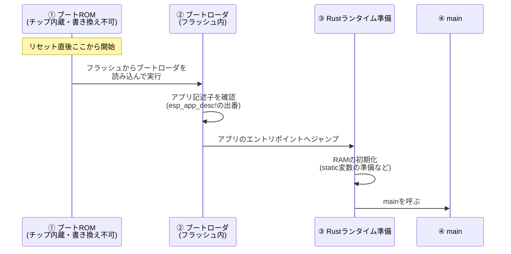

## このページでできるようになること

- リセットからmainまでの流れ（ブートROM→ブートローダ→アプリ）を順番に説明できる
- blinkyにある `esp_bootloader_esp_idf::esp_app_desc!()` が何のためにあるか説明できる
- `esp_hal::init` と `esp_rtos::start` がそれぞれ何を準備しているか説明できる

## 先に結論

電源投入やリセットの直後、あなたの `main` はまだ動いていません。まずチップ内蔵の**ブートROM**が動き、フラッシュから**ブートローダ**を起動し、ブートローダがあなたのアプリを見つけて実行を渡します。その後、Rust側の準備（メモリの初期化）が済んでから、ようやく `main` が呼ばれます。`main` の冒頭で呼ぶ `esp_hal::init` はクロックとペリフェラルの準備、`esp_rtos::start` はEmbassyを動かすための時計と割り込みの準備です。

## 身近なたとえ

学校の始業式を思い浮かべてください。生徒（あなたのプログラム）が教室で授業を始める前に、用務員さんが門を開け（ブートROM）、先生が教室の鍵を開けて出席を確認し（ブートローダ）、それから授業（main）が始まります。生徒がいきなり門を開けることはできません。

ただし実際のブートでは、「確認」は出席ではなくデータの検査です。ブートローダはフラッシュ上のアプリが正しい形式かを調べてから実行を渡します。

## 仕組み

### リセットからmainまでの4段階



**① ブートROM** — ESP32-C6のチップ内部には320KBのROM（書き換え不可のメモリ）があり、リセット直後はここのプログラムが動きます。ブートROMは、ストラッピングピン（第1部で見たGPIO9＝BOOTボタンなど）の状態を見て、「フラッシュのプログラムを起動する」か「書き込みモードに入る」かを決めます。BOOTボタンを押しながらリセットすると書き込みモードになるのは、この仕組みのためです。

**② ブートローダ** — フラッシュの先頭領域に置かれた小さなプログラムです。本教材の構成では、ESP-IDF形式のブートローダ（espflashが書き込み時に配置します）が使われます。ブートローダはフラッシュ内のアプリケーションを見つけ、正しい形式かを確かめてから実行を渡します。

**③ Rustランタイムの準備** — `main` の前に、static変数の初期値をフラッシュからRAMへコピーし、初期値のない領域をゼロで埋める、といった準備が行われます。これはesp-halが用意する起動コードとリンカスクリプト（`build.rs` の `linkall.x`）の仕事です。

**④ main** — ここでようやくあなたのコードです。

### esp_app_desc! — ブートローダへの名札

ブートローダはESP-IDF形式なので、アプリ側にも「ESP-IDF形式の名札」が必要です。それが**アプリ記述子（app descriptor）**で、`esp-bootloader-esp-idf` クレートの `esp_app_desc!()` マクロが生成します。この1行がないと、ブートローダがアプリを正しく扱えません。だからblinkyにも必ず書いてあったのです。

## RustとEmbassyではどう書くか

blinkyの起動部分を抜粋します。完全なコードは examples/01-blinky を見てください。

```rust
// esp-idf形式ブートローダが要求するアプリ記述子
esp_bootloader_esp_idf::esp_app_desc!();

#[esp_rtos::main]
async fn main(_spawner: Spawner) -> ! {
    let config = esp_hal::Config::default().with_cpu_clock(CpuClock::max());
    let peripherals = esp_hal::init(config);

    esp_println::logger::init_logger_from_env();

    let timg0 = TimerGroup::new(peripherals.TIMG0);
    let sw_interrupt = SoftwareInterruptControl::new(peripherals.SW_INTERRUPT);
    esp_rtos::start(timg0.timer0, sw_interrupt.software_interrupt0);
    // ...ここから先が「自分のやりたいこと」
}
```

## コードを一行ずつ読む

- `esp_bootloader_esp_idf::esp_app_desc!();` — 上で説明したアプリ記述子です。関数の外（ファイルのトップレベル）に置きます。
- `#[esp_rtos::main]` — `#![no_std]` の世界には普通の `main` の呼ばれ方がないため、この属性が「起動コードから呼ばれる本当の入口」と「あなたのasyncなmain」をつなぎ、Embassyの実行器も起動します。
- `-> !` — 「この関数は決して戻らない」という型です（第2部のloopで学びました）。マイコンには `main` の帰り先（OS）がないので、戻らないことを型で約束します。
- `esp_hal::init(config)` — クロック（CPUの動作速度）を設定し、チップの全ペリフェラルへの「鍵束」である `peripherals` を返します。ここでは `CpuClock::max()` で最高速度（160MHz）を指定しています。
- `esp_rtos::start(...)` — タイマー（TIMG0）とソフトウェア割り込みをEmbassyに渡し、`Timer::after(...).await` のような時間の仕組みを動かす準備をします。これを呼ぶ前に `Timer::after` を使うことはできません。

## 実行方法

blinkyをもう一度書き込んで、起動直後のログを見てみましょう。

```bash
cd examples/01-blinky
cargo run --release
```

リセット直後、あなたの `info!` のログより**前**に、ブートローダ由来の起動メッセージがシリアルに流れます。「mainの前に別のプログラムが動いている」ことを自分の目で確認できます。

## よくある失敗

- **`esp_app_desc!()` を消してしまい起動しない** — 一見「何もしていない1行」に見えますが、消すとブートローダがアプリを受け付けず、プログラムが始まりません。ビルドは通るのに動かない、という分かりにくい症状になります。
- **`esp_rtos::start` の前に `Timer::after` を使う** — 時間の仕組みがまだ準備されていないため、正しく動きません。初期化の順番（init → start → 自分の処理）は崩さないでください。
- **GPIO8をLowに引いたままリセットする** — GPIO8はストラッピングピンで、リセット時の状態がブートモードの判定に使われます。配線でGPIO8をGNDへつないだままだと、書き込みモードに入れないことがあります（第1部の配線ルール参照）。

## やってみよう

blinkyの `info!("Lチカを開始します")` の直前に、もう1行 `info!("mainに到達しました");` を足して書き込み、シリアルログの中で「ブートローダのメッセージ → あなたのメッセージ」の順になっていることを確認してください。

## 確認問題

1. リセット直後に最初に動くプログラムはどこにありますか。
2. `esp_app_desc!()` は誰のために書きますか。
3. `main` が `-> !` である理由を、OSの有無と結びつけて説明してください。

<details>
<summary>答え</summary>

1. チップ内蔵のROM（ブートROM）です。書き換えできません。
2. フラッシュ先頭にいるESP-IDF形式のブートローダのためです。アプリが正しい形式であることを伝える名札の役割をします。
3. パソコンでは `main` が終わるとOSに戻りますが、マイコンには戻る先のOSがありません。そのため `main` は永遠に動き続ける（決して戻らない）必要があり、それを型 `!` で表します。

</details>

## まとめ

- 起動の流れは「ブートROM → ブートローダ → Rustランタイム準備 → main」の4段階
- `esp_app_desc!()` はESP-IDF形式ブートローダに必要な名札で、消してはいけない
- `esp_hal::init` がクロックとペリフェラル、`esp_rtos::start` がEmbassyの時間の仕組みを準備する

## 次のページ

起動の流れの中で「フラッシュからRAMへコピー」という言葉が出てきました。フラッシュとRAMはどう違い、ESP32-C6にはどんなメモリがどれだけあるのでしょうか。次のページでメモリの地図を描きます。

[← 前のページ: no_stdとは何か](/embassy-esp32-c6/part05/01-no-std/) | [次のページ: メモリの地図 →](/embassy-esp32-c6/part05/03-memory/)
