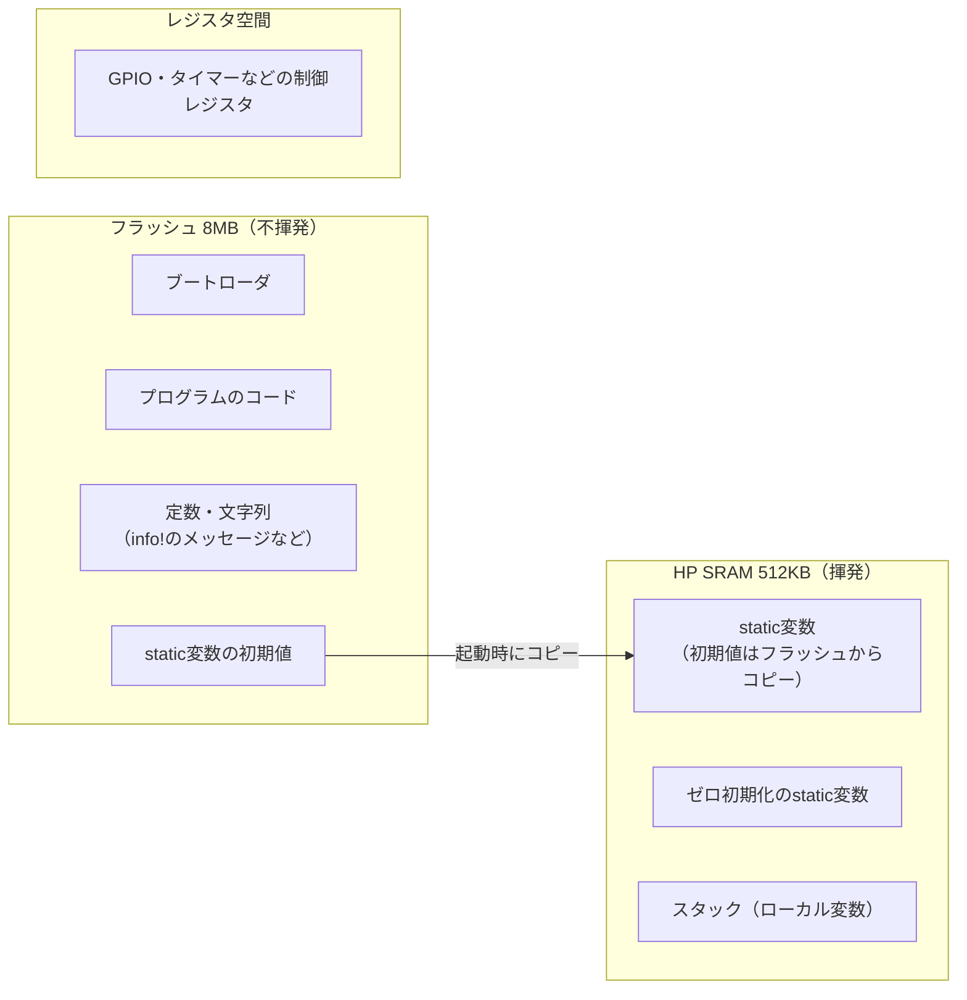

## このページでできるようになること

- ESP32-C6の主なメモリ（フラッシュ、HP SRAM、LP SRAM、ROM）の役割と大きさを言える
- プログラムのコード・static変数・スタックがそれぞれどこに置かれるかを説明できる
- 「レジスタ空間」がメモリの地図の中でどんな存在かを説明できる

## 先に結論

ESP32-C6-DevKitC-1には、電源を切っても消えない**フラッシュ8MB**と、高速だが電源で消える**HP SRAM 512KB**があります。プログラム本体はフラッシュに保存され、実行中のデータ（変数）はSRAMに置かれます。さらに、ペリフェラルを操作するための**レジスタ**も、メモリと同じ「住所（アドレス）」の仕組みでアクセスします。つまりCPUから見ると、フラッシュもRAMもペリフェラルも、すべて同じ1枚の地図の上にあります。

## 身近なたとえ

学校の校舎の見取り図を考えてください。図書室（フラッシュ）は本＝プログラムを長期保存する場所、教室の机（SRAM）は今使っているノートを広げる場所です。そして職員室の呼び出しボタン（レジスタ）は、押すと実際に何かが起きる特別な場所です。全部が同じ校舎の見取り図に載っています。

ただし実際のメモリの地図では、場所は部屋の名前ではなく**アドレス（番地）**という数値で表されます。CPUは「この番地を読む・書く」という操作しかせず、その番地がフラッシュかRAMかレジスタかで結果が変わるのです。

## 仕組み

### ESP32-C6のメモリ一覧

数値はすべて公式データシートとDevKitC-1ユーザーガイドによるものです。

| メモリ | 大きさ | 電源を切ると | 役割 |
|---|---|---|---|
| フラッシュ（外付け、WROOM-1モジュール内） | 8MB | 消えない | プログラム本体・定数の保存。書き込みは遅い |
| HP SRAM | 512KB | 消える | 実行中の変数・スタック。読み書きが速い |
| LP SRAM | 16KB | 消える（ただしDeep-sleep中は保持） | 低電力(LP)コア用・スリープ中のデータ退避（第12部） |
| ROM | 320KB | 消えない（書き換えも不可） | ブートROMなどチップ内蔵プログラム |

パソコンのメモリ（数GB〜数十GB）やストレージ（数百GB）と比べると、桁がいくつも小さいことが分かります。512KBは、スマホで撮った写真1枚よりも小さい量です。この「少なさ」が、第5部でこれから学ぶ設計方針（ヒープを避ける、固定長で書く）の理由になります。

### プログラムはどこに置かれるか



- **コードと定数** — フラッシュに置かれます。だから電源を切ってもプログラムは消えません。
- **static変数** — RAM上に住所が決まっていて、初期値は起動時にフラッシュからコピーされます（前ページの「Rustランタイムの準備」がこれです）。
- **スタック** — 関数のローカル変数の置き場で、RAMの中にあります。詳しくは次のページで扱います。
- **レジスタ空間** — GPIOやタイマーを制御する「スイッチ盤」です。特定のアドレスへ書き込むと、実際にピンの電圧が変わります。普通のメモリのようにデータを覚える場所ではありません。ここへの読み書きの作法は第5部8ページ（PACとunsafe）で学びます。

### フラッシュとRAMの使い分け

| 比較 | フラッシュ | HP SRAM |
|---|---|---|
| 速さ | 遅い（読み出しにキャッシュ等の工夫が要る） | 速い |
| 書き換え | 消去してから書く必要があり、回数にも寿命がある | 自由に何度でも |
| 電源断 | 保持 | 消える |
| 向いている用途 | プログラム・設定値の長期保存 | 実行中の変数 |

「実行中に頻繁に書き換えるものはRAM、ずっと取っておくものはフラッシュ」が基本の役割分担です。

## よくある失敗

- **「8MBもあるから余裕」と思ってRAMの量と混同する** — 8MBはフラッシュ（保存場所）です。実行中の変数が使えるのはHP SRAM 512KBのほうで、しかも無線スタックを使うとその一部が消費されます。大きな配列を気軽に作れる環境ではありません。
- **「電源を切っても変数は残る」と思い込む** — static変数もローカル変数もRAMにあるため、電源断やリセットで消えます。設定値を残したい場合はフラッシュへの保存が必要です（第12部5ページ）。
- **LP SRAMを普通のRAMの追加分と考える** — LP SRAM 16KBは低電力ドメイン用の特別な領域です。Deep-sleep中もデータが保持される点が特徴で、通常の変数置き場として最初から当てにするものではありません。

## やってみよう

blinkyをビルドして、できあがったプログラムの大きさを見てみましょう。

```bash
cd examples/01-blinky
cargo build --release
espflash board-info
```

書き込み時にespflashが表示するアプリのサイズが、フラッシュ8MBのうちどのくらいを占めるか計算してみてください。Lチカ程度なら、ごく一部しか使っていないことが分かります。

## 確認問題

1. ESP32-C6-DevKitC-1で、実行中の変数が使えるメモリはどれで、何KBですか。
2. `info!("Lチカを開始します")` の文字列データは、起動前はどこに保存されていますか。
3. レジスタ空間が「普通のメモリと違う」点をひとつ挙げてください。

<details>
<summary>答え</summary>

1. HP SRAMで、512KBです。
2. フラッシュです。定数データはプログラムと一緒にフラッシュへ書き込まれます。
3. 読み書きがデータの記憶ではなくハードウェアの動作（ピンの電圧を変える等）に直結する点です。同じ番地を読んでも、ハードウェアの状態によって値が変わることもあります。

</details>

## まとめ

- ESP32-C6の地図: フラッシュ8MB（保存）、HP SRAM 512KB（実行中の変数）、LP SRAM 16KB（低電力用）、ROM 320KB（ブート用）
- コードと定数はフラッシュ、static変数とスタックはRAMに置かれ、初期値は起動時にコピーされる
- ペリフェラルのレジスタもアドレスでアクセスする。同じ地図の上の「特別な場所」

## 次のページ

RAMの中でも、関数を呼ぶたびに自動で伸び縮みする領域が「スタック」です。仕組みを知らないと、あふれたときに原因不明の不具合に悩むことになります。次のページでスタックの動きを追います。

[← 前のページ: main以前に起きること](/embassy-esp32-c6/part05/02-before-main/) | [次のページ: stack →](/embassy-esp32-c6/part05/04-stack/)
