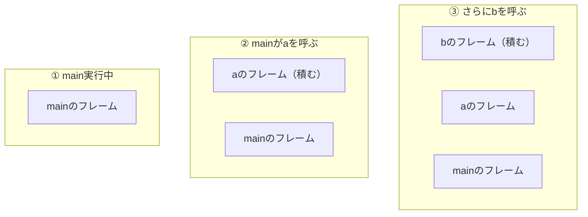

## このページでできるようになること

- スタックが「関数呼び出しと一緒に自動で伸び縮みするメモリ」であることを説明できる
- どんな変数がスタックに置かれるかを言える
- スタックオーバーフローが何で、なぜマイコンで特に危険かを説明できる

## 先に結論

スタックは、関数のローカル変数を置くためのRAM上の領域です。関数を呼ぶと積み上がり、関数から戻ると自動で片付きます。管理は完全に自動で速いのが長所ですが、大きさに限りがあります。使いすぎて限界を超えることを**スタックオーバーフロー**と呼び、マイコンでは隣のメモリを壊して「まったく関係ない場所の不具合」に化けるため、パソコン以上に警戒が必要です。

## 身近なたとえ

食堂のトレイの山を思い浮かべてください。新しいトレイは必ず一番上に置き、取るときも必ず一番上から取ります。関数を呼ぶことがトレイを1枚積むこと、関数から戻ることが1枚取ることに当たります。途中のトレイだけ抜くことはできません。

ただし実際のスタックに積まれるのはトレイではなく、「その関数のローカル変数一式と、戻り先の情報」です。この一式をスタックフレームと呼びます。

## 仕組み

### 関数呼び出しとスタックの動き



`b` から戻ると `b` のフレームは自動で消え、`a` から戻ると `a` のフレームも消えます。第3部で学んだ「所有権と変数の寿命」は、この仕組みと直結しています。関数を抜けた変数が使えなくなるのは、置き場所そのものが片付けられるからです。

### スタックに置かれるもの

- 関数のローカル変数（`let x = 5;` の `x` など）
- 関数の引数
- 固定長の配列（`let buf = [0u8; 64];` — 64バイトがそのままスタックに載る）
- 関数から戻るための「帰り道」の情報

つまり、これまで書いてきたコードのローカル変数は、ほぼすべてスタック上にありました。

### スタックオーバーフロー — あふれるとどうなるか

スタックに使える量には上限があります。次のようなコードは、上限を一気に食いつぶす例です。これは説明用のコード断片で、実際に書き込むためのものではありません。

```rust
fn main_task() {
    // 32KBの配列をローカル変数に置く → 32KB分スタックを消費
    let big = [0u8; 32 * 1024];
    // 再帰（自分自身を呼ぶ関数）も、深くなるほどフレームが積み上がる
}
```

パソコンではOSがスタックの限界を見張っていて、超えるとプログラムを止めてくれます。しかしESP32-C6にはOSも見張り役もいません。あふれたスタックは**隣にある他のデータ（static変数など）に上書きで侵入**します。すると、スタックとは無関係に見える変数が突然壊れ、原因の特定がとても難しい不具合になります。

対策の方針は次の3つです。

1. 大きな配列・バッファをローカル変数に置かない（staticに置く。第5部6ページ）
2. 深い再帰を書かない（ループで書き直す）
3. 「動いていたのに変数がなぜか壊れる」ときはスタック不足を疑う

## よくある失敗

- **大きいバッファをローカルに確保して不可解な動作になる** — `let buf = [0u8; 16384];` のような行は、それだけで16KBをスタックから奪います。ビルドは普通に通るため、気づきにくい失敗です。
- **再帰でデータ構造をたどって深さが読めなくなる** — 入力次第で再帰の深さが変わると、テスト中は動くのに本番で突然壊れます。組み込みでは再帰よりループを基本にしてください。

## やってみよう

blinkyの `main` に `let buf = [0u8; 64];` と小さな配列を足し、`info!("buf[0] = {}", buf[0]);` で使ってみてください（使わないと警告が出ます）。この64バイトがスタックに置かれ、`main` が動いている間ずっと存在する、と頭の中で地図に描けたら成功です。確認後は消して構いません。

## 確認問題

1. 関数から戻ったとき、その関数のローカル変数はどうなりますか。
2. スタックオーバーフローがマイコンでパソコンより危険なのはなぜですか。

<details>
<summary>答え</summary>

1. その関数のスタックフレームごと片付けられ、なくなります。だから関数の外から参照できません。
2. パソコンではOSが超過を検出して止めてくれますが、マイコンには見張りがなく、あふれた分が隣のメモリを黙って上書きするためです。壊れた場所と原因が離れていて、発見が困難になります。

</details>

## まとめ

- スタックはローカル変数の置き場。関数呼び出しで積み上がり、戻ると自動で片付く
- 大きな配列や深い再帰はスタックを食いつぶす。ビルドは通るので気づきにくい
- あふれると隣のメモリを壊す。「大きいものはスタックに置かない」が組み込みの基本

## 次のページ

「大きさが実行時に変わるデータ」はスタックには置けません。パソコンならヒープを使うところですが、組み込みではヒープを避けるのが定石です。その理由と代わりの道具を次のページで学びます。

[← 前のページ: メモリの地図](/embassy-esp32-c6/part05/03-memory/) | [次のページ: heapを使わない設計 →](/embassy-esp32-c6/part05/05-heap/)
