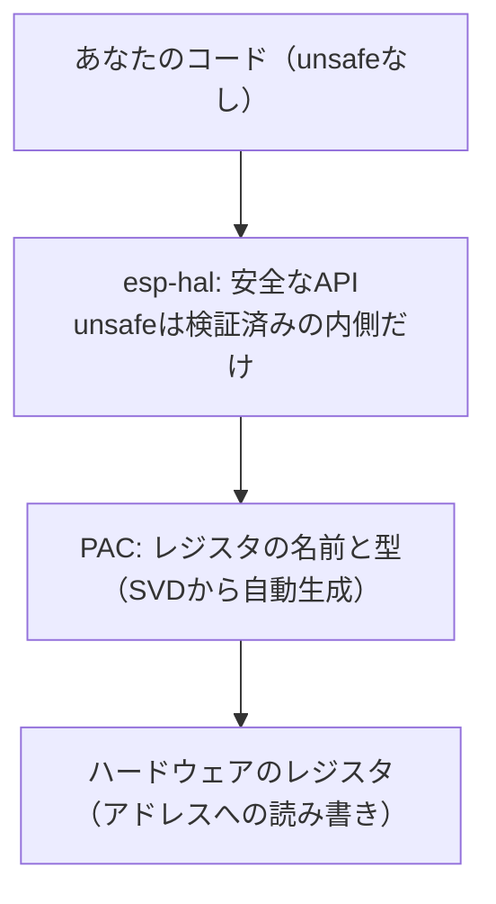

## このページでできるようになること

- レジスタ操作が「特定アドレスへの読み書き」であることを説明できる
- PAC（Peripheral Access Crate）が何を自動生成したものかを説明できる
- unsafeが「危険だから禁止」ではなく「安全な抽象化の内側で必要になる部品」である理由を説明できる

## 先に結論

ハードウェア制御の最下層は、レジスタという特別なアドレスへの読み書きです。Rustの生ポインタでこれを書くと、コンパイラには正しさを確認するすべがないため `unsafe` ブロックが必要になります。この生の読み書きに名前と型を与えて整理したものが**PAC**（Peripheral Access Crate）で、チップの公式定義ファイルから自動生成されます。esp-halはPACの上に建てられた家であり、unsafeな操作を検証済みの内側に閉じ込めて、外には安全なAPIだけを見せています。**unsafeは禁止語ではなく、「ここから先はコンパイラの代わりに人間が正しさを保証した」という責任の印**です。

## 身近なたとえ

電車の運転台を思い浮かべてください。乗客（アプリのコード）は運転台に入れません。運転士（esp-hal）だけが運転台のレバー（レジスタ）を触れます。運転士は訓練を受けて正しい手順を知っているから、乗客は何も知らなくても安全に目的地へ着けます。

ただし実際のunsafeは「立ち入り禁止の札」ではありません。誰かが必ず運転台に入らなければ電車は動かない、という点が本質です。問題は入るかどうかではなく、**入る場所を少数に絞り、そこを徹底的に確認する**ことです。

## 仕組み

### 最下層: レジスタは「住所への読み書き」

第5部3ページで見たとおり、GPIOやタイマーの制御レジスタはメモリの地図の上にあります。「GPIO10をHighにする」の正体は、データシートで決められた特定アドレスの特定ビットに1を書くことです。

概念を示すために、生のレジスタ書き込みの**形**だけを見てみます。これは説明用の擬似的な例で、実際のアドレスではありません。そのまま書き込んで使うコードでもありません。

```rust
// 説明用の擬似コード。REG_ADDRは実在のアドレスではない
const REG_ADDR: usize = 0x6000_0000;

unsafe {
    // 「このアドレスをu32のレジスタとみなして書く」
    core::ptr::write_volatile(REG_ADDR as *mut u32, 1 << 10);
}
```

この書き方には危険が3つ隠れています。

1. **アドレスを打ち間違えても誰も気づかない** — 隣のペリフェラルを壊しても、コンパイラは正しいコードとして通します
2. **ビットの意味を間違えても気づかない** — `1 << 10` が本当にGPIO10なのかは、データシートと人間の注意力だけが頼りです
3. **同じレジスタを2か所から同時に触ると壊れる** — 所有権のような仕組みが何もありません

だからRustはこの操作に `unsafe` ブロックを要求します。「コンパイラはここの正しさを保証できません。あなたが保証してください」という契約です。なお `write_volatile` の `volatile`（最適化でこの書き込みを消さない指定）については、割り込みと合わせて第6部以降で詳しく扱います。

### 中間層: PAC — データシートを型に変換したもの

チップメーカーは、全レジスタのアドレスとビットの意味を機械可読の定義ファイル（SVDと呼ばれます）で公開しています。これをRustのコードに自動変換したものがPAC（Peripheral Access Crate）です。ESP32-C6にも専用のPACがあり、esp-halはその上に作られています。

PACを使うと、生アドレスの代わりに「名前」でレジスタを指せるようになります。アドレスやビット位置の打ち間違い（危険1と2）は大きく減ります。しかし、「同じレジスタを2か所から触る」問題（危険3）や「操作の順序を間違える」問題はまだ残っています。PACはあくまで正確な辞書であって、正しい使い方までは強制しないのです。

### 上層: esp-hal — unsafeを内側に閉じ込める

esp-halは、PACの上に**安全な抽象化**を建てます。第6部で使う `Output::new(peripherals.GPIO10, ...)` の内部では、最終的にunsafeなレジスタ操作が実行されています。しかしesp-halの設計は次を保証します。

- `peripherals.GPIO10` は**move**される（第3部の所有権）ので、同じピンを2つの場所から操作するコードはコンパイルエラーになる
- 初期化の順序や設定の組み合わせは、型と関数の設計で正しい形しか書けないようになっている



つまりRustの組み込み開発は「unsafeを使わない」のではなく、**unsafeを少数の検証済みの場所に集約し、その外側では所有権と型でミスをコンパイルエラーに変える**という構造です。あなたが第6部以降で書くコードにunsafeがほぼ登場しないのは、esp-halの内側で誰かがその責任を引き受けてくれているからです。

## よくある失敗

- **「unsafeを使ったら負け」と考えて全面否定する** — ハードウェアを動かす以上、最下層のunsafeは必ずどこかに存在します。大切なのはゼロにすることではなく、場所を絞って責任の所在をはっきりさせることです。
- **ネットのコード片から生のレジスタ操作をコピーする** — 別チップ（ESP32やC3）のアドレスはC6では通用しません。動いたとしても偶然です。本教材の範囲では、レジスタ操作はesp-halのAPIを通して行い、生のPAC操作は使いません。

## やってみよう

blinkyの `Output::new(peripherals.GPIO10, ...)` の行を2回書く（同じ `peripherals.GPIO10` をもう一度使う）とどんなコンパイルエラーになるか、試してみてください。「moveされた値は二度使えない」というエラーが、そのまま「同じピンの二重操作の防止」になっていることを確認できます。確認したら元に戻してください。

## 確認問題

1. 「GPIOピンをHighにする」操作の、最下層での正体は何ですか。
2. PACは何をもとに、何を自動生成したものですか。
3. esp-halを使うとあなたのコードにunsafeがほぼ現れないのはなぜですか。

<details>
<summary>答え</summary>

1. データシートで決められた特定アドレスのレジスタへ、特定のビットパターンを書き込むことです。
2. チップメーカーが公開するレジスタ定義ファイル（SVD）をもとに、全レジスタへ名前と型を与えたRustクレートを自動生成したものです。
3. unsafeが必要な生のレジスタ操作を、esp-halが検証済みの内部に閉じ込め、外側には所有権と型で守られた安全なAPIだけを公開しているからです。

</details>

## まとめ

- レジスタ操作は生ポインタへの読み書きで、コンパイラが正しさを確認できないためunsafeが必要
- PACはデータシート由来の自動生成コードで、レジスタに名前と型を与える
- esp-halはunsafeを内側に閉じ込め、外側では所有権と型がミスをコンパイルエラーに変える

## 次のページ

では、esp-halは具体的に何をどう抽象化してくれているのでしょうか。次のページで、この教材の主役クレートesp-halの全体像を見ます。

[← 前のページ: panicとの付き合い方](/embassy-esp32-c6/part05/07-panic/) | [次のページ: HAL — esp-hal →](/embassy-esp32-c6/part05/09-hal/)
