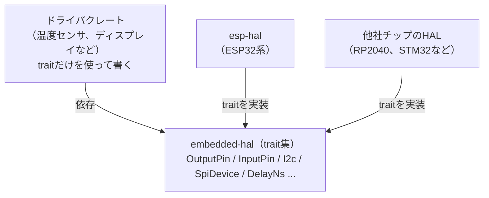

## このページでできるようになること

- embedded-halが「HALたちの共通言語（trait集）」であることを説明できる
- センサドライバがチップを問わず動く仕組みを、traitの言葉で説明できる
- embedded-hal 1.0とembedded-hal-asyncの関係が分かる

## 先に結論

embedded-halは、具体的なHALではなく**traitだけを集めたクレート**です。「デジタル出力ピンとはset_high/set_lowできるもの」「I2Cとは読み書きできるもの」という約束事（インターフェース）を定義します。esp-halを含む各社チップのHALがこのtraitを実装し、センサやディスプレイのドライバはtraitだけを相手に書かれます。その結果、**ドライバはどのチップでも動く**のです。2024年に1.0が確定し、async版のembedded-hal-asyncも1.0になっています。本教材のバージョン構成でも両方を使います。

## 身近なたとえ

USBの規格を思い浮かべてください。マウスのメーカーは「USBの約束」だけを守って作り、パソコンのメーカーも「USBの約束」だけを守って作ります。両者が直接相談しなくても、どのマウスもどのパソコンで動きます。embedded-halはこの「規格書」に当たります。

ただしUSBと違って、embedded-halの約束が守られているかの確認は、差し込んだときではなく**コンパイル時**に行われます。約束を破った組み合わせはビルドが通りません。

## 仕組み

### 3層の登場人物



- **embedded-hal** — 約束事（trait）だけを定義。ハードウェアのコードは1行もありません
- **各HAL** — esp-halの `Output` は `OutputPin` traitを実装しています。他社HALのピン型も同じtraitを実装します
- **ドライバ** — 「`OutputPin` を実装した何か」だけを要求します。それがどのチップのピンかは知りませんし、知る必要がありません

これは第4部5ページで学んだtraitの「共通の能力を定義する」使い方そのものです。crates.ioには、この仕組みに乗った市販センサ・表示器のドライバが多数公開されており、第8部でI2Cセンサを扱うときに実際に恩恵を受けます。

### 主なtrait（embedded-hal 1.0）

| trait | 意味 | 使う部 |
|---|---|---|
| `digital::OutputPin` | set_high / set_lowできる出力ピン | 第6部 |
| `digital::InputPin` | High/Lowを読める入力ピン | 第6部 |
| `i2c::I2c` | I2Cバスで読み書きできる | 第8部 |
| `spi::SpiDevice` | SPIデバイスと通信できる | 第8部 |
| `delay::DelayNs` | 指定時間待てる | 各部 |

また、失敗の表現には第4部7ページで学んだassociated typeが使われています。各traitは `Error` 型を実装側（HAL側）に選ばせるので、ドライバは「何かのエラー」として `Result` で受け取れます。

### ドライバはこう書かれている

genericsとtraitを使った、ドライバの骨格の最小例です。これは仕組みを示す例で、examplesには含まれていません。

```rust
use embedded_hal::digital::OutputPin;

/// どのチップのピンでも動くブザードライバ
struct Buzzer<P: OutputPin> {
    pin: P,
}

impl<P: OutputPin> Buzzer<P> {
    fn new(pin: P) -> Self {
        Buzzer { pin }
    }

    fn on(&mut self) -> Result<(), P::Error> {
        self.pin.set_high()
    }
}
```

`P: OutputPin` は「set_high/set_lowの約束を守る型なら何でも」という意味です。esp-halの `Output` を渡せばESP32-C6で動き、他社HALのピン型を渡せばそのチップで動きます。ドライバの作者はESP32-C6を持っていなくてもよいのです。

### embedded-hal-async — async版の約束

embedded-halのtraitは同期版（呼ぶと完了まで戻らない）です。Embassyの世界では「待っている間に他のtaskを動かす」async版が欲しくなります。それが**embedded-hal-async**で、`i2c::I2c` や `digital::Wait`（ピンの変化を待つ）などのasync版traitを定義します。同様に、シリアル的な読み書きにはembedded-io / embedded-io-asyncという姉妹規格があります。本教材では第8部・第9部でasync版を使っていきます。

## よくある失敗

- **ドライバクレートがembedded-hal 0.2系向けで動かない** — 1.0の前に長く使われた0.2系のtraitとは互換性がありません。crates.ioでドライバを選ぶときは、依存に `embedded-hal = "1"` とあるかを確認してください。
- **traitのメソッドが見つからないエラー** — `set_high` などのtraitメソッドは、`use embedded_hal::digital::OutputPin;` のようにtraitをスコープに入れないと呼べません（第4部5ページで学んだ規則です）。「メソッドがない」と言われたら、まずuse忘れを疑ってください。

## やってみよう

crates.ioで気になるセンサ名（例: 温度センサの型番）を検索し、見つけたドライバクレートの依存関係に `embedded-hal` があるか、バージョンは1系かを確認してみてください。「traitにだけ依存し、特定チップのHALに依存していない」ことが読み取れたら、このページの内容が身についています。

## 確認問題

1. embedded-halクレートに、ESP32-C6を動かすコードは入っていますか。
2. センサドライバがチップを問わず動くのはなぜですか。「trait」という言葉を使って説明してください。
3. embedded-hal-asyncは何のためにありますか。

<details>
<summary>答え</summary>

1. 入っていません。traitの定義（約束事）だけのクレートです。実装するのはesp-halなどの各HALです。
2. ドライバが特定のHALの型ではなく、embedded-halのtrait（OutputPinなど）だけに依存して書かれているからです。そのtraitを実装した型なら、どのチップのHALのものでも渡せます。
3. 待ち時間に他のtaskへ実行を譲れるasync版のtraitを定義するためです。Embassyと組み合わせて使います。

</details>

## まとめ

- embedded-halはtraitだけの「規格書」。各HALが実装し、ドライバはtraitだけに依存する
- この分業により、ドライバはチップを問わず再利用できる。確認はコンパイル時に行われる
- async版の約束はembedded-hal-async。第8部・第9部で実際に使う

## 次のページ

第5部で、no_stdの世界の仕組みと道具立てがそろいました。次の部からは、いよいよ実際のハードウェアを動かします。まずはGPIO出力から、esp-halの `Output` を本格的に使っていきましょう。

[← 前のページ: HAL — esp-hal](/embassy-esp32-c6/part05/09-hal/) | [次のページ: GPIO出力 →](/embassy-esp32-c6/part06/01-gpio-output/)
