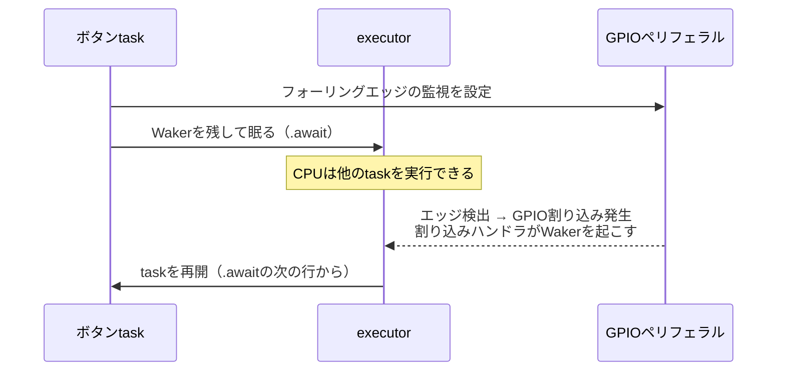

## このページでできるようになること

- ポーリングと割り込みの違いを説明できる
- 従来の「割り込みハンドラ」方式の仕組みと難しさを説明できる
- `wait_for_falling_edge().await`の内部で割り込みが使われていることを説明できる

## 先に結論

ピンの変化を知る方法は大きく2つあります。**ポーリング**（プログラムが何度も読みに行く）と**割り込み**（変化した瞬間にハードウェアが知らせてくる）です。従来の組み込み開発では、割り込みが起きたら呼ばれる特別な関数「割り込みハンドラ」を自分で書きました。強力ですが、共有データの扱いなど難しさの多い方式です。Embassyでは`wait_for_falling_edge().await`と書くだけで、**内部では**GPIO割り込みが使われ、割り込みが眠っているtaskを起こします。割り込みの効率と、普通の関数のような書きやすさが両立します。この教材ではasync wait方式を標準とします。

## 身近なたとえ

宅配便の受け取りで考えます。

- **ポーリング**: 5分おきに玄関まで行って「荷物来てないかな」と確認する。ほとんどの確認は無駄足です
- **割り込みハンドラ**: 玄関のチャイムが鳴ったら、**何をしていても中断して**玄関へ走るルールにする。無駄足はないが、料理中でも風呂でも即座に対応する必要があり、生活が複雑になります
- **async wait**: チャイムが鳴ったら「あとで手が空いたときに出よう」とメモされ、いま進行中の作業の区切りで玄関へ行く

実際のマイコンでは、チャイム＝GPIO割り込み、「何をしていても中断」＝CPUが実行中の処理を中断してハンドラへ飛ぶこと、「メモして区切りで対応」＝割り込みがWakerというメモを残してtaskを起こすことに対応します。async waitでも通知の瞬間の検出は割り込みそのものなので、見逃しはありません。

## 仕組み

### ポーリングの問題

```rust
// ポーリング（この教材では使わない書き方）
loop {
    if button.is_low() {
        // 押された処理
    }
    // このループはCPUを回し続ける
}
```

動きはしますが、CPUがずっとこのループを回り続けます。他の仕事の邪魔になり、電力も無駄です。さらに、読みに行く間隔より短い変化は見逃します。

### 従来の割り込みハンドラ方式

割り込みは「ハードウェアからの緊急連絡」です。GPIOペリフェラルに「このピンのフォーリングエッジを監視して」と設定しておくと、変化した瞬間にCPUが今の処理を中断し、あらかじめ登録した**割り込みハンドラ**（ISR: Interrupt Service Routine）という関数へ飛びます。Arduinoでは次のように書きます。

```cpp
// Arduino（従来の割り込みハンドラ方式）
volatile bool pressed = false;

void onButton() {          // 割り込みハンドラ
  pressed = true;          // フラグを立てるだけにするのが作法
}

void setup() {
  attachInterrupt(digitalPinToInterrupt(9), onButton, FALLING);
}

void loop() {
  if (pressed) {
    pressed = false;
    // 押された処理
  }
}
```

この方式には独特の難しさがあります。

- ハンドラは**いつでも**（loopのどの行の実行中でも）割り込んで走るため、loopと共有する変数の扱いを間違えるとデータが壊れる。`volatile`や割り込み禁止区間が必要になる
- ハンドラの中では時間のかかる処理やログ出力を避ける作法があり、結局「フラグを立ててloop側で処理」という二段構えになる
- ロジックがハンドラとloopに分断され、コードの流れが追いにくい

### Embassyのasync wait方式

Embassyでは同じことをこう書きます（`examples/02-button`より抜粋）。

```rust
button.wait_for_falling_edge().await;
// 押された処理（普通の関数の流れのまま書ける）
```

内部で起きていることを図にします。



1. `.await`した時点で、taskは「起こしてほしい」というメモ（**Waker**）を残して眠ります
2. GPIOペリフェラルはCPUと無関係にピンを監視し続けます
3. エッジが来ると**GPIO割り込み**が発生し、esp-halが用意した割り込みハンドラがWakerを通じてtaskを「実行可能」に戻します
4. executor（taskの切り替え係）が、そのtaskを`.await`の続きから再開します

つまり**割り込みハンドラは消えたのではなく、esp-halの内部に隠れています**。私たちが書くのは普通の上から下へ流れるコードだけで、共有フラグも`volatile`も要りません。WakerとFutureの正体は[第9部 3. Futureの直感的説明](/embassy-esp32-c6/part09/03-future/)で改めて扱います。

### 3方式の比較

| 方式 | CPUの無駄 | 見逃し | コードの書きやすさ |
|---|---|---|---|
| ポーリング | 大きい | 間隔次第で起きる | 単純だが常にループが必要 |
| 割り込みハンドラ | ない | ない | 共有データの扱いが難しい |
| async wait | ない | ない | 上から下へ素直に書ける |

## 実行方法

`examples/02-button`がそのままasync wait方式の実例です。

```bash
cargo run --release
```

ボタンを押した瞬間に反応すること、押していない間もプログラム全体が正常に動き続けることを確認してください。

## よくある失敗

- **`.await`を付け忘れて「何も起きない」**: `wait_for_falling_edge()`はFuture（あとで実行される予約票）を返すだけで、`.await`しないと待ちが始まりません。コンパイラの「unused ... Future」警告が出たら必ず対処してください
- **1つのtaskで2つのボタンを「同時に」待とうとして片方しか反応しない**: `wait`を2つ順番に並べると、1つ目が完了するまで2つ目は始まりません。複数の入力を同時に待つには、taskを分けるか`select`（[第9部 7. select](/embassy-esp32-c6/part09/07-select/)）を使います
- **割り込みハンドラ方式を自己流で混ぜてしまう**: esp-halの割り込みをEmbassyと別に直接扱うことも技術的には可能ですが、初学者にはハマりどころが多い領域です。この教材ではasync waitに統一します

## やってみよう

`examples/02-button`のループの先頭に`info!("待機開始")`を追加して実行し、ログの出るタイミングを観察してください。「待機開始」が出てからボタンを押すまでログが一切増えない＝ポーリングしていない、ということが確認できます。

## 確認問題

1. ポーリングの2つの欠点は何ですか。
2. 従来の割り込みハンドラ方式で「フラグを立ててloop側で処理する」二段構えがよく使われるのはなぜですか。
3. `wait_for_falling_edge().await`で待っているとき、割り込みハンドラは存在しないのでしょうか。

<details>
<summary>答え</summary>

1. 変化がなくてもCPUを消費し続けることと、読みに行く間隔より短い変化を見逃しうることです。
2. ハンドラは実行中の処理をいつでも中断して走るため、中で時間のかかる処理をすると他の処理を長く止めてしまうからです。ハンドラでは最小限の記録だけ行い、重い処理は通常の流れ（loop側）で行うのが作法です。
3. 存在します。esp-halの内部にGPIO割り込みのハンドラがあり、エッジ検出時にWakerを通じて眠っているtaskを起こしています。プログラマから見えない場所に隠されているだけです。

</details>

## まとめ

- ピン変化の検出はポーリングより割り込みが効率的。async waitは割り込みの効率をそのまま使える
- `wait_for_falling_edge().await`の内部では、GPIO割り込み→Waker→task再開という連携が動いている
- この教材では、共有データの難しさを避けられるasync wait方式を標準とする

## 次のページ

ピンの次は「時間」です。ここまで何気なく使ってきた`Timer::after`を正面から学び、Embassyの時間APIを使いこなします。

- 前: [5. チャタリング対策](/embassy-esp32-c6/part06/05-debounce/)
- 次: [7. Timerで待つ](/embassy-esp32-c6/part06/07-timer/)
