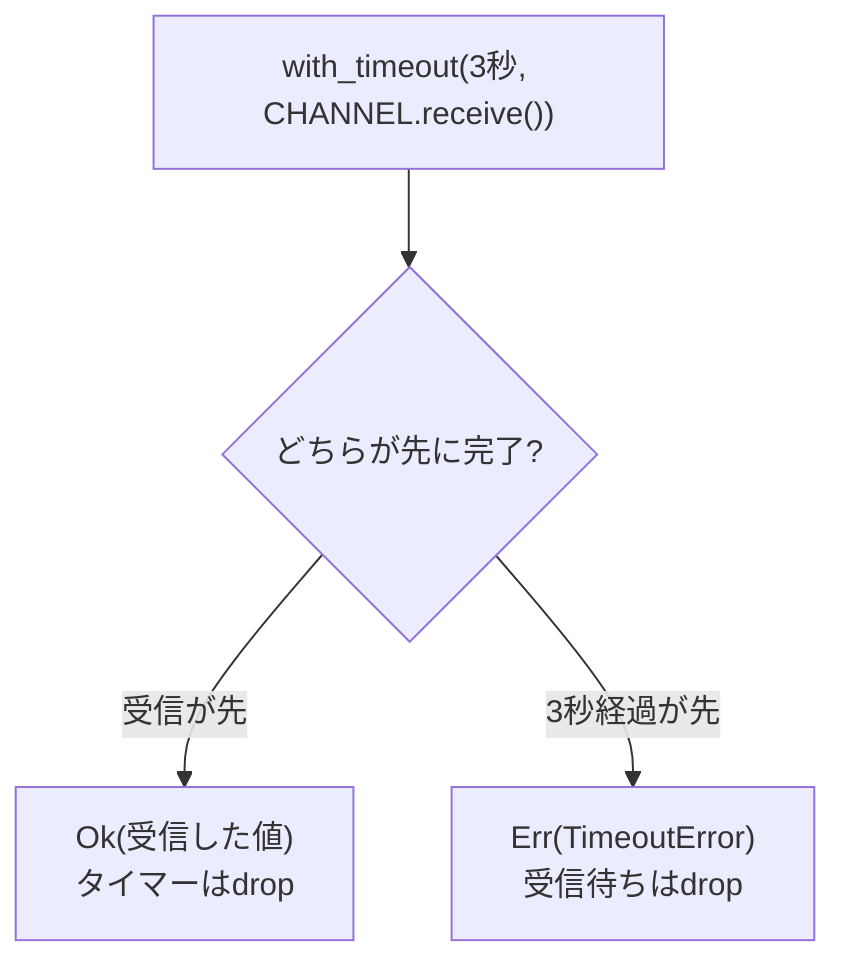

## このページでできるようになること

- `with_timeout`で待ちに制限時間を付けられる
- 戻り値の`Result`からタイムアウトの成否を判定できる
- タイムアウトした側のFutureがdrop（キャンセル）されることを説明できる

## 先に結論

`wait_for_falling_edge`やチャネルの受信のように「いつ完了するか分からない待ち」を無制限に続けると、相手が沈黙したときプログラムのその部分が永遠に止まります。`embassy_time::with_timeout(制限時間, 待ちたいFuture).await`を使うと、時間内に完了すれば`Ok(結果)`、間に合わなければ`Err(TimeoutError)`が返ります。第3部で学んだ`Result`そのものなので、`match`で両方の場合を必ず書くことになり、「待ちすぎたときどうするか」を設計に組み込めます。タイムアウトした場合、中の待ちはdropされて完全にキャンセルされます。

## 身近なたとえ

友だちとの待ち合わせで「15分待って来なかったら先に行くね」と決めておくのがタイムアウトです。決めていないと、来ない相手を永遠に待ち続けることになります。大事なのは、15分たったら**待つのを完全にやめる**ことです。「先に行きつつ、心のどこかで待ち続ける」ことはできません。

プログラムでも同じで、タイムアウトした待ち（Future）はdropされ、それ以降その待ちが復活することはありません。もう一度待ちたければ、次のループで新しく待ち直します。

## 仕組み

`with_timeout`は「本命の待ち」と「制限時間のタイマー」を同時に走らせ、先に完了したほうを採用する仕組みです。



戻り値は`Result<T, TimeoutError>`です。

| 結果 | 意味 |
|---|---|
| `Ok(値)` | 制限時間内に本命の待ちが完了した。`値`はその結果 |
| `Err(TimeoutError)` | 制限時間が先に来た。本命の待ちはdropされた |

**drop＝キャンセル**はEmbassyの重要な約束事です。負けた側のFutureは破棄され、それ以上進みません。この「キャンセルできる」性質はasyncの強みで、第9部の`select`でも同じ考え方が出てきます。

## RustとEmbassyではどう書くか

`examples/07-channel`のLED taskが実例です。ボタンイベントをチャネル（task間のメッセージキュー。詳細は[第9部 9. Channel・Signal・Mutex](/embassy-esp32-c6/part09/09-channel-signal-mutex/)）から受信しますが、3秒待って来なければ「イベントなし」と報告します。これは抜粋です。完全なコードは `examples/07-channel` を見てください。

```rust
use embassy_time::{Duration, with_timeout};

#[embassy_executor::task]
async fn led_task(mut led: Output<'static>) {
    let mut count: u32 = 0;
    loop {
        // receive()に3秒のタイムアウトを付ける。
        // 時間内に受信できればOk(イベント)、できなければErr(TimeoutError)
        match with_timeout(Duration::from_secs(3), CHANNEL.receive()).await {
            Ok(ButtonEvent::Pressed) => {
                count += 1;
                led.toggle();
                info!("[LEDタスク] イベント受信: {}回目 → LEDをトグル", count);
            }
            Err(_) => {
                info!("[LEDタスク] イベントなし（3秒間ボタンが押されていません）");
            }
        }
    }
}
```

## コードを一行ずつ読む

```rust
with_timeout(Duration::from_secs(3), CHANNEL.receive()).await
```

- 第1引数が制限時間、第2引数が本命のFutureです。`CHANNEL.receive()`はまだ`.await`していない点に注意してください。Futureのまま`with_timeout`へ渡し、`.await`は全体に1回だけ付けます
- 3秒以内に受信できれば`Ok(ButtonEvent::Pressed)`、できなければ`Err(TimeoutError)`になります

```rust
match ... {
    Ok(ButtonEvent::Pressed) => { ... }
    Err(_) => { ... }
}
```

`Result`を`match`で分けます。[第3部 3. match](/embassy-esp32-c6/part03/03-match/)で学んだ網羅性チェックのおかげで、`Err`側の処理を書き忘れるとコンパイルエラーになります。「タイムアウト時にどうするか」を考えずに済ませることが、型の力でできなくなっているのです。

タイムアウトは「異常」とは限りません。この例のように「3秒間何もなければ生存報告をする」といった、定期的な保険としても使えます。実際の製品では「センサの応答が来ない」「通信相手が沈黙した」ことを検出してリトライや再接続へ進む、エラー処理の入り口として重要です。

## 実行方法

```bash
cargo run --release
```

`examples/07-channel`を動かし、次の2つを確認してください。

- ボタンを押すと `イベント受信: n回目` のログが出てLEDがトグルする
- 3秒間何も押さないと `イベントなし（3秒間ボタンが押されていません）` が繰り返し出る

## よくある失敗

- **`with_timeout(d, future.await)`と書いてしまう**: 中で`.await`すると、`with_timeout`に渡す前にその場で待ち始めてしまい、制限時間が効きません。Futureは`.await`せずに渡し、`.await`は`with_timeout`全体に付けます
- **タイムアウト後も「裏で待ちが続いている」と誤解する**: `Err`になった時点で中のFutureはdropされ、完全に消えています。続きを待ちたければ、次のループで新しく`receive()`を作って待ち直します
- **`Err`側の処理を空にしてしまう**: `Err(_) => {}`と書けばコンパイルは通りますが、沈黙の検出という`with_timeout`の目的が失われます。最低でもログは残しましょう

## やってみよう

`from_secs(3)`を`from_secs(1)`に変えて、「イベントなし」のログが1秒ごとに出ることを確認してください。次に、タイムアウトが3回連続したらLEDを消灯する（`Err`側でカウンタを増やし、3に達したら`led.set_low()`）ように改造してみましょう。「沈黙が続いたら安全側へ倒す」という実用パターンの入り口です。

## 確認問題

1. `with_timeout`の戻り値の型はどんな形で、`Ok`と`Err`はそれぞれ何を意味しますか。
2. タイムアウトが起きたとき、本命のFutureはどうなりますか。
3. `with_timeout(Duration::from_secs(3), CHANNEL.receive().await)`という書き方の何が問題ですか。

<details>
<summary>答え</summary>

1. `Result<T, TimeoutError>`です。`Ok(値)`は制限時間内に本命の待ちが完了したこと、`Err(TimeoutError)`は制限時間が先に来たことを意味します。
2. dropされ、キャンセルされます。それ以上pollされることはなく、裏で待ちが続くこともありません。
3. `CHANNEL.receive().await`がその場で受信を待ち始めてしまうため、`with_timeout`が制限時間を管理できません。Futureは`.await`せずに渡す必要があります（実際にはこの書き方は型が合わずコンパイルエラーにもなります）。

</details>

## まとめ

- `with_timeout(制限時間, Future).await`で待ちに制限時間を付け、`Result`で結果を受ける
- タイムアウトした側のFutureはdrop＝完全キャンセル。裏で待ちは続かない
- タイムアウトは異常検出だけでなく、定期的な生存報告や「沈黙したら安全側へ」の設計にも使える

## 次のページ

タイムアウトはプログラムが「自分で」待ちすぎを検出する仕組みでした。最後は、プログラム全体が固まったときにハードウェアが強制リセットをかける最後の砦、Watchdogを学びます。

- 前: [8. Tickerで周期実行](/embassy-esp32-c6/part06/08-ticker/)
- 次: [10. Watchdog](/embassy-esp32-c6/part06/10-watchdog/)
