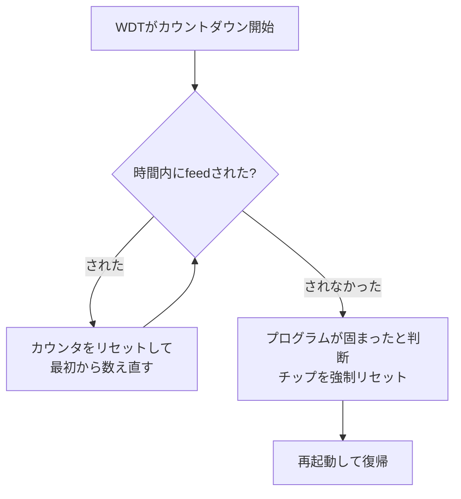

## このページでできるようになること

- Watchdog（番犬タイマー）が何のためにあるかを説明できる
- 「餌やり（feed）」と強制リセットの仕組みを説明できる
- ESP32-C6に載っているWDTの種類を挙げられる
- Embassyの設計とWatchdogの関係を説明できる

## 先に結論

Watchdogタイマー（WDT: Watchdog Timer、番犬タイマー）は、**プログラムが固まったときに自動でリセットをかける**ためのハードウェアです。プログラムは正常に動いている証拠として、決められた時間内にWDTへ合図（餌やり、feed）を送り続けます。合図が途絶えたら「固まった」とみなし、WDTがチップをリセットして復帰させます。前ページの`with_timeout`がプログラム内の一つの待ちを見張るのに対し、WDTは**プログラム全体**を見張る最後の砦です。ESP32-C6にはWDTが3つ（タイマーグループのMWDT×2、LP側のRWDT）あります。この教材では、WDTを直接操作するコードは扱わず、**Embassyの設計でループが止まらないことを優先する**、という整理をします。

## 身近なたとえ

一人暮らしのおばあちゃんに「毎日1回、無事だよと電話してね」と頼んでおくのが見守りサービスです。電話が来ているうちは安心。丸1日来なかったら、様子を見に行きます。WDTはこれのマイコン版で、「電話」がfeed、「様子を見に行く」が強制リセットです。

実際のWDTが本物の見守りと違うのは、対応が**リセット一択**という点です。事情を聞いたりはしません。時間内に合図がなければ、問答無用でチップを再起動します。乱暴に聞こえますが、「固まったまま動かない装置」より「勝手に再起動して復帰する装置」のほうが実用上ずっとましだ、という割り切りです。

## 仕組み

WDTの動作は、カウントダウンタイマーそのものです。

- **正常時**: プログラムはメインループの中などで定期的にfeedします。カウンタは満了する前に毎回巻き戻され、何も起きません
- **異常時**: プログラムが無限ループやデッドロック（互いに待ち合って動けない状態）で固まると、feedが途絶えます。カウンタが満了し、WDTがリセットをかけます

重要なのは、WDTが**ソフトウェアの状態に関係なく動くハードウェア**だという点です。プログラムがどんなに深く固まっていても、WDTは独立して数え続け、必ずリセットを実行できます。

### ESP32-C6のWDT構成

ESP32-C6にはWDTが3つ載っています（データシート）。

| 名前 | 場所 | 役割の概要 |
|---|---|---|
| MWDT0 | タイマーグループ0（TIMG0） | 汎用のWatchdog |
| MWDT1 | タイマーグループ1（TIMG1） | 汎用のWatchdog |
| RWDT | LP（低電力）システム側 | メインクロックの異常など、より深刻な問題も見張れるWatchdog |

複数あるのは、見張る対象や生き残れる状況が違うためです。たとえばRWDTはLP側にあるので、HP側のクロックに問題が起きた場合でも動作を続けられます。

### Embassyの設計とWatchdogの関係

この教材のプログラムが「固まる」としたら、典型的には次の2つです。

- **awaitのないループ**: `loop {}`のように`.await`を一度も通らないループを書くと、そのtaskがCPUを独占し、executorは他のtaskへ切り替えられなくなります（協調的マルチタスクの弱点。詳しくは[第9部 10. キャンセル・詰まり・優先順位](/embassy-esp32-c6/part09/10-cancel-backpressure/)）
- **終わらない待ち**: いつ完了するか分からない待ちを無制限に続ける設計。これは前ページの`with_timeout`で防げます

つまりEmbassyでは、「すべてのループが`.await`を含む」「無制限の待ちには`with_timeout`で制限を付ける」という設計規律を守ることが、固まらないための第一の防衛線です。WDTはそれでも防げない事態（想定外のバグ、ハードウェア起因の異常）に備える最後の防衛線であり、両者は役割が違います。

この教材では、WDTを直接操作するコード（有効化・feed・タイムアウト設定）は扱いません。esp-halのWDT関連APIはunstable feature配下にあり、この教材のexamplesとして検証したコードがないためです。製品開発でWDTが必要になったときは、使用するesp-halバージョンの公式ドキュメントでAPIを確認してください。ここでは「WDTが何を解決する装置か」「Embassyの設計規律とどう役割分担するか」を持ち帰ってもらえれば十分です。

## よくある失敗（設計上の落とし穴）

WDTを使う設計でよくある考え違いを2つ紹介します。コードを書かなくても、考え方として知っておく価値があります。

- **「とりあえず毎回feedする」でWDTを骨抜きにする**: タイマー割り込みなど「プログラム本体が固まっていても動き続ける場所」から無条件にfeedすると、本体が固まってもfeedは続き、WDTは一生発動しません。feedは「主要な処理が本当に一周した」ことを確認できる場所で行うのが原則です
- **複数taskの一部だけを見張ってしまう**: 1つのtaskがfeed係だと、他のtaskが固まっても検出できません。全taskの生存を確認してからfeedする（たとえば各taskからの報告を集める）といった設計の工夫が必要です
- **リセット後の対策を考えていない**: WDTリセットは復帰の手段であって、原因の修正ではありません。同じ条件で固まるバグが残っていれば、リセットを永遠に繰り返します。リセット理由の記録と原因調査がセットです

## やってみよう

コードを書かない5分の設計練習です。第9部の[07-channel](/embassy-esp32-c6/part09/09-channel-signal-mutex/)で作った「ボタンtask → Channel → LED task」の構成にWDTを組み合わせるとしたら、feedはどこで行うべきか考えて、紙に書き出してみてください。ヒント: 「両方のtaskが生きていること」を1か所で確認できる場所はどこでしょうか。片方のtaskだけがfeedすると何を見逃しますか。

## 確認問題

1. `with_timeout`とWatchdogは、どちらも「待ちすぎ・固まり」への対策です。見張る範囲はどう違いますか。
2. タイマー割り込みから無条件にfeedする設計がWDTを無意味にするのはなぜですか。
3. Embassyのプログラムで「awaitを含まないloop」が危険なのはなぜですか。

答え

1. `with_timeout`はプログラム内の**一つの待ち**を見張るソフトウェアの仕組みです。Watchdogは**プログラム全体**（feedが続いているか）を見張るハードウェアで、プログラムが完全に固まっても動作します。
2. プログラム本体が固まっても、割り込みだけは動き続けてfeedし続けることがあるからです。「本体が正常に一周している」こととfeedが結びついていないと、固まりを検出できません。
3. Embassyは協調的マルチタスクで、taskが`.await`でCPUを手放すことで切り替えが成り立っているからです。`.await`のないループはCPUを独占し、他のtaskがすべて止まります。

## まとめ

- Watchdogは「時間内にfeedがなければ強制リセット」というハードウェアの最後の砦。ESP32-C6にはMWDT×2とRWDTの3つがある
- 第一の防衛線はEmbassyの設計規律（全ループに`.await`、無制限の待ちに`with_timeout`）。WDTは想定外に備える最後の防衛線
- この教材ではWDT操作の実コードは扱わない。必要になったら使用バージョンのesp-hal公式ドキュメントを確認する

## 次のページ

第6部はこれで完了です。デジタルの世界（High/Low）を出て、次の部では「どれくらいの電圧か」を読むアナログの世界、ADCへ進みます。

- 前: [9. Timeout](/embassy-esp32-c6/part06/09-timeout/)
- 次: [第7部 1. ADCで電圧を読む](/embassy-esp32-c6/part07/01-adc/)
