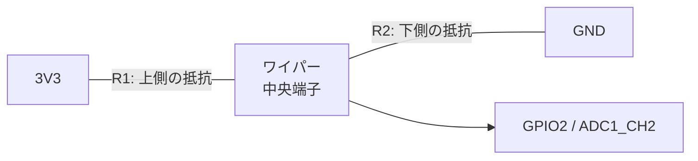

## このページでできるようになること

- 分圧の式 Vout = Vin × R2 ÷ (R1 + R2) で出力電圧を計算できる
- 可変抵抗（ポテンショメータ）が「回せる分圧回路」であることを説明できる
- 分圧で作った電圧をADCで読み、計算と実測を比べられる

## 先に結論

**分圧**とは、直列につないだ2本の抵抗で電圧を分けることです。3.3VをR1とR2で分けると、R2側の電圧は Vout = 3.3V × R2 ÷ (R1 + R2) になります。可変抵抗はこのR1とR2の割合をつまみで変えられる部品で、中央端子（ワイパー）から0V〜3.3Vの好きな電圧を取り出せます。前ページの配線でつまみを回すと読み値が変わったのは、この分圧のためです。

## 身近なたとえ

滝の途中に足場を作ることを想像してください。滝の高さ（電圧の差）は上から下まで決まっていますが、足場をどの高さに置くかで「足場から下までの落差」は自由に選べます。分圧の中間点は、この足場にあたります。

ただし実際の分圧では、途中の高さは「足場を置いた位置」ではなく**2本の抵抗の比率**で決まります。抵抗の比が3:1なら、電圧も3:1に分かれます。ここが比喩と実際の違いです。

## 仕組み

### 分圧の式

3.3VとGNDの間に、抵抗R1とR2を直列につなぎます。

```text
3V3 ──[R1]──●──[R2]── GND
            │
          Vout（ここをADCで読む）
```

直列回路では2本の抵抗に同じ電流が流れるため、電圧は抵抗の大きさに比例して分かれます。

**Vout = Vin × R2 ÷ (R1 + R2)**

例を3つ計算してみます（Vin = 3.3V）。

| R1 | R2 | Vout | ADC読み値の目安 |
|---|---|---|---|
| 10kΩ | 10kΩ | 3.3 × 10/(10+10) = 1.65V | 約2048 |
| 20kΩ | 10kΩ | 3.3 × 10/(20+10) = 1.1V | 約1365 |
| 10kΩ | 20kΩ | 3.3 × 20/(10+20) = 2.2V | 約2730 |

R2が大きいほどVoutは3.3Vに近づき、R1が大きいほど0Vに近づきます。

### 可変抵抗＝回せる分圧回路

可変抵抗（ポテンショメータ）は3端子の部品です。両端の間には全体の抵抗（この教材では10kΩ）があり、中央端子（**ワイパー**）は内部の抵抗体の上を滑る接点につながっています。



つまみを回すと接点の位置が動き、R1とR2の比率が連続的に変わります。つまり可変抵抗は「R1とR2を同時に調整できる分圧回路」そのものです。回しきればVoutは0Vまたは3.3Vになり、中間なら比率どおりの電圧になります。

### ADC読み値への換算

分圧の出力とADC読み値は比例します。

**読み値 ≒ Vout ÷ 3.3V × 4095**

例えばVout = 1.65Vなら読み値は約2048です。実際には誤差とノイズがあるので、計算値の前後数十の範囲に収まれば成功と考えてください。

## RustとEmbassyではどう書くか

読み取りのコードは前ページと同じです（`examples/13-adc-pwm`からの抜粋）。

```rust
let raw: u16 = adc1.read_oneshot(&mut pot_pin).await;
info!("ADC生値 = {raw:4}");
```

このページの主役はコードではなく回路です。同じコードのまま、配線だけ変えて実験します。

## 配線

### 実験1: 固定抵抗の分圧

10kΩを2本使い、計算どおり半分の電圧になるか確かめます。

```text
3V3 ──[10kΩ]──●──[10kΩ]── GND
              │
            GPIO2
```

読み値が約2048（±100程度）になれば、分圧の式のとおりです。

### 実験2: 可変抵抗

前ページと同じ配線です。

```text
可変抵抗（3端子）
  端 A ── 3V3
  中央（ワイパー）── GPIO2
  端 B ── GND
```

- 配線はUSBケーブルを抜いた状態で行います
- 3V3とGNDを逆にしても壊れませんが、つまみの回転方向と値の増減が逆になります

## 実行方法

`examples/13-adc-pwm`のプロジェクトで実行します。

```bash
cargo run --release
```

実験1では読み値が約2048で安定すること、実験2ではつまみに応じて0付近〜4095付近まで動くことを確認します。

## よくある失敗

- **固定抵抗2本で読み値が2048にならない**: 抵抗の実物には±5%程度の誤差があります。2本の誤差の出方によって読み値は数%ずれます。これは故障ではありません
- **可変抵抗の値が途中までしか動かない**: 中央端子ではなく端の端子をGPIO2につなぐと、分圧ではなく固定の抵抗接続になり、値がほぼ動かなくなります
- **5Vから分圧して「3.3V以下だから安全」と思い込む**: 計算上安全でも、配線ミスや抵抗の外れで5Vが直接GPIOにかかる危険があります。この教材の実験は必ず3V3ピンから行います

## やってみよう

実験1の上側の抵抗を330Ωに替えてみましょう（330Ωと10kΩの分圧）。Vout = 3.3 × 10000/(330+10000) ≒ 3.19Vなので、読み値は4000前後になるはずです。計算と実測を比べてください。

## 確認問題

1. Vin = 3.3V、R1 = 10kΩ、R2 = 5kΩのとき、Voutは何Vですか。
2. 可変抵抗のつまみを回すと出力電圧が変わるのはなぜですか。「R1」「R2」という言葉を使って説明してください。
3. 分圧の出力が1.1Vのとき、12bit ADCの読み値はおよそいくつですか。

<details>
<summary>答え</summary>

1. 3.3 × 5/(10+5) = 1.1Vです。
2. ワイパー（中央端子）の位置が動くと、上側の抵抗R1と下側の抵抗R2の比率が変わるからです。出力はR2 ÷ (R1+R2)に比例します。
3. 1.1 ÷ 3.3 × 4095 ≒ 1365です。

</details>

## まとめ

- 分圧の式: Vout = Vin × R2 ÷ (R1 + R2)。抵抗の比で電圧が分かれる
- 可変抵抗は3端子の「回せる分圧回路」。ワイパーから0V〜3.3Vを取り出せる
- ADC読み値 ≒ Vout ÷ 3.3V × 4095。誤差数%は正常

## 次のページ

読み値は電圧に比例しますが、生の数値のままでは扱いにくく、ノイズで揺れます。次は生値を電圧や物理量へ変換し、平均でならす方法を学びます。

- 前: [1. ADCで電圧を読む](/embassy-esp32-c6/part07/01-adc/)
- 次: [3. センサ値を整える](/embassy-esp32-c6/part07/03-sensor-reading/)
