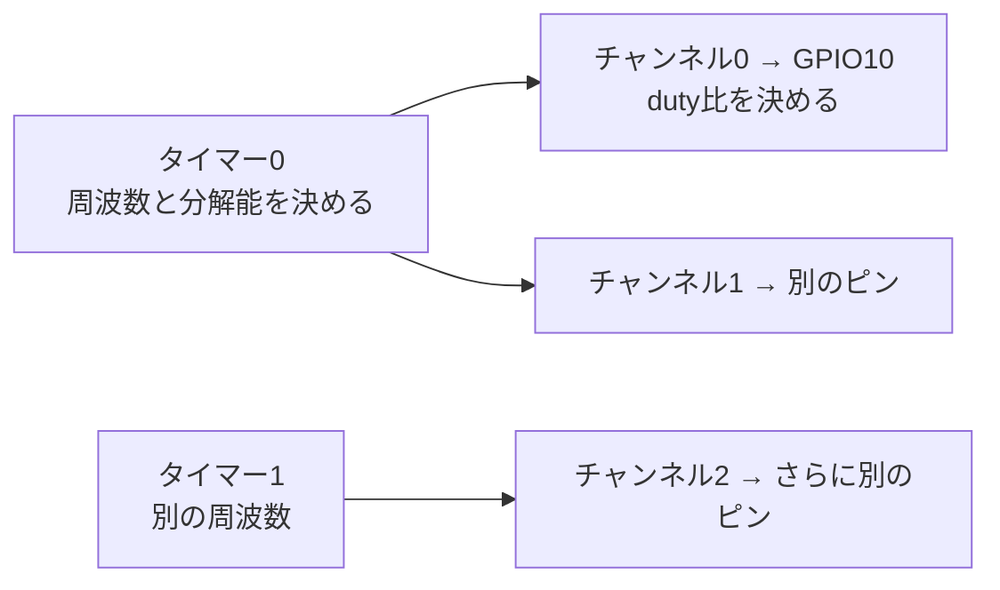

## このページでできるようになること

- PWMが「High/Lowしかないピンで中間の強さを作る」仕組みを説明できる
- 周波数とduty比という2つの用語を正しく使える
- ESP32-C6のLEDCペリフェラルの構成（タイマーとチャンネル）を説明できる
- esp-halでLEDCを設定してPWM信号を出せる

## 先に結論

GPIOの出力は3.3Vか0Vの2択で、中間の電圧は出せません。**PWM（Pulse Width Modulation、パルス幅変調）**は、HighとLowを高速に繰り返し、**Highの時間の割合（duty比）**で見かけの強さを調節する方法です。1秒あたりの繰り返し回数が**周波数**です。ESP32-C6にはPWM専用回路として**LEDC（6チャンネル）**と、モーター制御向けの**MCPWM**があり、この教材ではLED調光に向いたLEDCを使います。esp-halでは「タイマーを設定し、チャンネルにピンとタイマーをひも付ける」2段構えで設定します。

## 身近なたとえ

部屋の電気のスイッチを、ものすごい速さでカチカチし続けることを想像してください。1秒間に数千回も切り替えれば、目にはちらつきが見えず「点いている時間の割合」に応じた明るさに見えます。8割の時間ONなら明るく、2割なら暗く見えます。

ただし実際のPWMは「見かけの明るさ」を作っているだけで、電圧そのものは常に3.3Vか0Vのどちらかです。中間の電圧が出ているわけではない、という点が比喩とそのままでは違うところです（LEDはこれで十分調光できます）。

## 仕組み

### 周波数とduty比

PWM信号は2つの数字で決まります。

- **周波数**: 1秒あたりの繰り返し回数。この教材では5kHz（1周期 = 0.2ms）を使います
- **duty比**: 1周期のうちHighである時間の割合（0〜100%）

```text
duty 25%:  ▔▔▁▁▁▁▁▁▔▔▁▁▁▁▁▁   暗い
duty 50%:  ▔▔▔▔▁▁▁▁▔▔▔▔▁▁▁▁   中くらい
duty 75%:  ▔▔▔▔▔▔▁▁▔▔▔▔▔▔▁▁   明るい
           ←1周期→
```

平均すると、LEDに供給されるエネルギーはduty比に比例します。周波数の選び方は[7. 周波数の選び方](/embassy-esp32-c6/part07/07-frequency/)で詳しく扱います。

### LEDCペリフェラル

「高速でカチカチする」処理をCPUのループでやると、CPUがそれに掛かりきりになります。そこでESP32-C6は、PWM波形を自動で作り続ける専用回路**LEDC**（LED Control、LED制御器）を持っています。一度設定すれば、CPUが他の仕事（あるいはスリープに近い待機）をしていてもPWMは出続けます。

LEDCは2種類の部品の組み合わせで動きます。



- **タイマー**: 周波数とduty分解能（何段階でdutyを刻めるか）を決める。カウンタが0から上限まで数えて繰り返す
- **チャンネル**: 出力ピンとduty比を決める。カウンタの値がdutyのしきい値より小さい間High、超えたらLowを出す

チャンネルは**6本**あり、複数のチャンネルが1つのタイマーを共有できます。「同じ周波数でLEDを3個、別々の明るさ」といった使い方が自然にできます。

### MCPWMとの住み分け

ESP32-C6にはもう1つのPWM回路**MCPWM**（Motor Control PWM）もあります（タイマー×3、PWM出力×6）。デッドタイム挿入や相補出力など、モーター駆動回路向けの機能を持つ高機能版です。LEDの調光やサーボには不要なので、この教材ではシンプルなLEDCだけを使います。

## RustとEmbassyではどう書くか

LEDCの設定部分を見ます。これは抜粋です。完全なコードは `examples/13-adc-pwm` を見てください。

```rust
use esp_hal::gpio::DriveMode;
use esp_hal::ledc::channel::ChannelIFace;
use esp_hal::ledc::timer::TimerIFace;
use esp_hal::ledc::{LSGlobalClkSource, Ledc, LowSpeed, channel, timer};
use esp_hal::time::Rate;

let mut ledc = Ledc::new(peripherals.LEDC);
ledc.set_global_slow_clock(LSGlobalClkSource::APBClk);

// タイマー0を「5kHz・12bit分解能」に設定
let mut lstimer0 = ledc.timer::<LowSpeed>(timer::Number::Timer0);
lstimer0
    .configure(timer::config::Config {
        duty: timer::config::Duty::Duty12Bit,
        clock_source: timer::LSClockSource::APBClk,
        frequency: Rate::from_khz(5),
    })
    .unwrap();

// チャンネル0にGPIO10を割り当て、タイマー0とひも付ける（最初はduty 0% = 消灯）
let mut channel0 = ledc.channel(channel::Number::Channel0, peripherals.GPIO10);
channel0
    .configure(channel::config::Config {
        timer: &lstimer0,
        duty_pct: 0,
        drive_mode: DriveMode::PushPull,
    })
    .unwrap();

// duty比を変える（0〜100のパーセント指定）
channel0.set_duty(50).unwrap();
```

## コードを一行ずつ読む

```rust
let mut ledc = Ledc::new(peripherals.LEDC);
ledc.set_global_slow_clock(LSGlobalClkSource::APBClk);
```

- LEDC全体のドライバを作り、大元のクロック源にAPBクロックを選びます。タイマーはこのクロックを分周（割り算）して目的の周波数を作ります

```rust
duty: timer::config::Duty::Duty12Bit,
frequency: Rate::from_khz(5),
```

- 「12bit分解能・5kHz」の指定です。12bitなのでdutyは内部的に4096段階で刻まれます。周波数と分解能は自由な組み合わせにできず、制約があります（詳細は[7. 周波数の選び方](/embassy-esp32-c6/part07/07-frequency/)）
- `configure`は、実現できない組み合わせを指定すると`Err`を返します。ここでの`unwrap()`は「初期化時に設定が正しいことを確認する」意図です。設定値が固定の教材コードでは、失敗＝プログラムの誤りなので即座に止めます

```rust
let mut channel0 = ledc.channel(channel::Number::Channel0, peripherals.GPIO10);
```

- チャンネル0にGPIO10の所有権を渡します。以後このピンはLEDC専用になり、同じピンを`Output`としても使う、といった二重利用はコンパイル時に防がれます

```rust
channel0.set_duty(50).unwrap();
```

- 実行中にduty比を変えるメソッドです。引数は0〜100の**パーセント**です。100を超える値を渡すと`Err`が返ります

なおLEDCもADCと同じくesp-halの`unstable` feature配下のAPIです。

## 配線

[第6部 1. GPIO出力](/embassy-esp32-c6/part06/01-gpio-output/)と同じLED配線です。

```text
GPIO10 ──[330Ω]──▶|── GND
                 LED
```

## 実行方法

`examples/13-adc-pwm`のプロジェクトで実行します（可変抵抗もつなぐとつまみで明るさが変わります。LEDだけならduty固定で光ります）。

```bash
cargo run --release
```

## よくある失敗

- **`configure`が`Err`を返す（unwrapでパニック）**: 周波数と分解能の組み合わせが実現できません。例えばこの構成で13bit・5kHzは分周の制約により設定できず、12bitなら通ります。分解能を下げるか周波数を下げてください
- **`set_duty(150)`のように100超を渡してエラー**: 引数はパーセントです。センサ値などから計算するときは0〜100に収めてから渡します
- **GPIO8につないでも調光できない**: 開発ボードのGPIO8はWS2812B（信号制御式LED）です。PWMの明るさ制御は効きません。普通のLEDをGPIO10へつないでください
- **タイマーを設定せずチャンネルだけ設定して動かない**: チャンネルはタイマーへの参照（`timer: &lstimer0`）が必須です。順序は必ず「タイマー→チャンネル」です

## やってみよう

`set_duty`に渡す値を10、50、90と変えて書き込み直し、明るさの違いを見比べてみましょう。10%と50%の見た目の差が、50%と90%の差より大きく感じられるはずです（目の感度は直線的ではありません）。

## 確認問題

1. PWMのduty比とは何の割合ですか。
2. PWM信号の生成をCPUのループではなくLEDCに任せる利点は何ですか。
3. LEDCの「タイマー」と「チャンネル」は、それぞれ何を決めますか。

<details>
<summary>答え</summary>

1. 1周期のうち出力がHighになっている時間の割合です。
2. 一度設定すればCPUが他の処理をしていてもハードウェアが波形を出し続けるため、CPUを占有せず、タイミングも正確になります。
3. タイマーは周波数とduty分解能を、チャンネルは出力ピンとduty比を決めます。複数チャンネルが1つのタイマーを共有できます。

</details>

## まとめ

- PWMはHigh/Lowの高速切り替えで、duty比により見かけの強さを作る。電圧は常に3.3Vか0V
- LEDCは6チャンネルのPWM専用回路。タイマー（周波数・分解能）とチャンネル（ピン・duty）の2段構成
- ESP32-C6にはMCPWMもあるが、LED調光にはLEDCで十分

## 次のページ

設定したPWMを実際にLEDへつなぎ、dutyを段階的に変えて「呼吸するLED」を作ります。

- 前: [3. センサ値を整える](/embassy-esp32-c6/part07/03-sensor-reading/)
- 次: [5. LEDの明るさを変える](/embassy-esp32-c6/part07/05-led-brightness/)
