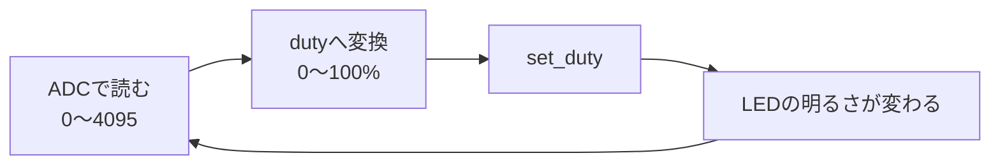

## このページでできるようになること

- 実行中に`set_duty`を呼んでLEDの明るさを変えられる
- センサ値からduty比を計算してLEDへ反映する流れを書ける
- duty比と「見た目の明るさ」が比例しない理由を説明できる

## 先に結論

LEDの調光は、LEDCの設定を一度済ませたあと、ループの中で`set_duty(0〜100)`を呼ぶだけです。ポイントは「設定は1回、dutyの変更は何度でも」という役割分担です。ADCの読み値（0〜4095）を0〜100%へ変換して渡せば、つまみ連動の調光になります。またLEDに送るエネルギーはduty比に比例しますが、人間の目の感度は暗い側ほど敏感なので、見た目の明るさはdutyに比例しません。

## 身近なたとえ

自転車のギアを思い出してください。走り出す前にギアの仕組みを組み立てる人はいません。組み立て（LEDCの設定）は最初に1回だけで、走りながら変えるのはギアの段（duty比）だけです。

ただしギアと違い、dutyは0〜100の連続的な値をいつでも何度でも変えられます。切り替えにガチャンという段差もなく、波形の次の周期から新しいdutyが反映されます。

## 仕組み

ループの各周回でやることは3つです。



変換式は前々ページで学んだ「掛けてから割る」整数演算です。

**duty(%) = 生値 × 100 ÷ 4095**

### 目の感度は直線的ではない

duty 50%のLEDは、100%のちょうど半分のエネルギーで光ります。しかし見た目には「半分の明るさ」よりかなり明るく感じます。人間の目は暗い光の変化に敏感で、明るい光の変化には鈍いからです。duty 1%→10%の変化は劇的に見え、90%→100%はほとんど分かりません。

均等な明るさの階段を作りたい場合は、dutyを2乗カーブなどで割り当てる補正（ガンマ補正と呼ばれます）を使いますが、まずは「比例しない」ことを知っていれば十分です。

## RustとEmbassyではどう書くか

`examples/13-adc-pwm`のメインループがこのページの内容そのものです（抜粋。設定部分は[前ページ](/embassy-esp32-c6/part07/04-pwm/)のとおり）。

```rust
loop {
    // ADCを1回読む（12bitなので0〜4095）
    let raw: u16 = adc1.read_oneshot(&mut pot_pin).await;

    // ADCの読み値(0〜4095)をデューティ比(0〜100%)に変換する
    // 校正の補正でわずかに4095を超えることがあるためmin(100)で上限を保証
    let duty_pct = ((raw as u32 * 100) / 4095).min(100) as u8;
    channel0.set_duty(duty_pct).unwrap();

    info!("ADC生値 = {raw:4}, PWMデューティ = {duty_pct:3}%");

    Timer::after(Duration::from_millis(500)).await;
}
```

## コードを一行ずつ読む

```rust
let duty_pct = ((raw as u32 * 100) / 4095).min(100) as u8;
```

この1行に3つの工夫が詰まっています。

- `raw as u32 * 100` — `u16`のまま掛けるとあふれる可能性があるため、先に`u32`へ広げます
- `/ 4095` — 割るのは掛けたあと。順序を逆にすると整数演算では0になります
- `.min(100)` — `AdcCalBasic`の校正は読み値を補正するため、まれに4095をわずかに超える値が返ります。そのまま変換すると101になり、`set_duty`がエラーを返します。上限を100で固定して防ぎます

```rust
channel0.set_duty(duty_pct).unwrap();
```

- dutyの更新は軽い処理で、ループ内で何度呼んでも問題ありません。`.min(100)`で引数の範囲を保証済みなので、ここでの失敗は設計上起こりません。それが`unwrap()`を許した理由です

```rust
Timer::after(Duration::from_millis(500)).await;
```

- `await`で待っている間もLEDCはハードウェアなので波形を出し続けます。CPUが待っていてもLEDは消えません。ここがCPUループでHigh/Lowを作る方式との決定的な違いです

## 配線

前ページのLED配線に、第1ページの可変抵抗を加えます。

```text
可変抵抗:  端A ── 3V3 / 中央 ── GPIO2 / 端B ── GND
LED:      GPIO10 ──[330Ω]──▶|── GND
```

## 実行方法

```bash
cargo run --release
```

つまみを回すとLEDの明るさが連続的に変わり、シリアルに生値とdutyが表示されます。

```text
INFO - ADC生値 = 1023, PWMデューティ =  24%
INFO - ADC生値 = 4095, PWMデューティ = 100%
```

## よくある失敗

- **つまみを回しても明るさの反応が遅い**: ループの待ち時間が500msなので、更新は0.5秒ごとです。`from_millis(50)`程度に縮めると滑らかに追従します
- **`.min(100)`を外すとたまにパニックする**: 校正済みの読み値が4095を超えた瞬間、dutyが101になり`set_duty`が`Err`を返すためです。「ありえない値が来ても壊れない」ように上限を保証するのは、センサ入力を扱う際の基本です
- **暗い側の変化が急すぎる**: 目の感度が非直線だからです。故障ではありません。気になる場合はdutyに2乗カーブを掛ける補正を試してください（確認問題の下の「やってみよう」参照）

## やってみよう

つまみを使わない「呼吸するLED」に改造してみましょう。ループを「`duty_pct`を0から100まで2ずつ増やし、100に達したら0に戻す。待ち時間は20ms」に書き換えます。`set_duty`と`Timer::after`の使い方は上のコードと同じです。じわっと明るくなって急に暗く戻る、のこぎり波の調光になります。

## 確認問題

1. LEDCの「設定」と「dutyの変更」は、それぞれ何回・いつ行いますか。
2. `.min(100)`がないと、どんなときに何が起きますか。
3. duty 50%のLEDが「半分の明るさ」に見えないのはなぜですか。

<details>
<summary>答え</summary>

1. 設定（タイマーとチャンネルの`configure`）は起動時に1回、dutyの変更（`set_duty`）はループ内で何度でも行います。
2. 校正の補正で読み値が4095を少し超えたとき、変換結果が101になり`set_duty`が`Err`を返します。`unwrap()`しているのでパニックして止まります。
3. LEDに送られるエネルギーはdutyに比例しますが、人間の目は暗い光ほど敏感なため、見た目の明るさは比例しません。

</details>

## まとめ

- 調光は「設定1回、`set_duty`は何度でも」。ハードウェアが波形を維持するのでawait中も光り続ける
- 生値→dutyの変換は`(raw as u32 * 100 / 4095).min(100)`。型の拡張・計算順序・上限保証の3点セット
- 見た目の明るさはdutyに比例しない（目の感度は非直線）

## 次のページ

同じPWMでも、周波数とパルス幅の使い方を変えるとサーボモーターの角度を制御できます。LEDとはまったく違う「パルス幅＝命令」の世界です。

- 前: [4. PWMとは何か](/embassy-esp32-c6/part07/04-pwm/)
- 次: [6. サーボ制御](/embassy-esp32-c6/part07/06-servo/)
