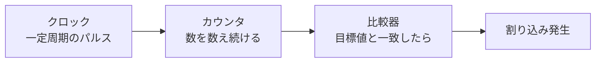
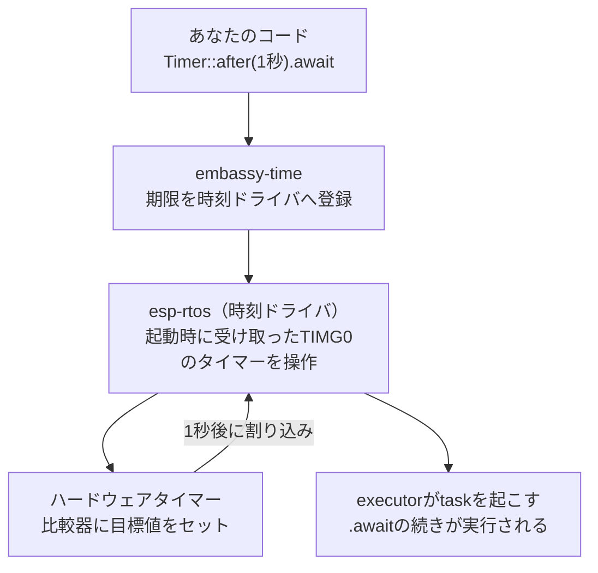

## このページでできるようになること

- ESP32-C6が持つタイマーの種類（systimer・TIMG・WDT）を挙げられる
- 「カウンタ＋比較器＋割り込み」というタイマーの基本構造を説明できる
- `Timer::after(...).await`の裏で何が起きているかを層で説明できる

## 先に結論

`Timer::after`で正確に待てるのは、チップの中で**ハードウェアタイマー**が休まず時を刻んでいるからです。ESP32-C6には主に3種類あります。**systimer**（52bitの時刻カウンタ）、**汎用タイマーTIMG×2**（54bit、自由に使えるストップウォッチ）、**ウォッチドッグタイマーWDT×3**（[第6部 10.](/embassy-esp32-c6/part06/10-watchdog/)の番犬）です。どれも「カウンタが数を数え、目標値と一致したら割り込みを出す」という同じ原理で動きます。この教材の構成では、起動時の`esp_rtos::start(timg0.timer0, ...)`でTIMG0のタイマーをesp-rtosへ渡し、これがEmbassyの時間APIの土台（時刻ドライバ)になっています。

## 身近なたとえ

ハードウェアタイマーはキッチンタイマーです。「3分後に鳴らして」とセットしたら、あとは料理（他の処理）に集中できます。時間が来ればベル（割り込み）が鳴って知らせてくれます。CPUが自分で秒を数える必要はありません。

ただしキッチンタイマーと違い、ハードウェアタイマーのカウンタは止まらず増え続ける「通し番号の時計」としても使えます。「あと3分」だけでなく「起動から今まで何マイクロ秒経ったか」も分かる点が違いです。

## 仕組み

### タイマーの基本構造

どのタイマーも中身は同じ3点セットです。



- **カウンタ**: クロックのパルスを1つずつ数える。ビット数が大きいほど長い時間を折り返しなしで数えられます
- **比較器（アラーム）**: 「カウンタがこの値になったら知らせて」という目標値を持ち、一致で割り込みを出します

### ESP32-C6の3種類のタイマー

| 種類 | 数・ビット幅 | 主な役割 |
|---|---|---|
| systimer | 52bit | システム全体の時刻の基準。常に走り続ける「時計」 |
| 汎用タイマー（TIMG0/TIMG1） | 各54bit | 自由に使える汎用の「ストップウォッチ」。分周・アラーム設定が柔軟 |
| ウォッチドッグ（WDT） | 3個 | 一定時間内に「生きてる」報告がなければリセットする監視役 |

- **systimer**は「今何時か」を答えるための装置です。折り返しまで数十年オーダーの余裕があり、時刻の基準として使われます
- **TIMG**（Timer Group、タイマーグループ）は2グループあり、それぞれ54bitの汎用タイマーとウォッチドッグを含みます。「時計」と「ストップウォッチ」の関係で覚えると区別しやすいです
- [7. 周波数の選び方](/embassy-esp32-c6/part07/07-frequency/)で使ったLEDCのタイマーは、これらとは別の「波形を作る専用タイマー」です。時を測る装置と波を作る装置は別物です

### Timer::afterの裏側

[第6部 7. Timerで待つ](/embassy-esp32-c6/part06/07-timer/)で使った`Timer::after`は、次の層の積み重ねで動いています。



awaitで待っている間、CPUはこのtaskを完全に手放して他のtaskを実行できます。時間の見張りはハードウェアが引き受けているからです。「ソフトウェアの時間API」と「ハードウェアの時計」をつなぐ部品を**時刻ドライバ**と呼び、この教材の構成ではesp-rtosがその役を担います。

## RustとEmbassyではどう書くか

実はすべてのexampleに、この配線がすでに書かれています（`examples/13-adc-pwm`より抜粋）。

```rust
use esp_hal::timer::timg::TimerGroup;

let timg0 = TimerGroup::new(peripherals.TIMG0);
let sw_interrupt = SoftwareInterruptControl::new(peripherals.SW_INTERRUPT);
esp_rtos::start(timg0.timer0, sw_interrupt.software_interrupt0);
```

## コードを一行ずつ読む

```rust
let timg0 = TimerGroup::new(peripherals.TIMG0);
```

- タイマーグループ0のドライバを作ります。`timg0.timer0`がその中の54bit汎用タイマーです

```rust
esp_rtos::start(timg0.timer0, sw_interrupt.software_interrupt0);
```

- タイマーの**所有権をesp-rtosへ渡します**。以降、このタイマーはEmbassyの時間の土台として専有され、あなたのコードが直接触ることはありません。「時計係を1人任命したら、他の人はその時計をいじらない」という所有権の考え方がここでも効いています

タイマーを直接操作する低レベルAPI（アラームの手動設定など）はこの教材では扱いません。Embassyの`Timer`/`Ticker`/`Instant`([第9部 6.](/embassy-esp32-c6/part09/06-embassy-time/)で詳説)を使えば、ハードウェアの違いを意識せずに済みます。

## 実行方法

新しいコードはありません。任意のexample（例: `examples/13-adc-pwm`）を動かし、「この`Timer::after`の裏でTIMG0が時を刻んでいる」と意識して眺めてみてください。

```bash
cargo run --release
```

## よくある失敗

- **`esp_rtos::start`を呼び忘れて`Timer::after`が動かない**: 時刻ドライバが初期化されていないと、Embassyの時間APIは機能しません。テンプレートの初期化2行を消さないでください
- **「awaitで待つ＝CPUがループで数えている」と誤解する**: 数えているのはハードウェアです。CPUは他のtaskを実行するか、やることがなければ待機します。だからこそ複数のtaskが同時に「待てる」のです
- **LEDCのタイマーとTIMGを混同する**: 名前は同じ「タイマー」ですが、LEDCのタイマーはPWM波形の周期を作る装置、TIMG/systimerは時間を測る装置です。番号も設定APIも別物です

## やってみよう

`Timer::after`の待ち時間を`from_micros(100)`（0.1ミリ秒）にして、ログの流れる速さを見てみましょう。マイクロ秒単位の指定がそのまま効くのは、裏の54bitカウンタが十分細かく速く時を刻んでいるからです。

## 確認問題

1. タイマーの基本構造を3つの部品で説明してください。
2. systimerとTIMGの役割の違いを「時計」と「ストップウォッチ」の言葉で説明してください。
3. `Timer::after(1秒).await`の間、CPUは何をしていますか。

<details>
<summary>答え</summary>

1. クロックを数える「カウンタ」、目標値との一致を見張る「比較器」、一致したときに知らせる「割り込み」です。
2. systimerはシステム共通の時刻の基準となる走りっぱなしの「時計」、TIMGは分周やアラームを自由に設定して使える汎用の「ストップウォッチ」です（ウォッチドッグも内蔵します）。
3. そのtaskを手放して、他のtaskを実行しています（やることがなければ待機します）。1秒の見張りはハードウェアタイマーと割り込みが担当します。

</details>

## まとめ

- タイマーは「カウンタ＋比較器＋割り込み」。ESP32-C6にはsystimer（52bit）・TIMG×2（54bit）・WDT×3がある
- `esp_rtos::start(timg0.timer0, ...)`がタイマーをesp-rtosへ渡し、Embassyの時間APIの土台になる
- awaitの待ち時間はハードウェアが数える。CPUは他のtaskに使われる

## 次のページ

第7部の総仕上げです。ADC・変換・PWMを1本のプログラムに統合し、つまみでLEDを調光する小さな制御装置を完成させます。

- 前: [8. duty比の計算](/embassy-esp32-c6/part07/08-duty/)
- 次: [10. 小さな制御プロジェクト](/embassy-esp32-c6/part07/10-mini-project/)
