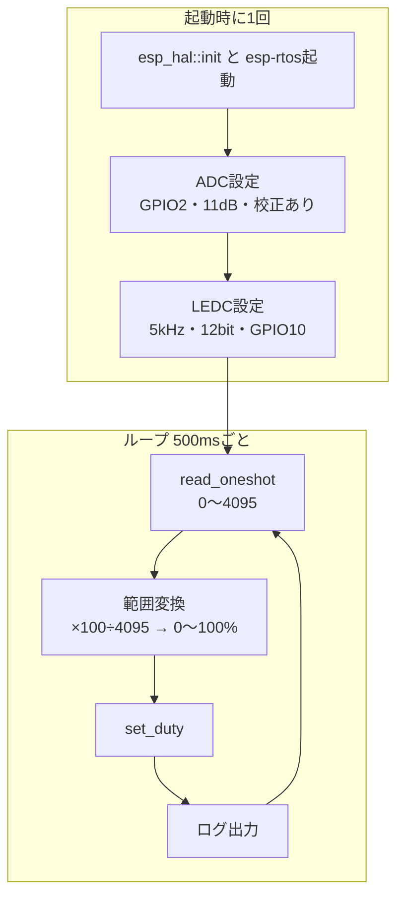

## このページでできるようになること

- ADCの読み取り・範囲変換・PWM出力を1本のプログラムに統合できる
- 「入力 → 変換 → 出力」という制御プログラムの基本形を説明できる
- 完成したコードを土台に、自分の変更（しきい値でのモード切替など）を加えられる

## 先に結論

第7部で学んだ部品を全部つなげます。**ADCで読む**（1ページ）→ **分圧で電圧が決まる**（2ページ）→ **値を変換する**（3・8ページ）→ **PWMで出す**（4・5ページ）。この「入力 → 変換 → 出力」を一定間隔で繰り返す形は、温度制御も明るさ制御もロボットも同じ、**制御プログラムの基本形**です。今回のコードは全体で100行足らずで、そのすべてをあなたはもう読めます。

## 身近なたとえ

シャワーの温度調節を思い出してください。手でお湯の温度を感じ（入力）、頭の中で「もう少し熱く」と判断し（変換）、蛇口をひねる（出力）。これを無意識に繰り返しています。今日作るのは、この「感じて・判断して・動かす」のループを電子部品で組んだものです。

ただし今回の装置の「判断」は比例計算だけの素直なものです。目標との差を見て調整し続ける本格的な制御（フィードバック制御）はまだ登場しません。その入り口に立った、と考えてください。

## 仕組み

プログラム全体の流れです。



第7部の各ページとの対応がそのまま章立てになっています。設定は1回、ループは「読む・変換・出す」の3拍子です。

## RustとEmbassyではどう書くか

今回は抜粋ではなく全文を載せます。`examples/13-adc-pwm/src/main.rs`と同一で、cargo check済みのコードです。

```rust
#![no_std]
#![no_main]

use embassy_executor::Spawner;
use embassy_time::{Duration, Timer};
use esp_backtrace as _;
use esp_hal::analog::adc::{Adc, AdcCalBasic, AdcConfig, Attenuation};
use esp_hal::clock::CpuClock;
use esp_hal::gpio::DriveMode;
use esp_hal::interrupt::software::SoftwareInterruptControl;
use esp_hal::ledc::channel::ChannelIFace;
use esp_hal::ledc::timer::TimerIFace;
use esp_hal::ledc::{LSGlobalClkSource, Ledc, LowSpeed, channel, timer};
use esp_hal::peripherals::ADC1;
use esp_hal::time::Rate;
use esp_hal::timer::timg::TimerGroup;
use log::info;

// esp-idf形式ブートローダが要求するアプリ記述子
esp_bootloader_esp_idf::esp_app_desc!();

// ADCの校正方式。AdcCalBasicは「0Vのときに読み値が0になる」ようにバイアスを補正する
// いちばん基本的な校正です（補正値はチップ内のeFuseから読み出されます）
type AdcCal = AdcCalBasic<ADC1<'static>>;

#[esp_rtos::main]
async fn main(_spawner: Spawner) -> ! {
    let config = esp_hal::Config::default().with_cpu_clock(CpuClock::max());
    let peripherals = esp_hal::init(config);

    esp_println::logger::init_logger_from_env();

    let timg0 = TimerGroup::new(peripherals.TIMG0);
    let sw_interrupt = SoftwareInterruptControl::new(peripherals.SW_INTERRUPT);
    esp_rtos::start(timg0.timer0, sw_interrupt.software_interrupt0);

    // --- ADCの設定 ---
    // GPIO2をADC1の入力として有効化。減衰11dBで0V〜約3.3Vの範囲を測定できる
    let mut adc1_config = AdcConfig::new();
    let mut pot_pin =
        adc1_config.enable_pin_with_cal::<_, AdcCal>(peripherals.GPIO2, Attenuation::_11dB);
    // into_async()で非同期版に変換。読み取り中はawaitで他のタスクに実行を譲れる
    let mut adc1 = Adc::new(peripherals.ADC1, adc1_config).into_async();

    // --- LEDC(PWM)の設定 ---
    let mut ledc = Ledc::new(peripherals.LEDC);
    ledc.set_global_slow_clock(LSGlobalClkSource::APBClk);

    // タイマー0を「5kHz・12bit分解能」に設定。
    // 12bit = デューティを0〜4095の4096段階で表せる、という意味
    let mut lstimer0 = ledc.timer::<LowSpeed>(timer::Number::Timer0);
    lstimer0
        .configure(timer::config::Config {
            duty: timer::config::Duty::Duty12Bit,
            clock_source: timer::LSClockSource::APBClk,
            frequency: Rate::from_khz(5),
        })
        .unwrap();

    // チャンネル0にGPIO10を割り当て、タイマー0とひも付ける（最初はデューティ0% = 消灯）
    let mut channel0 = ledc.channel(channel::Number::Channel0, peripherals.GPIO10);
    channel0
        .configure(channel::config::Config {
            timer: &lstimer0,
            duty_pct: 0,
            drive_mode: DriveMode::PushPull,
        })
        .unwrap();

    info!("ポテンショメータを回してLEDの明るさを変えてみましょう");

    loop {
        // ADCを1回読む（12bitなので0〜4095）
        let raw: u16 = adc1.read_oneshot(&mut pot_pin).await;

        // ADCの読み値(0〜4095)をデューティ比(0〜100%)に変換する
        // 校正の補正でわずかに4095を超えることがあるためmin(100)で上限を保証
        let duty_pct = ((raw as u32 * 100) / 4095).min(100) as u8;
        channel0.set_duty(duty_pct).unwrap();

        info!("ADC生値 = {raw:4}, PWMデューティ = {duty_pct:3}%");

        Timer::after(Duration::from_millis(500)).await;
    }
}
```

## コードを一行ずつ読む

新しい行はありません。復習として、各ブロックの出典ページを確認してください。

| ブロック | 学んだページ |
|---|---|
| `esp_rtos::start(timg0.timer0, ...)` | [9. ハードウェアタイマー](/embassy-esp32-c6/part07/09-hw-timer/) |
| `AdcConfig` 〜 `into_async()` | [1. ADCで電圧を読む](/embassy-esp32-c6/part07/01-adc/) |
| `Ledc` 〜 `channel0.configure` | [4. PWMとは何か](/embassy-esp32-c6/part07/04-pwm/) |
| `read_oneshot` | [1. ADCで電圧を読む](/embassy-esp32-c6/part07/01-adc/) |
| `((raw as u32 * 100) / 4095).min(100)` | [8. duty比の計算](/embassy-esp32-c6/part07/08-duty/) |
| `set_duty` | [5. LEDの明るさを変える](/embassy-esp32-c6/part07/05-led-brightness/) |

全体を通して読めたなら、第7部の目標は達成です。

## 配線

```text
可変抵抗:  端A ── 3V3 / 中央（ワイパー）── GPIO2 / 端B ── GND
LED:      GPIO10 ──[330Ω]──▶|── GND
```

- 配線はUSBケーブルを抜いた状態で行います
- 可変抵抗は必ず3V3から。5Vは使いません

## 実行方法

```bash
cd examples/13-adc-pwm
cargo run --release
```

つまみを回すとLEDの明るさが連動して変わり、シリアルに状態が流れます。

```text
INFO - ポテンショメータを回してLEDの明るさを変えてみましょう
INFO - ADC生値 =    12, PWMデューティ =   0%
INFO - ADC生値 = 2051, PWMデューティ =  50%
INFO - ADC生値 = 4095, PWMデューティ = 100%
```

## よくある失敗

- **LEDが最大でも暗い**: 抵抗が330Ωより大きい（例: 10kΩを誤用）と電流が絞られます。カラーコードを確認してください
- **つまみと明るさが逆に動く**: 可変抵抗の3V3とGNDが逆です。壊れてはいないので、配線を入れ替えるか、変換式を`100 - duty_pct`にする手もあります
- **明るさがときどきちらつく**: ワイパーの接触ノイズです。[3. センサ値を整える](/embassy-esp32-c6/part07/03-sensor-reading/)の移動平均を組み込むと安定します
- **`use of moved value`でコンパイルエラー**: GPIO2やGPIO10を他の場所でも使おうとしています。ピンの所有権はADC設定・LEDC設定へムーブ済みです

## やってみよう（演習: しきい値でモード切替）

このプロジェクトに「判断」を1つ足してみましょう。**つまみを9割以上に回したら、調光をやめてLEDを点滅させる**警告モードを作ります。

方針だけ示します（第2〜3部の知識で書けます）。

1. ループ内で`raw`を読んだ直後に`if raw > 3700 { ... } else { ... }`で分岐する
2. しきい値超えの側では`set_duty(100)`と`set_duty(0)`を`Timer::after(Duration::from_millis(100)).await`を挟んで交互に呼ぶ
3. しきい値以下の側は今までどおりの調光

さらに余力があれば、[第3部 2. enum](/embassy-esp32-c6/part03/02-enum/)で学んだ`enum Mode { Dimming, Alarm }`を導入し、現在のモードをログに出してみてください。状態をenumで表す設計は[第4部 9. 状態機械](/embassy-esp32-c6/part04/09-state-machine/)の実践になります。

## 確認問題

1. このプログラムの「入力・変換・出力」は、それぞれどの処理ですか。
2. 設定（configure）とループ内の処理（set_duty）を分けている理由は何ですか。
3. awaitで500ms待っている間、LEDが消えないのはなぜですか。

<details>
<summary>答え</summary>

1. 入力は`read_oneshot`によるADC読み取り、変換は`raw × 100 ÷ 4095`の範囲変換、出力は`set_duty`によるPWM更新です。
2. 周波数や分解能などの設定は一度決めれば変わらないのに対し、dutyは毎回変わるからです。重い準備を1回で済ませ、ループでは軽い更新だけを繰り返します。
3. PWM波形はLEDCというハードウェアが作り続けているからです。CPUが待っていても、設定済みのdutyで出力は維持されます。

</details>

## まとめ

- 制御プログラムの基本形は「入力 → 変換 → 出力」の繰り返し。今回はADC → 範囲変換 → PWM
- 設定は起動時に1回、ループでは軽い更新だけ。ハードウェア（ADC・LEDC・タイマー）が重労働を担う
- この形は温度制御にもモーター制御にも拡張できる。しきい値と状態（enum）を足せば「判断」も加わる

## 次のページ

第7部はここまでです。第8部では、マイコンが外の世界の「別の装置」と会話するための有線通信（UART・I2C・SPI・TWAI）に進みます。最初はもっとも基本的なUARTからです。

- 前: [9. ハードウェアタイマー](/embassy-esp32-c6/part07/09-hw-timer/)
- 次: [第8部 1. UART基礎](/embassy-esp32-c6/part08/01-uart-basics/)
