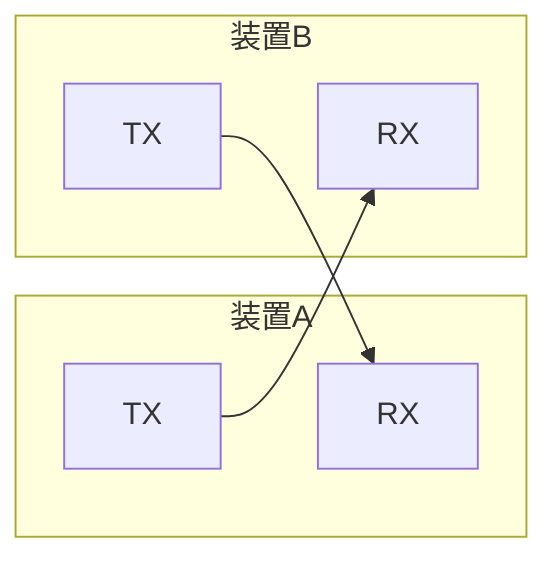

## このページでできるようになること

- UART（Universal Asynchronous Receiver/Transmitter）の役割とTX/RXの意味を説明できる
- ボーレートとは何か、なぜ双方で一致させる必要があるのかを説明できる
- esp-halで`Uart`を初期化し、ループバック実験でデータを送受信できる

## 先に結論

UARTは、TX（送信）とRX（受信）の2本の信号線でバイト列をやり取りする、最も基本的なシリアル通信です。クロック線がない代わりに、送る側と受け取る側が**ボーレート**（1秒あたりのビット数）を事前に約束しておきます。配線は必ず「自分のTX → 相手のRX」と交差させます。ESP32-C6にはHP UARTが2つ（UART0/UART1）とLP UARTが1つありますが、UART0（GPIO16/17）はログ表示用コンソールとして使用中なので、実験にはUART1を使います。このページでは自分のTXとRXを直結する**ループバック**で、外部機器なしに送受信を確かめます。

## 身近なたとえ

UARTは「2本のパイプでつながった手紙のやり取り」です。自分が出す手紙用のパイプ（TX）と、相手から届く手紙用のパイプ（RX）が別々にあるので、同時に送りも受けもできます。ボーレートは「1秒間に何文字読むか」の約束で、片方が速口すぎると相手は文字を聞き取れません。

ただし実際のUARTがやり取りするのは文字ではなく**ビット（0と1の電圧変化）**で、約束が合わないと「文字化けした別のバイト」として受信されてしまう点が、たとえとの違いです。

## 仕組み

UARTは1バイトを次のような**フレーム**にして、決まった速さで1ビットずつ送ります。

```text
アイドル(High) ──┐  ┌──┬──┬──┬──┬──┬──┬──┬──┐  ┌── アイドル(High)
                │S │D0│D1│D2│D3│D4│D5│D6│D7│ST│
                └──┴──┴──┴──┴──┴──┴──┴──┴──┴──┘
   S  = スタートビット（Lowに下がって「今から送る」の合図）
   D0-D7 = データ8ビット（最下位ビットから順に）
   ST = ストップビット（Highに戻って「1バイト終わり」）
```

- **ボーレート**: 1秒あたりのビット数です。教材では定番の115200bps（bits per second）を使います。1バイトはスタート・ストップ込みで10ビットなので、理論上は毎秒約11520バイト送れます
- **非同期（Asynchronous）**: クロック線を共有しない方式です。受信側はスタートビットの立ち下がりを検出し、そこから「約束した速さ」で各ビットの中央を読み取ります。だからボーレートがずれると受信が壊れます
- **TXとRXの交差**: TXは出口、RXは入口です。2台をつなぐときは必ずA.TX→B.RX、B.TX→A.RXと交差させます。実は第1部から使ってきたシリアルモニタも、UART0がUSB変換チップ（CP2102N）と交差配線されて動いています



ESP32-C6のUARTは次のとおりです（データシートより）。

| UART | 用途 |
|---|---|
| UART0（GPIO16 TX / GPIO17 RX） | シリアルモニタ用コンソール。実験に使わない |
| UART1 | 自由に使える。教材ではTX=GPIO23、RX=GPIO22に割り当て |
| LP UART | 低消費電力領域用。この教材では扱わない |

## Arduinoではどう書くか

Arduinoの`Serial.begin(115200)`と`Serial.println()`がまさにUARTです。2つ目のポートは`Serial1.begin()`のように使います。役割は同じで、「どのピンをどのUARTに割り当てるか」を自分で書くのがesp-halとの違いです。

## RustとEmbassyではどう書くか

UART1を115200bpsで構え、メッセージを送って自分で受け取ります。これは抜粋です。完全なコードは `examples/03-uart` を見てください。

```rust
use esp_hal::uart::{Config as UartConfig, Uart};

// UART1を115200bpsで初期化し、TX=GPIO23 / RX=GPIO22 を割り当てて
// into_async()で非同期モードに切り替える
let uart_config = UartConfig::default().with_baudrate(115_200);
let mut uart = Uart::new(peripherals.UART1, uart_config)
    .expect("UARTの設定が不正です")
    .with_tx(peripherals.GPIO23)
    .with_rx(peripherals.GPIO22)
    .into_async();
```

送受信のループはこう書きます（同じく抜粋）。

```rust
const MESSAGE: &str = "Hello, UART! from ESP32-C6\r\n";
let mut buf = [0u8; MESSAGE.len()];

loop {
    // 送信: 全バイト書き終わるまで待つ
    if let Err(e) = uart.write_all(MESSAGE.as_bytes()).await {
        error!("送信エラー: {:?}", e);
    }
    // 受信やタイムアウト処理は次のページで詳しく読みます
    // ...
}
```

## コードを一行ずつ読む

```rust
let uart_config = UartConfig::default().with_baudrate(115_200);
```

- 既定の設定からボーレートだけを115200に変えています。この数字が「双方の約束」です

```rust
let mut uart = Uart::new(peripherals.UART1, uart_config)
    .expect("UARTの設定が不正です")
    .with_tx(peripherals.GPIO23)
    .with_rx(peripherals.GPIO22)
    .into_async();
```

- `Uart::new`は`Result`を返します。設定値が不正だと失敗するためです。初期化直後で失敗が設計上ありえない箇所なので、ここでは`expect`で止めます
- `.with_tx(...)` / `.with_rx(...)` — GPIOピンの所有権をUARTへムーブして割り当てます。GPIOの章で学んだ「二重利用はコンパイルエラー」の仕組みがここでも働きます
- `.into_async()` — 割り込みベースの非同期モードに切り替えます。`await`で待てるようになります

```rust
uart.write_all(MESSAGE.as_bytes()).await
```

- `write_all`は`embedded-io-async`の`Write`トレイトのメソッドで、**全バイトを書き終わるまで**待ちます。似た名前の`write`は一部しか書かずに戻ることがあるため、`write_all`を使います

## 配線

ループバック実験は、自分のTXを自分のRXへつなぐだけです。

```text
GPIO23 (TX) ────ジャンパ線──── GPIO22 (RX)
```

- 配線はUSBケーブルを抜いた状態で行います
- GPIO16/17（UART0）には何もつなぎません。ログ表示に使用中です

## 実行方法

```bash
cd examples/03-uart
cargo run --release
```

1秒ごとに次のようなログが出れば成功です。

```text
INFO - UARTループバックを開始します（GPIO23とGPIO22を直結してください）
INFO - 受信: Hello, UART! from ESP32-C6
INFO - 受信: Hello, UART! from ESP32-C6
```

## よくある失敗

- **「受信タイムアウト」の警告が出続ける**: GPIO23とGPIO22がつながっていません。TXから出た信号は、配線がなければどこにも届かないためです
- **UART0のピン（GPIO16/17）を実験に使ってしまう**: UART0はシリアルモニタが使用中です。ここに別の配線をするとログが壊れたり、書き込みに失敗したりします
- **2台をつなぐときTX同士・RX同士を接続**: 出口と出口をつないでも信号は届きません。必ずTX→RXと交差させます
- **ボーレートの不一致**: 相手が9600bpsで自分が115200bpsだと、電圧変化を読む速さがずれ、意味のないバイト列（文字化け）になります

## やってみよう

`MESSAGE`を自分の好きな文字列に変えて実行してみましょう。受信バッファ`buf`の長さが`MESSAGE.len()`で自動的に追従することも確認してください。5分でできます。

## 確認問題

1. UARTに「クロック線」がないのに、受信側が正しくビットを読み取れるのはなぜですか。
2. 2台のマイコンをUARTでつなぐとき、配線を「交差」させるのはなぜですか。
3. この実験でUART0ではなくUART1を使うのはなぜですか。

<details>
<summary>答え</summary>

1. 送受信双方が同じボーレートを事前に約束していて、受信側はスタートビットの立ち下がりを基準に、約束した間隔で各ビットを読み取るからです。
2. TXは送信の出口、RXは受信の入口だからです。自分の出口を相手の入口へつながないとデータが届きません。
3. UART0（GPIO16/17）はログ表示用のコンソールとしてすでに使われているからです。実験用には空いているUART1を使います。

</details>

## まとめ

- UARTはTX/RXの2本線でバイト列を送る非同期シリアル通信。双方のボーレートを一致させる
- 配線は必ず「TX→相手のRX」に交差。ループバックなら自分のTXとRXを直結する
- C6ではUART0がコンソール用なので、実験にはUART1（TX=GPIO23、RX=GPIO22）を使う

## 次のページ

受信は「いつ届くか分からないデータを待つ」処理です。次のページでは、`await`による非同期受信と、待ちすぎを防ぐタイムアウトを学びます。

- 前: [第7部 10. 小さな制御プロジェクト](/embassy-esp32-c6/part07/10-mini-project/)
- 次: [2. UART非同期受信](/embassy-esp32-c6/part08/02-uart-async/)
