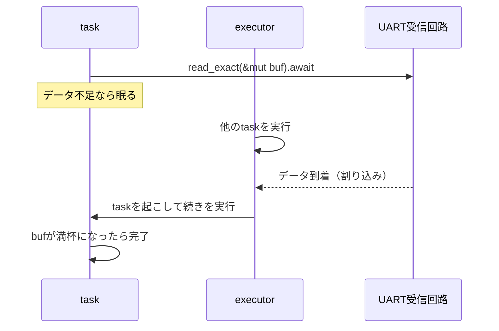

## このページでできるようになること

- 受信待ちを`await`で書くと何が良いのかを説明できる
- `embedded-io-async`の`Read`/`Write`トレイトと`read_exact`/`write_all`を使える
- `with_timeout`で「永遠に待ってしまう」受信を防げる

## 先に結論

UARTの受信データは「いつ届くか分からない」ものです。届くまでループで監視し続けると、CPUはその間ほかの仕事が何もできません。`into_async()`したUARTなら`uart.read_exact(&mut buf).await`と書くだけで、データが届くまでこのtaskは眠り、CPUは他のtaskに回ります。`read_exact`と`write_all`は`embedded-io-async`という共通トレイトのメソッドで、どのマイコンでも同じ書き方ができます。ただし`read_exact`は「バッファが満杯になるまで」待つので、配線ミスなどでデータが来ないと永遠に待ちます。`with_timeout`で待ち時間の上限を必ず付けましょう。

## 身近なたとえ

宅配便を「玄関の前に立って待つ」のが同期（ブロッキング）受信、「チャイムが鳴るまで別の用事をする」のが非同期受信です。`await`はチャイム待ちの状態で、荷物（データ）が来た瞬間に呼び出されます。

ただし実際の`await`では、待っている間に動くのは「あなたの別の用事」ではなく**同じCPU上の別のtask**である点が、たとえとの違いです。待つtaskが実行を明け渡すことで、システム全体が止まらずに済みます。

## 仕組み

`into_async()`したUARTは、受信割り込みとEmbassyの仕組みを組み合わせて動きます。



ポイントは2つです。

- **`read_exact(&mut buf)`は`buf`が満杯になるまで完了しない**: 「10バイトちょうど受け取りたい」という処理が1行で書けます。逆に言うと、9バイトしか来なければ完了しません
- **来ないものは待ち続ける**: 相手の故障や配線ミスでデータが途絶えると、そのtaskは永遠に眠ります。だから受信には[第6部 9. Timeout](/embassy-esp32-c6/part06/09-timeout/)で学んだ`with_timeout`を組み合わせます

もうひとつ、名前の話です。esp-halの`Uart`自身にも同期版の`write`/`read`メソッドがあり、トレイトのメソッドと名前が紛らわしいため、この教材では**全バイトの完了を保証する`write_all`/`read_exact`**を使います。`use embedded_io_async::{Read, Write};`でトレイトを取り込むと使えるようになります。

## RustとEmbassyではどう書くか

これは抜粋です。完全なコードは `examples/03-uart` を見てください。

```rust
use embassy_time::{Duration, Timer, with_timeout};
use embedded_io_async::{Read, Write};

let mut buf = [0u8; MESSAGE.len()];

loop {
    // 送信: write_all は embedded-io-async の Write トレイトのメソッド。
    // （writeは一部しか書き込まないことがあるため、全バイト書き込むwrite_allを使う）
    if let Err(e) = uart.write_all(MESSAGE.as_bytes()).await {
        error!("送信エラー: {:?}", e);
    }

    // 受信: read_exact はバッファがいっぱいになるまで待つ。
    // 配線を忘れると永遠に待ってしまうので、with_timeoutで500msの上限を付ける。
    match with_timeout(Duration::from_millis(500), uart.read_exact(&mut buf)).await {
        // 受信成功 → UTF-8文字列に変換して表示
        Ok(Ok(())) => match core::str::from_utf8(&buf) {
            Ok(s) => info!("受信: {}", s.trim_end()),
            Err(_) => warn!("受信したがUTF-8として不正: {:02X?}", buf),
        },
        // UARTの受信エラー（フレーミングエラーなど）
        Ok(Err(e)) => error!("受信エラー: {:?}", e),
        // タイムアウト（データが届かない）
        Err(_) => warn!("受信タイムアウト: GPIO23とGPIO22の配線を確認してください"),
    }

    Timer::after(Duration::from_secs(1)).await;
}
```

## コードを一行ずつ読む

```rust
use embedded_io_async::{Read, Write};
```

- `read_exact`/`write_all`はトレイトのメソッドなので、トレイト自体を`use`しないと呼べません。忘れるとコンパイラが「メソッドが見つからない。このトレイトをuseしては」と教えてくれます

```rust
with_timeout(Duration::from_millis(500), uart.read_exact(&mut buf)).await
```

- `read_exact`の完了と500ms経過の「早い方」で結果が決まります。戻り値は二重の`Result`です。外側がタイムアウトの有無、内側がUART自体のエラーを表します

```rust
Ok(Ok(())) => ...   // 期限内に受信成功
Ok(Err(e)) => ...   // 期限内だがUARTエラー（ノイズによるフレーミングエラーなど）
Err(_) => ...       // 期限切れ（データが来ない）
```

- 3つの結果を`match`で場合分けします。「失敗の種類ごとに対応を変える」のはResultの章で学んだ設計そのものです

```rust
match core::str::from_utf8(&buf) {
```

- 受信したのはただのバイト列です。文字列として表示するにはUTF-8として正しいか検証が必要で、`from_utf8`はそれを`Result`で返します。通信データを無検証で信用しない習慣づけです

## 実行方法

前ページと同じ配線（GPIO23とGPIO22を直結）のまま実行します。

```bash
cd examples/03-uart
cargo run --release
```

動作を確かめたら、**実行中にジャンパ線を抜いてみてください**。パニックせずに警告へ切り替わります。

```text
INFO - 受信: Hello, UART! from ESP32-C6
WARN - 受信タイムアウト: GPIO23とGPIO22の配線を確認してください
```

線を戻すと受信も復活します。エラーを「起きたら終わり」ではなく「起きても続行」として扱えるのがResult設計の力です。

## よくある失敗

- **`no method named read_exact`エラー**: `use embedded_io_async::{Read, Write};`を忘れています。トレイトのメソッドはトレイトがスコープにないと呼べません
- **タイムアウトなしで`read_exact`だけを`await`**: 配線が外れるとそのtaskは永遠に完了しません。外部からデータを受け取る処理には必ず時間の上限を付けます
- **`read_exact`のバッファ長と送信データ長の不一致**: バッファの方が長いと、足りない分が届くまで完了せずタイムアウトします。「何バイト受け取るつもりか」を意識して長さを決めます

## やってみよう

`with_timeout`の500msを50msに縮めて実行してみましょう。ループバックでは十分速く受信できるので、まだ成功するはずです。次に、送信の`write_all`をコメントアウトすると、確実にタイムアウトが観察できます。

## 確認問題

1. 受信待ちを`await`で書くと、待っている間のCPUはどうなりますか。
2. `read_exact`に`with_timeout`を組み合わせる理由は何ですか。
3. `Ok(Err(e))`はどんな状況を表しますか。

<details>
<summary>答え</summary>

1. そのtaskは眠り、executorが同じCPUで他のtaskを実行します。CPUを無駄な監視ループに使わずに済みます。
2. `read_exact`はバッファが満杯になるまで完了しないため、配線ミスや相手の故障でデータが来ないと永遠に待ってしまうからです。上限時間を付けて「来ない」ことを検出します。
3. タイムアウトはしていない（期限内に結果が出た）が、UART自体の受信エラー（フレーミングエラーなど）が起きた状況です。

</details>

## まとめ

- `into_async()`したUARTは`await`で受信を待て、待機中のCPUは他のtaskに回る
- `write_all`/`read_exact`は`embedded-io-async`トレイトのメソッド。トレイトの`use`を忘れない
- 外部からの受信には`with_timeout`で上限を付け、二重`Result`を`match`で場合分けする

## 次のページ

UARTは1対1の通信でした。次は2本の線に複数のデバイスをぶら下げられるI2C（アイ・スクエアド・シー）を学びます。センサの世界の主役です。

- 前: [1. UART基礎](/embassy-esp32-c6/part08/01-uart-basics/)
- 次: [3. I2C基礎](/embassy-esp32-c6/part08/03-i2c-basics/)
