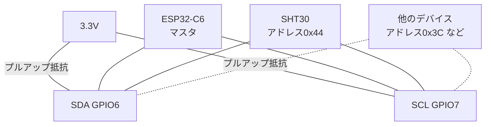

## このページでできるようになること

- I2Cの2本の線（SDA/SCL）とアドレスの役割を説明できる
- ACK/NACKが何を意味するかを説明できる
- esp-halで`I2c`を初期化し、バススキャンで接続中のデバイスを見つけられる

## 先に結論

I2C（Inter-Integrated Circuit）は、SDA（データ線）とSCL（クロック線）の2本だけで、**複数のデバイス**を1つのバスにぶら下げられるシリアル通信です。各デバイスは7ビットの**アドレス**（例: SHT30なら0x44）を持ち、マスタ（ESP32-C6）が「アドレス○○さん」と呼びかけると、該当するデバイスだけがACK（応答）を返します。ACKが返らないことをNACKといい、「そのアドレスにデバイスがいない」ことを意味します。UARTと違いクロック線を共有するので、ボーレートの約束は不要です。教材では標準モードの100kHz、SDA=GPIO6、SCL=GPIO7を使います。

## 身近なたとえ

I2Cは「1つの教室での出席確認」です。先生（マスタ）が「7番の人！」と番号で呼ぶと、7番の生徒（デバイス）だけが「はい（ACK）」と返事します。呼ばれていない生徒は黙っています。教室に何人いても、声の通り道（バス）は1つで済みます。

ただし実際のI2Cでは、返事の「はい」は声ではなく**SDA線を1クロックの間Lowに引く**という電気的な動作で、返事がなければ線はHighのまま（NACK）になる、という点がたとえとの違いです。

## 仕組み

1回の書き込み通信は次の流れです。

```text
マスタ:  START → アドレス(7bit)+W → [ACK待ち] → データ1バイト → [ACK待ち] → STOP
デバイス:                    ↑ここでSDAをLowに引く=ACK        ↑ACK
```

- **SCL（クロック線）**: マスタが「今このビットを読んで」というタイミングを刻みます。全デバイスがこれに合わせるので、速度の事前約束は不要です
- **SDA（データ線）**: アドレスもデータもACKも、この1本を双方向に使います
- **アドレス**: 7ビットなので理論上0x00〜0x7F。ただし0x00〜0x07と0x78以降は予約されていて、実際にデバイスが使えるのは**0x08〜0x77**です
- **ACK/NACK**: 各バイトの直後の1クロックで、受け取った側がSDAをLowへ引けばACK、引かなければNACKです。「呼んでもACKがない」＝「そのアドレスにデバイスがいない」と判断できます

もうひとつ大事なのが**プルアップ抵抗**です。I2Cのデバイスは線をLowへ引くことしかできない設計（オープンドレイン）なので、誰も引いていないときに線をHighへ戻す抵抗が必要です。市販のセンサモジュールの多くは基板上にプルアップ抵抗を内蔵しています。



ESP32-C6が持つI2Cコントローラは、HP I2C×1（今回使うI2C0）とLP I2C×1です。

## RustとEmbassyではどう書くか

I2C0を100kHzで構え、0x08〜0x77の全アドレスを呼んでみる**バススキャン**を動かします。これは抜粋です。完全なコードは `examples/04-i2c` を見てください。

```rust
use esp_hal::i2c::master::{Config as I2cConfig, Error as I2cError, I2c};
use esp_hal::time::Rate;

// I2C0を100kHz（標準モード）で初期化し、SDA=GPIO6 / SCL=GPIO7 を割り当てて
// into_async()で非同期モードに切り替える
let i2c_config = I2cConfig::default().with_frequency(Rate::from_khz(100));
let mut i2c = I2c::new(peripherals.I2C0, i2c_config)
    .expect("I2Cの設定が不正です")
    .with_sda(peripherals.GPIO6)
    .with_scl(peripherals.GPIO7)
    .into_async();

info!("I2Cバスをスキャンします (0x08..0x77)");
for addr in 0x08u8..0x78 {
    match i2c.write_async(addr, &[0x00]).await {
        Ok(()) => info!("  デバイスを発見: 0x{:02X}", addr),
        // ACKが返らない = そのアドレスにデバイスはいない（正常なこと）
        Err(I2cError::AcknowledgeCheckFailed(_)) => {}
        // それ以外はバス自体の異常（配線ミス・プルアップ不足など）
        Err(e) => warn!("  0x{:02X} でバスエラー: {:?}", addr, e),
    }
}
```

## コードを一行ずつ読む

```rust
let i2c_config = I2cConfig::default().with_frequency(Rate::from_khz(100));
```

- 100kHzはI2Cの標準モードで、ほぼ全デバイスが対応します。速い400kHz（ファストモード）対応デバイスもありますが、まず確実に動く速度から始めます

```rust
.with_sda(peripherals.GPIO6)
.with_scl(peripherals.GPIO7)
```

- UARTと同様、ピンの所有権をI2Cドライバへムーブします。I2Cは交差配線が不要で、SDAはSDA同士、SCLはSCL同士をつなぎます

```rust
match i2c.write_async(addr, &[0x00]).await {
```

- 「アドレス`addr`宛てに1バイト書く」を試みています。ACKが返れば`Ok`＝デバイス発見です
- 1バイト（0x00）を書くのは、esp-halのドライバが**空の書き込みをエラー（`ZeroLengthInvalid`）として拒否する**ためです。多くのデバイスは0x00を「レジスタ番号の指定」と解釈するだけで無害ですが、書き込みに反応するデバイスがまれにあるので、実運用のスキャンでは対象を絞るのが安全です

```rust
Err(I2cError::AcknowledgeCheckFailed(_)) => {}
```

- NACKは「いない番号を呼んだだけ」で、スキャンでは正常な結果です。だから何もしません。それ以外のエラーだけ警告するのが、`match`による場合分けの効いた書き方です

## 配線

SHT30モジュールを例にします。4本すべて必要です。

| SHT30モジュール | ESP32-C6 | 備考 |
|---|---|---|
| VCC（VIN） | 3.3V | **5Vにつながない** |
| GND | GND | |
| SDA | GPIO6 | |
| SCL | GPIO7 | |

- 多くのモジュールはプルアップ抵抗内蔵です。裸のセンサチップを使う場合はSDA/SCLをそれぞれ10kΩで3.3Vへプルアップします
- 配線はUSBケーブルを抜いた状態で行います

## 実行方法

```bash
cd examples/04-i2c
cargo run --release
```

```text
INFO - I2Cバスをスキャンします (0x08..0x77)
INFO -   デバイスを発見: 0x44
INFO - SHT30を検出しました。2秒ごとに温湿度を測定します
```

0x44（SHT30）が見つかれば成功です。ほかのI2Cデバイスをつなげば、そのアドレスも並びます。

## よくある失敗

- **1つもデバイスが見つからない**: SDAとSCLの入れ替わり、電源・GNDの未接続が定番です。全アドレスでNACKになるだけなのでエラーにはならず、静かに「発見0件」になります
- **全アドレスでバスエラー（NACK以外のエラー）が出る**: プルアップ抵抗がない、または配線が外れて線がHighに戻れない状態が疑われます。モジュールのプルアップ内蔵の有無を確認します
- **`write_async(addr, &[])`と空データで書いてスキャンしようとする**: esp-halは長さ0の書き込みを`ZeroLengthInvalid`エラーで拒否します。1バイト書く方式にします
- **アドレスの取り違え**: SHT30はADDRピンがGNDなら0x44、VDDなら0x45です。モジュールの配線次第で変わるので、スキャン結果で確かめるのが確実です

## やってみよう

スキャンの範囲`0x08u8..0x78`を`0x00u8..0x08`（予約領域）に変えて実行し、何も見つからないことを確かめてみましょう。終わったら必ず元に戻してください。手持ちに別のI2Cデバイス（ディスプレイ等）があれば、同じバスに追加してスキャン結果が2件になることも試せます。

## 確認問題

1. I2Cで複数のデバイスを2本の線につなげるのに、データが混ざらないのはなぜですか。
2. NACKは故障の印ではありません。バススキャンにおいてNACKは何を意味しますか。
3. UARTでは必要だった「ボーレートの約束」がI2Cで不要なのはなぜですか。

<details>
<summary>答え</summary>

1. 各デバイスが固有のアドレスを持ち、マスタがアドレスを指定して呼びかけ、該当デバイスだけが応答する決まりだからです。
2. そのアドレスにデバイスがいない（誰もACKを返さなかった）という意味です。スキャンでは大多数のアドレスがNACKになるのが正常です。
3. マスタがSCL（クロック線）でビットごとのタイミングを配るので、受け手は速度を事前に知らなくてもクロックに合わせて読み取れるからです。

</details>

## まとめ

- I2CはSDA/SCLの2本線＋アドレスで複数デバイスを1バスに接続する。教材はSDA=GPIO6、SCL=GPIO7、100kHz
- ACKはデバイスの「返事」。`AcknowledgeCheckFailed`（NACK）は「そのアドレスは不在」を表す
- バスにはプルアップ抵抗が必須（多くのモジュールは内蔵）。スキャンは1バイト書き込みで行う

## 次のページ

デバイスを見つけられたので、次はSHT30に測定コマンドを送り、温度と湿度の実データを読み出します。

- 前: [2. UART非同期受信](/embassy-esp32-c6/part08/02-uart-async/)
- 次: [4. I2Cセンサを読む](/embassy-esp32-c6/part08/04-i2c-sensor/)
