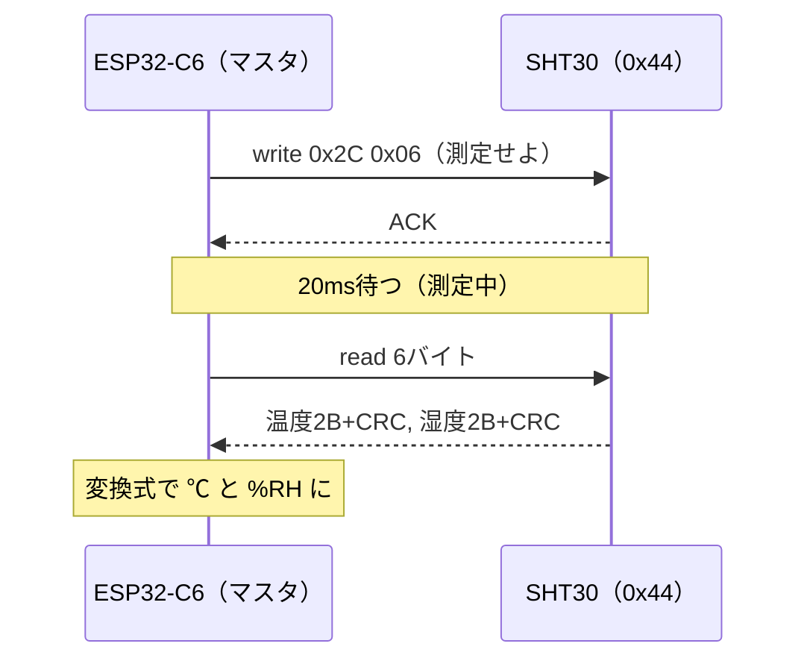

## このページでできるようになること

- 「コマンドを書く → 待つ → 結果を読む」というI2Cセンサの基本パターンを実装できる
- 受信したバイト列から物理量（温度・湿度）へ変換できる
- データシートのどこを見れば必要な情報（コマンド・待ち時間・変換式）が得られるか分かる

## 先に結論

多くのI2Cセンサは「①測定コマンドを書き込む → ②測定完了を待つ → ③結果のバイト列を読み出す → ④変換式で物理量にする」という同じパターンで動きます。SHT30の場合は、コマンド0x2C06を書き、20ms待ち、6バイト（温度2バイト＋CRC、湿度2バイト＋CRC）を読み、データシートの式で℃と%RHへ変換します。コマンドの値も待ち時間も変換式も、すべて**センサのデータシート**に書いてあります。ドライバを書くとは「データシートをコードに翻訳する」ことです。

## 身近なたとえ

証明写真機に似ています。お金を入れてボタンを押し（コマンド送信）、機械の中で処理が終わるのを待ち（測定待ち）、出てきた写真を受け取る（読み出し）。ボタンを押した瞬間に写真は出てきません。

ただしセンサの場合、「どのボタンを押すとどう動くか」「何秒待つか」が全部データシートという説明書に数値で決められていて、待ち時間を守らないと**古い結果や読み出し失敗**が返る点が、たとえとの違いです。

## 仕組み

SHT30の単発測定は、データシートで次のように決められています。

| 項目 | 値 | 出典（データシートの記述） |
|---|---|---|
| I2Cアドレス | 0x44（ADDRピン=GND時。VDD時は0x45） | アドレス表 |
| 単発測定コマンド | 0x2C 0x06（クロックストレッチ有効・高再現性） | コマンド表 |
| 測定所要時間 | 高再現性で最大15ms | タイミング表 |
| 応答データ | 温度上位・下位・CRC・湿度上位・下位・CRC の6バイト | データフォーマット |
| 温度変換式 | T[℃] = −45 + 175 × 生値 / 65535 | 変換式 |
| 湿度変換式 | RH[%] = 100 × 生値 / 65535 | 変換式 |

通信の流れを図にするとこうなります。



生値は16ビットの符号なし整数（0〜65535）で、「測定範囲全体を65536段階に割った目盛り」です。たとえば温度の生値が32768（ほぼ中央）なら、−45℃から175℃幅の中央付近、つまり約42.5℃を表します。

## RustとEmbassyではどう書くか

これは抜粋です。完全なコードは `examples/04-i2c` を見てください。

```rust
loop {
    Timer::after(Duration::from_secs(2)).await;

    // 単発測定コマンド 0x2C06（クロックストレッチ有効・高再現性）を送る。
    // I2Cではコマンドを上位バイト・下位バイトの順で送る
    if let Err(e) = i2c.write_async(SHT30_ADDR, &[0x2C, 0x06]).await {
        error!("測定コマンドの送信に失敗: {:?}", e);
        continue;
    }

    // 測定完了を待つ（高再現性測定の最大所要時間は15ms。余裕を見て20ms）
    Timer::after(Duration::from_millis(20)).await;

    // 測定結果6バイトを読み出す:
    // [温度上位, 温度下位, 温度CRC, 湿度上位, 湿度下位, 湿度CRC]
    let mut data = [0u8; 6];
    match i2c.read_async(SHT30_ADDR, &mut data).await {
        Ok(()) => {
            let raw_temp = u16::from_be_bytes([data[0], data[1]]);
            let raw_humi = u16::from_be_bytes([data[3], data[4]]);

            // データシートの変換式:
            //   温度[℃] = -45 + 175 × 生値 / 65535
            //   湿度[%RH] = 100 × 生値 / 65535
            let temp = -45.0 + 175.0 * (raw_temp as f32) / 65535.0;
            let humi = 100.0 * (raw_humi as f32) / 65535.0;

            info!("温度: {:.1} C / 湿度: {:.1} %RH", temp, humi);
        }
        Err(e) => error!("測定値の読み出しに失敗: {:?}", e),
    }
}
```

## コードを一行ずつ読む

```rust
i2c.write_async(SHT30_ADDR, &[0x2C, 0x06]).await
```

- 16ビットのコマンド0x2C06を、上位バイト0x2C・下位バイト0x06の順に2バイトで送ります。順序もデータシートの決まりです

```rust
if let Err(e) = ... { error!(...); continue; }
```

- コマンド送信に失敗したら（センサが外れた等）、この周回を`continue`で打ち切り、次の周回でまた挑戦します。1回の失敗でプログラム全体を止めない書き方です

```rust
Timer::after(Duration::from_millis(20)).await;
```

- 測定所要時間（最大15ms）に余裕を足した20msを待ちます。`await`で待つので、この間も他のtaskは動けます

```rust
let raw_temp = u16::from_be_bytes([data[0], data[1]]);
```

- 上位バイトが先に届くビッグエンディアン（be = big-endian）として2バイトを16ビット整数に組み立てます。バイト順を間違えると値が滅茶苦茶になります

```rust
let temp = -45.0 + 175.0 * (raw_temp as f32) / 65535.0;
```

- 整数の生値を`f32`へキャストしてから、データシートの式をそのまま書きます。式を「発明」する必要はありません。翻訳するだけです

なお`data[2]`と`data[5]`はCRC-8チェックサム（誤り検出符号）です。この例では検証を省略していますが、ノイズの多い環境で使うなら、受信データからCRCを計算して一致を確かめると信頼性が上がります。

## 実行方法

配線は[前ページ](/embassy-esp32-c6/part08/03-i2c-basics/)と同じです。

```bash
cd examples/04-i2c
cargo run --release
```

```text
INFO - SHT30を検出しました。2秒ごとに温湿度を測定します
INFO - 温度: 26.3 C / 湿度: 58.2 %RH
INFO - 温度: 26.4 C / 湿度: 58.0 %RH
```

センサを指でつまむと温度がじわっと上がり、息を吹きかけると湿度が跳ね上がります。実世界の値がコードに流れ込む瞬間です。

## よくある失敗

- **待ち時間を入れずにすぐ読む**: 測定が終わっていないため、センサが読み出しにNACKを返して`AcknowledgeCheckFailed`エラーになります。データシートの所要時間＋余裕を必ず待ちます
- **バイト順の誤り**: `from_be_bytes`を`from_le_bytes`にすると、温度が意味不明な値になります。I2Cセンサは上位バイト先行（ビッグエンディアン）が多数派ですが、必ずデータシートで確認します
- **変換式を整数のまま計算する**: `raw_temp / 65535`を整数演算で書くとほぼ常に0になります。`f32`へキャストしてから割ります
- **アドレス0x45のモジュールに0x44でアクセス**: ADDRピンの配線によりアドレスが変わります。前ページのスキャンで確認しましょう

## やってみよう

測定間隔を2秒から500msに縮めて、指でつまんだときの温度変化を細かく観察してみましょう。さらに`data[2]`（温度CRC）の生値を`info!`で表示して、毎回値が変わる（データに追従する）ことも見てみてください。

## 確認問題

1. 「コマンドを書いてから読み出すまでに待ち時間を入れる」のはなぜですか。
2. 生値52428のとき、温度は約何℃ですか（式: −45 + 175 × 生値 / 65535）。
3. センサドライバを書くときに最初に読むべき資料は何ですか。

<details>
<summary>答え</summary>

1. センサ内部で測定処理に時間がかかるからです。終わる前に読むと、NACKや無効なデータが返ります。
2. −45 + 175 × 52428 / 65535 ≒ −45 + 140 = 約95℃です（生値の8割は範囲の8割の位置）。
3. そのセンサのデータシートです。アドレス・コマンド・待ち時間・データ形式・変換式のすべてが載っています。

</details>

## まとめ

- I2Cセンサの基本は「コマンドwrite → 待つ → read → 変換」の4手順
- コマンド値・待ち時間・バイト列の構造・変換式はすべてデータシートが正
- 通信失敗は`continue`で受け流し、次の周回で再挑戦する設計にする

## 次のページ

ここまでエラーは「表示して続行」だけでした。次はI2Cのエラーを種類ごとに見分け、原因に応じた対処を書き分けます。

- 前: [3. I2C基礎](/embassy-esp32-c6/part08/03-i2c-basics/)
- 次: [5. I2Cのエラー処理](/embassy-esp32-c6/part08/05-i2c-errors/)
