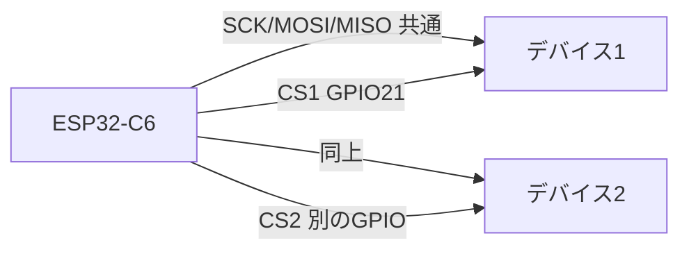

## このページでできるようになること

- 「電気的なバス共有」と「プログラム上のバス共有」が別の問題だと説明できる
- 1つのバスを複数のtaskから使うときに排他制御が必要な理由を説明できる
- `embassy-sync`のMutexで包む設計と、`embedded-hal-bus`というクレートの存在を知る

> このページは設計の考え方が中心です。掲載するコードは考え方を示す**未検証のスケッチ**で、`examples/`にはまだ対応する検証済みコードがありません。

## 先に結論

バス共有には2つの層があります。**電気的な共有**は簡単で、I2Cはアドレス、SPIはCS線の追加で複数デバイスをつなげます。難しいのは**プログラム上の共有**です。Rustでは`I2c`や`Spi`のドライバが1つしか作れず（ペリフェラルの所有権）、複数のtaskがそれを使いたいときに所有権の壁に当たります。答えは「バスを`embassy-sync`の`Mutex`で包み、使うときだけロックする」設計です。この定番パターンを部品化したのが`embedded-hal-bus`や`embassy-embedded-hal`といったクレートで、実務ではそれらを使うのが近道です。

## 身近なたとえ

家族で1台のプリンタを共有するのに似ています。紙の補充（電気的な接続）は済んでいても、2人が同時に印刷ボタンを押せば出力は混ざってしまいます。だから「使用中は他の人が待つ」という決まり（ロック）が要ります。

ただしプログラムの場合、「同時に使ってしまう」誤りを人の注意ではなく**型と所有権で防げる**のがRustの特徴で、ロックを取らないとバスに触れない構造を作れる点がたとえとの違いです。

## 仕組み

### 電気的な共有は解決済み

- **I2C**: 全デバイスが同じSDA/SCLにぶら下がり、アドレスで呼び分けます。配線の追加はゼロです
- **SPI**: SCK/MOSI/MISOは全デバイス共通で、**CS線だけをデバイスごとに1本**追加します。CSがHighのデバイスはMISOを切り離して黙っています



### プログラム上の共有が本当の問題

第6部までに学んだとおり、ペリフェラルのドライバはピンの所有権を持つため**1つしか作れません**。1つのtaskだけが使うなら、そのtaskにムーブすれば済みます。しかし「センサを読むtask」と「ディスプレイを描くtask」が同じバスを使うと、こんな事故が起こりえます。

1. task Aがデバイス1のCSをLowにして転送を始める
2. その転送の`await`中にtask Bが動き、デバイス2のCSをLowにして転送を始める
3. バス上で2つの取引が混ざり、両方のデータが壊れる

これを防ぐのが**排他制御（Mutex）**です。「バスを使う権利」を1つのロックにし、取引の間だけ借りて、終わったら返します。

### Mutexで包む設計（概念スケッチ）

次のコードは考え方を示す**未検証のスケッチ**です。そのままコピーして使わないでください。

```rust
// 概念スケッチ（未検証）: バスをMutexで包んで共有する
static SPI_BUS: Mutex<CriticalSectionRawMutex, Option<SpiBus>> = Mutex::new(None);

// taskの中:
{
    let mut bus = SPI_BUS.lock().await; // 使用権を待って獲得
    // CSをLow → 転送 → CSをHigh（この間、他のtaskは待たされる）
} // ここでロックが自動的に返される
```

大事なのは次の2点です。

- **ロックの範囲は「CSのLow区間全体」**: 転送1回ずつではなく、1回の取引全体を覆わないと、取引の途中に他のtaskが割り込めてしまいます
- **ロックはスコープを抜けると自動で返る**: 所有権とライフタイムの仕組み（[第3部 9. 借用](/embassy-esp32-c6/part03/09-borrow/)）が「返し忘れ」を防ぎます

### 車輪の再発明をしない: embedded-hal-bus

この「バス＋CS＋ロック」のパターンはあまりに定番なので、部品化したクレートがあります。

| クレート | 役割 |
|---|---|
| `embedded-hal-bus` | 1つのバスから「CS付きのデバイス」を複数切り出す標準部品（ブロッキング向けが中心） |
| `embassy-embedded-hal` | 同じ発想のasync版。`embassy-sync`のMutexでバスを共有する |

どちらも「デバイス側のドライバは`SpiDevice`（CS込みの取引単位）だけを知っていればよい」という[embedded-hal](/embassy-esp32-c6/part05/10-embedded-hal/)の考え方に沿っています。この教材のexamplesではまだ使っていないため、ここでは存在と役割の紹介にとどめます。実際に複数デバイスを使う段になったら、これらのドキュメントを読むところから始めてください。

## よくある失敗

- **ロックの範囲が狭すぎる**: 「コマンド送信」と「応答読み出し」の間でロックを手放すと、そこへ他のtaskの取引が割り込みます。取引全体を1つのロック区間にします
- **ロックを持ったまま長時間`await`する**: バスを借りたまま1秒待つようなコードは、他のtask全員をその間待たせます。待ち時間の長い処理はロックの外に出します
- **I2Cなら排他不要と思い込む**: アドレスで宛先は分かれても、「コマンド→待つ→読む」という複数回の通信からなる取引は、途中に他のtaskの通信が挟まると壊れることがあります。取引単位の排他はI2Cでも必要です

## やってみよう

コードを書かない5分の設計練習です。「SHT30（I2C温湿度センサ）を2秒ごとに読むtask」と「同じI2Cバスの別センサを10秒ごとに読むtask」が同居するプログラムを考え、(1) Mutexでロックすべき区間はどこからどこまでか、(2) ロックを持ったまま`Timer::after`で待ってよいのはどんな場合か、を紙に書き出してみてください。書けたら、このページの「よくある失敗」と見比べて答え合わせをしましょう。

## 確認問題

1. SPIで2台目のデバイスを追加するとき、増える配線は何ですか。
2. 電気的につなげるだけでは足りず、Mutexが必要になるのはどんなときですか。
3. ロックで覆うべき範囲は「転送1回」と「取引全体」のどちらですか。理由も答えてください。

<details>
<summary>答え</summary>

1. CS線1本だけです。SCK/MOSI/MISOは全デバイスで共有します。
2. 複数のtaskが同じバスを使うときです。`await`のたびに他のtaskへ実行が移るため、排他しないと取引が混ざってデータが壊れます。
3. 取引全体です。転送1回ずつのロックでは、コマンドと読み出しの間に他のtaskの通信が割り込み、デバイスの状態が崩れるからです。

</details>

## まとめ

- 電気的な共有は簡単（I2C=アドレス、SPI=CS追加）。難しいのはtask間の共有
- バスをMutexで包み、「取引全体」をロック区間にするのが定番設計
- `embedded-hal-bus`/`embassy-embedded-hal`がこのパターンの既製部品。実戦ではまずこれらを検討する

## 次のページ

ここからは自動車や産業機器で使われる通信、TWAI（CAN）です。まずは用語と配線の約束事を正確に押さえます。**トランシーバという追加部品が必須**という、これまでにない注意点が登場します。

- 前: [7. SPIデバイスを使う](/embassy-esp32-c6/part08/07-spi-device/)
- 次: [9. TWAI基礎](/embassy-esp32-c6/part08/09-twai-basics/)
