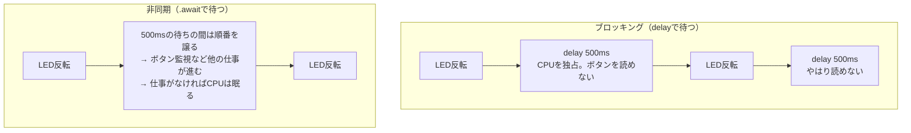

## このページでできるようになること

- 「ブロッキング（blocking）」とは何かを、自分の言葉で説明できる
- delayに頼ったloopが、プログラムが育つと破綻する理由を説明できる
- 同期処理と非同期処理の違いを、レジの行列の例と正式な用語の両方で説明できる

## 先に結論

`delay(500)`のような待ち方は、待っている間CPUを独り占めして、他の仕事を一切させません。これを**ブロッキング**と呼びます。LEDを点滅させながらボタンも読みたい、通信もしたい——仕事が増えるほど、ブロッキングは深刻な問題になります。**非同期処理**は「待ち時間になったら、他の仕事に順番を譲る」仕組みです。Embassyは、この非同期処理をマイコン上で実現するフレームワークです。

## 身近なたとえ

コンビニのレジを想像してください。お客さんが「お弁当を温めてください」と頼みました。レンジは1分かかります。

- **ブロッキングなレジ係**: レンジの前で1分間じっと待ちます。その間、行列は1ミリも進みません。
- **非同期なレジ係**: お弁当をレンジに入れたら、すぐ次のお客さんの会計を始めます。レンジが「チン」と鳴ったら、お弁当のお客さんに戻ります。

レジ係（CPU）は1人のままです。人を増やしたのではなく、**待ち時間の使い方**を変えただけです。

ただし実際のプログラムとの違いが1つあります。レジ係は自分の判断で仕事を切り替えますが、Embassyのプログラムでは、**切り替えてよい場所（`.await`）をプログラマが書いておき、切り替えの采配はexecutor（実行係）が行います**。この分担は次のページから詳しく見ていきます。

## 仕組み

時間の流れを図にすると、違いがはっきりします。LED点滅（500msごと）とボタン監視の2つの仕事がある場合です。



ブロッキング版では、500msの待ちの間ボタンを押しても反応できません。非同期版では、LEDの反転そのものは一瞬で終わり、残りの時間は他の仕事（や省電力の休み）に使えます。

用語を整理します。

| 用語 | 意味 |
|---|---|
| 同期処理 | 1つの仕事が終わるまで次へ進まない進め方 |
| ブロッキング | 待っている間、CPUが他の仕事をできない状態 |
| 非同期処理 | 待ち時間に他の仕事へ順番を譲る進め方 |
| 並行（concurrent） | 複数の仕事を切り替えながら同時に進めているように見せること |

## Arduinoではどう書くか

Arduinoの典型的なLチカはこうです。

```cpp
void loop() {
  digitalWrite(LED, HIGH);
  delay(500);              // ここで500ms、全部止まる
  digitalWrite(LED, LOW);
  delay(500);              // ここでも止まる
}
```

このままボタン読み取りを足すと、`delay`の間はボタンが効きません。Arduinoでも`millis()`で時刻を比べて自前で切り替える書き方（いわゆるノンブロッキング化）はできますが、仕事が3つ4つと増えると、時刻変数とフラグだらけの読みにくいコードになりがちです。Arduinoが悪いのではなく、**「切り替えの管理」を人間が手書きするのが大変**なのです。

## RustとEmbassyではどう書くか

Embassyでは、仕事ごとに**task**（タスク）を書き、待ちたい場所に`.await`と書くだけです。切り替えの管理はexecutorが引き受けます。

```rust
/// タスクA: LEDを500ms間隔で点滅させる
#[embassy_executor::task]
async fn blink_task(mut led: Output<'static>) {
    let mut ticker = Ticker::every(Duration::from_millis(500));
    loop {
        led.toggle();
        ticker.next().await; // 次の500msまで、他のtaskに順番を譲る
    }
}

/// タスクB: 1秒ごとにカウンタを増やしてログに表示する
#[embassy_executor::task]
async fn counter_task() {
    let mut ticker = Ticker::every(Duration::from_secs(1));
    let mut count: u32 = 0;
    loop {
        ticker.next().await;
        count += 1;
        info!("[タスクB] カウンタ = {}", count);
    }
}
```

これは抜粋です。完全なコードは examples/06-embassy-tasks を見てください。

## コードを一行ずつ読む

- `#[embassy_executor::task]` — この関数をEmbassyのtaskとして登録する印です。詳細は[taskのページ](/embassy-esp32-c6/part09/04-task/)で扱います。
- `async fn` — 「途中で順番を譲れる関数」の宣言です。次のページの主役です。
- `ticker.next().await` — ここが`delay(500)`との決定的な違いです。500ms待つのは同じですが、**待っている間CPUを独り占めしません**。

## 実行方法

```bash
cd examples/06-embassy-tasks
cargo run --release
```

期待される出力（LEDは500ms間隔で点滅し続けます）:

```text
INFO - 2つのタスクを起動します
INFO - [タスクB] カウンタ = 1
INFO - [タスクB] カウンタ = 2
INFO - [main] 動作中です（ハートビート）
```

LED点滅とカウンタ表示が、お互いを止めずに同時に進んでいることを確認してください。

## よくある失敗

1. **「非同期にすれば速くなる」と考えてしまう** — なりません。CPUは1つのままで、計算が速くなるわけではありません。速くなるのは「待ち時間を無駄にしない」部分だけです。計算そのものが重い処理は、非同期にしても同じ時間がかかります。
2. **非同期コードの中にブロッキングな待ちを混ぜてしまう** — `esp_hal::delay::Delay`のようなブロッキングの待ちをtask内で使うと、その間executorに順番が戻らず、**他のtaskも全部止まります**。Embassyのtask内の待ちは`embassy_time`の`Timer`や`Ticker`（`.await`が付くもの）を使います。

## やってみよう

examples/06-embassy-tasks の`blink_task`の周期を`500`から`100`に変えて書き込んでみましょう。LEDの点滅は速くなりますが、タスクBのカウンタは変わらず1秒ごとのままです。2つの仕事が独立している証拠です。

## 確認問題

1. 「ブロッキング」とはどんな状態ですか。CPUという言葉を使って説明してください。
2. レジのたとえで、「チン」の音は実際のマイコンでは何にあたるでしょうか。
3. 非同期にしても速くならない処理の例を1つ挙げてください。

<details>
<summary>答え</summary>

1. 1つの仕事の待ち時間の間、CPUが他の仕事を一切できずに拘束されている状態。
2. 「待っていたことが終わった」という通知。マイコンではタイマーやペリフェラルの割り込みがこの役割を果たします（詳しくはFutureのページで扱います）。
3. 例: 大きな配列の計算、暗号処理などのCPUを使い続ける処理。待ち時間がないので、譲る場面がありません。

</details>

## まとめ

- ブロッキングな待ち（delay）は、待ち時間中CPUを独り占めし、他の仕事を止める
- 非同期処理は待ち時間に順番を譲る仕組みで、CPUが増えるわけでも計算が速くなるわけでもない
- Embassyではtaskと`.await`で書き、切り替えの管理はexecutorが行う

## 次のページ

順番を譲る魔法の言葉`.await`。その正体を、`async fn`の仕組みと一緒に見ていきます。

[2. asyncとawait](/embassy-esp32-c6/part09/02-async-await/)

前のページ: [TWAIで通信する](/embassy-esp32-c6/part08/10-twai-comm/)
