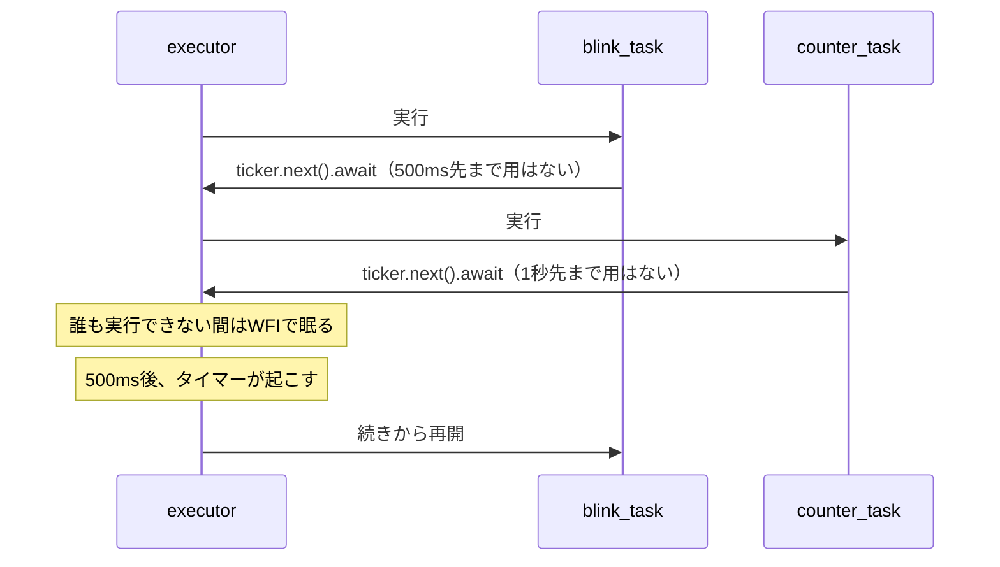

## このページでできるようになること

- `async fn`と`.await`が何をする書き方なのかを説明できる
- 「asyncは別コアで動く」「awaitの間CPUが動き続ける」「asyncなら速い」という3つの誤解を否定できる
- `.await`を書ける場所と書けない場所を区別できる

## 先に結論

`async fn`は「途中で中断して、あとで続きから再開できる関数」です。`.await`は「ここで結果を待ちます。**待つ間は他のtaskへ順番を譲ります**」という印です。順番を譲るだけなので、コアが増えるわけでも、処理が速くなるわけでもありません。譲った先に誰も仕事がなければ、CPUは省電力の待機状態（WFI）に入って眠ります。

## 身近なたとえ

`.await`は、病院の待合室の**番号札**に似ています。診察（結果）を待つ間、あなたは受付の前に立ちふさがって待つ必要はありません。番号札を持って席に着けば、窓口は他の人の対応ができます。呼ばれたら、続き（診察）が始まります。

実際の技術との違い: 病院ではあなた自身が呼び出しを聞いていますが、asyncでは**呼び出す仕組み（Waker、次のページで説明）が裏で用意され、あなたのコードは完全に停止しています**。再開の面倒はexecutorが見ます。

## 仕組み

`async fn`の中の処理は、`.await`を区切りとした「区間」に分かれています。executorはこの区間単位でtaskを切り替えます。



大事なポイントは3つです。よくある誤解と対にして書きます。

1. **asyncは自動的に別コアで動くわけではない。** ESP32-C6のCPUコアは1つ（シングルコア）です。taskがいくつあっても、動いているのは常に1つだけ。切り替えながら並行に「見せて」います。
2. **awaitの間、CPUが動き続けてループしているわけではない。** 全taskが待ちに入ると、executorはWFI（Wait For Interrupt）命令でCPUを眠らせます。タイマーやペリフェラルの割り込みが来たときだけ目を覚まします。「awaitは裏で忙しく待っている」は誤解です。
3. **asyncにすれば速くなるわけではない。** 計算そのものは1ミリ秒も速くなりません。改善するのは「待ち時間に他の仕事ができる」ことと「無駄な空回りをせず眠れる」ことです。

## RustとEmbassyではどう書くか

前のページと同じ examples/06-embassy-tasks から、`.await`が出てくる場所を拾ってみます。

```rust
#[embassy_executor::task]
async fn counter_task() {
    let mut ticker = Ticker::every(Duration::from_secs(1));
    let mut count: u32 = 0;
    loop {
        ticker.next().await;   // 1秒先まで順番を譲る
        count += 1;
        info!("[タスクB] カウンタ = {}", count);
    }
}
```

```rust
    // mainもひとつの並行処理として動き続ける
    loop {
        Timer::after(Duration::from_secs(5)).await;
        info!("[main] 動作中です（ハートビート）");
    }
```

これは抜粋です。完全なコードは examples/06-embassy-tasks を見てください。

## コードを一行ずつ読む

- `async fn counter_task()` — 「この関数は途中で順番を譲ることがあります」という宣言です。asyncの付かない普通の関数の中では`.await`は書けません。
- `ticker.next().await` — `ticker.next()`は「1秒後に完成する予定表」のような値（Future、次のページの主役）を返すだけで、まだ待っていません。**`.await`を付けて初めて「完成まで譲りながら待つ」**が実行されます。
- `count += 1` — `.await`から再開した後も、ローカル変数`count`はちゃんと残っています。中断・再開しても関数の状態が保たれるのが`async fn`の便利なところです。

## 実行方法

```bash
cd examples/06-embassy-tasks
cargo run --release
```

タスクB（1秒ごと）とmain（5秒ごと）のログが混ざって表示されます。1つのコアの上で、3つの処理（blink・counter・main）が順番を譲り合っている状態です。

## よくある失敗

1. **`.await`を付け忘れる** — `Timer::after(...)`だけ書いて`.await`を忘れると、待たずに素通りします。コンパイラが「Futureが使われていません」という警告（`unused ... Future`）を出してくれるので、警告は必ず読みましょう。
2. **asyncでない関数の中で`.await`を書く** — `only allowed inside async functions`というエラーになります。`.await`は`async fn`（またはasyncブロック）の中だけで使えます。
3. **「マルチコアで並列に走っているはず」と思い込む** — C6はシングルコアです。同時に実行されるtaskは常に1つなので、たとえば2つのtaskが同じ瞬間に変数を書き換える「並列」の競合は起きません。それでもtask間でデータを共有するには工夫が要ります（[Channel・Signal・Mutex](/embassy-esp32-c6/part09/09-channel-signal-mutex/)で扱います）。

## やってみよう

mainのハートビートの`Duration::from_secs(5)`を`from_secs(2)`に変えて、タスクBのカウンタ表示と交互に出るリズムがどう変わるか観察してみましょう。お互いに影響しないことが確認できます。

## 確認問題

1. `.await`の間、そのtaskのコードは実行されていますか。
2. 全taskが`.await`で待ちに入ったとき、CPUはどうなりますか。
3. 「重い計算をasync fnに書き換えたのに速くならない」——なぜでしょうか。

<details>
<summary>答え</summary>

1. 実行されていません。完全に中断していて、再開の条件が整うまでCPUを使いません。
2. executorがWFI命令でCPUを眠らせます。割り込み（タイマーなど）で目を覚まします。
3. asyncが改善するのは「待ち時間」の使い方だけだからです。計算はCPUを使い続ける処理で、待ち時間がないため何も変わりません（それどころか他のtaskを止めてしまいます。詳しくは[taskのページ](/embassy-esp32-c6/part09/04-task/)で扱います）。

</details>

## まとめ

- `async fn`は中断・再開できる関数、`.await`は「譲りながら待つ」印
- C6はシングルコア。asyncは並列でも高速化でもなく、待ち時間の有効活用
- 誰も動けないときはWFIで眠る。空回りはしない

## 次のページ

`.await`の裏側では、「できた？」「まだ」というやりとりが動いています。その主役であるFutureとpoll、Wakerの直感をつかみます。

[3. Futureの直感的説明](/embassy-esp32-c6/part09/03-future/)

前のページ: [1. 同期処理と非同期処理](/embassy-esp32-c6/part09/01-sync-vs-async/)
