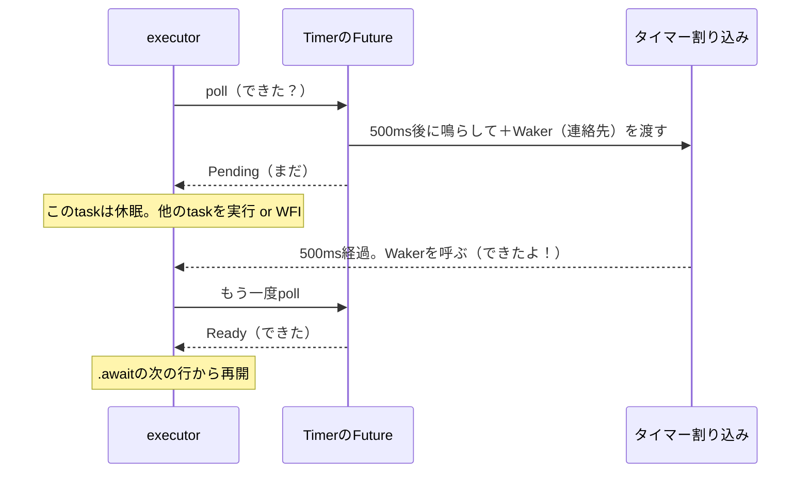

## このページでできるようになること

- Futureが「未来の結果の予定表」であることを説明できる
- pollとWakerの役割を、「できた？」「まだ。できたら呼ぶね」の会話で説明できる
- awaitが空回りせずに済む理由（割り込み→Waker→再poll）を説明できる

## 先に結論

`Timer::after(...)`のようなasyncの関数呼び出しは、その場では待たず、**Future**（フューチャー＝「未来にできる結果」を表す値）を返すだけです。executorはFutureに**poll**（「できた？」という問い合わせ）を行い、答えは`Ready`（できた）か`Pending`（まだ）の2択です。`Pending`のとき、Futureは**Waker**（「できたら呼んでね」の連絡先）を預かっておき、割り込みなどで結果が用意できた瞬間にWakerを呼びます。だからCPUは空回りせずに眠れるのです。

このページは仕組みの理解が目的です。**自分でFutureを手書きする必要はありません**。`async fn`と書けば、コンパイラがFutureを自動生成してくれます。

## 身近なたとえ

ラーメン店の呼び出しベルを思い出してください。注文すると、店員は料理の代わりに**ベル（振動する円盤）**を渡します。

- あなた「できた？」 — 店員「まだです。**できたらこのベルで呼びますね**」
- あなたは席で別のこと（宿題でも動画でも）をして待つ
- ベルが鳴る → カウンターへ行く → 「できてます」と料理を受け取る

このベルがWaker、「できた？」と聞きに行く行為がpoll、料理の受け取りが`Ready`です。

実際の技術との違い: あなた（task）は自分の意思でカウンターへ行くのではありません。**ベルを鳴らす（Wakerを呼ぶ）のは割り込みなどのハードウェア側の出来事で、カウンターへ連れて行く（再pollする）のはexecutor**です。task自身は眠っているだけです。

## 仕組み

pollの答えは、Rustのcoreライブラリにある`Poll`というenumで表されます。定義は驚くほど単純です。

```rust
// core::task::Poll の定義（概念をつかむための引用です）
enum Poll<T> {
    Ready(T),  // できた（中身は結果の値）
    Pending,   // まだ
}
```

第3部で学んだ「データ付きenum」がここでも主役です。`Timer::after`のFutureなら、時間が来れば`Ready(())`、まだなら`Pending`を返します。

全体の流れを図にします。



ポイントは、`Pending`の間**誰もループして監視していない**ことです。「できたら呼ぶね」の連絡先（Waker）を渡してあるから、全員が安心して眠れます。前のページの「awaitはWFIで眠る」の正体がこれです。

`async fn`は、この面倒なやりとりをコンパイラが全部肩代わりする書き方です。`.await`と書いた場所が「pollして、Pendingなら中断する地点」になります。

## よくある失敗

1. **「Futureを作った時点で処理が始まる」と思う** — 始まりません。Futureは予定表であって実行ではありません。`.await`（またはexecutorによるpoll）されて初めて動きます。`Timer::after(...)`と書いて`.await`を忘れると、1msも待たずに素通りするのはこのためです。
2. **「Pendingの間、裏でループが回っている」と思う** — 回っていません。Wakerが呼ばれるまで、そのtaskは一切pollされません。もし空回りで待つ設計なら、省電力なマイコンは成立しません。
3. **自作Futureを書こうとして挫折する** — `poll`を自分で実装するのは、Pinやライフタイムが絡む上級の題材です。この教材の範囲では`async fn`と既製のFuture（Timer、GPIOのwait系、Channelなど）の組み合わせだけで十分です。

## やってみよう

examples/06-embassy-tasks の`counter_task`で、`ticker.next().await;`の行を`let fut = ticker.next();`と`fut.await;`の2行に分けて書いてみましょう。動作は同じです。「Futureを作る」と「待つ」が別の操作だと実感できます。

## 確認問題

1. pollの答えは2種類あります。それぞれ何を意味しますか。
2. Wakerをラーメン店のたとえで言うと何ですか。また、実際には誰が（何が）Wakerを呼びますか。
3. `Pending`が返ってきた後、executorがそのtaskを再pollするきっかけは何ですか。

<details>
<summary>答え</summary>

1. `Ready(結果)`=「できた」、`Pending`=「まだ」。
2. 呼び出しベル。実際にはタイマーやペリフェラルの割り込みなど、「結果が用意できた」ことを知った側のコードが呼びます。
3. Wakerが呼ばれること。それまでは一度もpollされません。

</details>

## まとめ

- Futureは「未来の結果の予定表」。作っただけでは動かず、pollされて進む
- pollの答えは`Ready`か`Pending`。`Pending`ならWaker（連絡先）を残して眠る
- 割り込みがWakerを呼び、executorが再pollする。だから空回りしない

## 次のページ

仕組みが分かったので、実際に仕事を分割する単位——task——を自分で書きます。taskがOSスレッドとどう違うのかも重要なテーマです。

[4. task — 仕事を分割する](/embassy-esp32-c6/part09/04-task/)

前のページ: [2. asyncとawait](/embassy-esp32-c6/part09/02-async-await/)
