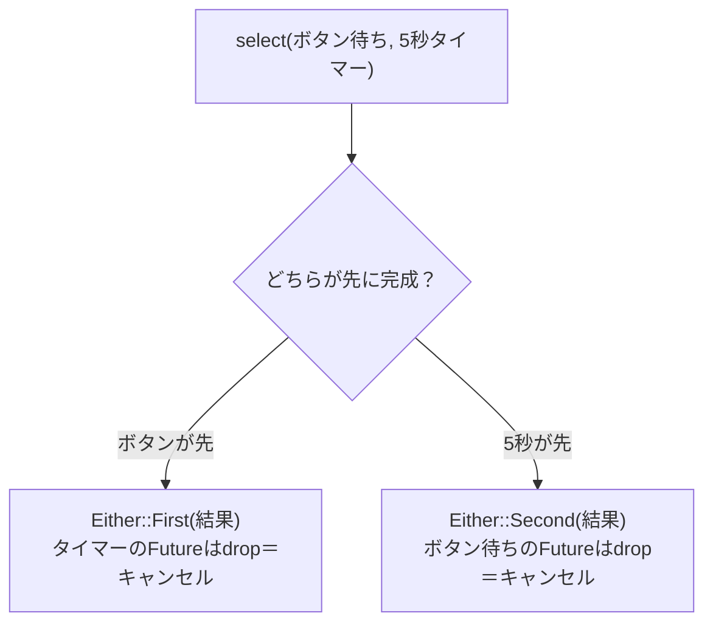

## このページでできるようになること

- `select`で2つの待ちを同時に仕掛け、早く完成した方で分岐できる
- 「負けた側のFutureはdropされる＝キャンセル」というEmbassyのキャンセルモデルを説明できる
- `with_timeout`が「selectの便利形」であることを説明できる

## 先に結論

`embassy_futures::select::select(a, b)`は、2つのFutureを**同時に**待ち、先に完成した方の結果を`Either::First`（aが勝ち）または`Either::Second`（bが勝ち）で返します。重要なのは負けた側の扱いです。**負けたFutureはdropされ、それ以上pollされません。Rustのasyncでは「dropされる」ことがそのまま「キャンセル」を意味します。**「ボタン待ちにタイムアウトを付ける」といった定番処理は、この早い者勝ちで作られています。

## 身近なたとえ

友だちと「先に着いた方の店に入ろう」と2軒のラーメン店の行列に別々に並ぶようなものです。片方が先に入店できたら、もう片方は**列から抜けます**。並び続けても意味がないからです。

実際の技術との違い: 2人で並ぶわけではありません。待っているのは「Futureという予定表」が2枚あるだけで、**動き手（CPU）は増えていません**。また、列から抜けた側（負けたFuture）は「あとで戻る」こともなく、その場で消滅（drop）します。

## 仕組み



**drop＝キャンセル**のモデルを丁寧に押さえましょう。

- Futureは、pollされない限り1mmも進まない「予定表」でした（[Futureのページ](/embassy-esp32-c6/part09/03-future/)）。
- dropされたFutureは二度とpollされないので、**続きは永遠に実行されません**。これがキャンセルの正体です。
- キャンセルに「中止イベント」や「通知」はありません。静かに消えるだけです。予約していた割り込みの後片付けなどは、各Futureのdrop処理（デストラクタ）が行います。
- したがって「selectに負けた側の処理が裏で続いているかも」という心配は不要です。逆に、**途中まで進んだ状態も消える**ことに注意が必要です（この落とし穴は[第10ページ](/embassy-esp32-c6/part09/10-cancel-backpressure/)で扱います）。

兄弟分として`select3`/`select4`（3つ・4つで競争）、`select_array`/`select_slice`（同じ型の集まりで競争）もあります。

## RustとEmbassyではどう書くか

「BOOTボタンが押されるか、5秒経つか」の早い者勝ちはこう書きます。

```rust
use embassy_futures::select::{Either, select};

    match select(
        button.wait_for_falling_edge(),
        Timer::after(Duration::from_secs(5)),
    )
    .await
    {
        Either::First(_) => info!("ボタンが先に押されました"),
        Either::Second(_) => info!("5秒が先に経ちました"),
    }
```

「待ちにタイムアウトを付ける」だけなら、embassy-timeの`with_timeout`が便利です。中身は「本命のFutureとタイマーの早い者勝ち」で、**時間切れのとき本命のFutureはdrop（キャンセル）されます**。examples/07-channel が実際に使っています。

```rust
        // receive()に3秒のタイムアウトを付ける。
        // 時間内に受信できればOk(イベント)、できなければErr(TimeoutError)
        match with_timeout(Duration::from_secs(3), CHANNEL.receive()).await {
            Ok(ButtonEvent::Pressed) => {
                count += 1;
                led.toggle();
                info!("[LEDタスク] イベント受信: {}回目 → LEDをトグル", count);
            }
            Err(_) => {
                info!("[LEDタスク] イベントなし（3秒間ボタンが押されていません）");
            }
        }
```

これは抜粋です。完全なコードは examples/07-channel を見てください。

## コードを一行ずつ読む

- `select(a, b).await` — aとbを**両方同時に**待ちます。「aを待ってからb」ではありません。awaitはselect全体に1つ付けます。
- `Either::First(_)` — 勝者がaだったことを表すenumです。`( )`の中には勝者の結果が入ります（今回はどちらも結果を使わないので`_`）。`match`で必ず両方の場合を書かされるのは、第3部で学んだ網羅性チェックのおかげです。
- `with_timeout(時間, future)` — 成功なら`Ok(結果)`、時間切れなら`Err(TimeoutError)`。selectとEitherを自分で書くより意図が読み取りやすくなります。

## 実行方法

```bash
cd examples/07-channel
cargo run --release
```

BOOTボタンを押すとLEDがトグルし、3秒間何もしないと「イベントなし」と表示されます。この「3秒待っても来ない」の裏でselect（with_timeout）が動いています。

## よくある失敗

1. **「負けた側は裏で続いている」と誤解する** — 続いていません。dropされた瞬間にキャンセルされ、二度とpollされません。「ボタン待ちがselectで負けたのに、あとから急に発火した」ようなことは起きません。
2. **`select(a.await, b.await)`と書いてしまう** — こう書くと、selectに渡す前に`a.await`で待ち切ってしまい、競争になりません。selectには**awaitしていないFuture**をそのまま渡し、`.await`はselect全体に付けます。
3. **ループ内selectで「途中まで」を失う** — たとえば「複数バイトの受信途中」のFutureがselectに負けると、読みかけの状態ごと消えます。何をdropしてよいかは設計の問題で、[キャンセル安全性](/embassy-esp32-c6/part09/10-cancel-backpressure/)として次々ページで扱います。

## やってみよう

examples/07-channel の`with_timeout`の`Duration::from_secs(3)`を`from_secs(1)`に変えてみましょう。「イベントなし」の表示が1秒ごとになります。タイムアウトの正体が「タイマーとの早い者勝ち」だと意識しながら観察してください。

## 確認問題

1. `select(a, b)`でbが先に完成したとき、戻り値は何ですか。またaはどうなりますか。
2. Embassyの世界で「キャンセル」とは、具体的に何が起きることですか。
3. `with_timeout`はどんなときに`Err`を返しますか。そのとき内側のFutureはどうなりますか。

<details>
<summary>答え</summary>

1. `Either::Second(bの結果)`。aはdropされ、キャンセルされます（それ以上pollされません）。
2. Futureがdropされ、二度とpollされなくなることです。特別な中止イベントはありません。
3. 指定時間内に内側のFutureが完成しなかったとき（`Err(TimeoutError)`）。内側のFutureはdrop＝キャンセルされます。

</details>

## まとめ

- `select(a, b)`は早い者勝ち。勝者は`Either::First/Second`で分かる
- 負けた側はdropされる。**drop＝キャンセル**がEmbassyのキャンセルモデル
- `with_timeout`は「本命 vs タイマー」のselectの便利形

## 次のページ

早い者勝ちの逆、「全部終わるまで待つ」がjoinです。selectとの使い分け、そして「taskを分けるか、1つのtask内でjoin/selectするか」の設計判断を学びます。

[8. join — 全部待つ](/embassy-esp32-c6/part09/08-join/)

前のページ: [6. EmbassyのTimerとInstant](/embassy-esp32-c6/part09/06-embassy-time/)
