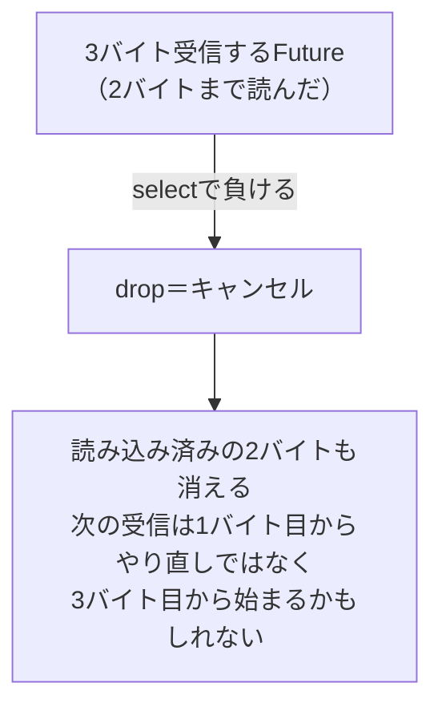

## このページでできるようになること

- 「キャンセル安全性」を、`.await`と途中状態の関係で説明できる
- Channel満杯時の挙動（バックプレッシャ）と、詰まりの検知方法を説明できる
- Embassyのtaskに優先順位がないことと、必要なときの逃げ道の存在を説明できる

## 先に結論

非同期設計の仕上げは「うまくいかないとき」の理解です。第一に**キャンセル**。selectやwith_timeoutに負けたFutureはdropされ、**途中まで進んだ状態ごと消えます**。`.await`のたびに「ここで打ち切られても大丈夫か？」と考える習慣が、キャンセル安全性の直感です。第二に**詰まり**。Channelが満杯だと`send`は待たされます（バックプレッシャ）。これは暴走を防ぐ健全な仕組みですが、受信側が長いCPU処理で止まっていると送信側まで連鎖して止まります。第三に**優先順位**。協調的実行のtaskは対等で、急ぎの仕事を割り込ませる優先度はありません。必要な場合の逃げ道（割り込みexecutor）の存在だけ知っておきましょう。

## 身近なたとえ

学園祭の焼きそば屋台を想像してください。注文票のクリップ（Channel）が満杯なら、注文係は新しい注文を**受け付けずに待ちます**。無限に受けてしまえば、作れないのに行列だけが伸びて大混乱です。「受けられる分しか受けない」のがバックプレッシャです。

ここで鉄板係（受信側）が「大きな肉の塊を延々切っている」（長いCPU処理）と、注文票は減らず、注文係も止まり、屋台全体が詰まります。**詰まりの原因は、たいてい受け手にあります**。

実際の技術との違い: 屋台なら店長が異変に気づきますが、プログラムでは詰まりは黙って起きます。だから`try_send`のような**検知の仕掛け**を自分で入れる必要があります。

## 仕組み

### キャンセル安全性の直感

[selectのページ](/embassy-esp32-c6/part09/07-select/)で見たとおり、Embassyのキャンセルは「dropされて二度とpollされない」ことでした。問題は、Futureが**途中状態**を持っているときです。



- `Timer::after`のキャンセルは無害です。待ちを止めるだけで、失われる途中状態がありません。
- 「複数バイトの受信」「複数手順の書き込み」の途中でキャンセルされると、読みかけのデータが失われたり、相手デバイスと手順がずれたりします。
- 対策の基本は、**キャンセルされうる場所（selectやwith_timeoutの中）には、途中で打ち切られても困らない単位のFutureだけを置く**ことです。examples/07-channel が`with_timeout`を`CHANNEL.receive()`に付けているのは好例です。receiveは「1件受け取る前」に打ち切られても、キューの中身は無傷だからです。

### バックプレッシャと詰まりの検知

Channelは有界（容量固定）でした。満杯時の選択肢は2つあります。

| 方法 | 満杯のとき | 使いどころ |
|---|---|---|
| `send(x).await` | 空くまで送信側が待つ | 取りこぼせないデータ。自然なブレーキになる |
| `try_send(x)` | すぐ`Err`が返る | 待てない場面。詰まりの検知・記録に使える |

受信側の設計も大切です。examples/07-channel の受信側は`with_timeout`付きで受信し、「3秒イベントが来ない」ことを検知してログを出します。「来ない」も「捌けない」も、**時間を区切って観測する**のが検知の基本です。

### 優先順位

Embassyのtaskは対等です。`.await`で譲り合うだけで、「このtaskを優先して」という指定はありません。長いCPU処理が1つあると全員が遅れる、というのは[taskのページ](/embassy-esp32-c6/part09/04-task/)で見たとおりです。

どうしても「遅れてはいけない処理」がある場合のために、esp-rtosの環境には**優先度の高い実行文脈でtaskを回す仕組み（割り込みexecutor、InterruptExecutorと呼ばれます）**が存在します。この教材の範囲では詳細は扱いませんが、「協調の限界を超える道具がある」ことだけ覚えておいてください。

最後にwatchdog（[第6部](/embassy-esp32-c6/part06/10-watchdog/)）との関係を一言。詰まりやbusyループでプログラム全体が固まったとき、最後の砦としてリセットをかけるのがwatchdogです。非同期設計の失敗は、watchdogのリセットという形で表面化することがあります。

## RustとEmbassyではどう書くか

満杯を検知する`try_send`はこう書きます。

```rust
static EVENTS: Channel<CriticalSectionRawMutex, u8, 4> = Channel::new();

    if EVENTS.try_send(1).is_err() {
        info!("キューが満杯です（受信側が詰まっていないか確認）");
    }
```

「来ない」を検知する受信側は examples/07-channel の形が定番です。

```rust
        match with_timeout(Duration::from_secs(3), CHANNEL.receive()).await {
            Ok(ButtonEvent::Pressed) => { /* 通常処理 */ }
            Err(_) => {
                info!("[LEDタスク] イベントなし（3秒間ボタンが押されていません）");
            }
        }
```

これは抜粋です。完全なコードは examples/07-channel を見てください。

## コードを一行ずつ読む

- `EVENTS.try_send(1)` — `.await`が付いていないことに注目。待たずに即答が返ります。`Err`は「今は満杯」という情報であって、異常終了ではありません。ログを出す、古いデータ側を諦める、など方針を選べます。
- `with_timeout(Duration::from_secs(3), CHANNEL.receive())` — タイムアウトした場合、`receive()`のFutureはdropされますが、キューの中身は失われません。キャンセル安全な待ち方の実例です。

## 実行方法

```bash
cd examples/07-channel
cargo run --release
```

ボタンを3秒以上放置して「イベントなし」のログが出ることを確認してください。これが「詰まり・無音の検知」の最小形です。

## よくある失敗

1. **キューを大きくして詰まりを「解決」した気になる** — 容量を4から64にしても、受信が追いつかない根本原因（受信側の長い処理）はそのままです。あふれるまでの時間が延びるだけで、しかも溜まった古いイベントがあとからまとめて処理される奇妙な動きになります。まず受信側を疑いましょう。
2. **キャンセルされうる場所に「途中状態を持つ処理」を置く** — selectやwith_timeoutの中に複数手順の通信を丸ごと入れると、打ち切りのたびに手順が中途半端に終わり、相手とのやりとりがずれます。打ち切ってよい単位（1件の受信、1回の待ち）に切ってから競争させてください。
3. **「優先度を上げれば解決する」と考える** — 詰まりの多くは設計（長いCPU処理、Channel/Signalの選び間違い）が原因です。優先度の仕組みは最後の手段で、まず`.await`で刻む・道具を選び直すのが先です。

## やってみよう

examples/07-channel の`led_task`の通常処理の中に`Timer::after(Duration::from_secs(5)).await;`を足して、受信をわざと遅くしてみましょう。ボタンを素早く5回押すと、Channel（容量4）に溜まったイベントがあとからゆっくり処理される様子と、あふれた分の押下でボタンtaskが待たされる様子が観察できます。

## 確認問題

1. `CHANNEL.receive()`にwith_timeoutを付けるのがキャンセル安全と言える理由は何ですか。
2. `send().await`と`try_send()`は、満杯のときの振る舞いがどう違いますか。それぞれどんな場面に向きますか。
3. Embassyの通常のtaskに優先順位はありますか。急ぎの処理が必要なときの逃げ道は何ですか。

<details>
<summary>答え</summary>

1. タイムアウトでreceiveのFutureがdropされても、失われる途中状態がなく、キューの中身も無傷だからです。
2. `send().await`は空きが出るまで待ちます（取りこぼし防止・自然なブレーキ）。`try_send()`は即座にErrを返します（待てない場面・詰まりの検知）。
3. ありません。全taskが対等で、`.await`による譲り合いだけです。必要なら割り込みexecutor（InterruptExecutor）という優先度の高い実行文脈を使う道がありますが、まず設計の見直しが先です。

</details>

## まとめ

- キャンセル＝dropは途中状態ごと消える。打ち切られてよい単位のFutureだけを競争に出す
- 満杯で`send`が待つのは暴走を防ぐバックプレッシャ。詰まりは`try_send`やタイムアウトで観測し、原因は受信側から疑う
- taskは対等で優先順位はない。割り込みexecutorという逃げ道はあるが、まずは設計で解決する

## 次のページ

非同期の道具立てがそろいました。いよいよ無線です。Wi-Fiの電波・SSID・チャンネルといった物理側の基礎から始めます。

[Wi-Fiの基礎](/embassy-esp32-c6/part10/01-wifi-basics/)

前のページ: [9. Channel・Signal・Mutex](/embassy-esp32-c6/part09/09-channel-signal-mutex/)
