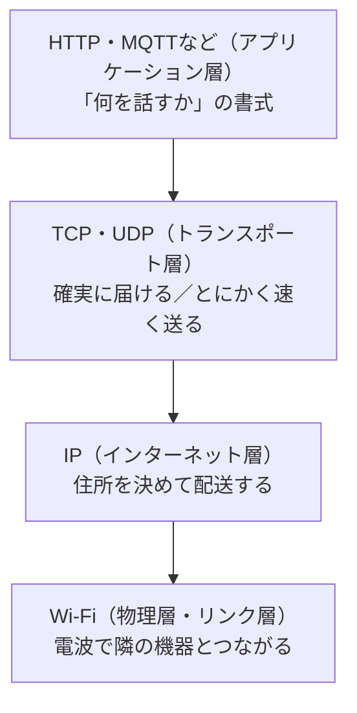

## このページでできるようになること

- SSID・チャンネル・2.4GHz帯という言葉の意味を説明できる
- ESP32-C6のWi-Fiの仕様（Wi-Fi 6対応・2.4GHz帯のみ）を正しく言える
- 「Wi-Fiにつながる」ことと「インターネットが使える」ことが別物である理由を、層の図で説明できる

## 先に結論

Wi-Fiは「電波でケーブルの代わりをする」技術です。アクセスポイント（親機）が飛ばしている電波の名前が**SSID**で、電波が使う周波数の区画が**チャンネル**です。ESP32-C6はWi-Fi 6（802.11ax）に対応していますが、使えるのは**2.4GHz帯だけ**です。5GHz帯専用のアクセスポイントには接続できません。そして最重要なのは、Wi-Fiはネットワークの**いちばん下の層**にすぎないということです。Wi-Fiにつながっただけでは、まだWebページは見られません。その上にIP、さらにTCP、さらにHTTPという層を順に積み重ねて、初めて通信が完成します。第10部はこの積み重ねを1段ずつ登っていきます。

## 身近なたとえ

Wi-Fiは「学校に通じる道路」のようなものです。道路が開通しただけでは、手紙は届きません。手紙を届けるにはさらに「住所の仕組み」（IP）、「届いたか確認しながら送る配達員」（TCP）、「手紙の書式」（HTTP）が必要です。道路・住所・配達員・書式は、それぞれ別の仕事をしています。

ただし実際のネットワークでは、これらは物理的に別の道具ではなく、**同じ電波の上で動くソフトウェアの層**です。1つのデータは、HTTPの文章がTCPの区切りに包まれ、それがIPの宛先付きの包みに包まれ、最後にWi-Fiの電波に乗って飛びます。

## 仕組み — 層の積み重ね

第10部全体の地図となる図です。何度も戻ってきて確認してください。



大事な原則はこうです。

- **各層は自分の仕事しかしない**。Wi-Fiは「電波で隣（アクセスポイント）とつながる」だけで、住所も配達確認も知りません
- **上の層は下の層がないと動けない**。HTTPはTCPの上、TCPはIPの上、IPはWi-Fi（またはケーブル）の上で動きます
- だから「Wi-FiがあるからHTTPが使える」という一足飛びの説明は正しくありません。間に2つの層があります

この教材では、Wi-Fi（このページと次ページ）→ IPとDHCP（4〜5ページ）→ TCPとUDP（6〜7ページ）→ DNS・HTTP・MQTT（8〜10ページ）の順で、下から1層ずつ積み上げます。

### SSID — 電波の名前

アクセスポイント（親機。家庭では無線LANルーター）は、自分の電波に**SSID**（Service Set Identifier）という名前を付けて周囲に知らせています。スマホのWi-Fi設定画面に並ぶ名前の一覧が、まさに近所のSSID一覧です。子機（ステーション）は「どのSSIDに、どのパスワードで入るか」を指定して接続します。パスワードによる暗号化（WPA2/WPA3という方式が一般的です）で、部外者が勝手に入ったり通信を盗み見たりできないようにしています。

### 2.4GHz帯とチャンネル

Wi-Fiの電波には主に2.4GHz帯と5GHz帯があります。2.4GHz帯は遠くまで届き壁にも強い一方、電子レンジやBluetoothと同じ帯域なので混雑しがちです。5GHz帯は速くて空いていますが、届く範囲が狭めです。

各帯域はさらに**チャンネル**という区画に分かれています（2.4GHz帯では日本で1〜13ch）。どのチャンネルを使うかは**アクセスポイントが決め**、子機は接続時に自動で合わせます。マイコン側でチャンネルを気にする必要はふつうありません。

### ESP32-C6のWi-Fi仕様

データシートによると、ESP32-C6のWi-Fiは次の通りです。

| 項目 | 値 |
|---|---|
| 規格 | Wi-Fi 6（IEEE 802.11ax）対応（11b/g/n互換） |
| 周波数帯 | **2.4GHz帯のみ** |
| 最大速度 | 150Mbps |
| 省電力機能 | TWT（Target Wake Time）対応 |

「Wi-Fi 6対応なのに2.4GHzのみ」という組み合わせに注意してください。Wi-Fi 6は5GHz専用の規格ではなく、2.4GHz帯でも使えます。C6が対応するのはその2.4GHz側だけです。つまり**5GHz帯専用のSSIDには絶対に接続できません**。自宅のルーターが「〇〇-5G」のような5GHz用SSIDしか出していない場合は、2.4GHz側のSSIDを有効にする必要があります。

TWTは「次にいつ起きて通信するか」をアクセスポイントと約束して、それまで無線部を休ませる省電力機能です。電池で動くIoT機器を意識したWi-Fi 6の目玉機能で、C6がIoT向けチップであることの表れです。

## RustとEmbassyではどう書くか

接続コードの全体は次のページで扱います。ここでは「SSIDとパスワードをどうやってプログラムに渡すか」だけ先に見ておきます。`examples/08-wifi/src/main.rs`からの抜粋です。

```rust
// 環境変数SSID/PASSWORDをコンパイル時に埋め込む。
// 未設定の場合はプレースホルダになる（ビルドは通るが接続はできない）。
const SSID: &str = match option_env!("SSID") {
    Some(v) => v,
    None => "your-ssid",
};
const PASSWORD: &str = match option_env!("PASSWORD") {
    Some(v) => v,
    None => "your-password",
};
```

`option_env!`は**ビルド時**に環境変数を読み取ってプログラムへ埋め込むマクロです。ソースコードにパスワードを直接書かずに済むので、コードを公開しても秘密が漏れません。実行時にマイコンが環境変数を読むわけではない（マイコンにはOSも環境変数もない）ことに注意してください。

## よくある失敗

- **5GHz帯のSSIDに接続しようとして失敗する**: C6は2.4GHz帯のみ対応です。ルーターの設定画面で2.4GHz側のSSIDを確認してください。最近のルーターは2.4GHzと5GHzを同じSSIDにまとめる機能（バンドステアリング）を持つことがあり、その場合も接続が不安定になることがあります。切り分けたいときは2.4GHz専用のSSIDを分けて作るのが確実です
- **「Wi-Fiにつながったのに通信できない」と混乱する**: Wi-Fi接続はリンク層の完成にすぎません。IPアドレスの取得（DHCP）が終わっていなければ、その上のTCPもHTTPも動きません。層の図を思い出して、「どの層まで完成しているか」を順に確認する癖をつけてください

## やってみよう

スマホのWi-Fi設定画面を開いて、見えているSSIDを数えてみてください。次に自宅のルーターの設定画面（またはルーター本体のラベル）で、2.4GHz帯のSSIDがどれか、チャンネルがいくつに設定されているかを確認してみましょう。次のページでC6をつなぐのはそのSSIDです。

## 確認問題

1. Wi-Fiに接続できただけではWebページを見られません。あと何の層が必要ですか。下から順に挙げてください。
2. ESP32-C6が「Wi-Fi 6対応」なのに接続できないアクセスポイントがあります。どんなアクセスポイントですか。
3. SSIDとは何ですか。一文で説明してください。

<details>
<summary>答え</summary>

1. IP（住所と配送）、TCPまたはUDP（トランスポート）、HTTP（アプリケーションの書式）の3つの層です。Wi-Fiはいちばん下の物理層・リンク層だけを担当します。
2. 5GHz帯専用のアクセスポイントです。C6のWi-Fi 6対応は2.4GHz帯のみなので、5GHz帯の電波には接続できません。
3. アクセスポイントが自分の電波（ネットワーク）に付けて周囲へ知らせている名前です。

</details>

## まとめ

- Wi-Fiはネットワークの最下層（物理層・リンク層）。その上にIP→TCP/UDP→HTTPを積み重ねて初めて通信が完成する
- SSIDは電波の名前、チャンネルは周波数の区画。チャンネルはアクセスポイントが決め、子機は自動で合わせる
- ESP32-C6はWi-Fi 6（802.11ax）対応だが**2.4GHz帯のみ**。5GHz専用SSIDには接続できない

## 次のページ

いよいよC6を自宅のアクセスポイントへ接続します。ステーション（子機）として接続を確立し、切断されたら自動で再接続する実用的なコードを一行ずつ読み解きます。

- 前: [第9部 10. キャンセル・詰まり・優先順位](/embassy-esp32-c6/part09/10-cancel-backpressure/)
- 次: [2. Stationとしてつなぐ](/embassy-esp32-c6/part10/02-station/)
