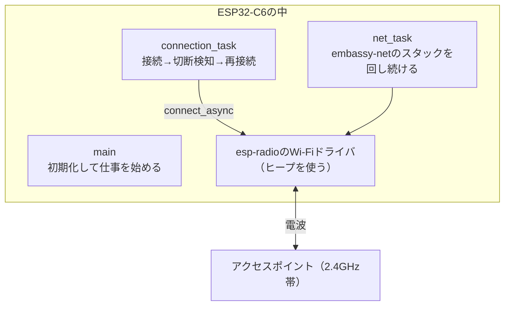

## このページでできるようになること

- esp-radioでWi-Fiドライバを初期化し、ステーション（子機）としてアクセスポイントへ接続できる
- Wi-Fi使用時にヒープ（esp-alloc）が必要になる理由を説明できる
- 「接続を維持するtask」と「ネットワークスタックを回すtask」の役割分担を説明できる
- 切断されたら自動で再接続するループを書ける

## 先に結論

Wi-Fi接続の流れは「①ヒープを確保する → ②`esp_radio::wifi::new`でドライバを起動する → ③`StationConfig`にSSIDとパスワードを渡す → ④`connect_async().await`で接続する」です。接続は一度きりではなく切れるものなので、接続専用のtaskを作り、`wait_for_disconnect_async().await`で切断を検知したら少し待って再接続するループにします。さらに、TCP/IPを担当するembassy-netのスタックを回し続ける専用taskも必要です。mainと合わせて3つの非同期の仕事が同時に走る——第9部で学んだtask分割が、ここで初めて本領を発揮します。

## 身近なたとえ

ステーション（Station）とは「子機」、つまりスマホやノートPCと同じ立場です。アクセスポイント（親機）という「会場の入口」で、SSID（会場名）を確認し、パスワード（招待コード）を見せて入場する側です。そして接続維持のtaskは「入場し直す係」です。会場から追い出されたり停電したりしたら（電波が切れたら）、少し待ってもう一度入口に並び直します。

ただし実際のWi-Fiでは、「入場」は一瞬のイベントではなく**電波の同期と暗号鍵の交換という手続き**で、成功しても電波状況によっていつでも切れうる、という点がたとえと違います。だからこそ再接続ループが必須になります。

## 仕組み

登場する部品と、3つの非同期処理の関係を図にします。



- **connection_task**: `WifiController`を持ち、接続と再接続だけを担当します
- **net_task**: embassy-netの`Runner`を持ち、`run().await`でTCP/IP処理を回し続けます（IP層より上は次ページ以降の主役です。今日は「回しておく必要がある」ことだけ覚えてください）
- **main**: 初期化後は、ソケット通信などアプリ本来の仕事をします

### なぜヒープ（esp-alloc）が必要なのか

第5部では「組み込みRustはヒープを使わない設計が基本」と学びました。しかしWi-Fiは例外です。esp-radioのWi-Fiドライバは、Espressif提供の通信処理コードを含んでおり、その内部が動的なメモリ確保（ヒープ）を前提に作られています。そのため、Wi-Fiを使うプログラムでは`esp-alloc`でヒープ領域を用意し、`esp-rtos`にも`esp-radio`・`esp-alloc`のfeatureを付けます。「原則はヒープなし、無線ドライバのためにだけ用意する」と整理してください。

## RustとEmbassyではどう書くか

`examples/08-wifi/src/main.rs`から、接続に関わる部分を順に抜粋します（DNS・TCP・HTTPの部分は以降のページで読みます）。完全なコードはexamplesを見てください。

まず初期化です。

```rust
#[esp_rtos::main]
async fn main(spawner: Spawner) -> ! {
    let config = esp_hal::Config::default().with_cpu_clock(CpuClock::max());
    let peripherals = esp_hal::init(config);

    esp_println::logger::init_logger_from_env();

    // Wi-Fiドライバはヒープを使うため、esp-allocでヒープを確保する
    // （公式exampleと同じ構成: 回収済みRAM 64KiB + 通常RAM 36KiB）
    esp_alloc::heap_allocator!(#[ram(reclaimed)] size: 64 * 1024);
    esp_alloc::heap_allocator!(size: 36 * 1024);

    let timg0 = TimerGroup::new(peripherals.TIMG0);
    let sw_interrupt = SoftwareInterruptControl::new(peripherals.SW_INTERRUPT);
    esp_rtos::start(timg0.timer0, sw_interrupt.software_interrupt0);
```

次に、ステーション設定を作ってWi-Fiドライバを起動します。

```rust
    // ステーション（子機）モードの設定。SSIDとパスワードを渡す
    let station_config = WifiConfig::Station(
        StationConfig::default()
            .with_ssid(SSID)
            .with_password(PASSWORD.into()),
    );

    info!("Wi-Fiを初期化します");
    let (controller, interfaces) = match esp_radio::wifi::new(
        peripherals.WIFI,
        ControllerConfig::default().with_initial_config(station_config),
    ) {
        Ok(v) => v,
        Err(e) => panic!("Wi-Fiの初期化に失敗しました: {e:?}"),
    };

    // ステーション用のネットワークインタフェースを取り出す
    let wifi_interface = interfaces.station;
```

続いて、embassy-netのスタックを作り、2つのtaskを起動します。

```rust
    // DHCPでIPアドレスをもらう設定
    let net_config = embassy_net::Config::dhcpv4(Default::default());

    // TCPシーケンス番号の予測を防ぐため、乱数でシードを作る
    let rng = Rng::new();
    let seed = ((rng.random() as u64) << 32) | rng.random() as u64;

    // ネットワークスタックを生成。stackは操作用ハンドル、runnerは駆動役
    let (stack, runner) = embassy_net::new(
        wifi_interface,
        net_config,
        STACK_RESOURCES.init(StackResources::new()),
        seed,
    );

    // Wi-Fi接続を維持するタスクと、ネットワークスタックを回すタスクを起動
    spawner.spawn(connection_task(controller).unwrap());
    spawner.spawn(net_task(runner).unwrap());
```

最後が今日の主役、接続を維持するtaskです。

```rust
/// Wi-Fi接続を維持するタスク。切断されたら5秒待って再接続する
#[embassy_executor::task]
async fn connection_task(mut controller: WifiController<'static>) {
    info!("Wi-Fi接続管理タスクを開始します");
    loop {
        info!("SSID「{SSID}」へ接続します...");
        match controller.connect_async().await {
            Ok(connected) => {
                info!("Wi-Fiに接続しました: {connected:?}");
                // 切断されるまでここで待つ
                let disconnected = controller.wait_for_disconnect_async().await.ok();
                warn!("Wi-Fiが切断されました: {disconnected:?}");
            }
            Err(e) => {
                error!("Wi-Fi接続に失敗しました: {e:?}");
            }
        }
        // 少し待ってから再接続する
        Timer::after(Duration::from_secs(5)).await;
    }
}

/// ネットワークスタック本体を動かし続けるタスク
#[embassy_executor::task]
async fn net_task(mut runner: Runner<'static, Interface<'static>>) {
    runner.run().await
}
```

## コードを一行ずつ読む

重要な行だけ取り上げます。

```rust
esp_alloc::heap_allocator!(#[ram(reclaimed)] size: 64 * 1024);
esp_alloc::heap_allocator!(size: 36 * 1024);
```

ヒープ領域を2か所、合計約100KiB確保します。1行目の`#[ram(reclaimed)]`は「起動処理が終わって不要になったRAM領域を再利用する」指定で、貴重なRAM（C6は512KB）を節約するための公式exampleと同じ構成です。

```rust
let (controller, interfaces) = match esp_radio::wifi::new(
    peripherals.WIFI,
    ControllerConfig::default().with_initial_config(station_config),
) {
```

Wi-Fiドライバを起動し、2つの値を受け取ります。`controller`は**電波側の操作卓**（接続・切断・スキャンなど）、`interfaces`は**データの出入口**です。役割が違うので別の値になっています。`ControllerConfig::default().with_initial_config(station_config)`で「最初からステーションモードで動く」よう指示しています。

```rust
let wifi_interface = interfaces.station;
```

`interfaces`からステーション用のインタフェースを取り出します。これが次の`embassy_net::new`に渡され、IP層（embassy-net）と電波層（esp-radio）が接続されます。層と層をつなぐ瞬間です。

```rust
let seed = ((rng.random() as u64) << 32) | rng.random() as u64;
```

embassy-netに渡す乱数の種です。TCPは通信ごとに「シーケンス番号」の初期値を選びますが、これが予測可能だと通信を横取りする攻撃がしやすくなります。C6のハードウェア乱数生成器（`Rng`）から64bitの種を作って渡します。

```rust
spawner.spawn(connection_task(controller).unwrap());
spawner.spawn(net_task(runner).unwrap());
```

第9部で学んだ通り、`connection_task(controller)`の呼び出しはtask起動用のトークンを作ります。task置き場が足りない場合はこの時点でエラーになるため`unwrap`していますが、各taskは1個ずつしか起動しないので失敗は設計上起きません。

```rust
match controller.connect_async().await {
    Ok(connected) => {
        let disconnected = controller.wait_for_disconnect_async().await.ok();
```

`connect_async().await`は接続完了（または失敗）まで待つ非同期関数です。成功したら、すぐ次に`wait_for_disconnect_async().await`で**切断されるまで眠ります**。この間CPUは他のtaskの仕事ができます。切断が起きるとここが目覚め、ループの先頭に戻って5秒後に再接続します。ポーリング（定期的に「まだつながってる？」と確認する方式）よりも素直で無駄のない、async らしい書き方です。

## 実行方法

SSIDとパスワードは環境変数でビルド時に渡します（前ページ参照）。examplesリポジトリでは次のように実行します。

```bash
SSID=あなたのSSID PASSWORD=あなたのパスワード cargo run --release -p wifi
```

期待されるログ（抜粋）は次の通りです。

```text
INFO - Wi-Fiを初期化します
INFO - Wi-Fi接続管理タスクを開始します
INFO - SSID「あなたのSSID」へ接続します...
INFO - Wi-Fiに接続しました: ...
INFO - IPアドレスの取得を待っています...
```

このあとIPアドレスの取得（DHCP）に進みますが、それは5ページで扱います。試しにルーターの電源を切ると`Wi-Fiが切断されました`と表示され、電源を戻すと自動で再接続されるはずです。

## よくある失敗

- **`your-ssid`へ接続しようとして失敗する**: 環境変数`SSID`/`PASSWORD`を渡さずにビルドすると、プレースホルダのまま埋め込まれます。ログに表示されるSSIDが自分のものになっているか確認してください
- **接続に失敗し続ける（5秒ごとにエラー）**: パスワードの間違い、またはそのSSIDが5GHz帯専用の場合が典型です。C6は2.4GHz帯しか使えません（[前ページ](/embassy-esp32-c6/part10/01-wifi-basics/)参照）
- **`esp_radio::wifi::new`や実行時のpanicで止まる**: ヒープの確保（`esp_alloc::heap_allocator!`）を書き忘れる、または`esp-rtos`の`esp-radio`/`esp-alloc` featureを付け忘れると、無線ドライバが動けません。Cargo.tomlとmainの両方を確認してください
- **接続はできたがその後の通信が一切動かない**: `net_task`（`runner.run()`）を起動し忘れると、embassy-netは1バイトも処理しません。スタックは自動では回らず、専用taskで回し続ける必要があります

## やってみよう

再接続の待ち時間`Duration::from_secs(5)`を`1`に変えて、ルーターの電源を切ってから復帰までの動きをログで観察してみてください。次に、connection_taskの`loop`の先頭に接続試行回数のカウンタを足して、「何回目の接続か」をログに出してみましょう。

## 確認問題

1. ヒープを使わない設計が基本の組み込みRustで、このプログラムがesp-allocを使うのはなぜですか。
2. `connection_task`と`net_task`は、それぞれ何を担当していますか。
3. `wait_for_disconnect_async().await`の間、CPUはこのtaskのために何か仕事をしていますか。

<details>
<summary>答え</summary>

1. esp-radioのWi-Fiドライバ（Espressif提供の通信処理コードを含む）が内部で動的メモリ確保を前提としているためです。無線ドライバのためにだけヒープを用意します。
2. `connection_task`はWi-Fi（リンク層）の接続維持——接続し、切断を検知したら再接続します。`net_task`はembassy-netの`Runner`を回し続け、IP層以上のパケット処理を駆動します。
3. していません。切断イベントが起きるまでこのtaskは眠っていて、CPUは他のtask（net_taskやmain）の仕事をしています。切断が起きたときだけ起こされます。

</details>

## まとめ

- Wi-Fi接続は「ヒープ確保 → `esp_radio::wifi::new` → `StationConfig`でSSID/パスワード指定 → `connect_async`」の流れ
- 接続は切れるもの。`wait_for_disconnect_async`で切断を待ち、再接続するループを専用taskにする
- embassy-netのスタックは`Runner::run()`を回す専用taskがないと動かない。mainと合わせて3つの非同期処理の分業で成り立つ

## 次のページ

ステーションの反対、C6自身がアクセスポイント（親機）になる動作モードを学びます。どんな用途に向き、どんな限界があるのかを整理します。

- 前: [1. Wi-Fiの基礎](/embassy-esp32-c6/part10/01-wifi-basics/)
- 次: [3. Access Pointになる](/embassy-esp32-c6/part10/03-access-point/)
