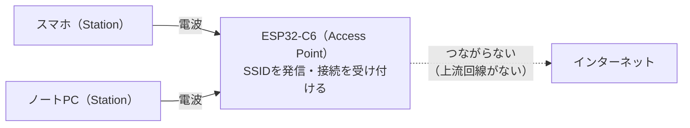

## このページでできるようになること

- Access Point（AP）モードとStationモードの違いを説明できる
- APモードが向いている用途（初期設定・ローカル直結）を挙げられる
- 「APになってもインターネットにはつながらない」理由を層の考え方で説明できる

> このページは概念説明のみです。本教材のexamplesにはAPモードの検証済みコードがないため、コードは載せません（[技術対応状況表](/embassy-esp32-c6/project/support-matrix/)の通り、esp-radio 0.18自体はAPモードに対応していますが、教材ではStation主体としています）。

## 先に結論

APモードとは、ESP32-C6自身が電波を飛ばして**親機になる**動作モードです。スマホから「C6のSSID」が見えるようになり、ルーターなしで直接つながれます。ただしAPになるのは**リンク層の親になるだけ**で、インターネットへの出口（ルーター機能や上流回線）が自動で手に入るわけではありません。主な用途は、製品の初期設定画面（スマホを直結させてWi-Fiパスワードを入力してもらう）や、ルーターのない場所でのローカル通信です。

## 身近なたとえ

Stationモードが「会場に入場する客」なら、APモードは「自分で小さな会場を開く主催者」です。自分の会場名（SSID）を掲げ、来た人（スマホなど）を入場させます。ただし、自分の会場を開いたからといって、隣町（インターネット）への道路がつながるわけではありません。

実際のAPモードでも同じで、C6がやるのは**電波の親としてリンクをまとめること**までです。家庭のWi-Fiルーターが「AP＋インターネットへの出口（ゲートウェイ）＋住所配布係（DHCP）」の3役をこなしているのに対し、C6のAPモードは基本的に1役目だけ、と考えると混同を防げます。

## 仕組み

- APはSSIDをビーコンという電波で定期的に発信し、Stationからの接続を受け付けます
- 接続してきたStationと**同じ電波の中（同じリンク）**で通信できます。その上でIP・TCP・HTTPを積めば、スマホからC6のWebページを開く、といったローカル通信が可能になります
- しかしC6には上流のインターネット回線がないので、つながったスマホがC6経由でWebを見ることはできません。「Wi-Fiの電波がある＝インターネットがある」ではない、という第1ページの原則そのものです

### 向いている用途

- **初期設定（プロビジョニング）**: 市販のスマート家電の「最初に家電のWi-Fiにスマホをつなぎ、アプリで自宅のSSIDとパスワードを入力する」流れは、まさに家電がAPモードで動いている例です。設定を受け取ったらStationモードに切り替えて自宅のWi-Fiへ入り直します
- **ルーターのない場所でのローカル直結**: 屋外の計測器にスマホを直結してデータを見る、といった用途です

### 限界と注意点

- **インターネット接続は提供できない**: 上で述べた通りです
- **同時接続数は少ない**: マイコンのRAMは限られるため、家庭用ルーターのように多数の子機を想定してはいけません
- **2.4GHz帯のみ**: Stationのときと同じ制限です
- **本教材では未検証**: esp-radioにはAPモード用の設定と、Station用と対になるAP用インタフェースが用意されていますが、教材のexamplesではビルド検証をしていないため、具体的なコードは扱いません。挑戦したい人はesp-halリポジトリの公式examplesを参照してください

## よくある失敗

- **C6のAPにスマホをつないだのに「インターネットなし」と警告される**: 仕様通りの正常な状態です。C6は上流回線を持たないので、スマホは「リンクはあるがインターネットに出られない」と正しく報告しています
- **APモードにすれば設定なしで通信できると思ってしまう**: リンクの上にはやはりIPが必要です。子機にIPアドレスを配る仕組み（DHCPサーバー役）をどうするかまで考えて、初めてローカル通信が成立します（DHCPは[5ページ](/embassy-esp32-c6/part10/05-dhcp/)で学びます）

## やってみよう

手元のスマホに「テザリング（モバイルアクセスポイント）」機能があれば有効にして、別の端末から接続してみてください。スマホが「AP＋上流回線（モバイル回線）」の2役をこなしていることが体感できます。C6のAPモードは、このうち上流回線のない状態に相当します。

## 確認問題

1. StationモードとAPモードの違いを一文で説明してください。
2. C6のAPにスマホを接続しても、スマホからWebサイトが見られないのはなぜですか。
3. 市販のスマート家電が初期設定のときだけAPモードになるのはなぜですか。

答え

1. Stationは他のアクセスポイントへ接続する子機、APは自分がSSIDを発信して接続を受け付ける親機です。
2. C6はリンク層の親になるだけで、インターネットへの上流回線（ゲートウェイの先）を持たないためです。
3. まだ自宅のWi-Fi設定を知らない家電に、スマホを直結させて設定情報（SSIDとパスワード）を渡すためです。設定を受け取ったらStationモードで自宅のWi-Fiへ接続し直します。

## まとめ

- APモードはC6自身が親機になり、SSIDを発信して接続を受け付ける動作モード
- できるのはリンク層まで。インターネットへの出口は提供できない
- 用途は初期設定とローカル直結。本教材ではコード未検証のため概念のみ扱う

## 次のページ

リンクの上に積む最初の層、IPアドレスを学びます。「192.168.1.23」のような数字の意味と、サブネット・ゲートウェイの役割を整理します。

- 前: [2. Stationとしてつなぐ](/embassy-esp32-c6/part10/02-station/)
- 次: [4. IPアドレス](/embassy-esp32-c6/part10/04-ip-address/)
