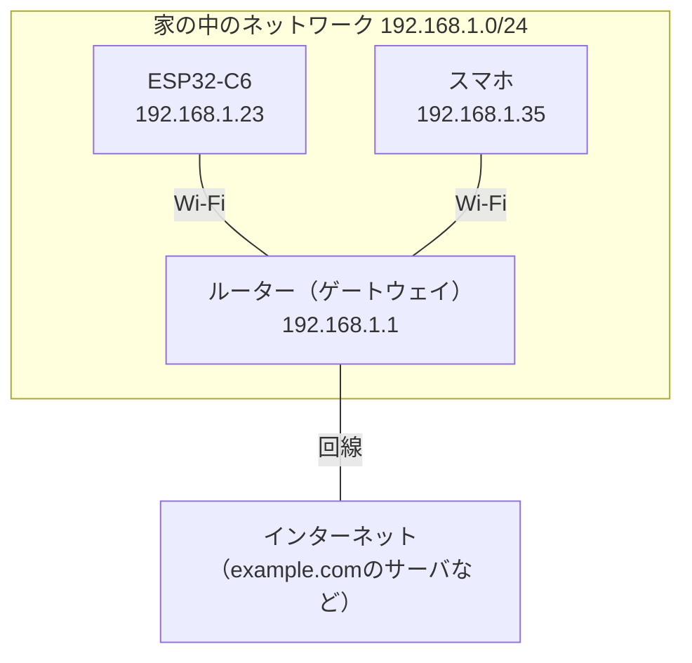
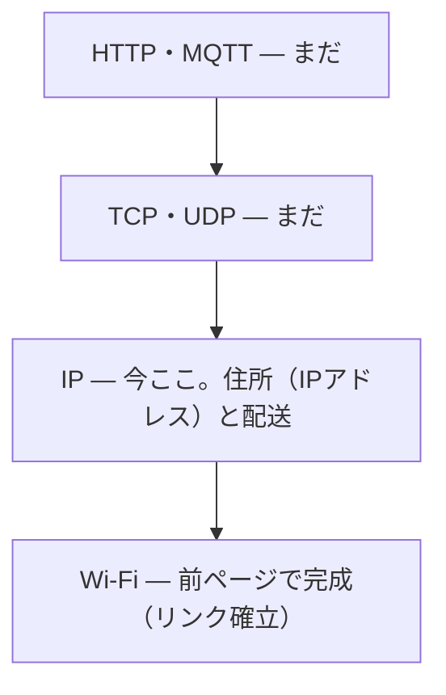

## このページでできるようになること

- IPアドレス・サブネット・ゲートウェイを自分の言葉で説明できる
- 「192.168.1.23/24」という表記を読み解ける
- Wi-Fiにつながることと、IPアドレスを持つことが別の段階である理由を説明できる

## 先に結論

IP（Internet Protocol）は、機器に**住所（IPアドレス）**を与え、宛先の住所へデータの小包（パケット）を配送する仕組みです。IPv4のアドレスは「192.168.1.23」のような4つの数字（各0〜255）です。同じ家の中（同じネットワーク）かどうかは**サブネット**という区切りで判断し、家の外へ出る小包はすべて**ゲートウェイ**（家庭ではルーター）に託します。Wi-Fi接続が完了しても、IPアドレスを持つまではこの層は動きません。前ページまでが「道路の開通」、このページからが「住所の世界」です。

## 身近なたとえ

IPアドレスは「マンションの住所と部屋番号」です。「192.168.1」までが同じマンション名（ネットワーク部）、最後の「23」が部屋番号（ホスト部）だと思ってください。同じマンション内なら直接届けられますが、別のマンション宛の荷物は1階の郵便窓口（ゲートウェイ）に預けます。窓口の先の配送網がインターネットです。

ただし実際のIPでは、どこまでが「マンション名」かは固定ではなく、**サブネットマスクという設定で決まる**点がたとえと違います。それを表すのが「/24」という表記です。

## 仕組み

家庭のネットワークを図にすると、こうなっています。



### 「192.168.1.23/24」の読み方

末尾の`/24`は「先頭24ビット（＝最初の3つの数字、192.168.1）がネットワーク部」という意味です。この部分が同じ機器どうしは**同じサブネット**にいて、ルーターを介さず直接通信できます。ネットワーク部が違う宛先（例: example.comのサーバ）への小包は、ゲートウェイに送って転送してもらいます。

なお`192.168.`で始まるアドレスは**プライベートアドレス**という家庭内・組織内専用の住所で、インターネット側からは直接見えません。だからどの家でも同じ「192.168.1.x」を使えるのです。

### 層の積み重ねを確認する

第1ページの図に、ここまでの進み具合を重ねます。



Wi-Fiの層は「アクセスポイントと電波でつながる」ことしか知りません。IPアドレスの割り当てはその上の話で、Wi-Fi接続の完了とは**別のイベント**です。だからログでも「Wi-Fiに接続しました」と「IPアドレスを取得しました」が別々に出ます。

## RustとEmbassyではどう書くか

embassy-netでは、スタックが現在持っているIPv4設定を`config_v4()`で確認できます。`examples/08-wifi/src/main.rs`からの抜粋です。

```rust
// DHCPでIPアドレスが取れるまで待つ
info!("IPアドレスの取得を待っています...");
stack.wait_config_up().await;
if let Some(config) = stack.config_v4() {
    info!("IPアドレスを取得しました: {}", config.address);
}
```

## コードを一行ずつ読む

```rust
stack.wait_config_up().await;
```

「IP設定が有効になる（＝アドレスを持つ）まで眠る」非同期の待ちです。なぜ待つ必要があるのか、アドレスは誰がくれるのか——それが次ページのDHCPです。

```rust
if let Some(config) = stack.config_v4() {
```

IPv4設定は「まだ無いかもしれない」ので`Option`で返ります。第3部で学んだ「ないかもしれないことを型で表す」の実例です。`config.address`には「192.168.1.23/24」のような**アドレス＋サブネット長**が入っています。

## 実行方法

前ページと同じコマンドで実行し、ログを観察します。

```bash
SSID=あなたのSSID PASSWORD=あなたのパスワード cargo run --release -p wifi
```

```text
INFO - Wi-Fiに接続しました: ...
INFO - IPアドレスの取得を待っています...
INFO - IPアドレスを取得しました: 192.168.1.23/24
```

表示されたアドレスのネットワーク部（例: 192.168.1）が、スマホやPCのIPアドレスと同じになっているはずです。同じサブネットにいる証拠です。

## よくある失敗

- **「Wi-Fiに接続しました」の後、IPアドレスの表示が出ない**: リンク層は完成したのにIP層が完成していない状態です。原因の切り分けは次ページ（DHCP）で扱いますが、「2つは別の段階」だと分かっていれば慌てずに済みます
- **表示された192.168.x.xのアドレスに外出先からアクセスしようとする**: プライベートアドレスは家の中だけで通用する住所です。インターネット側からは直接届きません
- **PCで確認したC6のアドレスを固定だと思い込む**: 次ページで学ぶDHCPは、アドレスを**貸し出す**仕組みです。再起動や時間経過で別のアドレスになることがあります

## やってみよう

自分のPCまたはスマホのIPアドレスを確認してみてください（PCなら`ifconfig`や設定画面、スマホならWi-Fi設定の詳細）。C6のログに出たアドレスとネットワーク部が一致しているか、ゲートウェイのアドレス（多くの家庭で192.168.x.1）も確認してみましょう。

## 確認問題

1. 「192.168.1.23/24」の`/24`は何を意味しますか。
2. C6がexample.comのサーバへパケットを送るとき、最初にどの機器へ渡しますか。その理由も説明してください。
3. 「Wi-Fiにつながった」と「IPアドレスを持った」はなぜ別のイベントなのですか。

<details>
<summary>答え</summary>

1. 先頭24ビット（192.168.1）がネットワーク部であることを意味します。この部分が同じ機器は同じサブネットにいます。
2. ゲートウェイ（家庭ではルーター）です。example.comのサーバは自分と違うネットワークにいるため、直接は届けられず、外への配送はゲートウェイに任せます。
3. 担当する層が違うからです。Wi-Fi接続はリンク層（電波でつながる）の完了で、IPアドレスの取得はその上のインターネット層の設定です。リンクが先に完成し、その上でアドレスの割り当てが行われます。

</details>

## まとめ

- IPアドレスは機器の住所。「/24」はネットワーク部の長さで、同じネットワーク部の機器は直接通信できる
- 外のネットワーク宛のパケットはすべてゲートウェイ（ルーター）に託す。192.168.x.xは家庭内専用のプライベートアドレス
- Wi-Fi接続（リンク層）とIPアドレス取得（インターネット層）は別の段階。embassy-netでは`wait_config_up`と`config_v4`で確認できる

## 次のページ

C6のIPアドレスは誰が、どうやって決めてくれたのでしょうか。自動で住所を貸し出す仕組み、DHCPを学びます。

- 前: [3. Access Pointになる](/embassy-esp32-c6/part10/03-access-point/)
- 次: [5. DHCP](/embassy-esp32-c6/part10/05-dhcp/)
